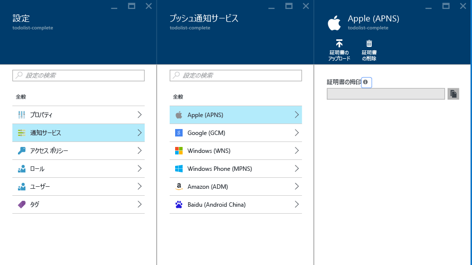

# Azure Notification Hubs から iOS へのプッシュ通知の送信
[!INCLUDE [notification-hubs-selector-get-started](../../includes/notification-hubs-selector-get-started.md)]

## 概要
> [!NOTE]
> このチュートリアルを完了するには、アクティブな Azure アカウントが必要です。 アカウントがない場合は、無料試用版のアカウントを数分で作成することができます。 詳細については、 [Azure の無料試用版サイト](https://azure.microsoft.com/pricing/free-trial/?WT.mc_id=A0E0E5C02&amp;returnurl=http%3A%2F%2Fazure.microsoft.com%2Fen-us%2Fdocumentation%2Farticles%2Fnotification-hubs-ios-get-started)を参照してください。
> 
> 

このチュートリアルでは、Azure Notification Hubs を使用して iOS アプリケーションにプッシュ通知を送信する方法について説明します。 [Apple Push Notification サービス (APNs)](https://developer.apple.com/library/ios/documentation/NetworkingInternet/Conceptual/RemoteNotificationsPG/Chapters/ApplePushService.html)を使用してプッシュ通知を受信する空の iOS アプリケーションを作成します。 

完了すると、通知ハブを使用して、アプリケーションを実行するすべてのデバイスにプッシュ通知をブロードキャストできるようになります。

## 開始する前に
[!INCLUDE [notification-hubs-hero-slug](../../includes/notification-hubs-hero-slug.md)]

このチュートリアルの完成したコードについては、 [GitHub](https://github.com/Azure/azure-notificationhubs-samples/tree/master/iOS/GetStartedNH/GetStarted)を参照してください。 

## 前提条件
このチュートリアルには、次のものが必要です。

* [Mobile Services iOS SDK バージョン 1.2.4]
*  [Xcode]
* iOS 8 (またはこれ以降のバージョン) に対応したデバイス
* [Apple Developer Program](https://developer.apple.com/programs/) メンバーシップ
  
  > [!NOTE]
  > プッシュ通知の構成要件により、プッシュ通知のデプロイとテストは、iOS シミュレーターではなく物理 iOS デバイス (iPhone または iPad) で行う必要があります。
  > 
  > 

このチュートリアルを完了することは、iOS アプリケーションの他のすべての Notification Hubs チュートリアルの前提条件です。

[!INCLUDE [Notification Hubs Enable Apple Push Notifications](../../includes/notification-hubs-enable-apple-push-notifications.md)]

## iOS プッシュ通知向けに通知ハブを構成する
このセクションでは、作成した **.p12** プッシュ証明書を使用して、新しい通知ハブを作成し、APNS での認証を構成する方法について説明します。 既に作成した通知ハブを使用する場合は、手順 5. に進んでください。

[!INCLUDE [notification-hubs-portal-create-new-hub](../../includes/notification-hubs-portal-create-new-hub.md)]

<ol start="6">

<li>

<b>[設定]</b> ブレードの <b>[Notification Services]</b> ボタンをクリックし、<b>[Apple (APNS)]</b> を選択します。 <b>[証明書のアップロード]</b> をクリックし、先にエクスポートしておいた <b>.p12</b> ファイルを選択します。 必ず正しいパスワードも入力してください。

これは開発用であるため、<b>[サンドボックス]</b> モードを選択してください。 <b>[実稼働]</b> は、ストアからアプリを購入したユーザーにプッシュ通知を送信する場合にのみ使用します。

</li>
</ol>
&emsp;&emsp;&emsp;&emsp;

&emsp;&emsp;&emsp;&emsp;

これで、通知ハブが APNS と連動するように構成されました。接続文字列にアプリケーションを登録し、プッシュ通知を送信できます。

## Notification Hubs に iOS アプリケーションを接続する
1. Xcode で、新しい iOS プロジェクトを作成し、 **[Single View Application]** テンプレートを選択します。
   
    ![Xcode - Single View Application][8]
    
2. 新しいプロジェクトのオプションを設定する際には、以前に Apple Developer ポータルでバンドル ID を設定したときと同じ**製品名**と**組織 ID** を使用してください。
   
    ![Xcode - project options][11]
    
3. **[Target (ターゲット)]** でプロジェクト名をクリックし、**[Build Settings (ビルド設定)]** タブをクリックして **[Code Signing Identity (コード署名 ID)]** を展開し、**[Debug (デバッグ)]** でコード署名 ID を選択します。 **[Levels (レベル)]** を **[Basic (基本)]** から **[All (すべて)]** に切り替え、**[Provisioning Profile (プロビジョニング プロファイル)]** に、事前に作成したプロビジョニング プロファイルを設定します。
   
    Xcode で作成した新しいプロビジョニング プロファイルが表示されない場合は、署名 ID のプロファイルを更新してみてください。 メニュー バーの **Xcode** をクリックし、**[Preference (ユーザー設定)]**、**[Account (アカウント)]** タブ、**[View Details (詳細の表示)]** ボタンの順にクリックします。次に、署名 ID をクリックし、右下隅にある更新ボタンをクリックします。
   
    ![Xcode - provisioning profile][9]
4. [Mobile Services iOS SDK バージョン 1.2.4] をダウンロードしてファイルを解凍します。 Xcode でプロジェクトを右クリックして **[Add Files to (ファイルの追加先)]** オプションをクリックし、Xcode プロジェクトに **WindowsAzureMessaging.framework** フォルダーを追加します。 **[Copy items if needed (必要に応じてアイテムをコピー)]** を選択し、**[Add (追加)]** をクリックします。
   
   > [!NOTE]
   > Notification Hubs SDK は現在、Xcode 7 におけるビットコードをサポートしていません。  プロジェクトの **[Build Options (ビルド オプション)]** で **[Enable Bitcode (ビットコードの有効化)]** を **[No (いいえ)]** に設定する必要があります。
   > 
   > 
   
    ![Unzip Azure SDK][10]
5. `HubInfo.h`という名前の新しいヘッダー ファイルをプロジェクトに追加します。 このファイルに通知ハブの定数が保存されます。  次の定義を追加し、文字列リテラルのプレースホルダーを "*ハブ名*" とメモしておいた *DefaultListenSharedAccessSignature* に置き換えます。
   
        #ifndef HubInfo_h
        #define HubInfo_h
   
            #define HUBNAME @"<Enter the name of your hub>"
            #define HUBLISTENACCESS @"<Enter your DefaultListenSharedAccess connection string"
   
        #endif /* HubInfo_h */
6. `AppDelegate.h` ファイルを開き、次の import ディレクティブを追加します。
   
         #import <WindowsAzureMessaging/WindowsAzureMessaging.h> 
         #import "HubInfo.h"
7. `AppDelegate.m file` で、iOS のバージョンに基づいて `didFinishLaunchingWithOptions` メソッド内に次のコードを追加します。 このコードにより、APNs にデバイス ハンドルが登録されます。
   
    iOS 8 の場合:
   
         UIUserNotificationSettings *settings = [UIUserNotificationSettings settingsForTypes:UIUserNotificationTypeSound |
                                                UIUserNotificationTypeAlert | UIUserNotificationTypeBadge categories:nil];
   
        [[UIApplication sharedApplication] registerUserNotificationSettings:settings];
        [[UIApplication sharedApplication] registerForRemoteNotifications];
   
    iOS 8 より前のバージョンの場合:
   
         [[UIApplication sharedApplication] registerForRemoteNotificationTypes: UIRemoteNotificationTypeAlert | UIRemoteNotificationTypeBadge | UIRemoteNotificationTypeSound];
8. 同じファイルで、次のメソッドを追加します。 このコードは、HubInfo.h に指定した接続情報を使用して通知ハブに接続します。 その後、通知ハブが通知を送信できるように、通知ハブにデバイス トークンを指定します。
   
        - (void)application:(UIApplication *)application didRegisterForRemoteNotificationsWithDeviceToken:(NSData *) deviceToken {
            SBNotificationHub* hub = [[SBNotificationHub alloc] initWithConnectionString:HUBLISTENACCESS
                                        notificationHubPath:HUBNAME];
   
            [hub registerNativeWithDeviceToken:deviceToken tags:nil completion:^(NSError* error) {
                if (error != nil) {
                    NSLog(@"Error registering for notifications: %@", error);
                }
                else {
                    [self MessageBox:@"Registration Status" message:@"Registered"];
                }
            }];
        }
   
        -(void)MessageBox:(NSString *)title message:(NSString *)messageText
        {
            UIAlertView *alert = [[UIAlertView alloc] initWithTitle:title message:messageText delegate:self
                cancelButtonTitle:@"OK" otherButtonTitles: nil];
            [alert show];
        }
9. 同じファイルで次のメソッドを追加し、アプリケーションがアクティブのときに通知を受信した場合に **UIAlert** が表示されるようにします。

        - (void)application:(UIApplication *)application didReceiveRemoteNotification: (NSDictionary *)userInfo {
            NSLog(@"%@", userInfo);
            [self MessageBox:@"Notification" message:[[userInfo objectForKey:@"aps"] valueForKey:@"alert"]];
        }

1. お使いのデバイスでアプリケーションをビルドして実行し、エラーがないことを確認します。

## テスト プッシュ通知を送信する
アプリで通知の受信テストを行うには、 [Azure ポータル] でハブ ブレードの **[トラブルシューティング]** から ( *[テストの送信]* オプションを使用して) プッシュ通知を送信します。

![Azure Portal - Test Send][30]

[!INCLUDE [notification-hubs-sending-notifications-from-the-portal](../../includes/notification-hubs-sending-notifications-from-the-portal.md)]

## (省略可能) アプリからプッシュ通知を送信する
> [!IMPORTANT]
> この例では、クライアント アプリからの通知の送信方法を学習目的でのみ紹介しています。 クライアント アプリには `DefaultFullSharedAccessSignature` が存在している必要があります。この点がご利用の通知ハブにとってリスクとなります。ユーザーによって不正な通知がクライアントに送信される可能性があります。
> 
> 

このセクションでは、REST インターフェイスを使用して、アプリ内からプッシュ通知を送信する方法の例を示します。

1. Xcode で `Main.storyboard` を開き、オブジェクト ライブラリから次の UI コンポーネントを追加して、ユーザーがアプリでプッシュ通知を送信できるようにします。
   
   * ラベル テキストなしのラベル。 これは、通知の送信時にエラーをレポートするために使用されます。 **[Lines (線)]** プロパティを **0** に設定して、左右の余白とビューの上部の制約を受けてサイズが自動で設定されるようにします。
   * **[Placeholder (プレースホルダー)]** テキストが **Enter Notification Message** に設定されたテキスト フィールド。 次に示すように、ラベルのすぐ下のフィールドを制限します。 ビュー コントローラーをアウトレット デリゲートに設定します。
   * テキスト フィールドのすぐ下で水平方向の中央に制約された **[Send Notification]** というタイトルのボタン。
     
     ビューは次のようになります。
     
     ![Xcode designer][32]
2. ビューに関連付けられたラベルとテキスト フィールドに[アウトレットを追加](https://developer.apple.com/library/ios/recipes/xcode_help-IB_connections/chapters/CreatingOutlet.html)し、`UITextFieldDelegate` と `NSXMLParserDelegate` をサポートするように `interface` の定義を更新します。 以下に示す 3 つのプロパティ宣言を追加し、REST API の呼び出しと応答の解析をサポートします。
   
    ViewController.h ファイルは次のようになります。
   
        #import <UIKit/UIKit.h>
   
        @interface ViewController : UIViewController <UITextFieldDelegate, NSXMLParserDelegate>
        {
            NSXMLParser *xmlParser;
        }
   
        // Make sure these outlets are connected to your UI by ctrl+dragging
        @property (weak, nonatomic) IBOutlet UITextField *notificationMessage;
        @property (weak, nonatomic) IBOutlet UILabel *sendResults;
   
        @property (copy, nonatomic) NSString *statusResult;
        @property (copy, nonatomic) NSString *currentElement;
   
        @end
3. `HubInfo.h` を開いて、次の定数を追加します。これらの定数は、ハブに通知を送信する際に使用されます。 プレースホルダーの文字列リテラルを実際の *DefaultFullSharedAccessSignature* 接続文字列に置き換えます。
   
        #define API_VERSION @"?api-version=2015-01"
        #define HUBFULLACCESS @"<Enter Your DefaultFullSharedAccess Connection string>"
4. 次の `#import` ステートメントを `ViewController.h` ファイルに追加します。
   
        #import <CommonCrypto/CommonHMAC.h>
        #import "HubInfo.h"
5. `ViewController.m` で、インターフェイスの実装に次のコードを追加します。 これは、 *DefaultFullSharedAccessSignature* 接続文字列を解析するコードです。 [REST API リファレンス](http://msdn.microsoft.com/library/azure/dn495627.aspx)で説明したように、解析されたこの情報は **Authorization** 要求ヘッダーの SaS トークンの生成に使用されます。
   
        NSString *HubEndpoint;
        NSString *HubSasKeyName;
        NSString *HubSasKeyValue;
   
        -(void)ParseConnectionString
        {
            NSArray *parts = [HUBFULLACCESS componentsSeparatedByString:@";"];
            NSString *part;
   
            if ([parts count] != 3)
            {
                NSException* parseException = [NSException exceptionWithName:@"ConnectionStringParseException"
                    reason:@"Invalid full shared access connection string" userInfo:nil];
   
                @throw parseException;
            }
   
            for (part in parts)
            {
                if ([part hasPrefix:@"Endpoint"])
                {
                    HubEndpoint = [NSString stringWithFormat:@"https%@",[part substringFromIndex:11]];
                }
                else if ([part hasPrefix:@"SharedAccessKeyName"])
                {
                    HubSasKeyName = [part substringFromIndex:20];
                }
                else if ([part hasPrefix:@"SharedAccessKey"])
                {
                    HubSasKeyValue = [part substringFromIndex:16];
                }
            }
        }
6. `ViewController.m` で、`viewDidLoad` メソッドを更新してビューの読み込み時に接続文字列を解析します。 また、以下に示したユーティリティ メソッドをインターフェイスの実装に追加します。  

        - (void)viewDidLoad
        {
            [super viewDidLoad];
            [self ParseConnectionString];
            [_notificationMessage setDelegate:self];
        }

        -(NSString *)CF_URLEncodedString:(NSString *)inputString
        {
           return (__bridge NSString *)CFURLCreateStringByAddingPercentEscapes(NULL, (CFStringRef)inputString,
                NULL, (CFStringRef)@"!*'();:@&=+$,/?%#[]", kCFStringEncodingUTF8);
        }

        -(void)MessageBox:(NSString *)title message:(NSString *)messageText
        {
            UIAlertView *alert = [[UIAlertView alloc] initWithTitle:title message:messageText delegate:self
                cancelButtonTitle:@"OK" otherButtonTitles: nil];
            [alert show];
        }

1. `ViewController.m`で、 **REST API リファレンス** で説明されているように、次のコードをインターフェイスの実装に追加して、 [Authorization](http://msdn.microsoft.com/library/azure/dn495627.aspx)ヘッダーに指定する SaS 認証トークンを生成します。
   
        -(NSString*) generateSasToken:(NSString*)uri
        {
            NSString *targetUri;
            NSString* utf8LowercasedUri = NULL;
            NSString *signature = NULL;
            NSString *token = NULL;
   
            @try
            {
                // Add expiration
                uri = [uri lowercaseString];
                utf8LowercasedUri = [self CF_URLEncodedString:uri];
                targetUri = [utf8LowercasedUri lowercaseString];
                NSTimeInterval expiresOnDate = [[NSDate date] timeIntervalSince1970];
                int expiresInMins = 60; // 1 hour
                expiresOnDate += expiresInMins * 60;
                UInt64 expires = trunc(expiresOnDate);
                NSString* toSign = [NSString stringWithFormat:@"%@\n%qu", targetUri, expires];
   
                // Get an hmac_sha1 Mac instance and initialize with the signing key
                const char *cKey  = [HubSasKeyValue cStringUsingEncoding:NSUTF8StringEncoding];
                const char *cData = [toSign cStringUsingEncoding:NSUTF8StringEncoding];
                unsigned char cHMAC[CC_SHA256_DIGEST_LENGTH];
                CCHmac(kCCHmacAlgSHA256, cKey, strlen(cKey), cData, strlen(cData), cHMAC);
                NSData *rawHmac = [[NSData alloc] initWithBytes:cHMAC length:sizeof(cHMAC)];
                signature = [self CF_URLEncodedString:[rawHmac base64EncodedStringWithOptions:0]];
   
                // Construct authorization token string
                token = [NSString stringWithFormat:@"SharedAccessSignature sig=%@&se=%qu&skn=%@&sr=%@",
                    signature, expires, HubSasKeyName, targetUri];
            }
            @catch (NSException *exception)
            {
                [self MessageBox:@"Exception Generating SaS Token" message:[exception reason]];
            }
            @finally
            {
                if (utf8LowercasedUri != NULL)
                    CFRelease((CFStringRef)utf8LowercasedUri);
                if (signature != NULL)
                CFRelease((CFStringRef)signature);
            }
   
            return token;
        }
2. Ctrl キーを押しながら **[Send Notification]** ボタンを `ViewController.m` にドラッグし、**Touch Down** イベントに対するアクション **SendNotificationMessage** を追加します。 REST API を使用して通知を送信するように次のコードでメソッドを更新します。
   
        - (IBAction)SendNotificationMessage:(id)sender
        {
            self.sendResults.text = @"";
            [self SendNotificationRESTAPI];
        }
   
        - (void)SendNotificationRESTAPI
        {
            NSURLSession* session = [NSURLSession
                             sessionWithConfiguration:[NSURLSessionConfiguration defaultSessionConfiguration]
                             delegate:nil delegateQueue:nil];
   
            // Apple Notification format of the notification message
            NSString *json = [NSString stringWithFormat:@"{\"aps\":{\"alert\":\"%@\"}}",
                                self.notificationMessage.text];
   
            // Construct the message's REST endpoint
            NSURL* url = [NSURL URLWithString:[NSString stringWithFormat:@"%@%@/messages/%@", HubEndpoint,
                                                HUBNAME, API_VERSION]];
   
            // Generate the token to be used in the authorization header
            NSString* authorizationToken = [self generateSasToken:[url absoluteString]];
   
            //Create the request to add the APNs notification message to the hub
            NSMutableURLRequest *request = [NSMutableURLRequest requestWithURL:url];
            [request setHTTPMethod:@"POST"];
            [request setValue:@"application/json;charset=utf-8" forHTTPHeaderField:@"Content-Type"];
   
            // Signify Apple notification format
            [request setValue:@"apple" forHTTPHeaderField:@"ServiceBusNotification-Format"];
   
            //Authenticate the notification message POST request with the SaS token
            [request setValue:authorizationToken forHTTPHeaderField:@"Authorization"];
   
            //Add the notification message body
            [request setHTTPBody:[json dataUsingEncoding:NSUTF8StringEncoding]];
   
            // Send the REST request
            NSURLSessionDataTask* dataTask = [session dataTaskWithRequest:request
                completionHandler:^(NSData *data, NSURLResponse *response, NSError *error)
            {
                NSHTTPURLResponse* httpResponse = (NSHTTPURLResponse*) response;
                if (error || (httpResponse.statusCode != 200 && httpResponse.statusCode != 201))
                {
                    NSLog(@"\nError status: %d\nError: %@", httpResponse.statusCode, error);
                }
                if (data != NULL)
                {
                    xmlParser = [[NSXMLParser alloc] initWithData:data];
                    [xmlParser setDelegate:self];
                       [xmlParser parse];
                }
            }];
            [dataTask resume];
        }
3. `ViewController.m`で、テキスト フィールドのキーボードを閉じる動作をサポートする次のデリゲート メソッドを追加します。 Ctrl キーを押しながらテキスト フィールドからインターフェイス デザイナーの View Controller アイコンにドラッグし、ビュー コントローラーをアウトレット デリゲートとして設定します。
   
        //===[ Implement UITextFieldDelegate methods ]===
   
        -(BOOL)textFieldShouldReturn:(UITextField *)textField
        {
            [textField resignFirstResponder];
            return YES;
        }
4. `ViewController.m` で、`NSXMLParser` を使用した応答の解析をサポートする次のデリゲート メソッドを追加します。
   
       //===[ Implement NSXMLParserDelegate methods ]===
   
       -(void)parserDidStartDocument:(NSXMLParser *)parser
       {
           self.statusResult = @"";
       }
   
       -(void)parser:(NSXMLParser *)parser didStartElement:(NSString *)elementName
           namespaceURI:(NSString *)namespaceURI qualifiedName:(NSString *)qName
           attributes:(NSDictionary *)attributeDict
       {
           NSString * element = [elementName lowercaseString];
           NSLog(@"*** New element parsed : %@ ***",element);
   
           if ([element isEqualToString:@"code"] | [element isEqualToString:@"detail"])
           {
               self.currentElement = element;
           }
       }
   
       -(void) parser:(NSXMLParser *)parser foundCharacters:(NSString *)parsedString
       {
           self.statusResult = [self.statusResult stringByAppendingString:
               [NSString stringWithFormat:@"%@ : %@\n", self.currentElement, parsedString]];
       }
   
       -(void)parserDidEndDocument:(NSXMLParser *)parser
       {
           // Set the status label text on the UI thread
           dispatch_async(dispatch_get_main_queue(),
           ^{
               [self.sendResults setText:self.statusResult];
           });
       }
5. プロジェクトをビルドし、エラーがないことを確認します。

> [!NOTE]
> Xcode7 でビットコード サポートに関するビルド エラーが発生した場合は、Xcode の **[Build Settings (ビルド設定)]** > **[Enable Bitcode (ビットコードの有効化)]** \(ENABLE_BITCODE) を **[NO (いいえ)]** に変更する必要があります。 Notification Hubs SDK は、現在ビットコードをサポートしていません。 
> 
> 

Apple の「 [Local and Push Notification Programming Guide (ローカルおよびプッシュ通知プログラミング ガイド)]」に、使用できるすべての通知ペイロードが記載されています。

## アプリでプッシュ通知を受信できるかどうかを確認する
iOS でプッシュ通知をテストするには、物理 iOS デバイスにアプリをデプロイする必要があります。 iOS シミュレーターを使用して Apple のプッシュ通知を送信することはできません。

1. アプリケーションを実行して登録が成功したことを確認したら、 **[OK]**を押します。
   
    ![iOS App Push Notification Registration Test][33]
2. 前述のとおり、 [Azure ポータル]からテスト プッシュ通知を送信することができます。 アプリにプッシュ通知を送信するためのコードを追加した場合は、テキスト フィールドの内部をタップして、通知メッセージを入力します。 入力後、キーボードの **Send** キーまたはビュー内の **[Send Notification]** ボタンを押して、通知メッセージを送信します。
   
    ![iOS App Push Notification Send Test][34]
3. 特定の通知ハブから通知を受信するように登録されているすべてのデバイスにプッシュ通知が送信されます。
   
    ![iOS App Push Notification Receive Test][35]

## 次のステップ
この簡単な例では、すべての登録済み iOS デバイスにプッシュ通知をブロードキャストしました。 学習の次のステップとして、「[Azure Notification Hubs と .NET バックエンドによる iOS ユーザーへの通知]」に進むことをお勧めします。このチュートリアルでは、バックエンドを作成し、タグを使用してプッシュ通知を送信する方法について説明しています。 

対象グループごとにユーザーを区分する場合は、チュートリアル「 [Notification Hubs を使用したニュース速報の送信] 」もご覧ください。 

Notification Hubs の全般的な情報については、「 [Notification Hubs の概要]」を参照してください。

<!-- Images. -->

[6]: ./media/notification-hubs-ios-get-started/notification-hubs-configure-ios.png
[8]: ./media/notification-hubs-ios-get-started/notification-hubs-create-ios-app.png
[9]: ./media/notification-hubs-ios-get-started/notification-hubs-create-ios-app2.png
[10]: ./media/notification-hubs-ios-get-started/notification-hubs-create-ios-app3.png
[11]: ./media/notification-hubs-ios-get-started/notification-hubs-xcode-product-name.png

[30]: ./media/notification-hubs-ios-get-started/notification-hubs-test-send.png

[31]: ./media/notification-hubs-ios-get-started/notification-hubs-ios-ui.png
[32]: ./media/notification-hubs-ios-get-started/notification-hubs-storyboard-view.png
[33]: ./media/notification-hubs-ios-get-started/notification-hubs-test1.png
[34]: ./media/notification-hubs-ios-get-started/notification-hubs-test2.png
[35]: ./media/notification-hubs-ios-get-started/notification-hubs-test3.png

<!-- URLs. -->
[Mobile Services iOS SDK バージョン 1.2.4]: http://aka.ms/kymw2g
[Mobile Services iOS SDK]: http://go.microsoft.com/fwLink/?LinkID=266533
[Submit an app page]: http://go.microsoft.com/fwlink/p/?LinkID=266582
[My Applications]: http://go.microsoft.com/fwlink/p/?LinkId=262039
[Live SDK for Windows]: http://go.microsoft.com/fwlink/p/?LinkId=262253

[Get started with Mobile Services]: /develop/mobile/tutorials/get-started-ios
[Azure Classic Portal]: https://manage.windowsazure.com/
[Notification Hubs の概要]: http://msdn.microsoft.com/library/jj927170.aspx
[Xcode]: https://go.microsoft.com/fwLink/p/?LinkID=266532
[iOS Provisioning Portal]: http://go.microsoft.com/fwlink/p/?LinkId=272456

[Get started with push notifications in Mobile Services]: ../mobile-services-javascript-backend-ios-get-started-push.md
[Azure Notification Hubs と .NET バックエンドによる iOS ユーザーへの通知]: notification-hubs-aspnet-backend-ios-apple-apns-notification.md
[Notification Hubs を使用したニュース速報の送信]: notification-hubs-ios-xplat-segmented-apns-push-notification.md

[Local and Push Notification Programming Guide (ローカルおよびプッシュ通知プログラミング ガイド)]: http://developer.apple.com/library/mac/#documentation/NetworkingInternet/Conceptual/RemoteNotificationsPG/Chapters/ApplePushService.html#//apple_ref/doc/uid/TP40008194-CH100-SW1
[Azure ポータル]: https://portal.azure.com

<!--HONumber=Dec16_HO1-->

