# <a name="tutorial-send-location-based-push-notifications-with-notification-hubs-and-bing-spatial-data"></a>チュートリアル:Notification Hubs と Bing Spatial Data を使用して場所に基づいたプッシュ通知を送信する

このチュートリアルでは、Azure Notification Hubs と Bing Spatial Data を使用して場所に基づいたプッシュ通知を送信する方法について学習します。

このチュートリアルでは、次の手順を実行します。

> [!div class="checklist"]
> * データ ソースを設定する
> * UWP アプリケーションを設定する
> * バックエンドを設定する
> * ユニバーサル Windows プラットフォーム (UWP) アプリでプッシュ通知をテストする

## <a name="prerequisites"></a>前提条件

* **Azure サブスクリプション**。 Azure サブスクリプションをお持ちでない場合は、開始する前に[無料の Azure アカウント](https://azure.microsoft.com/free/)を作成してください。
* [Visual Studio 2015 Update 1](https://www.visualstudio.com/downloads/download-visual-studio-vs.aspx) 以降 ([Community Edition](https://go.microsoft.com/fwlink/?LinkId=691978&clcid=0x409))。
* 最新バージョンの [Azure SDK](https://azure.microsoft.com/downloads/)。
* [Bing マップ デベロッパー センター アカウント](https://www.bingmapsportal.com/)。アカウントの作成は無料です。作成したアカウントは Microsoft アカウントに関連付けることができます。

## <a name="set-up-the-data-source"></a>データ ソースを設定する

1. [Bing Maps デベロッパー センター](https://www.bingmapsportal.com/)にログインします。
2. 一番上のナビゲーション バーで、 **[データ ソース]** を選択してから、 **[Manage Data Sources] (データ ソースの管理)** を選択します。

    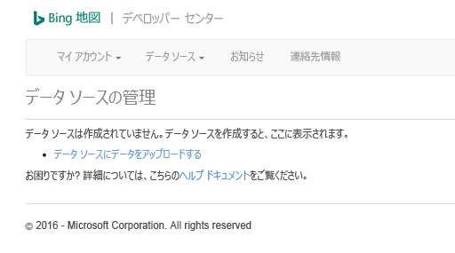
3. 既存のデータ ソースがない場合は、データ ソースを作成するためのリンクが表示されます。 **[Upload data as a data source] (データをデータ ソースとしてアップロードする)** を選択します。 **[データ ソース]**  >  **[データのアップロード]** メニューを使用することもできます。

    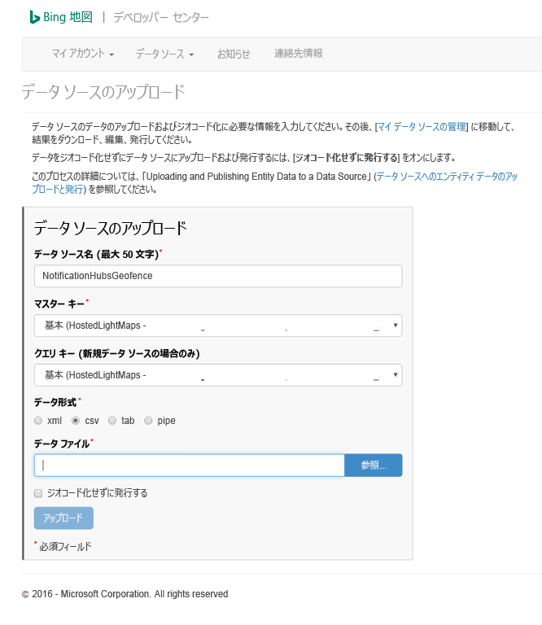
4. 次の内容を含むファイル `NotificationHubsGeofence.pipe` をハード ドライブ上に作成します。このチュートリアルでは、サンフランシスコのウォーターフロントの領域を形作るサンプルのパイプ ベース ファイルを使用します。

    ```text
    Bing Spatial Data Services, 1.0, TestBoundaries
    EntityID(Edm.String,primaryKey)|Name(Edm.String)|Longitude(Edm.Double)|Latitude(Edm.Double)|Boundary(Edm.Geography)
    1|SanFranciscoPier|||POLYGON ((-122.389825 37.776598,-122.389438 37.773087,-122.381885 37.771849,-122.382186 37.777022,-122.389825 37.776598))
    ```

    このパイプ ファイルは、次のエンティティを表しています。

    
5. **[Upload a data source] (データ ソースをアップロードする)** ページで、次のアクションを実行します。
   1. **[データ形式]** として **[パイプ]** を選択します。
   2. 前の手順で作成した `NotificationHubGeofence.pipe` ファイルを参照して選択します。
   3. **[アップロード]** ボタンを選択します。

      > [!NOTE]
      > **[マスター キー]** に、 **[クエリ キー]** とは異なる新しいキーを指定するよう求められる場合があります。 ダッシュボードで新しいキーを作成して、データ ソースのアップロード ページを更新してください。
6. データ ファイルをアップロードしたら、そのデータ ソースを確実に発行する必要があります。 前と同様に **[データ ソース]**  ->  **[Manage Data Sources] (データ ソースの管理)** を選択します。
7. 一覧のデータ ソースを選択してから、 **[アクション]** 列で **[発行]** を選択します。

    
8. **[Published Data Sources] (発行されたデータ ソース)** タブに切り替え、一覧にデータ ソースが表示されることを確認します。

    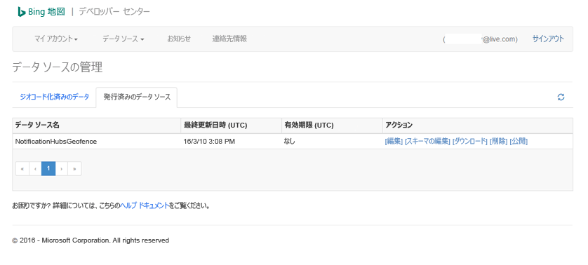
9. **[編集]** を選択します。 データ内のどの場所に導入したかが (一目で) わかります。

    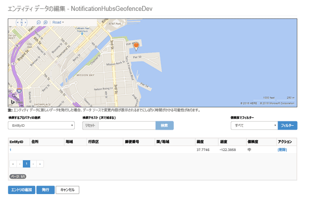

    この時点では、作成したジオフェンスの境界がポータルに表示されません。指定した場所が適切に収まっていることを確認するだけでかまいません。
10. これで、データ ソースの要件がすべて揃いました。 API 呼び出しに使用する要求 URL について詳しい情報を確認するには、Bing Maps デベロッパー センターで **[Data sources]\(データ ソース\)** を選択し、 **[Data Source Information]\(データ ソース情報\)** を選択します。

    

    **クエリ URL** は、デバイスが現在、場所の境界内に存在するかどうかをチェックするためのクエリを実行できるエンドポイントです。 このチェックを実行するには、クエリ URL に対して、次のパラメーターが追加された GET 呼び出しを実行するだけで済みます。

    ```text
    ?spatialFilter=intersects(%27POINT%20LONGITUDE%20LATITUDE)%27)&$format=json&key=QUERY_KEY
    ```

    Bing Maps は、デバイスがジオフェンス内に存在するかどうかを確認するための計算を自動的に実行します。 ブラウザー (または cURL) から要求を実行すると、標準の JSON 応答が取得されます。

    

    この応答が返されるのは、実際にその地点が、指定された境界の範囲内にあるときだけです。 存在しない場合は、空の**結果**のバケットが取得されます。

    

## <a name="set-up-the-uwp-application"></a>UWP アプリケーションを設定する

1. Visual Studio で、 **[空白のアプリ (ユニバーサル Windows)]** タイプの新しいプロジェクトを起動します。

    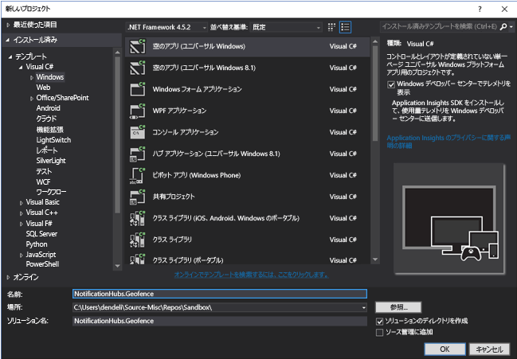

    プロジェクトを作成したら、アプリ自体のテスト ハーネスが必要です。 ジオフェンス インフラストラクチャを構成するさまざまな要素を設定していきましょう。 このソリューションでは Bing サービスを使用しようとしているため、特定の場所フレームに関するクエリを実行できるパブリック REST API エンドポイントが存在します。

    ```text
    http://spatial.virtualearth.net/REST/v1/data/
    ```
    これを機能させるには、次のパラメーターを指定します。

   * **データ ソース ID** と**データ ソース名** – Bing マップ API では、さまざまな分類のメタデータ (位置情報、企業の営業時間など) がデータ ソースに格納されます。  
   * **エンティティ名** – 通知の基準点として使用するエンティティです。
   * **Bing Maps API キー** – 前に Bing デベロッパー センター アカウントを作成するときに取得したキー。

     これでデータ ソースが準備できたので、UWP アプリケーションの操作を開始できます。
2. アプリケーションの場所サービスを有効にします。 **ソリューション エクスプローラー**で `Package.appxmanifest` ファイルを開きます。

    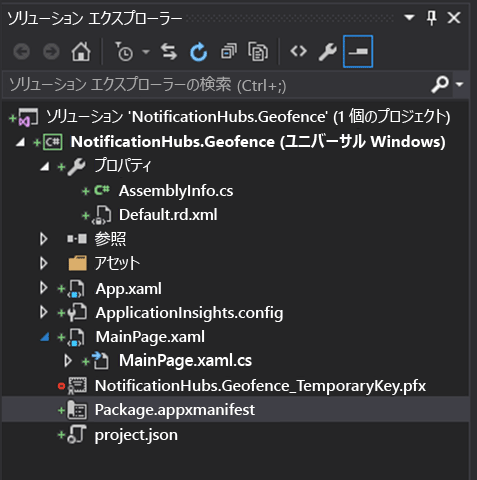
3. 開いたばかりのパッケージ プロパティ タブで、 **[機能]** タブに切り替えてから、 **[場所]** を選択します。

    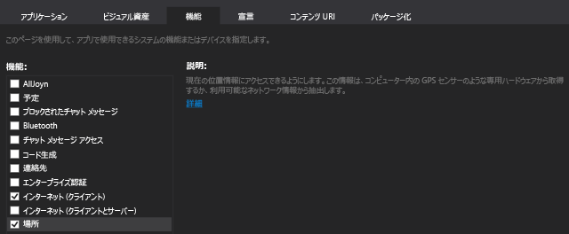
4. ソリューション内に `Core` という名前の新しいフォルダーを作成し、その中に `LocationHelper.cs` という名前の新しいファイルを追加します。

    

    `LocationHelper` クラスには、システム API 経由でユーザーの場所を取得するためのコードが含まれています。

    ```csharp
    using System;
    using System.Threading.Tasks;
    using Windows.Devices.Geolocation;

    namespace NotificationHubs.Geofence.Core
    {
        public class LocationHelper
        {
            private static readonly uint AppDesiredAccuracyInMeters = 10;

            public async static Task<Geoposition> GetCurrentLocation()
            {
                var accessStatus = await Geolocator.RequestAccessAsync();
                switch (accessStatus)
                {
                    case GeolocationAccessStatus.Allowed:
                        {
                            Geolocator geolocator = new Geolocator { DesiredAccuracyInMeters = AppDesiredAccuracyInMeters };

                            return await geolocator.GetGeopositionAsync();
                        }
                    default:
                        {
                            return null;
                        }
                }
            }

        }
    }
    ```

    UWP アプリでのユーザーの場所の取得の詳細については、[ユーザーの場所の取得](https://msdn.microsoft.com/library/windows/apps/mt219698.aspx)に関するページを参照してください。
5. 位置情報の取得機能が正しく動作することを確認するために、メイン ページ (`MainPage.xaml.cs`) のコードを開いてください。 `MainPage` コンストラクター内に `Loaded` イベントの新しいイベント ハンドラーを作成します。

    ```csharp
    public MainPage()
    {
        this.InitializeComponent();
        this.Loaded += MainPage_Loaded;
    }
    ```

    イベント ハンドラーには、次のコードを実装します。

    ```csharp
    private async void MainPage_Loaded(object sender, RoutedEventArgs e)
    {
        var location = await LocationHelper.GetCurrentLocation();

        if (location != null)
        {
            Debug.WriteLine(string.Concat(location.Coordinate.Longitude,
                " ", location.Coordinate.Latitude));
        }
    }
    ```
6. アプリケーションを実行し、そこからユーザーの場所へのアクセスを許可します。

    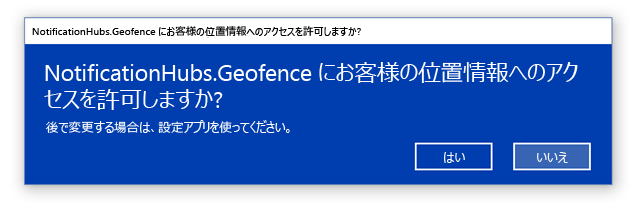
7. アプリケーションの起動後、 **出力** ウィンドウに座標が表示されます。

    

    これで場所の取得が機能することがわかったので、もう使用しなければ、Loaded イベント ハンドラーは必要に応じて削除できます。
8. 次に、位置情報の変化をキャプチャします。 `LocationHelper` クラスで、`PositionChanged` のイベント ハンドラーを追加します。

    ```csharp
    geolocator.PositionChanged += Geolocator_PositionChanged;
    ```

    この実装では、場所の座標を **[出力]** ウィンドウに表示します。

    ```csharp
    private static async void Geolocator_PositionChanged(Geolocator sender, PositionChangedEventArgs args)
    {
        await CoreApplication.MainView.CoreWindow.Dispatcher.RunAsync(CoreDispatcherPriority.Normal, () =>
        {
            Debug.WriteLine(string.Concat(args.Position.Coordinate.Longitude, " ", args.Position.Coordinate.Latitude));
        });
    }
    ```

## <a name="set-up-the-backend"></a>バックエンドを設定する

1. [GitHub から .NET バックエンド サンプル](https://github.com/Azure/azure-notificationhubs-samples/tree/master/dotnet/NotifyUsers)をダウンロードします。
2. ダウンロードが完了したら、`NotifyUsers` フォルダーを開いてから、Visual Studio で `NotifyUsers.sln` ファイルを開きます。
3. `AppBackend` プロジェクトを **スタートアップ プロジェクト** として設定し、起動します。

    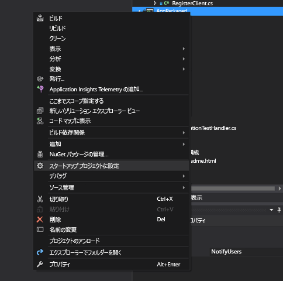

    このプロジェクトはターゲット デバイスにプッシュ通知を送信するように既に構成されているため、実行する必要があるのは、通知ハブ用の正しい接続文字列を指定することと、ユーザーがジオフェンス内に存在する場合にのみ通知を送信するための境界の識別を追加することの 2 つだけです。

4. 接続文字列を構成するには、`Models` フォルダーの `Notifications.cs` を開きます。 `NotificationHubClient.CreateClientFromConnectionString` 関数には、[Azure Portal](https://portal.azure.com) ( **[設定]** の **[アクセス ポリシー]** ページ内を参照) で取得できる通知ハブに関する情報が含まれています。 更新した構成ファイルを保存します。
5. Bing Maps API の結果のモデルを作成します。 それを行うための最も簡単な方法として、`Models` フォルダーを開き、 **[追加]**  >  **[クラス]** を選択します。 これに `GeofenceBoundary.cs` という名前を付けます。 完了したら、最初のセクションで取得した API 応答から JSON をコピーします。 Visual Studio で、 **[編集]**  >  **[形式を選択して貼り付け]**  >  **[JSON をクラスとして貼り付ける]** を使用します。

    この方法により、オブジェクトが意図したとおりに確実に逆シリアル化されます。 結果として得られるクラス セットは、次のクラスのようになります。

    ```csharp
    namespace AppBackend.Models
    {
        public class Rootobject
        {
            public D d { get; set; }
        }

        public class D
        {
            public string __copyright { get; set; }
            public Result[] results { get; set; }
        }

        public class Result
        {
            public __Metadata __metadata { get; set; }
            public string EntityID { get; set; }
            public string Name { get; set; }
            public float Longitude { get; set; }
            public float Latitude { get; set; }
            public string Boundary { get; set; }
            public string Confidence { get; set; }
            public string Locality { get; set; }
            public string AddressLine { get; set; }
            public string AdminDistrict { get; set; }
            public string CountryRegion { get; set; }
            public string PostalCode { get; set; }
        }

        public class __Metadata
        {
            public string uri { get; set; }
        }
    }
    ```
6. 次に、 `Controllers` > `NotificationsController.cs`を開きます。 ターゲットの経度と緯度を考慮するように Post 呼び出しを更新します。 それを行うには、関数シグネチャに `latitude` と `longitude` の 2 つの文字列を追加します。

    ```csharp
    public async Task<HttpResponseMessage> Post(string pns, [FromBody]string message, string to_tag, string latitude, string longitude)
    ```
7. プロジェクト内に `ApiHelper.cs` という名前の新しいクラスを作成します。これは、Bing に接続して、地点の境界の交差をチェックするために使用します。 次のコードに示すように、`IsPointWithinBounds` 関数を実装します。

    ```csharp
    public class ApiHelper
    {
        public static readonly string ApiEndpoint = "{YOUR_QUERY_ENDPOINT}?spatialFilter=intersects(%27POINT%20({0}%20{1})%27)&$format=json&key={2}";
        public static readonly string ApiKey = "{YOUR_API_KEY}";

        public static bool IsPointWithinBounds(string longitude,string latitude)
        {
            var json = new WebClient().DownloadString(string.Format(ApiEndpoint, longitude, latitude, ApiKey));
            var result = JsonConvert.DeserializeObject<Rootobject>(json);
            if (result.d.results != null && result.d.results.Count() > 0)
            {
                return true;
            }
            else
            {
                return false;
            }
        }
    }
    ```

    > [!IMPORTANT]
    > API エンドポイントは必ず、先ほど Bing デベロッパー センターから取得したクエリ URL に置き換えてください (API キーも同様)。

    クエリに対する結果が存在する場合は、指定された地点がジオフェンスの境界内にあることを示すため、この関数は `true` を返します。 結果が存在しない場合、Bing はその地点が参照フレームの外部にあることを通知しているため、この関数は `false` を返します。
8. `NotificationsController.cs` で、switch ステートメントの直前にチェックを作成します。

    ```csharp
    if (ApiHelper.IsPointWithinBounds(longitude, latitude))
    {
        switch (pns.ToLower())
        {
            case "wns":
                //// Windows 8.1 / Windows Phone 8.1
                var toast = @"<toast><visual><binding template=""ToastText01""><text id=""1"">" +
                            "From " + user + ": " + message + "</text></binding></visual></toast>";
                outcome = await Notifications.Instance.Hub.SendWindowsNativeNotificationAsync(toast, userTag);

                // Windows 10 specific Action Center support
                toast = @"<toast><visual><binding template=""ToastGeneric""><text id=""1"">" +
                            "From " + user + ": " + message + "</text></binding></visual></toast>";
                outcome = await Notifications.Instance.Hub.SendWindowsNativeNotificationAsync(toast, userTag);

                break;
        }
    }
    ```

## <a name="test-push-notifications-in-the-uwp-app"></a>UWP アプリでプッシュ通知をテストする

1. UWP アプリで、通知をテストできるようになりました。 `LocationHelper` クラスに、`SendLocationToBackend` という新しい関数を作成します。

    ```csharp
    public static async Task SendLocationToBackend(string pns, string userTag, string message, string latitude, string longitude)
    {
        var POST_URL = "http://localhost:8741/api/notifications?pns=" +
            pns + "&to_tag=" + userTag + "&latitude=" + latitude + "&longitude=" + longitude;

        using (var httpClient = new HttpClient())
        {
            try
            {
                await httpClient.PostAsync(POST_URL, new StringContent("\"" + message + "\"",
                    System.Text.Encoding.UTF8, "application/json"));
            }
            catch (Exception ex)
            {
                Debug.WriteLine(ex.Message);
            }
        }
    }
    ```

    > [!NOTE]
    > `POST_URL` をデプロイされた Web アプリケーションの場所に設定します。 当面はローカルに実行してもかまいませんが、パブリック バージョンをデプロイするときは、外部プロバイダーでホストする必要があります。
2. UWP アプリをプッシュ通知用に登録します。 Visual Studio で、 **[プロジェクト]**  >  **[ストア]**  >  **[アプリケーションをストアと関連付ける]** の順に選択します。

    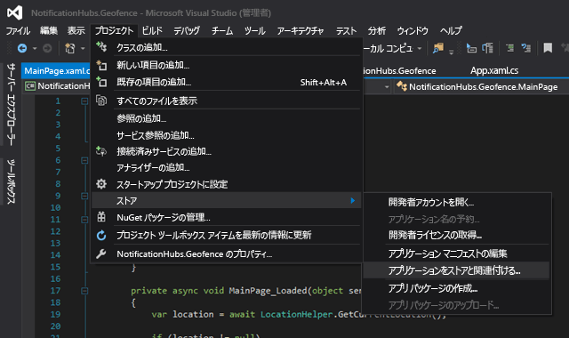
3. 開発者アカウントにサインインしたら、既存のアプリを選択するか、または新しくアプリを作成してそこにパッケージを関連付けてください。
4. デベロッパー センターに移動し、作成したアプリを開きます。 **[サービス]**  >  **[プッシュ通知]**  >  **[Live Services site]\(Live サービス サイト\)** の順に選択します。

    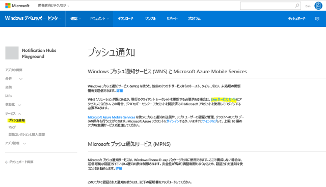
5. このサイトで、**アプリケーションのシークレット**と**パッケージ SID** をメモします。 Azure Portal では、この両方が必要です。通知ハブを開いて、 **[設定]**  >  **[Notification Services]**  >  **[Windows (WNS)]** を選択し、必要なフィールドに情報を入力します。

    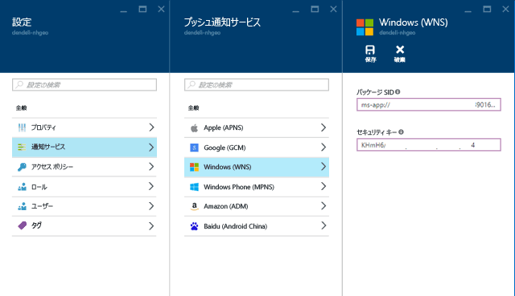
6. **[保存]** を選択します。
7. **ソリューション エクスプローラー**で **[参照設定]** を開いて、 **[NuGet パッケージの管理]** を選択します。 **Microsoft Azure Service Bus マネージド ライブラリ**への参照を追加します。単純に `WindowsAzure.Messaging.Managed` を検索し、それをプロジェクトに追加します。

    
8. テストのために、再度 `MainPage_Loaded` イベント ハンドラーを作成し、そこに次のコード スニペットを追加します。

    ```csharp
    var channel = await PushNotificationChannelManager.CreatePushNotificationChannelForApplicationAsync();

    var hub = new NotificationHub("HUB_NAME", "HUB_LISTEN_CONNECTION_STRING");
    var result = await hub.RegisterNativeAsync(channel.Uri);

    // Displays the registration ID so you know it was successful
    if (result.RegistrationId != null)
    {
        Debug.WriteLine("Reg successful.");
    }
    ```

    このコードは、アプリを通知ハブに登録します。 これで準備が整いました。
9. `LocationHelper` の `Geolocator_PositionChanged` ハンドラー内に、場所をジオフェンスの内部に強制的に配置するテスト コードを追加できます。

    ```csharp
    await LocationHelper.SendLocationToBackend("wns", "TEST_USER", "TEST", "37.7746", "-122.3858");
    ```

10. 実際の座標 (現時点では境界内にない可能性があります) を渡しているわけではなく、事前に定義されたテスト値を使用しているため、更新時に次の通知が表示されます。

    

## <a name="next-steps"></a>次のステップ

このソリューションを運用環境に対応させるには、いくつかの手順を実行する必要があります。

1. 最初に、ジオフェンスが動的であることを確認する必要があります。 それには、Bing API を使用した何らかの追加の作業で、既存のデータ ソース内の新しい境界をアップロードできることが必要です。 詳細については、[Bing Spatial Data Services API ドキュメント](https://msdn.microsoft.com/library/ff701734.aspx)を参照してください。
2. 次に、適切な参加者に対して確実に通知を配信するために、 [タグ付け](notification-hubs-tags-segment-push-message.md)によってターゲットを指定する場合があります。

このチュートリアルに示されているソリューションでは、多様なターゲット プラットフォームが存在する可能性のあるシナリオが説明されているため、ジオフェンシングがシステム固有の機能に制限されません。 しかし、ユニバーサル Windows プラットフォームには、 [細かい設定なしにジオフェンスを検出](https://msdn.microsoft.com/windows/uwp/maps-and-location/set-up-a-geofence)する機能が備わっています。
