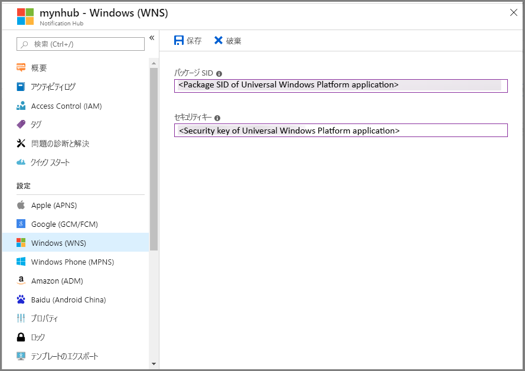

# Notification Hubs の使用 (Windows ユニバーサル プラットフォーム アプリ)
[!INCLUDE [notification-hubs-selector-get-started](../../includes/notification-hubs-selector-get-started.md)]

## 概要
このチュートリアルでは、Azure Notification Hubs を使用してユニバーサル Windows プラットフォーム (UWP) アプリにプッシュ通知を送信する方法について説明します。

このチュートリアルでは、Windows プッシュ通知サービス (WNS) を使用してプッシュ通知を受信する、空の Windows ストア アプリを作成します。 完了すると、通知ハブを使用して、アプリケーションを実行するすべてのデバイスにプッシュ通知をブロードキャストできるようになります。

## 開始する前に
[!INCLUDE [notification-hubs-hero-slug](../../includes/notification-hubs-hero-slug.md)]

このチュートリアルの完成したコードについては、GitHub の [こちら](https://github.com/Azure/azure-notificationhubs-samples/tree/master/dotnet/GetStartedWindowsUniversal)を参照してください。

## 前提条件
このチュートリアルには、次のものが必要です。

* [Microsoft Visual Studio Community 2015](https://www.visualstudio.com/products/visual-studio-community-vs) 以降
* [ユニバーサル Windows アプリ開発ツールがインストールされている](https://msdn.microsoft.com/windows/uwp/get-started/get-set-up)
* アクティブな Azure アカウント  アカウントがない場合は、無料試用版のアカウントを数分で作成することができます。 詳細については、 [Azure の無料試用版サイト](https://azure.microsoft.com/pricing/free-trial/?WT.mc_id=A0E0E5C02&amp;returnurl=http%3A%2F%2Fazure.microsoft.com%2Fen-us%2Fdocumentation%2Farticles%2Fnotification-hubs-windows-store-dotnet-get-started%2F)を参照してください。
* アクティブな Windows ストア アカウント

このチュートリアルを完了することは、Windows ユニバーサル プラットフォーム アプリの他のすべての Notification Hubs チュートリアルの前提条件です。

## アプリケーションを Windows ストアに登録する
UWP アプリにプッシュ通知を送信するには、アプリを Windows ストアに関連付ける必要があります。 さらに、WNS に統合するために通知ハブを構成する必要があります。

1. アプリケーションをまだ登録していない場合は、 [Windows デベロッパー センター](https://dev.windows.com/overview)に移動し、Microsoft アカウントでサインインし、 **[新しいアプリの作成]**をクリックします。

2. アプリの名前を入力し、 **[アプリの名前の予約]**をクリックします。 これでアプリケーションの新しい Windows ストア登録が作成されます。

3. Visual Studio で、Windows ユニバーサルの **[空のアプリケーション]** テンプレートを使用して新しい Visual C# ストア アプリ プロジェクトを作成し、**[OK]** をクリックします。

4. ターゲットとプラットフォームの最小バージョンの既定値をそのまま使用します。

5. ソリューション エクスプローラーで Windows ストア アプリ プロジェクトを右クリックし、**[ストア]**、**[アプリケーションをストアと関連付ける]** の順にクリックします。 **アプリケーションを Windows ストアと関連付ける** ウィザードが表示されます。

6. ウィザードで、自分の Microsoft アカウントでサインインします。

7. ステップ 2. で登録したアプリケーションをクリックし、**[次へ]**、**[関連付け]** の順にクリックします。 この操作により、必要な Windows ストア登録情報がアプリケーション マニフェストに追加されます。

8. [Windows デベロッパー センター](http://dev.windows.com/overview)で新しいアプリのページに戻り、**[サービス]**、**[プッシュ通知]**、**[WNS/MPNS]** の順にクリックします。

9. **[新しい通知]** をクリックします。

10. **[Blank (Toast)]\(空白 (トースト)\)** テンプレートをクリックして、**[OK]** をクリックします。

11. 通知の**名前**とビジュアル **コンテキスト** メッセージを入力します。 **[下書きとして保存]** をクリックします。

12. [アプリケーション登録ポータル](http://apps.dev.microsoft.com)に移動して、ログインします。

13. アプリケーション名をクリックします。 **Windows ストア** プラットフォームの設定の**アプリケーション シークレット** パスワードと**パッケージ セキュリティ ID (SID)** をメモします。

     > [AZURE.WARNING]
    アプリケーション シークレットおよびパッケージ SID は、重要なセキュリティ資格情報です。 これらの値は、他のユーザーと共有したり、アプリケーションで配信したりしないでください。

## 通知ハブを構成する
[!INCLUDE [notification-hubs-portal-create-new-hub](../../includes/notification-hubs-portal-create-new-hub.md)]

<ol start="6">
<li>
<b>[Notification Services]</b> オプションと <b>[Windows (WNS)]</b> オプションを順に選択します。 次に、<b>アプリケーション シークレット</b> パスワードを <b>[セキュリティ キー]</b> ボックスに入力します。 前のセクションで WNS から取得した<b>パッケージ SID</b> 値を入力し、<b>[保存]</b> をクリックします。

</li>
</ol>

&emsp;&emsp;

これで、通知ハブが WNS と連動するように構成されました。接続文字列にアプリケーションを登録し、通知を送信できます。

## 通知ハブにアプリケーションを接続する
1. Visual Studio でソリューションを右クリックし、 **[NuGet パッケージの管理]**をクリックします。
   
    **[NuGet パッケージの管理]** ダイアログ ボックスが表示されます。
2. `WindowsAzure.Messaging.Managed` を検索し、 **[インストール]**をクリックして、使用条件に同意します。
   
    ![][20]
   
    <a href="http://nuget.org/packages/WindowsAzure.Messaging.Managed/">WindowsAzure.Messaging.Managed NuGet パッケージ</a>を使用して、Windows の Azure メッセージング ライブラリに参照がダウンロードされ、インストールされ、追加されます。
3. App.xaml.cs プロジェクト ファイルを開き、次の `using` ステートメントを追加します。 
   
        using Windows.Networking.PushNotifications;
        using Microsoft.WindowsAzure.Messaging;
        using Windows.UI.Popups;
4. さらに、App.xaml.cs で、次の **InitNotificationsAsync** メソッドの定義を **App** クラスに追加します。
   
        private async void InitNotificationsAsync()
        {
            var channel = await PushNotificationChannelManager.CreatePushNotificationChannelForApplicationAsync();
   
            var hub = new NotificationHub("< your hub name>", "<Your DefaultListenSharedAccessSignature connection string>");
            var result = await hub.RegisterNativeAsync(channel.Uri);
   
            // Displays the registration ID so you know it was successful
            if (result.RegistrationId != null)
            {
                var dialog = new MessageDialog("Registration successful: " + result.RegistrationId);
                dialog.Commands.Add(new UICommand("OK"));
                await dialog.ShowAsync();
            }
   
        }
   
    このコードにより、WNS からアプリケーションのチャネル URI が取得され、そのチャネル URI が通知ハブに登録されます。
   
   > [!NOTE]
   > "your hub name" プレースホルダーは、Azure Portal に表示される通知ハブの名前に置き換えてください。 さらに、接続文字列プレースホルダーを、前のセクションで通知ハブの **[アクセス ポリシー]** ページから取得した **DefaultListenSharedAccessSignature** 接続文字列に置き換えます。
   > 
   > 
5. App.xaml.cs 内で、**OnLaunched** イベント ハンドラーの先頭に、次に示す新しい **InitNotificationsAsync** メソッドへの呼び出しを追加します。
   
        InitNotificationsAsync();
   
    これにより、アプリケーションが起動するたびに必ずチャネル URI が通知ハブに登録されます。
6. **F5** キーを押してアプリケーションを実行します。 登録キーを示すポップアップ ダイアログが表示されます。

これで、アプリケーションがトースト通知を受信する準備が整いました。

## 通知を送信する
以下の画面に示すように、通知ハブの [[テスト送信]](https://portal.azure.com/) ボタンを使用して、**Azure Portal** で通知を送信し、アプリケーションで通知の受信テストをすばやく行うことができます。

プッシュ通知は通常、互換性のあるライブラリを使用して Mobile Services などのバックエンド サービスや ASP.NET に送信されます。 ライブラリがバックエンドで利用できない場合、REST API を直接使用して通知メッセージを送信できます。 

このチュートリアルでは、バックエンド サービスではなく、コンソール アプリケーションの通知ハブに .NET SDK を使用して通知を送信することで例を単純にして、クライアント アプリのテスト手順のみを説明します。 ASP.NET バックエンドから通知を送信するには、次のステップとして「 [Notification Hubs を使用したユーザーへのプッシュ通知] 」を参照することをお勧めします。 ただし、通知の送信には、次の方法も使用できます。

* **REST インターフェイス**: [REST インターフェイス](http://msdn.microsoft.com/library/windowsazure/dn223264.aspx)を使用すると、任意のバックエンド プラットフォームの通知をサポートできます。
* **Microsoft Azure Notification Hubs .NET SDK**: Nuget Package Manager for Visual Studio で、 [Install-Package Microsoft.Azure.NotificationHubs](https://www.nuget.org/packages/Microsoft.Azure.NotificationHubs/)を実行します。
* **Node.js** : [Node.js から Notification Hubs を使用する方法](notification-hubs-nodejs-push-notification-tutorial.md)。
* **Azure Mobile Apps**: Notification Hubs に統合されている Azure Mobile Apps から通知を送信する方法の例については、「 [Windows Runtime 8.1 ユニバーサル アプリへのプッシュ通知の追加](../app-service-mobile/app-service-mobile-windows-store-dotnet-get-started-push.md)」を参照してください。
* **Java / PHP**: REST API を使用した通知の送信方法の例については、「Java/PHP から Notification Hubs を使用する方法」([Java](notification-hubs-java-push-notification-tutorial.md)  |  [PHP](notification-hubs-php-push-notification-tutorial.md)) を参照してください。

## (省略可能) コンソール アプリケーションから通知を送信する
.NET コンソール アプリケーションを使用して通知を送信するには、次の手順を実行します。 

1. ソリューションを右クリックして **[追加]**、**[新しいプロジェクト]** の順に選択し、**[Visual C#]** で **[Windows]**、**[コンソール アプリケーション]** の順にクリックして、**[OK]** をクリックします。
   
    これにより、新しい Visual C# コンソール アプリケーションがソリューションに追加されます。 個別のソリューションでこの操作を行うこともできます。

2. Visual Studio で、**[ツール]**、**[NuGet パッケージ マネージャー]**、**[パッケージ マネージャー コンソール]** の順にクリックします。
   
    Visual Studio のパッケージ マネージャー コンソールが表示されます。
3. パッケージ マネージャー コンソール ウィンドウで **[既定のプロジェクト]** に新しいコンソール アプリケーション プロジェクトを設定した後、そのコンソール ウィンドウから次のコマンドを実行します。
   
        Install-Package Microsoft.Azure.NotificationHubs
   
    これにより <a href="http://www.nuget.org/packages/Microsoft.Azure.NotificationHubs/">Microsoft.Azure.Notification Hubs NuGet パッケージ</a>を利用して Azure Notification Hubs SDK に参照が追加されます。
   
    
4. Program.cs ファイルを開き、次の `using` ステートメントを追加します。
   
        using Microsoft.Azure.NotificationHubs;
5. **Program** クラスで、次のメソッドを追加します。
   
        private static async void SendNotificationAsync()
        {
            NotificationHubClient hub = NotificationHubClient
                .CreateClientFromConnectionString("<connection string with full access>", "<hub name>");
            var toast = @"<toast><visual><binding template=""ToastText01""><text id=""1"">Hello from a .NET App!</text></binding></visual></toast>";
            await hub.SendWindowsNativeNotificationAsync(toast);
        }
   
       Make sure to replace the "hub name" placeholder with the name of the notification hub that as it appears in the Azure Portal. Also, replace the connection string placeholder with the **DefaultFullSharedAccessSignature** connection string that you obtained from the **Access Policies** page of your Notification Hub in the section called "Configure your notification hub."
   
   > [!NOTE]
   > **リッスン** アクセスではなく**フル** アクセスを持つ接続文字列を使用してください。 リッスン アクセス文字列には通知を送信するアクセス許可はありません。
   > 
   > 
6. **Main** メソッド内に、次の行を追加します。
   
         SendNotificationAsync();
         Console.ReadLine();
7. Visual Studio でコンソール アプリケーション プロジェクトを右クリックし、 **[スタートアップ プロジェクトに設定]** をクリックすることにより、それをスタートアップ プロジェクトとして設定します。 **F5** キーを押して、アプリケーションを実行します。
   
    登録したすべてのデバイスでトースト通知を受信します。 トースト バナーをクリックまたはタップすると、アプリケーションが読み込まれます。

MSDN の[トースト カタログ]、[タイル カタログ]、[バッジの概要]に関する各トピックに、サポートされるすべてのペイロードが記載されています。

## 次のステップ
この簡単な例では、すべての Windows デバイスにブロードキャスト通知を送信します。 次のステップとして「 [Notification Hubs を使用したユーザーへのプッシュ通知] 」チュートリアルをお勧めします。 このチュートリアルでは、特定のユーザーに対してタグを使用して ASP.NET バックエンドから通知を送信する方法について説明しています。

対象グループごとにユーザーを区分する場合は、「 [Notification Hubs を使用したニュース速報の送信]」を参照してください。 

Notification Hubs の全般的な情報については、「 [Notification Hubs の概要](notification-hubs-push-notification-overview.md)」を参照してください。

<!-- Images. -->
[13]: ./media/notification-hubs-windows-store-dotnet-get-started/notification-hub-create-console-app.png
[14]: ./media/notification-hubs-windows-store-dotnet-get-started/notification-hub-windows-toast.png
[19]: ./media/notification-hubs-windows-store-dotnet-get-started/notification-hub-windows-reg.png
[20]: ./media/notification-hubs-windows-store-dotnet-get-started/notification-hub-windows-universal-app-install-package.png

<!-- URLs. -->

[Notification Hubs を使用したユーザーへのプッシュ通知]: notification-hubs-aspnet-backend-windows-dotnet-wns-notification.md
[Notification Hubs を使用したニュース速報の送信]: notification-hubs-windows-notification-dotnet-push-xplat-segmented-wns.md

[トースト カタログ]: http://msdn.microsoft.com/library/windows/apps/hh761494.aspx
[タイル カタログ]: http://msdn.microsoft.com/library/windows/apps/hh761491.aspx
[バッジの概要]: http://msdn.microsoft.com/library/windows/apps/hh779719.aspx

