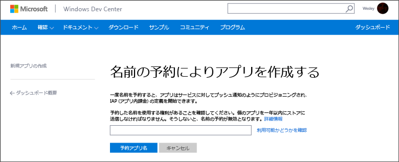
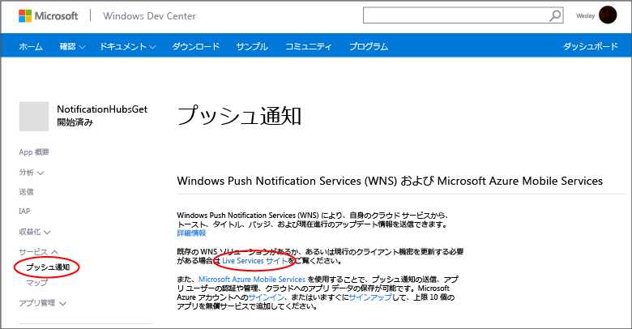

<properties
	pageTitle="Azure Notification Hubs の使用"
	description="Azure Notification Hubs を使用してプッシュ通知を行う方法について説明します。"
	services="notification-hubs"
	documentationCenter="windows"
	authors="wesmc7777"
	manager="dwrede"
	editor="dwrede"/>

<tags
	ms.service="notification-hubs"
	ms.workload="mobile"
	ms.tgt_pltfrm="mobile-windows"
	ms.devlang="dotnet"
	ms.topic="hero-article"
	ms.date="08/24/2015"
	ms.author="wesmc"/>

# Notification Hubs の使用

[AZURE.INCLUDE [notification-hubs-selector-get-started](../../includes/notification-hubs-selector-get-started.md)]

##概要

このトピックでは、Azure Notification Hubs を使用して Windows ストアや Windows Phone 8.1 (Silverlight 以外) アプリケーションにプッシュ通知を送信する方法について説明します。Windows Phone 8.1 Silverlight を対象としている場合は、[Windows Phone](notification-hubs-windows-phone-get-started.md) バージョンを参照してください。このチュートリアルでは、Windows プッシュ通知サービス (WNS) を使用してプッシュ通知を受信する空の Windows ストア アプリケーションを作成します。完了すると、通知ハブを使用して、アプリケーションを実行するすべてのデバイスにプッシュ通知をブロードキャストできるようになります。

このチュートリアルでは、Notification Hubs を使用した簡単なブロードキャスト シナリオのデモンストレーションを行います。Notification Hubs を使用してデバイスの特定のユーザーとグループに対応する方法を理解するために、次のチュートリアルも一緒に参照してください。

##前提条件

このチュートリアルには、次のものが必要です。

+ Microsoft Visual Studio Express 2013 for Windows Update 2 Visual Studio のこのバージョンでは、ユニバーサル アプリ プロジェクトを作成する必要があります。Windows ストア アプリのみを作成する場合は、Visual Studio 2012 Express for Windows 8 が必要です。

+ アクティブな Windows ストア アカウント

+ アクティブな Azure アカウント アカウントがない場合は、無料の試用アカウントを数分で作成することができます。詳細については、[Azure の無料評価版サイト](http://azure.microsoft.com/pricing/free-trial/?WT.mc_id=A0E0E5C02&amp;returnurl=http%3A%2F%2Fazure.microsoft.com%2Fja-JP%2Fdocumentation%2Farticles%2Fnotification-hubs-windows-store-dotnet-get-started%2F)を参照してください。

このチュートリアルを完了することは、Windows ストア アプリケーションの他のすべての Notification Hubs チュートリアルの前提条件です。

##アプリケーションを Windows ストアに登録する

Windows ストア アプリにプッシュ通知を送信するには、アプリケーションを Windows ストアに関連付ける必要があります。さらに、WNS に統合するために通知ハブを構成する必要があります。

1. アプリケーションをまだ登録していない場合は、<a href="http://go.microsoft.com/fwlink/p/?LinkID=266582" target="_blank">Windows デベロッパー センター</a>に移動し、Microsoft アカウントでログインし、**[新しいアプリの作成]** をクリックします。

2. アプリの名前を入力し、**[アプリの名前の予約]** をクリックします。

   	

   	これでアプリケーションの新しい Windows ストア登録が作成されます。

3. Visual Studio で、**空のアプリケーション** テンプレートを使用して新しい Visual C# ストア アプリ プロジェクトを作成します。

   	![][2]

4. ソリューション エクスプローラーで Windows ストア アプリ プロジェクトを右クリックし、**[ストア]**、**[アプリケーションをストアと関連付ける]** の順にクリックします。

   	![][3]

   	**アプリケーションを Windows ストアと関連付ける**ウィザードが表示されます。

5. ウィザードで **[サインイン]** をクリックし、Microsoft アカウントでログインします。

6. ステップ 2. で登録したアプリケーションをクリックし、**[次へ]**、**[関連付け]** の順にクリックします。

   	![][4]

   	この操作により、必要な Windows ストア登録情報がアプリケーション マニフェストに追加されます。

7. (省略可能) Windows Phone ストア アプリ プロジェクトのステップ 4.～6. を繰り返します。

8. 新しいアプリの Windows デベロッパー センターに戻り、**[サービス]**、**[プッシュ通知]** をクリックし、**[Windows プッシュ通知サービス (WNS) と Microsoft Azure Mobile Services]** の下にある **[ライブ サービス サイト]** をクリックします。

   	

9. **[アプリ設定]** タブで、**[クライアント シークレット]** と **[パッケージ セキュリティ ID (SID)]** の値をメモしておきます。

   	![][6]

 	> [AZURE.NOTE]**セキュリティに関する注意**: クライアント シークレットとパッケージ SID は、重要なセキュリティ資格情報です。これらの値は、他のユーザーと共有したり、アプリケーションで配信したりしないでください。

##通知ハブを構成する

1. [Azure 管理ポータル]にログオンし、画面の下部にある **[新規]** をクリックします。

2. **[App Services]**、**[Service Bus]**、**[通知ハブ]**、**[簡易作成]** の順にクリックします。

   	![][7]

3. 通知ハブの名前を入力して、目的のリージョンを選択し、**[新しい通知ハブを作成する]** をクリックします。

   	![][8]

4. 前の手順で作成した名前空間 (通常は "***通知ハブ名*-ns**") をクリックし、上部にある **[構成]** タブをクリックします。

   	![][9]

5. 上部にある **[Notification Hubs]** を選択し、前の手順で作成した通知ハブをクリックします。

   	![][10]

6. 上部にある **[構成]** タブを選択し、前のセクションで WNS から取得した **[クライアント シークレット]** と **[パッケージ SID]** の値を入力して、**[保存]** をクリックします。

   	![][11]

7. ページ上部の **[ダッシュボード]** タブを選択し、下部の **[接続情報]** ボタンをクリックします。2 つの接続文字列をメモします。

   	![][12]

これで、通知ハブが WNS と連動するように構成されました。接続文字列にアプリケーションを登録し、通知を送信できます。

##通知ハブにアプリケーションを接続する

1. Visual Studio でソリューションを開いて右クリックし、**[NuGet パッケージの管理]** をクリックします。

	[NuGet パッケージの管理] ダイアログ ボックスが表示されます。

2. `WindowsAzure.Messaging.Managed` を検索し、**[インストール]** をクリックし、ソリューション内のすべてのプロジェクトを選択して、使用条件に同意します。

	![][20]

	こうすることで、<a href="http://nuget.org/packages/WindowsAzure.Messaging.Managed/">WindowsAzure.Messaging.Managed NuGet パッケージ</a>を使用して、Windows の Azure メッセージング ライブラリにすべてのプロジェクトの参照がダウンロード、インストール、追加されます。

3. App.xaml.cs プロジェクト ファイルを開き、次の `using` ステートメントを追加します。ユニバーサル プロジェクトでは、このファイルは `<project_name>.Shared` フォルダーにあります。

        using Windows.Networking.PushNotifications;
        using Microsoft.WindowsAzure.Messaging;
		using Windows.UI.Popups;

	

4. さらに、App.xaml.cs で、次の **InitNotificationsAsync** メソッドの定義を **App** クラスに追加します。

	    private async void InitNotificationsAsync()
        {
            var channel = await PushNotificationChannelManager.CreatePushNotificationChannelForApplicationAsync();

            var hub = new NotificationHub("<hub name>", "<connection string with listen access>");
			var result = await hub.RegisterNativeAsync(channel.Uri);

            // Displays the registration ID so you know it was successful
            if (result.RegistrationId != null)
            {
                var dialog = new MessageDialog("Registration successful: " + result.RegistrationId);
                dialog.Commands.Add(new UICommand("OK"));
                await dialog.ShowAsync();
            }

        }

    このコードにより、WNS からアプリケーションの ChannelURI が取得され、その ChannelURI が通知ハブに登録されます。

    >[AZURE.NOTE]"hub name" プレースホルダーは、ポータルの **[Notification Hubs]** タブに表示される通知ハブの名前 (たとえば、前の例では **mynotificationhub2**) に置き換えてください。また、接続文字列プレースホルダーを、先に取得した **DefaultListenSharedAccessSignature** 接続文字列に置き換えます。

5. App.xaml.cs 内で、**OnLaunched** イベント ハンドラーの先頭に、次に示す新しい **InitNotificationsAsync** メソッドへの呼び出しを追加します。

        InitNotificationsAsync();

    これにより、アプリケーションが起動されるたびに必ず ChannelURI が通知ハブに登録されます。

6. ソリューション エクスプローラーで Windows ストア アプリの **Package.appxmanifest** をダブルクリックし、**[通知]** で **[トースト対応]** を **[はい]** に設定します。

   	![][18]

   	**[ファイル]** メニューの **[すべて保存]** をクリックします。

7. (省略可能) Windows Phone ストア アプリ プロジェクトの前のステップを繰り返します。

8. **F5** キーを押してアプリケーションを実行します。登録キーを示すポップアップ ダイアログが表示されます。

   	![][19]

9. (省略可能) 前のステップを繰り返して、他のプロジェクトを実行します。

これで、アプリケーションがトースト通知を受信する準備が整いました。

##バックエンドから通知を送信する

通知は、<a href="http://msdn.microsoft.com/library/windowsazure/dn223264.aspx">REST インターフェイス</a>を使用するどのバックエンドからも Notification Hubs を使用して送信できます。このチュートリアルでは、.NET コンソール アプリケーションを使用して通知を送信します。Notification Hubs と統合した Azure Mobile Services バックエンドからの通知の送信例については、「**Mobile Servicesでのプッシュ通知の使用**」([.NET バックエンド](../mobile-services-javascript-backend-windows-store-dotnet-get-started-push.md) | [JavaScript バックエンド](../mobile-services-javascript-backend-windows-store-dotnet-get-started-push.md)) を参照してください。REST API を使用した通知の送信方法の例については、「**How to use Notification Hubs from Java/PHP (Java/PHP から Notification Hubs を使用する方法)**」([Java](notification-hubs-java-backend-how-to.md) | [PHP](notification-hubs-php-backend-how-to.md)) を参照してください。

1. ソリューションを右クリックし、**[追加]** と **[新しいプロジェクト]** を選択し、**[Visual C#]** で **[Windows]** と **[コンソール アプリケーション]** をクリックして、**[OK]** をクリックします。

   	![][13]

	これにより、新しい Visual C# コンソール アプリケーションがソリューションに追加されます。個別のソリューションでこの操作を行うこともできます。

4. Visual Studio で、**[ツール]**、**[Nuget パッケージ マネージャー]**、**[パッケージ マネージャー コンソール]** の順にクリックします。

	Visual Studio のパッケージ マネージャー コンソールが表示されます。

6. パッケージ マネージャー コンソール ウィンドウで **[既定のプロジェクト]** を新しいコンソール アプリケーション プロジェクトに設定した後、そのコンソール ウィンドウから次のコマンドを実行します。

        Install-Package Microsoft.Azure.NotificationHubs

	これにより <a href="http://www.nuget.org/packages/Microsoft.Azure.NotificationHubs/">Microsoft.Azure.Notification Hubs NuGet パッケージ</a>を利用して Azure Notification Hubs SDK に参照が追加されます。

5. Program.cs ファイルを開き、次の `using` ステートメントを追加します。

        using Microsoft.Azure.NotificationHubs;

6. **Program** クラスで、次のメソッドを追加します。

        private static async void SendNotificationAsync()
        {
            NotificationHubClient hub = NotificationHubClient
				.CreateClientFromConnectionString("<connection string with full access>", "<hub name>");
            var toast = @"<toast><visual><binding template=""ToastText01""><text id=""1"">Hello from a .NET App!</text></binding></visual></toast>";
            await hub.SendWindowsNativeNotificationAsync(toast);
        }

   	"hub name" プレースホルダーは、ポータルの **[Notification Hubs]** タブに表示される通知ハブの名前に置き換えてください。また、接続文字列プレースホルダーを、「通知ハブを構成する」で取得した **DefaultFullSharedAccessSignature** という接続文字列に置き換えます。

	>[AZURE.NOTE]**リッスン** アクセスではなく**フル** アクセスを持つ接続文字列を使用してください。リッスン アクセス文字列には通知を送信するアクセス許可はありません。

7. 次に、**Main** メソッド内に、次の行を追加します。

         SendNotificationAsync();
		 Console.ReadLine();

8. Visual Studio でコンソール アプリケーション プロジェクトを右クリックし、**[スタートアップ プロジェクトに設定]** をクリックすることにより、それをスタートアップ プロジェクトとして設定します。**F5** キーを押して、アプリケーションを実行します。

   	![][14]

	登録したすべてのデバイスでトースト通知を受信します。トースト バナーをクリックまたはタップすると、アプリを読み込みます。

MSDN の [トースト カタログ]、[タイル カタログ]、[バッジの概要]トピックに、サポートされるすべてのペイロードが記載されています。

##次のステップ

この簡単な例では、すべての Windows デバイスにブロードキャスト通知を送信します。特定のユーザーをターゲットとするには、「[Notification Hubs を使用したユーザーへのプッシュ通知]」のチュートリアルを参照してください。対象グループごとにユーザーを区分する場合は、「[Notification Hubs を使用したニュース速報の送信]」を参照してください。通知ハブの使用方法の詳細については、「[Notification Hubs の概要]」を参照してください。

<!-- Images. -->
[2]: ./media/notification-hubs-windows-store-dotnet-get-started/notification-hub-create-windows-universal-app.png
[3]: ./media/notification-hubs-windows-store-dotnet-get-started/notification-hub-associate-win8-app.png
[4]: ./media/notification-hubs-windows-store-dotnet-get-started/mobile-services-select-app-name.png
[6]: ./media/notification-hubs-windows-store-dotnet-get-started/mobile-services-win8-app-push-auth.png
[7]: ./media/notification-hubs-windows-store-dotnet-get-started/notification-hub-create-from-portal.png
[8]: ./media/notification-hubs-windows-store-dotnet-get-started/notification-hub-create-from-portal2.png
[9]: ./media/notification-hubs-windows-store-dotnet-get-started/notification-hub-select-from-portal.png
[10]: ./media/notification-hubs-windows-store-dotnet-get-started/notification-hub-select-from-portal2.png
[11]: ./media/notification-hubs-windows-store-dotnet-get-started/notification-hub-configure-wns.png
[12]: ./media/notification-hubs-windows-store-dotnet-get-started/notification-hub-connection-strings.png
[13]: ./media/notification-hubs-windows-store-dotnet-get-started/notification-hub-create-console-app.png
[14]: ./media/notification-hubs-windows-store-dotnet-get-started/notification-hub-windows-toast.png
[15]: ./media/notification-hubs-windows-store-dotnet-get-started/notification-hub-scheduler1.png
[16]: ./media/notification-hubs-windows-store-dotnet-get-started/notification-hub-scheduler2.png
[18]: ./media/notification-hubs-windows-store-dotnet-get-started/notification-hub-win8-app-toast.png
[19]: ./media/notification-hubs-windows-store-dotnet-get-started/notification-hub-windows-reg.png
[20]: ./media/notification-hubs-windows-store-dotnet-get-started/notification-hub-windows-universal-app-install-package.png

<!-- URLs. -->
[Azure 管理ポータル]: https://manage.windowsazure.com/
[Notification Hubs の概要]: http://msdn.microsoft.com/library/jj927170.aspx

[Notification Hubs を使用したユーザーへのプッシュ通知]: notification-hubs-aspnet-backend-windows-dotnet-notify-users.md
[Notification Hubs を使用したニュース速報の送信]: notification-hubs-windows-store-dotnet-send-breaking-news.md

[トースト カタログ]: http://msdn.microsoft.com/library/windows/apps/hh761494.aspx
[タイル カタログ]: http://msdn.microsoft.com/library/windows/apps/hh761491.aspx
[バッジの概要]: http://msdn.microsoft.com/library/windows/apps/hh779719.aspx
 

<!---HONumber=August15_HO9-->