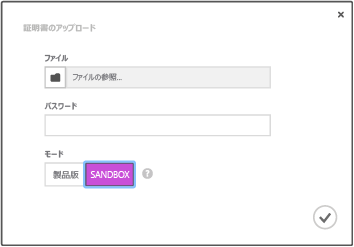

<properties
	pageTitle="Notification Hubs の使用 (Xamarin.iOS アプリケーション) | Microsoft Azure"
	description="このチュートリアルでは、Azure Notification Hubs を使用して Xamarin.iOS アプリケーションにプッシュ通知を送信する方法について学習します。"
	services="notification-hubs"
	documentationCenter="xamarin"
	authors="ysxu"
	manager="dwrede"
	editor=""/>

<tags
	ms.service="notification-hubs"
	ms.workload="mobile"
	ms.tgt_pltfrm="mobile-xamarin-ios"
	ms.devlang="dotnet"
	ms.topic="hero-article"
	ms.date="10/21/2015"
	ms.author="yuaxu"/>

# Notification Hubs の使用

[AZURE.INCLUDE [notification-hubs-selector-get-started](../../includes/notification-hubs-selector-get-started.md)]

##概要

このチュートリアルでは、Azure Notification Hubs を使用して iOS アプリケーションにプッシュ通知を送信する方法について説明します。Apple Push Notification サービス (APNs) を使用してプッシュ通知を受信する空の Xamarin.iOS アプリケーションを作成します。完了すると、通知ハブを使用して、アプリケーションを実行するすべてのデバイスにプッシュ通知をブロードキャストできるようになります。完成したコードは、[NotificationHubs アプリケーション][GitHub] サンプルで参照できます。

このチュートリアルでは、Notification Hubs を使用した簡単なブロードキャスト シナリオのデモンストレーションを行います。

##前提条件

このチュートリアルには、次のものが必要です。

+ [XCode 6.0][Install Xcode]
+ iOS 7.0 (またはこれ以降のバージョン) に対応したデバイス
+ iOS Developer Program メンバーシップ
+ [Xamarin.iOS]
+ [Azure Mobile Services コンポーネント]

   >[AZURE.NOTE]プッシュ通知の構成要件により、プッシュ通知のデプロイとテストは、シミュレーターではなく iOS 対応デバイス (iPhone または iPad) で行う必要があります。

このチュートリアルを完了することは、Xamarin.iOS アプリの他のすべての Notification Hubs チュートリアルの前提条件です。

> [AZURE.IMPORTANT]このチュートリアルを完了するには、アクティブな Azure アカウントが必要です。アカウントがない場合は、無料試用版のアカウントを数分で作成することができます。詳細については、[Azure の無料試用版サイト](http://azure.microsoft.com/pricing/free-trial/?WT.mc_id=A643EE910&amp;returnurl=http%3A%2F%2Fazure.microsoft.com%2Fja-JP%2Fdocumentation%2Farticles%2Fpartner-xamarin-notification-hubs-ios-get-started)を参照してください。

[AZURE.INCLUDE [Notification Hubs による Apple プッシュ通知の有効化](../../includes/notification-hubs-enable-apple-push-notifications.md)]

##通知ハブを構成する

このセクションでは、作成した **.p12** プッシュ証明書を使用して、新しい通知ハブを作成し、APNS での認証を構成する方法について説明します。既に作成した通知ハブを使用する場合は、手順 5. に進んでください。

[AZURE.INCLUDE [notification-hubs-portal-create-new-hub](../../includes/notification-hubs-portal-create-new-hub.md)]

<ol start="7">
<li>

上部にある <b>[構成]</b> タブをクリックし、Apple 通知設定の <b>[アップロード]</b> ボタンをクリックして、証明書の拇印をアップロードします。次に、前にエクスポートした <b>.p12</b> 証明書と、その証明書のパスワードを選択します。

これは開発用であるため、<b>[サンドボックス]</b> モードを選択してください。<b>[運用]</b> は、ストアからアプリを購入したユーザーにプッシュ通知を送信する場合のみ使用します。

</li>
</ol>
&emsp;&emsp;

&emsp;&emsp;

これで、通知ハブが APNS と連動するように構成されました。接続文字列にアプリケーションを登録し、通知を送信できます。

##通知ハブにアプリケーションを接続する

#### 新しいプロジェクトを作成する

1. Xamarin Studio で、新しい iOS プロジェクトを作成し、**[統合 API]**、**[単一ビュー アプリケーション]** テンプレートの順に選択します。

   	![][31]

2. Azure Messaging コンポーネントへの参照を追加します。[ソリューション] ビューで、プロジェクトの **[コンポーネント]** フォルダーを右クリックし、**[他のコンポーネントを取得する]** を選択します。**Azure Messaging** コンポーネントを検索し、そのコンポーネントをプロジェクトに追加します。

3. **AppDelegate.cs** で、次の using ステートメントを追加します。

    using WindowsAzure.Messaging;

4. **SBNotificationHub** のインスタンスを宣言します。

		private SBNotificationHub Hub { get; set; }

5. 次の変数を使用して **Constants.cs** クラスを作成します。

        // Azure app-specific connection string and hub path
        public const string ConnectionString = "<Azure connection string>";
        public const string NotificationHubPath = "<Azure hub path>";

6. **AppDelegate.cs** で、**FinishedLaunching()** を更新して次の内容に合わせます。

        public override bool FinishedLaunching(UIApplication application, NSDictionary launchOptions)
        {
            UIRemoteNotificationType notificationTypes = UIRemoteNotificationType.Alert |
                UIRemoteNotificationType.Badge | UIRemoteNotificationType.Sound;
            UIApplication.SharedApplication.RegisterForRemoteNotificationTypes(notificationTypes);

            return true;
        }

7. **AppDelegate.cs** で **RegisteredForRemoteNotifications()** メソッドをオーバーライドします。

        public override void RegisteredForRemoteNotifications(UIApplication application, NSData deviceToken)
        {
            Hub = new SBNotificationHub(Constants.ConnectionString, Constants.NotificationHubPath);

            Hub.UnregisterAllAsync (deviceToken, (error) => {
                if (error != null)
                {
                    Console.WriteLine("Error calling Unregister: {0}", error.ToString());
                    return;
                }

                NSSet tags = null; // create tags if you want
                Hub.RegisterNativeAsync(deviceToken, tags, (errorCallback) => {
                    if (errorCallback != null)
                        Console.WriteLine("RegisterNativeAsync error: " + errorCallback.ToString());
                });
            });
        }

8. **AppDelegate.cs** で **ReceivedRemoteNotification()** メソッドをオーバーライドします。

        public override void ReceivedRemoteNotification(UIApplication application, NSDictionary userInfo)
        {
            ProcessNotification(userInfo, false);
        }

9. **AppDelegate.cs** で次の **ProcessNotification()** メソッドを作成します。

        void ProcessNotification(NSDictionary options, bool fromFinishedLaunching)
        {
            // Check to see if the dictionary has the aps key.  This is the notification payload you would have sent
            if (null != options && options.ContainsKey(new NSString("aps")))
            {
                //Get the aps dictionary
                NSDictionary aps = options.ObjectForKey(new NSString("aps")) as NSDictionary;

                string alert = string.Empty;

                //Extract the alert text
                // NOTE: If you're using the simple alert by just specifying
                // "  aps:{alert:"alert msg here"}  ", this will work fine.
                // But if you're using a complex alert with Localization keys, etc.,
                // your "alert" object from the aps dictionary will be another NSDictionary.
                // Basically the JSON gets dumped right into a NSDictionary,
                // so keep that in mind.
                if (aps.ContainsKey(new NSString("alert")))
                    alert = (aps [new NSString("alert")] as NSString).ToString();

                //If this came from the ReceivedRemoteNotification while the app was running,
                // we of course need to manually process things like the sound, badge, and alert.
                if (!fromFinishedLaunching)
                {
                    //Manually show an alert
                    if (!string.IsNullOrEmpty(alert))
                    {
                        UIAlertView avAlert = new UIAlertView("Notification", alert, null, "OK", null);
                        avAlert.Show();
                    }
                }
            }
        }

    > [AZURE.NOTE]ネットワーク接続がないなどの状況に対処するために、**FailedToRegisterForRemoteNotifications()** をオーバーライドすることを選択できます。

10. デバイスでアプリケーションを実行します。

## 通知を送信する

以下の画面に示すように、通知ハブの [デバッグ] タブを使用して、Azure ポータルで通知を送信し、アプリケーションで通知の受信テストを行うことができます。

プッシュ通知は通常、互換性のあるライブラリを使用して Mobile Services などのバックエンド サービスや ASP.NET に送信されます。ライブラリがバックエンドで利用できない場合、REST API を直接使用して通知メッセージを送信できます。

このチュートリアルでは、バックエンド サービスではなく、コンソール アプリケーションの通知ハブに .NET SDK を使用して通知を送信することで例を単純にして、クライアント アプリのテスト手順のみを説明します。ASP.NET バックエンドから通知を送信するには、次のステップとして「[Notification Hubs を使用したユーザーへのプッシュ通知](notification-hubs-aspnet-backend-ios-notify-users.md)」を参照することをお勧めします。ただし、通知の送信には、次の方法も使用できます。

* **REST インターフェイス**: [REST インターフェイス](http://msdn.microsoft.com/library/windowsazure/dn223264.aspx)を使用すると、任意のバックエンド プラットフォームの通知をサポートできます。

* **Microsoft Azure Notification Hubs .NET SDK**: Nuget Package Manager for Visual Studio で、[Install-Package Microsoft.Azure.NotificationHubs](https://www.nuget.org/packages/Microsoft.Azure.NotificationHubs/) を実行します。

* **Node.js** : [Node.js から Notification Hubs を使用する方法](notification-hubs-nodejs-how-to-use-notification-hubs.md)。

* **Azure Mobile Services**: Notification Hubs と統合した Azure Mobile Services バックエンドからの通知の送信例については、「Mobile Services でのプッシュ通知の使用」([.NET バックエンド](../mobile-services/mobile-services-javascript-backend-windows-store-dotnet-get-started-push.md) | [JavaScript バックエンド](../mobile-services/mobile-services-javascript-backend-windows-store-dotnet-get-started-push.md)) を参照してください。

* **Java / PHP**: REST API を使用した通知の送信方法の例については、「Java/PHP から Notification Hubs を使用する方法」([Java](notification-hubs-java-backend-how-to.md) | [PHP](notification-hubs-php-backend-how-to.md)) を参照してください。

####(省略可能) .NET コンソール アプリケーションから通知を送信する

このセクションでは、.NET コンソール アプリケーションを使用して通知を送信します。

1. Visual C# の新しいコンソール アプリケーションを作成します。

   	![][213]

2. Visual Studio で、**[ツール]**、**[Nuget パッケージ マネージャー]**、**[パッケージ マネージャー コンソール]** の順にクリックします。

	Visual Studio のパッケージ マネージャー コンソールが表示されます。

3. パッケージ マネージャー コンソール ウィンドウで **[既定のプロジェクト]** に新しいコンソール アプリケーション プロジェクトを設定した後、そのコンソール ウィンドウから次のコマンドを実行します。

        Install-Package Microsoft.Azure.NotificationHubs

	これにより <a href="http://www.nuget.org/packages/Microsoft.Azure.NotificationHubs/">Microsoft.Azure.Notification Hubs NuGet パッケージ</a>を利用して Azure Notification Hubs SDK に参照が追加されます。

	

4. Program.cs ファイルを開き、次の `using` ステートメントを追加します。

        using Microsoft.Azure.NotificationHubs;

3. `Program` クラスで、次のメソッドを追加します。

        private static async void SendNotificationAsync()
        {
            NotificationHubClient hub = NotificationHubClient.CreateClientFromConnectionString("<connection string with full access>", "<hub name>");
            var alert = "{"aps":{"alert":"Hello from .NET!"}}";
            await hub.SendAppleNativeNotificationAsync(alert);
        }

4. `Main` メソッド内に次の行を追加します。

         SendNotificationAsync();
		 Console.ReadLine();

5. F5 キーを押してアプリケーションを実行します。デバイスでアラートを受信します。Wi-Fi を使用する場合は、接続が機能していることを確認します。

Apple の「[Local and Push Notification Programming Guide (ローカルおよびプッシュ通知プログラミング ガイド)]」に、使用できるすべてのペイロードが記載されています。

####(省略可能) モバイル サービスから通知を送信する

このセクションでは、モバイル サービスを使用してノード スクリプトから通知を送信します。

モバイル サービスを使用して通知を送信するには、「[Mobile Services の使用]」に従った後、次の手順を実行します。

1. [Azure ポータル]にサインインし、モバイル サービスを選択します。

2. 上部にある **[Scheduler]** タブを選択します。

   	![][215]

3. スケジュールされた新しいジョブを作成して名前を挿入し、**[要求時]** をクリックします。

   	![][216]

4. ジョブが作成されたら、ジョブ名をクリックします。上部のバーにある **[スクリプト]** タブをクリックします。

5. スケジューラ関数内に次のスクリプトを挿入します。必ず、プレースホルダーを、通知ハブの名前と既に取得してある *DefaultFullSharedAccessSignature* の接続文字列に置き換えてください。**[保存]** をクリックします。

		var azure = require('azure');
		var notificationHubService = azure.createNotificationHubService('<Hubname>', '<SAS Full access >');
		notificationHubService.apns.send(
	    	null,
    		{"aps":
        		{
          		"alert": "Hello from Mobile Services!"
        		}
    		},
    		function (error)
    		{
	        	if (!error) {
    	        	console.warn("Notification successful");
        		}
    		}
		);

6. 下部のバーにある **[一度だけ実行する]** をクリックします。デバイスでアラートを受信します。

##次のステップ

この簡単な例では、すべての iOS デバイスに通知をブロードキャストします。特定のユーザーをターゲットとするには、「[Notification Hubs を使用したユーザーへのプッシュ通知]」のチュートリアルを参照してください。対象グループごとにユーザーを区分する場合は、「[Notification Hubs を使用したニュース速報の送信]」を参照してください。Notification Hubs の使用方法の詳細については、「[Microsoft Azure Notification Hubs の概要]」と「[方法: Microsoft Azure Notification Hubs (iOS アプリ)]」を参照してください。

<!-- Images. -->

[213]: ./media/partner-xamarin-notification-hubs-ios-get-started/notification-hub-create-console-app.png

[215]: ./media/partner-xamarin-notification-hubs-ios-get-started/notification-hub-scheduler1.png
[216]: ./media/partner-xamarin-notification-hubs-ios-get-started/notification-hub-scheduler2.png

[31]: ./media/partner-xamarin-notification-hubs-ios-get-started/notification-hub-create-ios-app.png

<!-- URLs. -->
[Mobile Services iOS SDK]: http://go.microsoft.com/fwLink/?LinkID=266533
[Submit an app page]: http://go.microsoft.com/fwlink/p/?LinkID=266582
[My Applications]: http://go.microsoft.com/fwlink/p/?LinkId=262039
[Live SDK for Windows]: http://go.microsoft.com/fwlink/p/?LinkId=262253

[Mobile Services の使用]: /develop/mobile/tutorials/get-started-xamarin-ios
[Azure ポータル]: https://manage.windowsazure.com/
[Microsoft Azure Notification Hubs の概要]: http://msdn.microsoft.com/library/jj927170.aspx
[方法: Microsoft Azure Notification Hubs (iOS アプリ)]: http://msdn.microsoft.com/library/jj927168.aspx
[Install Xcode]: https://go.microsoft.com/fwLink/p/?LinkID=266532
[iOS Provisioning Portal]: http://go.microsoft.com/fwlink/p/?LinkId=272456

[Notification Hubs を使用したユーザーへのプッシュ通知]: /manage/services/notification-hubs/notify-users-aspnet
[Notification Hubs を使用したニュース速報の送信]: /manage/services/notification-hubs/breaking-news-dotnet

[Local and Push Notification Programming Guide (ローカルおよびプッシュ通知プログラミング ガイド)]: http://developer.apple.com/library/mac/#documentation/NetworkingInternet/Conceptual/RemoteNotificationsPG/Chapters/ApplePushService.html#//apple_ref/doc/uid/TP40008194-CH100-SW1
[Apple Push Notification Service]: http://go.microsoft.com/fwlink/p/?LinkId=272584

[Azure Mobile Services コンポーネント]: http://components.xamarin.com/view/azure-mobile-services/
[GitHub]: http://go.microsoft.com/fwlink/p/?LinkId=331329
[Xamarin.iOS]: http://xamarin.com/download
[WindowsAzure.Messaging]: https://github.com/infosupport/WindowsAzure.Messaging.iOS

<!---HONumber=Oct15_HO4-->