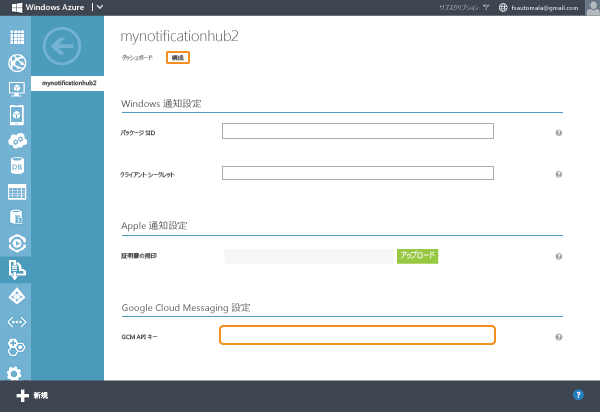
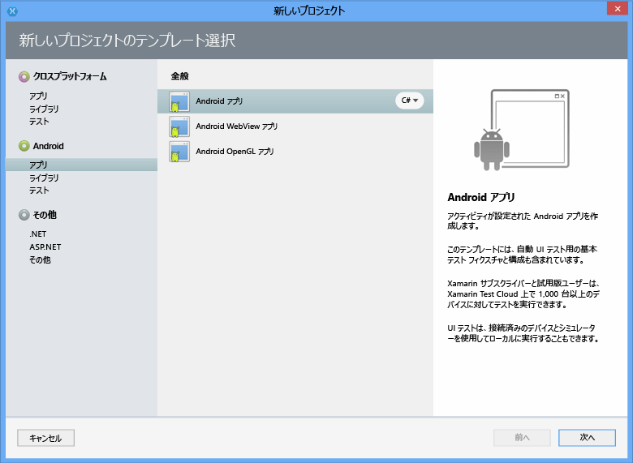
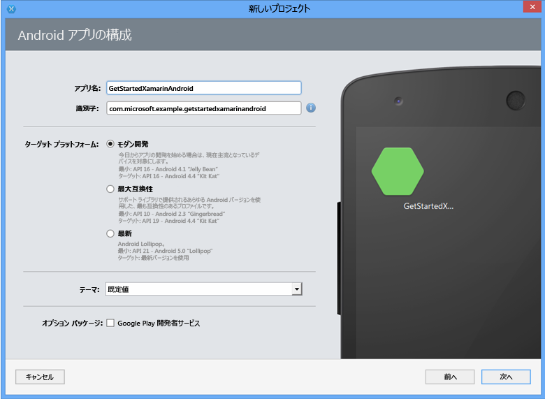
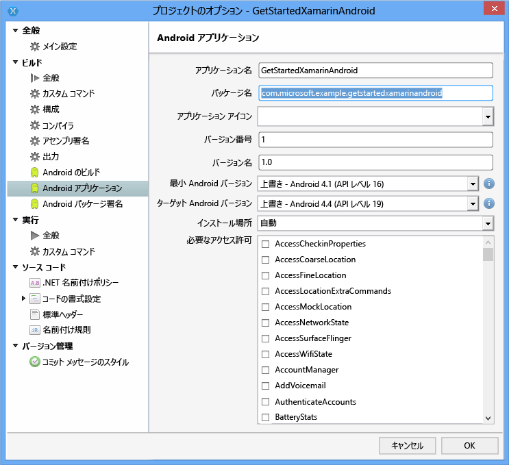

# Xamarin for Android での Notification Hubs の使用
[!INCLUDE [notification-hubs-selector-get-started](../../includes/notification-hubs-selector-get-started.md)]

## 概要
このチュートリアルでは、Azure Notification Hubs を使用して Xamarin.Android アプリケーションにプッシュ通知を送信する方法について説明します。
Google Cloud Messaging (GCM) を使用してプッシュ通知を受信する空の Xamarin.Android アプリケーションを作成します。 完了すると、通知ハブを使用して、アプリケーションを実行するすべてのデバイスにプッシュ通知をブロードキャストできるようになります。 完成したコードは、[NotificationHubs アプリケーション][GitHub] サンプルで参照できます。

このチュートリアルでは、Notification Hubs を使用した簡単なブロードキャスト シナリオのデモンストレーションを行います。

## 開始する前に
[!INCLUDE [notification-hubs-hero-slug](../../includes/notification-hubs-hero-slug.md)]

このチュートリアルの完成したコードについては、GitHub の [こちら](https://github.com/Azure/azure-notificationhubs-samples/tree/master/dotnet/Xamarin/GetStartedXamarinAndroid)を参照してください。

## 前提条件
このチュートリアルには、次のものが必要です。

* Visual Studio と Xamarin (Windows) または Xamarin Studio (Mac OS X)。インストールの詳しい手順については、「[セットアップとインストール](https://msdn.microsoft.com/library/mt613162.aspx)」を参照してください。
* アクティブな Google アカウント
* [Azure Messaging コンポーネント]
* [Google Cloud Messaging のクライアント コンポーネント]

このチュートリアルを完了することは、Xamarin.Android アプリの他のすべての Notification Hubs チュートリアルの前提条件です。

> [!IMPORTANT]
> このチュートリアルを完了するには、アクティブな Azure アカウントが必要です。 アカウントがない場合は、無料試用版のアカウントを数分で作成することができます。 詳細については、 [Azure の無料試用版サイト](https://azure.microsoft.com/pricing/free-trial/?WT.mc_id=A9C9624B5&amp;returnurl=http%3A%2F%2Fazure.microsoft.com%2Fen-us%2Fdocumentation%2Farticles%2Fpartner-xamarin-notification-hubs-android-get-started%2F)を参照してください。
> 
> 

## Google Cloud Messaging を有効にする
[!INCLUDE [mobile-services-enable-Google-cloud-messaging](../../includes/mobile-services-enable-google-cloud-messaging.md)]

## 通知ハブを構成する
[!INCLUDE [notification-hubs-portal-create-new-hub](../../includes/notification-hubs-portal-create-new-hub.md)]

<ol start="7">

<li>
上部にある <b>[構成]</b> タブをクリックし、前のセクションで取得した <b>API キー</b>値を入力して、<b>[保存]</b> をクリックします。

</li>
</ol>
&emsp;&emsp;

これで、通知ハブが GCM と連動するように構成されました。接続文字列により、アプリが通知を受信すると共に、プッシュ通知を送信するように登録されます。

## 通知ハブにアプリケーションを接続する
### 新しいプロジェクトを作成する
1. Xamarin Studio で **[New Solution (新しいソリューション)]** をクリックし、**[Android App (Android アプリ)]** をクリックして、**[Next (次へ)]** をクリックします。
   
      

2. **アプリケーション名**と**識別子**を入力します。 サポートする**ターゲット プラットフォーム**をクリックし、**[Next (次へ)]**、**[Create (作成)]** の順にクリックします。
   
      

    これにより、新しい Android プロジェクトが作成されます。

1. [ソリューション] ビューで新しいプロジェクトを右クリックして **[オプション]**を選択し、プロジェクトのプロパティを開きます。 **[Build (ビルド)]** セクションで **[Android Application (Android アプリケーション)]** 項目を選択します。
   
    **パッケージ名** の先頭の文字は、小文字にしてください。
   
   > [!IMPORTANT]
   > パッケージ名の先頭の文字は、小文字にする必要があります。 小文字にしないと、以下のプッシュ通知に **BroadcastReceiver** と **IntentFilter** を登録するときに、アプリケーション マニフェスト エラーが発生します。
   > 
   > 
   
      
2. 必要に応じて、 **[Minimum Android version]** の API レベルを変更します。
3. 必要に応じて、 **[Target Android version]** の API バージョンを変更します (API レベル 8 以上にする必要があります)。

**[OK]** をクリックして、[Project Options] ダイアログを閉じます。

### プロジェクトに必要なコンポーネントを追加します。
Xamarin コンポーネント ストアから入手できる Google Cloud Messaging クライアントにより、Xamarin.Android でプッシュ通知をサポートするプロセスが効率化されます。

1. Xamarin.Android アプリケーションの [コンポーネント] フォルダーを右クリックし、 **[コンポーネントの取得]**を選択します。
2. 「 **Azure Messaging** 」というコンポーネントを検索し、それをプロジェクトに追加します。
3. 「 **Google Cloud Messaging Client** 」というコンポーネントを検索し、それをプロジェクトに追加します。

### プロジェクトで Notification Hubs を設定する
1. Android アプリケーションと通知ハブについて次の情報を収集します。
   
   * **GoogleProjectNumber**: このプロジェクト番号の値は、Google 開発者ポータルでアプリの概要から取得します。 この値は、以前ポータルでアプリを作成したときにメモしています。
   * **Listen connection string**: [DefaultFullSharedAccessSignature]のダッシュボードで **[接続文字列の表示]** をクリックします。 この値として接続文字列 *DefaultListenSharedAccessSignature* をコピーします。
   * **Hub name**: これは [DefaultFullSharedAccessSignature]から取得できるハブの名前です。 たとえば、 *mynotificationhub2*です。
     
     Xamarin プロジェクトの **Constants.cs** クラスを作成し、このクラスに次の定数値を定義します。 プレースホルダーを実際の値に置き換えます。
     
       public static class Constants   {
     
           public const string SenderID = "<GoogleProjectNumber>"; // Google API Project Number
           public const string ListenConnectionString = "<Listen connection string>";
           public const string NotificationHubName = "<hub name>";
       }
2. 次の using ステートメントを **MainActivity.cs**に追加します。
   
        using Android.Util;
        using Gcm.Client;
3. アプリを実行しているときにアラート ダイアログを表示するために使用する `MainActivity` クラスにインスタンス変数を追加します。
   
        public static MainActivity instance;
4. **MainActivity** クラスで次のメソッドを作成します。
   
        private void RegisterWithGCM()
        {
            // Check to ensure everything's set up right
            GcmClient.CheckDevice(this);
            GcmClient.CheckManifest(this);
   
            // Register for push notifications
            Log.Info("MainActivity", "Registering...");
            GcmClient.Register(this, Constants.SenderID);
        }
5. **MainActivity.cs** の `OnCreate` メソッドで `instance` 変数を初期化し、`RegisterWithGCM` の呼び出しを追加します。
   
        protected override void OnCreate (Bundle bundle)
        {
            instance = this;
   
            base.OnCreate (bundle);
   
            // Set your view from the "main" layout resource
            SetContentView (Resource.Layout.Main);
   
            // Get your button from the layout resource,
            // and attach an event to it
            Button button = FindViewById<Button> (Resource.Id.myButton);
   
            RegisterWithGCM();
        }
6. 新しい **MyBroadcastReceiver**クラスを作成します。
   
   > [!NOTE]
   > 次に **BroadcastReceiver** クラスを一から作成する手順を説明します。 ただし、**MyBroadcastReceiver.cs** の作成方法には、手動の他に [NotificationHubs のサンプル][GitHub]に付属の Xamarin.Android サンプル プロジェクトにある **GcmService.cs** ファイルを参照して迅速に作成できる方法があります。 **GcmService.cs** を複製してクラス名を変更する方法も利用できます。
   > 
   > 
7. 次の using ステートメントを、(前の追加したコンポーネントとアセンブリを参照する) **MyBroadcastReceiver.cs** に追加します。
   
        using System.Collections.Generic;
        using System.Text;
        using Android.App;
        using Android.Content;
        using Android.Util;
        using Gcm.Client;
        using WindowsAzure.Messaging;
8. **MyBroadcastReceiver.cs** で、**using** ステートメントと **namespace** 宣言の間に次のアクセス許可要求を追加します。
   
        [assembly: Permission(Name = "@PACKAGE_NAME@.permission.C2D_MESSAGE")]
        [assembly: UsesPermission(Name = "@PACKAGE_NAME@.permission.C2D_MESSAGE")]
        [assembly: UsesPermission(Name = "com.google.android.c2dm.permission.RECEIVE")]
   
        //GET_ACCOUNTS is needed only for Android versions 4.0.3 and below
        [assembly: UsesPermission(Name = "android.permission.GET_ACCOUNTS")]
        [assembly: UsesPermission(Name = "android.permission.INTERNET")]
        [assembly: UsesPermission(Name = "android.permission.WAKE_LOCK")]
9. **MyBroadcastReceiver.cs** で、**MyBroadcastReceiver** クラスを変更して次の内容に合わせます。
   
        [BroadcastReceiver(Permission=Gcm.Client.Constants.PERMISSION_GCM_INTENTS)]
        [IntentFilter(new string[] { Gcm.Client.Constants.INTENT_FROM_GCM_MESSAGE },
            Categories = new string[] { "@PACKAGE_NAME@" })]
        [IntentFilter(new string[] { Gcm.Client.Constants.INTENT_FROM_GCM_REGISTRATION_CALLBACK },
            Categories = new string[] { "@PACKAGE_NAME@" })]
        [IntentFilter(new string[] { Gcm.Client.Constants.INTENT_FROM_GCM_LIBRARY_RETRY },
            Categories = new string[] { "@PACKAGE_NAME@" })]
        public class MyBroadcastReceiver : GcmBroadcastReceiverBase<PushHandlerService>
        {
            public static string[] SENDER_IDS = new string[] { Constants.SenderID };
   
            public const string TAG = "MyBroadcastReceiver-GCM";
        }
10. **MyBroadcastReceiver.cs** に、**GcmServiceBase** から派生した **PushHandlerService** という名前の別のクラスを追加します。 **Service** 属性をクラスに適用するようにしてください。
    
         [Service] // Must use the service tag
         public class PushHandlerService : GcmServiceBase
         {
             public static string RegistrationID { get; private set; }
             private NotificationHub Hub { get; set; }
    
             public PushHandlerService() : base(Constants.SenderID)
                {
                 Log.Info(MyBroadcastReceiver.TAG, "PushHandlerService() constructor");
             }
         }
11. **GcmServiceBase** は、**OnRegistered()** メソッド、**OnUnRegistered()** メソッド、**OnMessage()** メソッド、**OnRecoverableError()** メソッド、および **OnError()** メソッドを実装しています。 **PushHandlerService** クラスの実装で、これらのメソッドを上書きする必要があります。これらのメソッドは、通知ハブとのやり取りに応答して呼び出されます。
12. **PushHandlerService** の **OnRegistered()** メソッドを次のコードで上書きします。
    
         protected override void OnRegistered(Context context, string registrationId)
         {
             Log.Verbose(MyBroadcastReceiver.TAG, "GCM Registered: " + registrationId);
             RegistrationID = registrationId;
    
             createNotification("PushHandlerService-GCM Registered...",
                                 "The device has been Registered!");
    
             Hub = new NotificationHub(Constants.NotificationHubName, Constants.ListenConnectionString,
                                         context);
             try
             {
                 Hub.UnregisterAll(registrationId);
             }
             catch (Exception ex)
             {
                 Log.Error(MyBroadcastReceiver.TAG, ex.Message);
             }
    
             //var tags = new List<string>() { "falcons" }; // create tags if you want
             var tags = new List<string>() {};
    
             try
             {
                 var hubRegistration = Hub.Register(registrationId, tags.ToArray());
             }
             catch (Exception ex)
             {
                 Log.Error(MyBroadcastReceiver.TAG, ex.Message);
             }
         }
    
    > [!NOTE]
    > 上の **OnRegistered()** コードでは、特定のメッセージング チャネルを登録するタグを指定できる点に注目してください。
    > 
    > 
13. **PushHandlerService** の **OnMessage** メソッドを次のコードで上書きします。
    
        protected override void OnMessage(Context context, Intent intent)
        {
            Log.Info(MyBroadcastReceiver.TAG, "GCM Message Received!");
    
            var msg = new StringBuilder();
    
            if (intent != null && intent.Extras != null)
            {
                foreach (var key in intent.Extras.KeySet())
                    msg.AppendLine(key + "=" + intent.Extras.Get(key).ToString());
            }
    
            string messageText = intent.Extras.GetString("message");
            if (!string.IsNullOrEmpty (messageText))
            {
                createNotification ("New hub message!", messageText);
            }
            else
            {
                createNotification ("Unknown message details", msg.ToString ());
            }
        }
14. 通知が届いたときにその旨をユーザーに通知するには、次に示す **createNotification** メソッドと **dialogNotify** メソッドを **PushHandlerService** に追加します。
    
    > [!NOTE]
    > Android バージョン 5.0 以降の通知デザインは、以前のバージョンとはかなり異なるものになっています。 Android 5.0 以降でこのテストを行う場合は、通知を受信するためにアプリを実行する必要があります。 詳細については、 [Android の通知](http://go.microsoft.com/fwlink/?LinkId=615880)に関する記事をご覧ください。
    > 
    > 
    
        void createNotification(string title, string desc)
        {
            //Create notification
            var notificationManager = GetSystemService(Context.NotificationService) as NotificationManager;
    
            //Create an intent to show UI
            var uiIntent = new Intent(this, typeof(MainActivity));
    
            //Create the notification
            var notification = new Notification(Android.Resource.Drawable.SymActionEmail, title);
    
            //Auto-cancel will remove the notification once the user touches it
            notification.Flags = NotificationFlags.AutoCancel;
    
            //Set the notification info
            //we use the pending intent, passing our ui intent over, which will get called
            //when the notification is tapped.
            notification.SetLatestEventInfo(this, title, desc, PendingIntent.GetActivity(this, 0, uiIntent, 0));
    
            //Show the notification
            notificationManager.Notify(1, notification);
            dialogNotify (title, desc);
        }
    
        protected void dialogNotify(String title, String message)
        {
    
            MainActivity.instance.RunOnUiThread(() => {
                AlertDialog.Builder dlg = new AlertDialog.Builder(MainActivity.instance);
                AlertDialog alert = dlg.Create();
                alert.SetTitle(title);
                alert.SetButton("Ok", delegate {
                    alert.Dismiss();
                });
                alert.SetMessage(message);
                alert.Show();
            });
        }
15. 抽象メンバー **OnUnRegistered()**、**OnRecoverableError()**、および **OnError()** を上書きして、コードがコンパイルされるようにします。
    
        protected override void OnUnRegistered(Context context, string registrationId)
        {
            Log.Verbose(MyBroadcastReceiver.TAG, "GCM Unregistered: " + registrationId);
    
            createNotification("GCM Unregistered...", "The device has been unregistered!");
        }
    
        protected override bool OnRecoverableError(Context context, string errorId)
        {
            Log.Warn(MyBroadcastReceiver.TAG, "Recoverable Error: " + errorId);
    
            return base.OnRecoverableError (context, errorId);
        }
    
        protected override void OnError(Context context, string errorId)
        {
            Log.Error(MyBroadcastReceiver.TAG, "GCM Error: " + errorId);
        }

## エミュレーターを使用してアプリケーションを実行する
このアプリケーションをエミュレーターで実行する場合は、Google API をサポートしている Android Virtual Device (AVD) を使用してください。

> [!IMPORTANT]
> プッシュ通知を受信するには、Android Virtual Device で Google アカウントを設定する必要があります  (エミュレーターで、**[Settings (設定)]** に移動して **[Add Account (アカウントの追加)]** をクリックします)。さらに、エミュレーターがインターネットに接続されていることを確認します。
> 
> [!NOTE]
> Android バージョン 5.0 以降の通知デザインは、以前のバージョンとはかなり異なるものになっています。 詳細については、 [Android の通知](http://go.microsoft.com/fwlink/?LinkId=615880)に関する記事をご覧ください。
> 
> 

1. **[Tools (ツール)]** で **[Open Android Emulator Manager (Android エミュレーター マネージャーを開く)]** をクリックし、デバイスを選択してから **[Edit (編集)]** をクリックします。
   
      ![][18]
2. **[Target (ターゲット)]** で **[Google APIs (Google API)]** を選択し、**[OK]** をクリックします。
   
      ![][19]
3. 上部のツール バーで、 **[実行]**をクリックし、アプリを選択します。 これによりエミュレーターが起動し、アプリケーションが実行されます。
   
   アプリにより、GCM から *registrationId* が取得され、通知ハブに登録されます。

## バックエンドから通知を送信する
以下の画面に示すように、通知ハブの [デバッグ] タブを使用して、 [DefaultFullSharedAccessSignature] で通知を送信することで、アプリケーションで通知の受信テストを行うことができます。

![][30]

プッシュ通知は通常、互換性のあるライブラリを使用して Mobile Services などのバックエンド サービスや ASP.NET に送信されます。 ライブラリがバックエンドで利用できない場合、REST API を直接使用して通知メッセージを送信できます。

通知の送信方法を確認できるチュートリアルの一覧を次に示します。

* ASP.NET: 「 [Notification Hubs を使用したユーザーへのプッシュ通知]」を参照してください。
* Azure Notification Hub Java SDK: Java からの通知を送信するには「 [Java から Notification Hubs を使用する方法](notification-hubs-java-push-notification-tutorial.md) 」を参照してください。 これは Android の開発用に Eclipse でテストされています。
* PHP: 「 [PHP から Notification Hubs を使用する方法](notification-hubs-php-push-notification-tutorial.md)」を参照してください。

チュートリアルの以下のサブセクションでは、.NET コンソール アプリと、ノード スクリプトを使用するモバイル サービスで通知を送信します。

#### (省略可能).NET アプリケーションを使用して通知を送信する
このセクションでは、.NET コンソール アプリケーションを使用して通知を送信します。

1. Visual C# の新しいコンソール アプリケーションを作成します。
   
      ![][20]
2. Visual Studio で、**[ツール]**、**[NuGet パッケージ マネージャー]**、**[パッケージ マネージャー コンソール]** の順にクリックします。
   
    Visual Studio のパッケージ マネージャー コンソールが表示されます。
3. パッケージ マネージャー コンソール ウィンドウで **[既定のプロジェクト]** に新しいコンソール アプリケーション プロジェクトを設定した後、そのコンソール ウィンドウから次のコマンドを実行します。
   
        Install-Package Microsoft.Azure.NotificationHubs
   
    これにより <a href="http://www.nuget.org/packages/Microsoft.Azure.NotificationHubs/">Microsoft.Azure.Notification Hubs NuGet パッケージ</a>を利用して Azure Notification Hubs SDK に参照が追加されます。
   
    
4. Program.cs ファイルを開き、次の `using` ステートメントを追加します。
   
        using Microsoft.Azure.NotificationHubs;
5. `Program` クラスで、次のメソッドを追加します。 プレースホルダーのテキストを、 *Azure クラシック ポータル* にある接続文字列 [DefaultFullSharedAccessSignature]とハブの名前で更新します。
   
        private static async void SendNotificationAsync()
        {
            NotificationHubClient hub = NotificationHubClient.CreateClientFromConnectionString("<connection string with full access>", "<hub name>");
            await hub.SendGcmNativeNotificationAsync("{ \"data\" : {\"message\":\"Hello from Azure!\"}}");
        }
6. **Main** メソッド内に次の行を追加します。
   
         SendNotificationAsync();
         Console.ReadLine();
7. F5 キーを押してアプリケーションを実行します。 アプリで通知を受信します。
   
      ![][21]

#### (省略可能) モバイル サービスを使用して通知を送信する
1. 「 [Mobile Services の使用]」に従って、以下の操作を行います。
2. [DefaultFullSharedAccessSignature]にサインインし、モバイル サービスを選択します。
3. 上部にある **[Scheduler]** タブを選択します。
   
      ![][22]
4. スケジュールされた新しいジョブを作成して名前を挿入し、 **[要求時]**をクリックします。
   
      ![][23]
5. ジョブが作成されたら、ジョブ名をクリックします。 上部のバーにある **[スクリプト]** タブをクリックします。
6. スケジューラ関数内に次のスクリプトを挿入します。 必ず、プレースホルダーを、通知ハブの名前と既に取得してある *DefaultFullSharedAccessSignature* の接続文字列に置き換えてください。 **[保存]**をクリックします。
   
        var azure = require('azure');
        var notificationHubService = azure.createNotificationHubService('<hub name>', '<connection string>');
        notificationHubService.gcm.send(null,'{"data":{"message" : "Hello from Mobile Services!"}}',
          function (error)
          {
            if (!error) {
               console.warn("Notification successful");
            }
            else
            {
              console.warn("Notification failed" + error);
            }
          }
        );
7. 下部のバーにある **[一度だけ実行する]** をクリックします。 トースト通知を受信します。

## 次のステップ
この簡単な例では、すべての Android デバイスに通知をブロードキャストします。 特定のユーザーをターゲットとするには、「 [Notification Hubs を使用したユーザーへのプッシュ通知]」のチュートリアルを参照してください。 対象グループごとにユーザーを区分する場合は、「 [Notification Hubs を使用したニュース速報の送信]」を参照してください。 Notification Hubs の使用方法の詳細については、[Notification Hubs のガイダンス]に関するページと[Android 向けの Notification Hubs の手順]に関するページを参照してください。

<!-- Anchors. -->
[Enable Google Cloud Messaging]: #register
[Configure your Notification Hub]: #configure-hub
[Connecting your app to the Notification Hub]: #connecting-app
[Run your app with the emulator]: #run-app
[Send notifications from your back-end]: #send
[Next steps]:#next-steps

<!-- Images. -->

[11]: ./media/partner-xamarin-notification-hubs-android-get-started/notification-hub-configure-android.png

[13]: ./media/partner-xamarin-notification-hubs-android-get-started/notification-hub-create-xamarin-android-app1.png
[15]: ./media/partner-xamarin-notification-hubs-android-get-started/notification-hub-create-xamarin-android-app3.png

[18]: ./media/partner-xamarin-notification-hubs-android-get-started/notification-hub-create-android-app7.png
[19]: ./media/partner-xamarin-notification-hubs-android-get-started/notification-hub-create-android-app8.png

[20]: ./media/partner-xamarin-notification-hubs-android-get-started/notification-hub-create-console-app.png
[21]: ./media/partner-xamarin-notification-hubs-android-get-started/notification-hub-android-toast.png
[22]: ./media/partner-xamarin-notification-hubs-android-get-started/notification-hub-scheduler1.png
[23]: ./media/partner-xamarin-notification-hubs-android-get-started/notification-hub-scheduler2.png

[30]: ./media/partner-xamarin-notification-hubs-android-get-started/notification-hubs-debug-hub-gcm.png

<!-- URLs. -->
[Submit an app page]: http://go.microsoft.com/fwlink/p/?LinkID=266582
[My Applications]: http://go.microsoft.com/fwlink/p/?LinkId=262039
[Live SDK for Windows]: http://go.microsoft.com/fwlink/p/?LinkId=262253
[Mobile Services の使用]: /develop/mobile/tutorials/get-started-xamarin-android/#create-new-service
[JavaScript and HTML]: /develop/mobile/tutorials/get-started-with-push-js

[DefaultFullSharedAccessSignature]: https://manage.windowsazure.com/
[wns object]: http://go.microsoft.com/fwlink/p/?LinkId=260591
[Notification Hubs のガイダンス]: http://msdn.microsoft.com/library/jj927170.aspx
[Android 向けの Notification Hubs の手順]: http://msdn.microsoft.com/library/dn282661.aspx

[Notification Hubs を使用したユーザーへのプッシュ通知]: /manage/services/notification-hubs/notify-users-aspnet
[Notification Hubs を使用したニュース速報の送信]: /manage/services/notification-hubs/breaking-news-dotnet
[GCMClient Component page]: http://components.xamarin.com/view/GCMClient
[Xamarin.NotificationHub GitHub page]: https://github.com/SaschaDittmann/Xamarin.NotificationHub
[GitHub]: http://go.microsoft.com/fwlink/p/?LinkId=331329
[Google Cloud Messaging のクライアント コンポーネント]: http://components.xamarin.com/view/GCMClient/
[Azure Messaging コンポーネント]: http://components.xamarin.com/view/azure-messaging

<!--HONumber=Jan17_HO1-->

