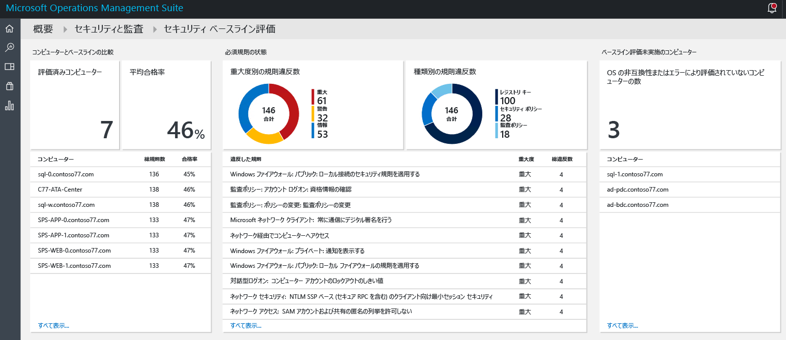
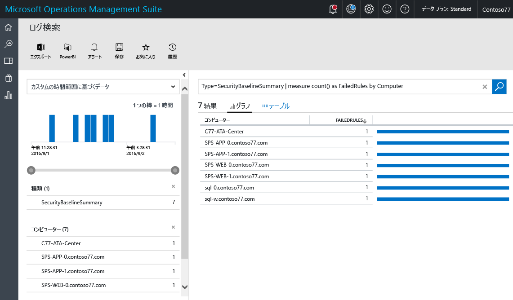
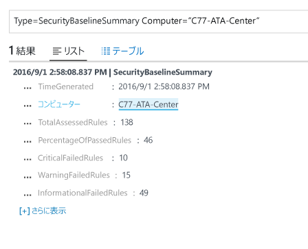
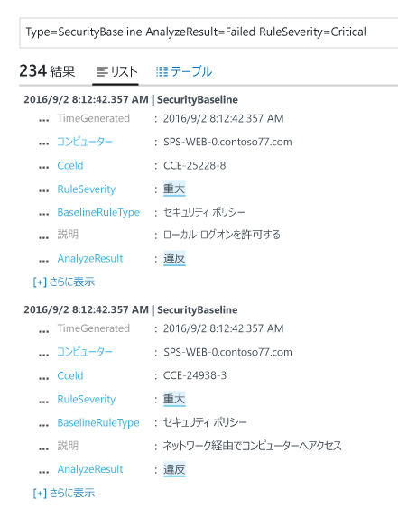

# Operations Management Suite のセキュリティと監査ソリューションでのベースライン評価
このドキュメントは、[Operations Management Suite (OMS) のセキュリティと監査ソリューション](operations-management-suite-overview.md)のベースライン評価機能を使用して、監視対象のリソースのセキュリティで保護された状態にアクセスする際に役立ちます。

## ベースライン評価とは
Microsoft は、世界中の業界団体や政府機関と協力して、安全性の高いサーバー全世界と共に安全性の高いサーバーのデプロイを表す Windows 構成を定義しています。 この構成は、レジストリ キー、監査ポリシーの設定、セキュリティ ポリシーの設定のセットで、これらの設定には Microsoft が推奨する値があります。 この規則のセットがセキュリティ ベースラインと呼ばれます。 OMS のセキュリティと監査のベースライン評価機能では、コンプライアンスについてすべてのコンピューターをシームレスにスキャンできます。 

規則には次の 3 種類があります。

* **レジストリの規則**: レジストリ キーが正しく設定されていることを確認します。
* **監査ポリシー規則**: 監査ポリシーに関する規則です。
* **セキュリティ ポリシー規則**: コンピューターに対するユーザーのアクセス許可に関する規則。

> [!NOTE]
> この機能の簡単な概要については、「[Use OMS Security to assess the Security Configuration Baseline ( OMS のセキュリティを使用したセキュリティ構成ベースラインの評価)](https://blogs.technet.microsoft.com/msoms/2016/08/12/use-oms-security-to-assess-the-security-configuration-baseline/)」を参照してください。
> 
> 

## セキュリティ ベースラインの評価
OMS のセキュリティと監査で監視されているすべてのコンピューターの現在のセキュリティ ベースラインの評価は、ダッシュボードを使用して確認できます。  セキュリティ ベースラインの評価ダッシュボードにアクセスするには、次の手順を実行してください。

1. **Microsoft Operations Management Suite** のメイン ダッシュボードで、**[セキュリティおよび監査]** タイルをクリックします。
2. **[セキュリティおよび監査]** ダッシュボードで、**[セキュリティ ドメイン]** の下にある **[ベースライン評価]** をクリックします。 次の図に示すように、**[セキュリティ ベースラインの評価]** ダッシュボードが表示されます。
   
    

このダッシュボードは、次の 3 つの主な領域に分かれています。

* **ベースラインと比較したコンピューター**: このセクションには、評価されたコンピューターの数と評価に合格したコンピューターの割合の概要が示されます。 また、上位 10 台のコンピューターと評価の割合の結果も表示されます。
* **必要な規則の状態**: このセクションでは、重要度別の失敗した規則と種類別の失敗した規則が認識されることを目的としています。 最初のグラフを見ると、失敗した規則のほとんどが重大であるかどうかをすばらく識別できます。 また、失敗した規則の上位 10 個とその重要度の一覧も示されます。 2 つ目のグラフでは、評価中に失敗した規則の種類が示されています。 
* **ベースライン アセスメントがないコンピューター**: このセクションには、オペレーティング システムの非互換性またはエラーが原因で評価されなかったコンピューターの一覧が表示されます。 

### ベースラインと比較したコンピューターの評価
すべてのコンピューターがセキュリティ ベースラインの評価に準拠していることが理想的です。 ただし、状況によってそのようにならないことが予想されます。 セキュリティ管理のプロセスの一環として、すべてのセキュリティ評価テストに合格できなかったコンピューターの確認を含めることは重要です。 それを視覚化する簡単な方法として、**[ベースラインと比較したコンピューター]** セクションにある **[評価されたコンピューター]** オプションを選択します。 次の画面に示すように、ログ検索の結果にコンピューターの一覧が示されていることがわかります。

検索結果は表形式で表示されます。ここには、最初の列にコンピューター名、2 番目の列に失敗した規則の数が示されています。 失敗した規則の種類に関する情報を取得するには、コンピューター名に加えて、失敗した規則の数をクリックします。 次の図に示すような結果が表示されます。

この検索結果には、評価された規則の合計のほか、失敗した重大な規則、警告の規則、失敗した規則 (情報) の数が示されます。

### 必要な規則の状態の評価
評価に合格したコンピューターの割合の値に関する情報を取得したら、重要度に応じて、どの規則が失敗しているかついて詳細を入手することをお勧めします。 この視覚化は、最初に解決する必要があるコンピューターに優先順位を付けて、次の評価時にそれらのコンピューターが規則に準拠にした状態になるようにするのに役立ちます。 **[必要な規則の状態]** の下の **[失敗した規則 (重要度別)]** タイルにあるグラフの "重大" 部分にカーソルを合わせてクリックします。 次に示すような結果が表示されます。

 

このログの結果では、失敗したベースライン規則の種類、この規則の説明、このセキュリティ規則の Common Configuration Enumeration (CCE) ID が表示されます。 対象のコンピューターで修正措置を実行してこの問題を解決するには、これらの属性があれば十分です。

> [!NOTE]
> CCE の詳細については、[National Vulnerability Database](https://nvd.nist.gov/cce/index.cfm) にアクセスしてください。
> 
> 

### ベースライン アセスメントがないコンピューターの評価
OMS は、Windows Server 2008 R2 から Windows Server 2012 R2 までのドメイン メンバーとドメイン コントローラーのベースライン プロファイルをサポートします。 Windows Server 2016 のベースラインはまだ確定していませんが、発行されるとすぐに追加される予定です。 OMS のセキュリティと監視のベースラインの評価でスキャンされたその他すべてのオペレーティング システムは、**[ベースライン アセスメントがないコンピューター]** セクションに表示されます。

## 関連項目
このドキュメントでは、OMS のセキュリティと監査のベースラインの評価について説明しました。 OMS セキュリティの詳細については、次の記事を参照してください。

* [Operations Management Suite (OMS) overview (Operations Management Suite (OMS) の概要)](operations-management-suite-overview.md)
* [Operations Management Suite のセキュリティと監査ソリューションでのセキュリティの警告に対する監視と対応](oms-security-responding-alerts.md)
* [Operations Management Suite のセキュリティと監査ソリューションでのリソースの監視](oms-security-monitoring-resources.md)

