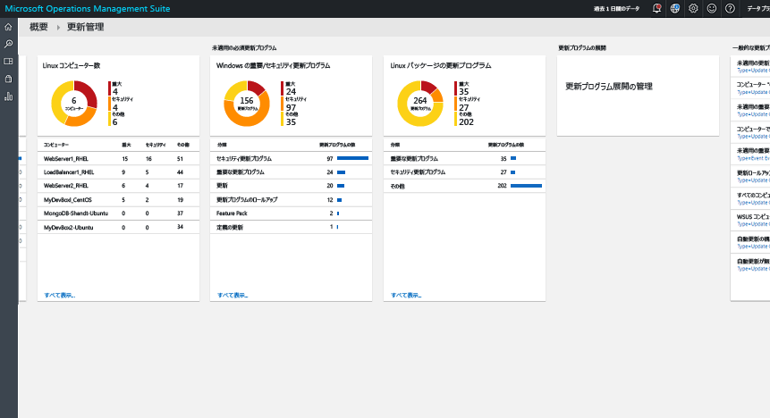
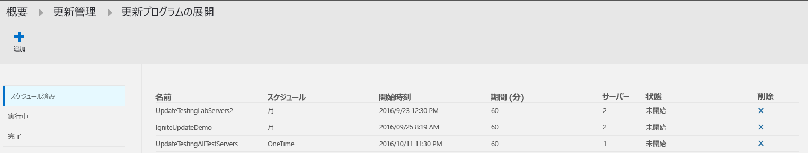
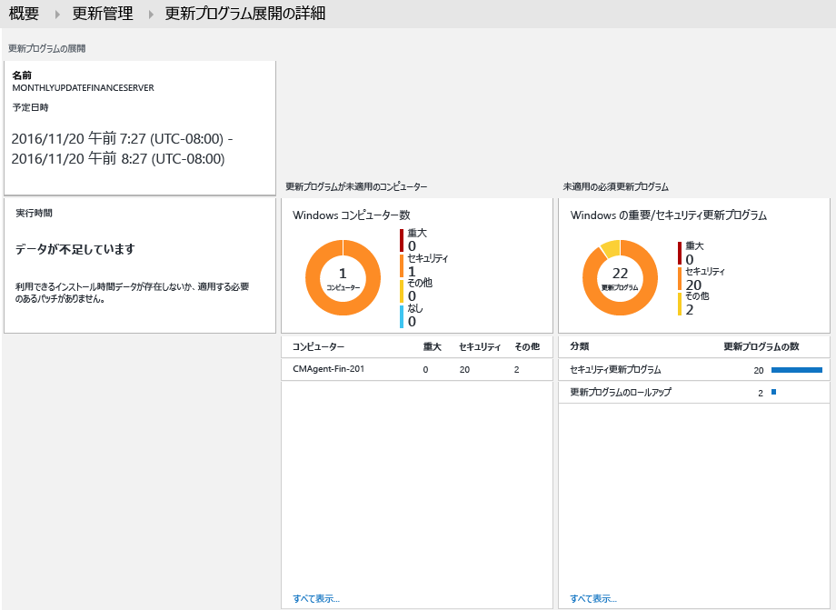
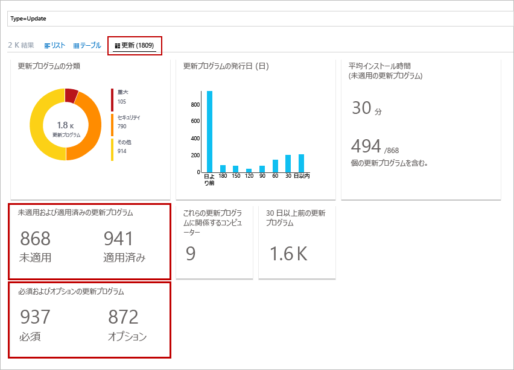
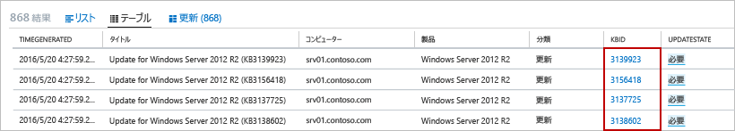
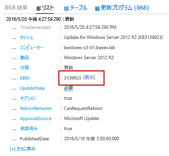

# OMS の更新管理ソリューション
OMS の更新管理ソリューションを使用すると、Windows コンピューターと Linux コンピューターの更新プログラムを管理することができます。  すべてのエージェント コンピューターで利用可能な更新プログラムの状態をすばやく評価し、サーバーに必要な更新プログラムをインストールするプロセスを開始することができます。 

## 前提条件
* このソリューションでサポートされるのは、Windows Server 2008 以降に対する更新プログラムの評価の実行と、Windows Server 2012 以降に対する更新プログラムのデプロイのみです。  Server Core と Nano Server のインストール オプションはサポートされていません。
* Windows クライアント オペレーティング システムはサポートされていません。  
* Windows エージェントは、Windows Server Update Services (WSUS) サーバーと通信するか Microsoft Update にアクセスできるように構成する必要があります。  
  
  > [!NOTE]
  > Windows エージェントは、System Center Configuration Manager で同時に管理することはできません。  
  > 
  > 
* Linux エージェントは、更新リポジトリへのアクセスが必要です。  OMS Agent for Linux は [GitHub](https://github.com/microsoft/oms-agent-for-linux) からダウンロードできます。 

## 構成
OMS ワークスペースに更新管理ソリューションを追加し、Linux エージェントを追加するには、次の手順を実行します。 Windows エージェントは、そのままの構成で自動的に追加されます。

> [!NOTE]
> このソリューションを有効にすると、OMS ワークスペースに接続された Windows コンピューターは自動的に Hybrid Runbook Worker として構成されます。これは、このソリューションに含まれる Runbook をサポートするための措置です。  ただし、このコンピューターは、Automation アカウントで既に定義した可能性のあるハイブリッド worker グループには登録されません。  このソリューションと Hybrid Runbook Worker グループのメンバーシップの両方に同じアカウントを使用していれば、Automation Runbook をサポートするために、このコンピューターを Automation アカウントの Hybrid Runbook Worker に追加することができます。  この機能は、Hybrid Runbook Worker のバージョン 7.2.12024.0 に追加されました。   

1. ソリューション ギャラリーからの [OMS ソリューションの追加](../log-analytics/log-analytics-add-solutions.md)に関するページで説明されているプロセスを使用して、更新管理ソリューションを OMS ワークスペースに追加します。  
2. OMS ポータルで、**[設定]** を選択し、**[接続されたソース]** を選択します。  **ワークスペース ID** と、**主キー**または **2 次キー**をメモしておきます。
3. 各 Linux コンピューターで、次の手順を実行します。
   
   a.    次のコマンドを実行して、OMS Agent for Linux の最新バージョンをインストールします。  <Workspace ID> を実際のワークスペース ID、<Key> を実際の主キーまたは 2 次キーに置き換えてください。
   
        cd ~
        wget https://raw.githubusercontent.com/Microsoft/OMS-Agent-for-Linux/master/installer/scripts/onboard_agent.sh && sh onboard_agent.sh -w <WorkspaceID>  -s <PrimaryKey> -d opinsights.azure.com 

   b. エージェントを削除するには、「[Uninstalling the OMS Agent for Linux (OMS Agent for Linux のアンインストール)](https://github.com/Microsoft/OMS-Agent-for-Linux/blob/master/docs/OMS-Agent-for-Linux.md#uninstalling-the-oms-agent-for-linux)」セクションで説明しているプロセスを使用します。  

## 管理パック
System Center Operations Manager 管理グループが OMS ワークスペースに接続されている場合、このソリューションを追加したときに次の管理パックが Operations Manager にインストールされます。 これらの管理パックに伴う構成や保守は不要です。 

* Microsoft System Center Advisor 更新プログラム評価インテリジェンス パック (Microsoft.IntelligencePacks.UpdateAssessment)
* Microsoft.IntelligencePack.UpdateAssessment.Configuration (Microsoft.IntelligencePack.UpdateAssessment.Configuration)
* 更新プログラムの展開 MP

ソリューション管理パックの更新方法の詳細については、「[Operations Manager を Log Analytics に接続する](../log-analytics/log-analytics-om-agents.md)」を参照してください。

## データ収集
### サポートされているエージェント
次の表は、このソリューションの接続先としてサポートされているソースとその説明です。

| 接続されているソース | サポートの有無 | 説明 |
| --- | --- | --- |
| Windows エージェント |はい |ソリューションは、Windows エージェントからシステムの更新プログラムに関する情報を収集し、必要な更新プログラムのインストールを開始します。 |
| Linux エージェント |はい |ソリューションは、Linux エージェントからシステムの更新プログラムに関する情報を収集します。 |
| Operations Manager 管理グループ |はい |ソリューションは、接続された管理グループ内のエージェントからシステムの更新プログラムに関する情報を収集します。 Operations Manager エージェントから Log Analytics への直接接続は必要ありません。 データは管理グループから OMS リポジトリに転送されます。 |
| Azure ストレージ アカウント |なし |Azure Storage には、システムの更新プログラムに関する情報が含まれていません。 |

### 収集の頻度
管理対象の各 Windows コンピューターでは、1 日 2 回スキャンが実行されます。  更新プログラムがインストールされると、その情報が 15 分以内に更新されます。  

管理対象の各 Linux コンピューターでは、3 時間ごとにスキャンが実行されます。  

## ソリューションの使用
OMS ワークスペースに更新管理ソリューションを追加すると、OMS のダッシュボードに **[Update Management (更新管理)]** タイルが追加されます。 このタイルには、ご利用の環境で現在システムの更新プログラムを必要としているコンピューターの数が数字とグラフで表示されます。  
  

## 更新プログラムの評価の表示
**[Update Management (更新管理)]** タイルをクリックすると、**[Update Management (更新管理)]** ダッシュボードが表示されます。 ダッシュボードには、次の表に示した列が存在します。 それぞれの列には、特定のスコープと時間範囲について、その列の基準に該当する項目が最大 10 個表示されます。 すべてのレコードを返すログ検索を実行するには、列の一番下にある **[すべて表示]** をクリックするか、列ヘッダーをクリックします。

| 分割 | Description |
| --- | --- |
| **更新プログラムを適用していないコンピューター** | |
| Critical or Security Updates (緊急更新プログラムまたはセキュリティ更新プログラム) |更新プログラムを適用していないコンピューターのうち、適用されていない更新プログラムの数で並べ替えた上位 10 個のコンピューターが表示されます。 コンピューター名をクリックするとログ検索が実行され、そのコンピューターに関する更新レコードがすべて返されます。 |
| Critical or Security Updates older than 30 days (30 日を経過した緊急更新プログラムまたはセキュリティ更新プログラム) |緊急更新プログラムまたはセキュリティ更新プログラムを適用していないコンピューターの数が、更新プログラムの公開からの時間の長さでグループ化されて表示されます。 エントリの 1 つをクリックするとログ検索が実行され、適用していない緊急更新プログラムがすべて返されます。 |
| **インストールされていない必須の更新プログラム** | |
| Critical or Security Updates (緊急更新プログラムまたはセキュリティ更新プログラム) |コンピューターに適用されてない更新プログラムの分類が、そのカテゴリの更新プログラムが適用されていないコンピューターの数で並べ替えて表示されます。 分類をクリックするとログ検索が実行され、その分類に関する更新レコードがすべて返されます。 |
| **Update Deployments (更新プログラムの展開)** | |
| Update Deployments (更新プログラムの展開) |現在スケジュールされている更新プログラムの展開数と、次にスケジュールされている実行までの期間。  タイルをクリックすると、スケジュール、現在実行中の更新プログラム、完了した更新プログラムを表示したり、新しい展開をスケジュールしたりできます。 |

   
   
 
![[更新管理] ダッシュボードのコンピューター ビュー](./media/oms-solution-update-management/update-management-assessment-computer-view.png)   
 
![[更新管理] ダッシュボードのパッケージ ビュー](./media/oms-solution-update-management/update-management-assessment-package-view.png)   

## 更新プログラムのインストール
ご利用の環境のすべての Windows コンピューターで更新プログラムが評価されたら、"*更新プログラムのデプロイ*" を作成することで、必要な更新プログラムがインストールされるようにすることができます。  "更新プログラムの展開" とは、1 台以上の Windows コンピューターに必要な更新プログラムをスケジュールに従ってインストールすることです。  対象に含めるコンピューターまたはコンピューター グループに加え、展開の日時を指定します。  

更新プログラムは、Azure Automation の Runbook によってインストールされます。  これらの Runbook は表示できません。また、これらは構成不要です。  "更新プログラムの展開" を作成すると、対象に含めたコンピューターに対して、指定した時間にマスター更新 Runbook を開始するスケジュールが作成されます。  このマスター Runbook は、必要な更新プログラムのインストールを実行する子 Runbook を各 Windows エージェントで開始します。  

Azure Marketplace から利用できるオンデマンドの Red Hat Enterprise Linux (RHEL) イメージから作成した仮想マシンは、Azure にデプロイされた [Red Hat Update Infrastructure (RHUI)](../virtual-machines/linux/update-infrastructure-redhat.md) にアクセスするよう登録されています。  その他の Linux ディストリビューションは、サポートされている方式に従ったディストリビューション オンライン ファイル リポジトリから更新する必要があります。  

### 更新プログラムの展開の表示
**[Update Deployment (更新プログラムの展開)]** タイルをクリックすると、既存の更新プログラムの展開の一覧が表示されます。  これらは状態別 (**スケジュール**、**実行中**、**Completed (完了)**) にグループ化されています。      

各更新プログラムの展開に表示されるプロパティについては、次の表で説明します。

| プロパティ | Description |
| --- | --- |
| 名前 |更新プログラムの展開の名前。 |
| スケジュール |スケジュールの種類。  現在、指定可能な値は *OneTime* のみです。 |
| 開始時刻 |更新プログラムの展開の開始予定日時。 |
| 時間 |更新プログラムの展開の実行が許可されている時間 (分)。  この時間内にすべての更新プログラムがインストールされない場合、残りの更新プログラムは次の更新プログラムの展開まで待つ必要があります。 |
| サーバー |更新プログラムの展開の影響を受けるコンピューターの数。 |
| 状態 |更新プログラムの展開の現在の状態。  次のいずれかの値になります。 - 開始されていません - 実行中 - 完了しました |

更新プログラムの展開をクリックすると、その詳細画面が表示されます。この画面には、次の表にある列が含まれます。  更新プログラムの展開がまだ開始されていない場合は、これらの列に値が設定されません。 

| 分割 | Description |
| --- | --- |
| **コンピューターの結果** | |
| 正常に完了しました |更新プログラムの展開に含まれるコンピューターの数を状態別に表示します。  状態をクリックするとログ検索が実行され、更新プログラムの展開でその状態の更新レコードがすべて返されます。 |
| コンピューターのインストール状態 |更新プログラムの展開に含まれるコンピューターと、インストールに成功した更新プログラムの割合を示します。 エントリの 1 つをクリックするとログ検索が実行され、適用していない緊急更新プログラムがすべて返されます。 |
| **インスタンスの更新結果** | |
| インスタンスのインストール状態 |コンピューターに適用されてない更新プログラムの分類が、そのカテゴリの更新プログラムが適用されていないコンピューターの数で並べ替えて表示されます。 コンピューターをクリックするとログ検索が実行され、そのコンピューターに関する更新レコードがすべて返されます。 |

   

### 更新プログラムの展開の作成
新しい更新プログラムの展開を作成するには、画面上部にある **[追加]** ボタンをクリックして **[New Update Deployment (新しい更新プログラムの展開)]** ページを開きます。  次の表にあるプロパティの値を指定する必要があります。

| プロパティ | Description |
| --- | --- |
| 名前 |更新プログラムの展開を識別する一意の名前。 |
| タイム ゾーン |開始時刻に使用するタイム ゾーン。 |
| 開始時刻 |更新プログラムの展開を開始する日時。 |
| 時間 |更新プログラムの展開の実行が許可されている時間 (分)。  この時間内にすべての更新プログラムがインストールされない場合、残りの更新プログラムは次の更新プログラムの展開まで待つ必要があります。 |
| [Computers (コンピューター)] |更新プログラムの展開に含めるコンピューターまたはコンピューター グループの名前。  ドロップダウン リストから 1 つ以上のエントリを選択します。 |

   ![[New Update Deployment (新しい更新プログラムの展開)] ページ](./media/oms-solution-update-management/update-newupdaterun-page.png)

### 時間範囲
既定では、更新管理ソリューションの分析は、過去 1 日間に生成された接続されているすべての管理グループから収集されたデータが対象となります。 

データの時間範囲を変更するには、ダッシュボードの上部にある **[Data based on (データの時間範囲)]** を選択します。 過去 7 日間、過去 1 日間、または過去 6 時間以内に作成または更新されたレコードを選択できます。 **[Custom]** (カスタム) を選択して、独自の日付範囲を指定することもできます。     

## Log Analytics のレコード
更新管理ソリューションにより 2 種類のレコードが OMS リポジトリに作成されます。

### Update レコード
**Update** という種類のレコードは、各コンピューターでインストールされるか必要とされる更新プログラムごとに作成されます。 Update レコードには、次の表に示したプロパティがあります。

| プロパティ | 説明 |
| --- | --- |
| 型 |*Update* |
| SourceSystem |更新プログラムのインストールを承認したソース。 次のいずれかの値になります。 - Microsoft Update - Windows Update - SCCM - Linux Servers (パッケージ マネージャーから取得) |
| Approved |更新プログラムのインストールが承認されているかどうかを指定します。  Linux サーバーの場合、修正プログラムの適用は OMS で管理されないため、現在、これは省略可能です。 |
| Classification (Windows の場合) |更新プログラムの分類。 次のいずれかの値になります。 - アプリケーション - Critical Updates (緊急更新プログラム) - Definition Updates (定義の更新) - Feature Packs (Feature Pack) - Security Updates (セキュリティ更新プログラム) - Service Packs (Service Pack) - Update Rollups (更新プログラムのロールアップ) - 更新プログラム |
| Classification (Linux の場合) |更新プログラムの分類。 次のいずれかの値になります。 - Critical Updates (緊急更新プログラム) - Security Updates (セキュリティ更新プログラム) - Other Updates (他の更新プログラム) |
| コンピューター |コンピューターの名前。 |
| InstallTimeAvailable |同じ更新プログラムをインストールした他のエージェントからインストール時刻を入手できるかどうかを指定します。 |
| InstallTimePredictionSeconds |同じ更新プログラムをインストールしたその他のエージェントに基づいた、インストールの推定時間 (秒)。 |
| KBID |更新プログラムについて説明するサポート技術情報の ID。 |
| ManagementGroupName |SCOM エージェントの管理グループの名前。  その他のエージェントの場合、これは AOI-<workspace ID> です。 |
| MSRCBulletinID |更新プログラムについて説明するマイクロソフト セキュリティ情報の ID。 |
| MSRCSeverity |マイクロソフト セキュリティ情報の重大度。 次のいずれかの値になります。 - Critical (重大) - Important (重要) - Moderate (警告) |
| 省略可能。 |更新プログラムが省略可能かどうかを指定します。 |
| 製品 |更新プログラムの対象製品の名前。  **[表示]** をクリックすると、ブラウザーで記事が開きます。 |
| PackageSeverity |Linux ディストリビューションのベンダーによって報告された、この更新プログラムで修正される脆弱性の重大度。 |
| PublishDate |更新プログラムがインストールされた日時。 |
| RebootBehavior |更新プログラムによって再起動を強制するかどうかを指定します。 次のいずれかの値になります。 - canrequestreboot - neverreboots |
| RevisionNumber |更新プログラムのリビジョン番号。 |
| SourceComputerId |コンピューターを一意に識別する GUID。 |
| TimeGenerated |レコードの最終更新日時。 |
| タイトル |更新プログラムのタイトル。 |
| UpdateID |更新プログラムを一意に識別する GUID。 |
| UpdateState |このコンピューターに更新プログラムがインストールされているかどうかを示します。 次のいずれかの値になります。 - Installed - 更新プログラムはこのコンピューターにインストールされています。 - Needed - 更新プログラムはインストールされていないため、このコンピューターに必要です。 |

 
**Update** という種類のレコードを返すログ検索を実行する際に、**Updates** を選択すると、検索から返された最新情報が一連のタイルに集約されて表示されます。 **[インストールされていない更新プログラムと適用済みの更新プログラム]** タイルと **[必須およびオプションの更新プログラム]** タイルでエントリをクリックすると、ビューをその更新プログラムのセットに限定することができます。 **[リスト]** ビューまたは **[テーブル]** ビューを選択すると、個別のレコードが返されます。  

  

**[テーブル]** ビューでは、任意のレコードの **KBID** をクリックすると、ブラウザーが起動してそのサポート技術情報の記事が表示されます。 これにより、特定の更新プログラムの詳細をすぐに確認できます。  

**[リスト]** ビューでは、KBID の横にある **[表示]** リンクをクリックすると、サポート技術情報の記事が開きます。 

### UpdateSummary レコード
**UpdateSummary** という種類のレコードは、Windows エージェント コンピューターごとに作成されます。 このレコードは、更新プログラムについてコンピューターがスキャンされるたびに更新されます。 **UpdateSummary** レコードには、次の表に示したプロパティがあります。

| プロパティ | 説明 |
| --- | --- |
| 型 |UpdateSummary |
| SourceSystem |OpsManager |
| コンピューター |コンピューターの名前。 |
| CriticalUpdatesMissing |コンピューターに適用されていない緊急更新プログラムの数。 |
| ManagementGroupName |SCOM エージェントの管理グループの名前。 その他のエージェントの場合、これは AOI-<workspace ID> です。 |
| NETRuntimeVersion |コンピューターにインストールされている .NET ランタイムのバージョン。 |
| OldestMissingSecurityUpdateBucket |このコンピューターで適用されていない最も古いセキュリティ更新プログラムが公開されてからの時間を分類するバケット。 次のいずれかの値になります。 - それより以前 - 180 日前 - 150 日前 - 120 日前 - 90 日前 - 60 日前 - 30 日前 - 最近 |
| OldestMissingSecurityUpdateInDays |このコンピューターで適用されていない最も古いセキュリティ更新プログラムが公開されてからの日数。 |
| OsVersion |コンピューターにインストールされているオペレーティング システムのバージョン。 |
| OtherUpdatesMissing |コンピューターに適用されていないその他の更新プログラムの数。 |
| SecurityUpdatesMissing |このコンピューターに適用されていないセキュリティ更新プログラムの数。 |
| SourceComputerId |コンピューターを一意に識別する GUID。 |
| TimeGenerated |レコードの最終更新日時。 |
| TotalUpdatesMissing |コンピューターに適用されていない更新プログラムの合計数。 |
| WindowsUpdateAgentVersion |コンピューター上の Windows Update エージェントのバージョン番号。 |
| WindowsUpdateSetting |コンピューターで重要な更新プログラムをインストールする方法に関する設定。 次のいずれかの値になります。 - 無効 - Notify before installation (インストール前に通知) - Scheduled installation (スケジュールに従ってインストール) |
| WSUSServer |WSUS サーバーの URL (コンピューターがそれを使用するように構成されている場合)。 |

## サンプル ログ検索
次の表は、このソリューションによって収集された更新レコードを探すログ検索の例です。 

| クエリ | Description |
| --- | --- |
| 更新プログラムがインストールされていないすべてのコンピューター |Type=Update UpdateState=Needed Optional=false &#124; select Computer,Title,KBID,Classification,UpdateSeverity,PublishedDate |
| コンピューター "COMPUTER01.contoso.com" (実際のコンピューター名に置き換えてください) にインストールされていない更新プログラム |Type=Update UpdateState=Needed Optional=false Computer="COMPUTER01.contoso.com" &#124; select Computer,Title,KBID,Product,UpdateSeverity,PublishedDate |
| All computers with missing critical or security updates (緊急更新プログラムまたはセキュリティ更新プログラムがインストールされていないすべてのコンピューター) |Type=Update UpdateState=Needed Optional=false (Classification="Security Updates" OR Classification="Critical Updates") |
| Critical or security updates needed by machines where updates are manually applied (更新プログラムが手動で適用されるコンピューターに必要な、緊急更新プログラムまたはセキュリティ更新プログラム) |Type=Update UpdateState=Needed Optional=false (Classification="Security Updates" OR Classification="Critical Updates") Computer IN {Type=UpdateSummary WindowsUpdateSetting=Manual &#124; Distinct Computer} &#124; Distinct KBID |
| Error events for machines that have missing critical or security required updates (必要とされている緊急更新プログラムまたはセキュリティ更新プログラムがインストールされていないコンピューターのエラー イベント) |Type=Event EventLevelName=error Computer IN {Type=Update (Classification="Security Updates" OR Classification="Critical Updates") UpdateState=Needed Optional=false &#124; Distinct Computer} |
| 更新プログラムのロールアップがインストールされていないすべてのコンピューター |Type=Update Optional=false Classification="Update Rollups" UpdateState=Needed &#124; select Computer,Title,KBID,Classification,UpdateSeverity,PublishedDate |
| 全コンピューターのインストールされていない個別の更新プログラム |Type=Update UpdateState=Needed Optional=false &#124; Distinct Title |
| WSUS コンピューター メンバーシップ |Type=UpdateSummary &#124; measure count() by WSUSServer |
| 自動更新の構成 |Type=UpdateSummary &#124; measure count() by WindowsUpdateSetting |
| 自動更新が無効にされたコンピューター |Type=UpdateSummary WindowsUpdateSetting=Manual |
| List of all the Linux machines which have a package update available (パッケージ更新プログラムが使用可能なすべての Linux マシンの一覧) |Type=Update and OSType=Linux and UpdateState!="Not needed" &#124; measure count() by Computer |
| List of all the Linux machines which have a package update available which addresses Critical or Security vulnerability (重大な脆弱性またはセキュリティの脆弱性に対処するパッケージ更新プログラムが使用可能なすべての Linux マシンの一覧) |Type=Update and OSType=Linux and UpdateState!="Not needed" and (Classification="Critical Updates" OR Classification="Security Updates") &#124; measure count() by Computer |
| List of all packages that have an update available (更新プログラムが使用可能なすべてのパッケージの一覧) |Update and OSType=Linux and UpdateState!="Not needed" |
| List of all packages that have an update available which addresses Critical or Security vulnerability (重大な脆弱性またはセキュリティの脆弱性に対処する更新プログラムが使用可能なすべてのパッケージの一覧) |Type=Update  and OSType=Linux and UpdateState!="Not needed" and (Classification="Critical Updates" OR Classification="Security Updates") |
| List of all the “Ubuntu” machines with any update available (任意の更新プログラムが使用可能なすべての "Ubuntu" マシンの一覧) |Type=Update and OSType=Linux and OSName = Ubuntu &#124; measure count() by Computer |

## 次のステップ
* [Log Analytics](../log-analytics/log-analytics-log-searches.md) でログ検索を使用して、詳細な更新プログラムデータを確認します。
* 管理対象のコンピューターで更新プログラムが準拠しているかどうかを示す[独自のダッシュボードを作成](../log-analytics/log-analytics-dashboards.md)します。
* 緊急更新プログラムがコンピューターにインストールされていないと検出された場合またはコンピューターで自動更新が無効になっている場合、[アラートを作成](../log-analytics/log-analytics-alerts.md)します。  

