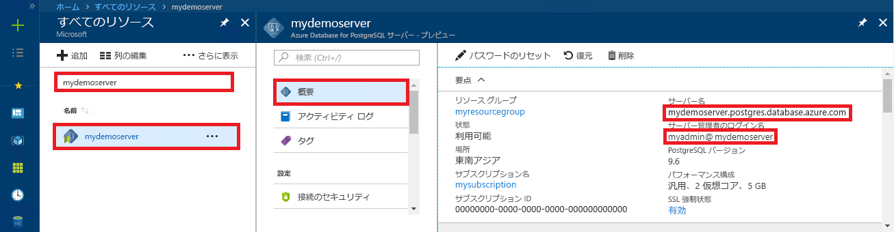

# <a name="azure-database-for-postgresql-use-net-c-to-connect-and-query-data"></a>Azure Database for PostgreSQL: .NET (C#) を使用した接続とデータの照会
このクイックスタートでは、C# アプリケーションを使用して Azure Database for PostgreSQL に接続する方法を紹介します。 ここでは、SQL ステートメントを使用してデータベース内のデータを照会、挿入、更新、削除する方法を説明します。 この記事の手順では、C# を使用した開発には慣れているものの、Azure Database for PostgreSQL の使用は初めてであるユーザーを想定しています。

## <a name="prerequisites"></a>前提条件
このクイックスタートでは、次のいずれかのガイドで作成されたリソースを出発点として使用します。
- [DB の作成 - ポータル](quickstart-create-server-database-portal.md)
- [DB の作成 - CLI](quickstart-create-server-database-azure-cli.md)

さらに、以下を実行する必要があります。
- [.NET Framework](https://www.microsoft.com/net/download) のインストール。 リンク先の記事の手順に従って、プラットフォーム (Windows、Ubuntu Linux、または macOS) に応じた .NET をインストールしてください。 
- コードの入力と編集に使用する [Visual Studio](https://www.visualstudio.com/downloads/) または Visual Studio Code のインストール。
- [Npgsql](https://www.nuget.org/packages/Npgsql/) Nuget パッケージへの参照の追加。

## <a name="get-connection-information"></a>接続情報の取得
Azure Database for PostgreSQL に接続するために必要な接続情報を取得します。 完全修飾サーバー名とログイン資格情報が必要です。

1. [Azure Portal](https://portal.azure.com/) にログインします。
2. Azure Portal の左側のメニューにある **[すべてのリソース]** をクリックし、作成したサーバー (例: **mydemoserver**) を検索します。
3. サーバー名をクリックします。
4. サーバーの **[概要]** パネルから、**[サーバー名]** と **[サーバー管理者ログイン名]** を書き留めます。 パスワードを忘れた場合も、このパネルからパスワードをリセットすることができます。
 

## <a name="connect-create-table-and-insert-data"></a>接続、テーブルの作成、データの挿入
接続し、**CREATE TABLE** および **INSERT INTO** SQL ステートメントを使用してデータを読み込むには、次のコードを使用します。 このコードでは、[Open()](http://www.npgsql.org/doc/api/Npgsql.NpgsqlConnection.html#Npgsql_NpgsqlConnection_Open) メソッドで NpgsqlCommand クラスを使用して、PostgreSQL データベースへの接続を確立します。 その後、[CreateCommand()](http://www.npgsql.org/doc/api/Npgsql.NpgsqlConnection.html#Npgsql_NpgsqlConnection_CreateCommand) メソッドを使用して、CommandText プロパティを設定し、[ExecuteNonQuery()](http://www.npgsql.org/doc/api/Npgsql.NpgsqlCommand.html#Npgsql_NpgsqlCommand_ExecuteNonQuery) メソッドを呼び出して、データベース コマンドを実行します。 

Host、DBName、User、Password の各パラメーターは、サーバーとデータベースの作成時に指定した値に置き換えてください。 

```csharp
using System;
using System.Collections.Generic;
using System.Linq;
using System.Text;
using System.Threading.Tasks;
using Npgsql;

namespace Driver
{
    public class AzurePostgresCreate
    {
        // Obtain connection string information from the portal
        //
        private static string Host = "mydemoserver.postgres.database.azure.com";
        private static string User = "mylogin@mydemoserver";
        private static string DBname = "mypgsqldb";
        private static string Password = "<server_admin_password>";
        private static string Port = "5432";

        static void Main(string[] args)
        {
            // Build connection string using parameters from portal
            //
            string connString =
                String.Format(
                    "Server={0}; User Id={1}; Database={2}; Port={3}; Password={4}; SSL Mode=Prefer; Trust Server Certificate=true",
                    Host,
                    User,
                    DBname,
                    Port,
                    Password);

            var conn = new NpgsqlConnection(connString);

            Console.Out.WriteLine("Opening connection");
            conn.Open();

            var command = conn.CreateCommand();
            command.CommandText = "DROP TABLE IF EXISTS inventory;";
            command.ExecuteNonQuery();
            Console.Out.WriteLine("Finished dropping table (if existed)");

            command.CommandText = "CREATE TABLE inventory (id serial PRIMARY KEY, name VARCHAR(50), quantity INTEGER);";
            command.ExecuteNonQuery();
            Console.Out.WriteLine("Finished creating table");

            command.CommandText =
                String.Format(
                    @"
                                INSERT INTO inventory (name, quantity) VALUES ({0}, {1});
                                INSERT INTO inventory (name, quantity) VALUES ({2}, {3});
                                INSERT INTO inventory (name, quantity) VALUES ({4}, {5});
                            ",
                    "\'banana\'", 150,
                    "\'orange\'", 154,
                    "\'apple\'", 100
                    );

            int nRows = command.ExecuteNonQuery();
            Console.Out.WriteLine(String.Format("Number of rows inserted={0}", nRows));

            Console.Out.WriteLine("Closing connection");
            conn.Close();

            Console.WriteLine("Press RETURN to exit");
            Console.ReadLine();
        }
    }
}
```

## <a name="read-data"></a>データの読み取り
接続し、**SELECT** SQL ステートメントを使用してデータを読み取るには、次のコードを使用します。 このコードでは、[Open()](http://www.npgsql.org/doc/api/Npgsql.NpgsqlConnection.html#Npgsql_NpgsqlConnection_Open) メソッドで NpgsqlCommand クラスを使用して、PostgreSQL への接続を確立します。 その後、[CreateCommand()](http://www.npgsql.org/doc/api/Npgsql.NpgsqlConnection.html#Npgsql_NpgsqlConnection_CreateCommand) メソッドと [ExecuteReader()](http://www.npgsql.org/doc/api/Npgsql.NpgsqlCommand.html#Npgsql_NpgsqlCommand_ExecuteReader) メソッドを使用して、データベース コマンドを実行します。 次に、[Read()](http://www.npgsql.org/doc/api/Npgsql.NpgsqlDataReader.html#Npgsql_NpgsqlDataReader_Read) を使用して、結果のレコードに進みます。 最後に、[GetInt32()](http://www.npgsql.org/doc/api/Npgsql.NpgsqlDataReader.html#Npgsql_NpgsqlDataReader_GetInt32_System_Int32_) と [GetString()](http://www.npgsql.org/doc/api/Npgsql.NpgsqlDataReader.html#Npgsql_NpgsqlDataReader_GetString_System_Int32_) を使用して、レコード内の値を解析します。

Host、DBName、User、Password の各パラメーターは、サーバーとデータベースの作成時に指定した値に置き換えてください。 

```csharp
using System;
using System.Collections.Generic;
using System.Linq;
using System.Text;
using System.Threading.Tasks;
using Npgsql;

namespace Driver
{
    public class AzurePostgresRead
    {
        // Obtain connection string information from the portal
        //
        private static string Host = "mydemoserver.postgres.database.azure.com";
        private static string User = "mylogin@mydemoserver";
        private static string DBname = "mypgsqldb";
        private static string Password = "<server_admin_password>";
        private static string Port = "5432";

        static void Main(string[] args)
        {
            // Build connection string using parameters from portal
            //
            string connString =
                String.Format(
                    "Server={0}; User Id={1}; Database={2}; Port={3}; Password={4};",
                    Host,
                    User,
                    DBname,
                    Port,
                    Password);

            var conn = new NpgsqlConnection(connString);

            Console.Out.WriteLine("Opening connection");
            conn.Open();

            var command = conn.CreateCommand();
            command.CommandText = "SELECT * FROM inventory;";

            var reader = command.ExecuteReader();
            while (reader.Read())
            {
                Console.WriteLine(
                    string.Format(
                        "Reading from table=({0}, {1}, {2})",
                        reader.GetInt32(0).ToString(),
                        reader.GetString(1),
                        reader.GetInt32(2).ToString()
                        )
                    );
            }

            Console.Out.WriteLine("Closing connection");
            conn.Close();

            Console.WriteLine("Press RETURN to exit");
            Console.ReadLine();
        }
    }
}
```


## <a name="update-data"></a>データの更新
接続し、**UPDATE** SQL ステートメントを使用してデータを更新するには、次のコードを使用します。 このコードでは、[Open()](http://www.npgsql.org/doc/api/Npgsql.NpgsqlConnection.html#Npgsql_NpgsqlConnection_Open) メソッドで NpgsqlCommand クラスを使用して、PostgreSQL への接続を確立します。 その後、[CreateCommand()](http://www.npgsql.org/doc/api/Npgsql.NpgsqlConnection.html#Npgsql_NpgsqlConnection_CreateCommand) メソッドを使用して、CommandText プロパティを設定し、[ExecuteNonQuery()](http://www.npgsql.org/doc/api/Npgsql.NpgsqlCommand.html#Npgsql_NpgsqlCommand_ExecuteNonQuery) メソッドを呼び出して、データベース コマンドを実行します。

Host、DBName、User、Password の各パラメーターは、サーバーとデータベースの作成時に指定した値に置き換えてください。 

```csharp
using System;
using System.Collections.Generic;
using System.Linq;
using System.Text;
using System.Threading.Tasks;
using Npgsql;

namespace Driver
{
    public class AzurePostgresUpdate
    {
        // Obtain connection string information from the portal
        //
        private static string Host = "mydemoserver.postgres.database.azure.com";
        private static string User = "mylogin@mydemoserver";
        private static string DBname = "mypgsqldb";
        private static string Password = "<server_admin_password>";
        private static string Port = "5432";

        static void Main(string[] args)
        {
            // Build connection string using parameters from portal
            //
            string connString =
                String.Format(
                    "Server={0}; User Id={1}; Database={2}; Port={3}; Password={4};",
                    Host,
                    User,
                    DBname,
                    Port,
                    Password);

            var conn = new NpgsqlConnection(connString);

            Console.Out.WriteLine("Opening connection");
            conn.Open();

            var command = conn.CreateCommand();
            command.CommandText =
            String.Format("UPDATE inventory SET quantity = {0} WHERE name = {1};",
                200,
                "\'banana\'"
                );

            int nRows = command.ExecuteNonQuery();
            Console.Out.WriteLine(String.Format("Number of rows updated={0}", nRows));

            Console.Out.WriteLine("Closing connection");
            conn.Close();

            Console.WriteLine("Press RETURN to exit");
            Console.ReadLine();
        }
    }
}
```


## <a name="delete-data"></a>データの削除
接続し、**DELETE** SQL ステートメントを使用してデータを削除するには、次のコードを使用します。 

このコードでは、[Open()](http://www.npgsql.org/doc/api/Npgsql.NpgsqlConnection.html#Npgsql_NpgsqlConnection_Open) メソッドで NpgsqlCommand クラスを使用して、PostgreSQL データベースへの接続を確立します。 その後、[CreateCommand()](http://www.npgsql.org/doc/api/Npgsql.NpgsqlConnection.html#Npgsql_NpgsqlConnection_CreateCommand) メソッドを使用して、CommandText プロパティを設定し、[ExecuteNonQuery()](http://www.npgsql.org/doc/api/Npgsql.NpgsqlCommand.html#Npgsql_NpgsqlCommand_ExecuteNonQuery) メソッドを呼び出して、データベース コマンドを実行します。

Host、DBName、User、Password の各パラメーターは、サーバーとデータベースの作成時に指定した値に置き換えてください。 

```csharp
using System;
using System.Collections.Generic;
using System.Linq;
using System.Text;
using System.Threading.Tasks;
using Npgsql;

namespace Driver
{
    public class AzurePostgresDelete
    {
        // Obtain connection string information from the portal
        //
        private static string Host = "mydemoserver.postgres.database.azure.com";
        private static string User = "mylogin@mydemoserver";
        private static string DBname = "mypgsqldb";
        private static string Password = "<server_admin_password>";
        private static string Port = "5432";

        static void Main(string[] args)
        {
            // Build connection string using parameters from portal
            //
            string connString =
                String.Format(
                    "Server={0}; User Id={1}; Database={2}; Port={3}; Password={4};",
                    Host,
                    User,
                    DBname,
                    Port,
                    Password);

            var conn = new NpgsqlConnection(connString);

            Console.Out.WriteLine("Opening connection");
            conn.Open();

            var command = conn.CreateCommand();
            command.CommandText =
            String.Format("DELETE FROM inventory WHERE name = {0};",
                "\'orange\'");
            int nRows = command.ExecuteNonQuery();
            Console.Out.WriteLine(String.Format("Number of rows deleted={0}", nRows));

            Console.Out.WriteLine("Closing connection");
            conn.Close();

            Console.WriteLine("Press RETURN to exit");
            Console.ReadLine();
        }
    }
}
```

## <a name="next-steps"></a>次の手順
> [!div class="nextstepaction"]
> [エクスポートとインポートを使用したデータベースの移行](./howto-migrate-using-export-and-import.md)
