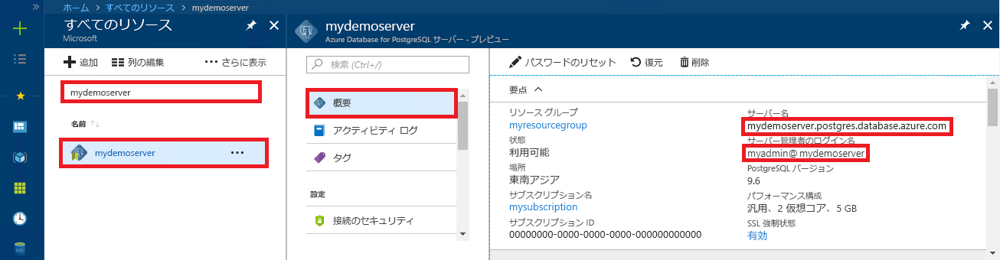

# <a name="azure-database-for-postgresql-use-go-language-to-connect-and-query-data"></a>Azure Database for PostgreSQL: Go 言語を使った接続とデータの照会
このクイックスタートでは、[Go](https://golang.org/) 言語 (golang) で記述されたコードを使用して、Azure Database for PostgreSQL に接続する方法を紹介します。 ここでは、SQL ステートメントを使用してデータベース内のデータを照会、挿入、更新、削除する方法を説明します。 この記事では、Go を使用した開発には慣れているものの、Azure Database for PostgreSQL の使用は初めてであるユーザーを想定しています。

## <a name="prerequisites"></a>前提条件
このクイックスタートでは、次のいずれかのガイドで作成されたリソースを出発点として使用します。
- [DB の作成 - ポータル](quickstart-create-server-database-portal.md)
- [DB の作成 - Azure CLI](quickstart-create-server-database-azure-cli.md)

## <a name="install-go-and-pq-connector"></a>Go と pq コネクタのインストール
[Go](https://golang.org/doc/install) と[純粋な Go postgres ドライバー (pq)](https://github.com/lib/pq) を自分のコンピューターにインストールします。 プラットフォームに応じて、該当する手順に従ってください。

### <a name="windows"></a> Windows
1. Go for Microsoft Windows を[ダウンロード](https://golang.org/dl/)し、[インストール手順](https://golang.org/doc/install)に従ってインストールします。
2. スタート メニューからコマンド プロンプトを起動します。
3. プロジェクト用のフォルダーを作成します (例: `mkdir  %USERPROFILE%\go\src\postgresqlgo`)。
4. ディレクトリをプロジェクト フォルダーに変更します (例: `cd %USERPROFILE%\go\src\postgresqlgo`)。
5. GOPATH の環境変数がソース コード ディレクトリをポイントするように設定します。 `set GOPATH=%USERPROFILE%\go`
6. `go get github.com/lib/pq` コマンドを実行して、[純粋な Go Postgres ドライバー (pq)](https://github.com/lib/pq) をインストールします。

   まとめると、Go をインストールしてから、コマンド プロンプトで以下のコマンドを実行します。
   ```cmd
   mkdir  %USERPROFILE%\go\src\postgresqlgo
   cd %USERPROFILE%\go\src\postgresqlgo
   set GOPATH=%USERPROFILE%\go
   go get github.com/lib/pq
   ```

### <a name="linux-ubuntu"></a>Linux (Ubuntu)
1. Bash シェルを起動します。 
2. `sudo apt-get install golang-go` を実行して Go をインストールします。
3. プロジェクトのフォルダーを自分のホーム ディレクトリに作成します (例: `mkdir -p ~/go/src/postgresqlgo/`)。
4. ディレクトリをこのフォルダーに変更します (例: `cd ~/go/src/postgresqlgo/`)。
5. GOPATH 環境変数に有効なソース ディレクトリを設定します (現在のホーム ディレクトリの go フォルダーなど)。 Bash シェルで `export GOPATH=~/go` を実行し、現在のシェル セッションの GOPATH として go ディレクトリを追加します。
6. `go get github.com/lib/pq` コマンドを実行して、[純粋な Go Postgres ドライバー (pq)](https://github.com/lib/pq) をインストールします。

   まとめると、以下の Bash コマンドを実行します。
   ```bash
   sudo apt-get install golang-go
   mkdir -p ~/go/src/postgresqlgo/
   cd ~/go/src/postgresqlgo/
   export GOPATH=~/go/
   go get github.com/lib/pq
   ```

### <a name="apple-macos"></a>Apple macOS
1. [インストール手順](https://golang.org/doc/install)に従って、ご利用のプラットフォームに適した Go をダウンロードしてインストールします。 
2. Bash シェルを起動します。 
3. プロジェクトのフォルダーを自分のホーム ディレクトリに作成します (例: `mkdir -p ~/go/src/postgresqlgo/`)。
4. ディレクトリをこのフォルダーに変更します (例: `cd ~/go/src/postgresqlgo/`)。
5. GOPATH 環境変数に有効なソース ディレクトリを設定します (現在のホーム ディレクトリの go フォルダーなど)。 Bash シェルで `export GOPATH=~/go` を実行し、現在のシェル セッションの GOPATH として go ディレクトリを追加します。
6. `go get github.com/lib/pq` コマンドを実行して、[純粋な Go Postgres ドライバー (pq)](https://github.com/lib/pq) をインストールします。

   まとめると、Go をインストールしてから、以下の Bash コマンドを実行します。
   ```bash
   mkdir -p ~/go/src/postgresqlgo/
   cd ~/go/src/postgresqlgo/
   export GOPATH=~/go/
   go get github.com/lib/pq
   ```

## <a name="get-connection-information"></a>接続情報の取得
Azure Database for PostgreSQL に接続するために必要な接続情報を取得します。 完全修飾サーバー名とログイン資格情報が必要です。

1. [Azure Portal](https://portal.azure.com/) にログインします。
2. Azure Portal の左側のメニューにある **[すべてのリソース]** をクリックし、作成したサーバー (例: **mydemoserver**) を検索します。
3. サーバー名をクリックします。
4. サーバーの **[概要]** パネルから、**[サーバー名]** と **[サーバー管理者ログイン名]** を書き留めます。 パスワードを忘れた場合も、このパネルからパスワードをリセットすることができます。
 

## <a name="build-and-run-go-code"></a>Go コードのビルドと実行 
1. Golang コードを書くには、Microsoft Windows のメモ帳、Ubuntu の [vi](http://manpages.ubuntu.com/manpages/xenial/man1/nvi.1.html#contenttoc5) や [Nano](https://www.nano-editor.org/)、macOS の TextEdit などのプレーンテキスト エディターを使用できます。 充実した対話的な開発環境 (IDE) の方が好ましい場合は、Jetbrains の [Gogland](https://www.jetbrains.com/go/)、Microsoft の [Visual Studio Code](https://code.visualstudio.com/)、または [Atom](https://atom.io/) をお試しください。
2. 以下のセクションからテキスト ファイルに Golang コードを貼り付け、\*.go というファイル拡張子でプロジェクト フォルダーに保存します。たとえば、Windows の場合は `%USERPROFILE%\go\src\postgresqlgo\createtable.go` に、Linux の場合は `~/go/src/postgresqlgo/createtable.go` に保存します。
3. コード内で `HOST`、`DATABASE`、`USER`、および `PASSWORD` の定数を見つけて、サンプルの値を独自の値で置き換えます。  
4. コマンド プロンプトまたは Bash シェルを起動します。 ディレクトリをプロジェクト フォルダーに変更します。 たとえば Windows の場合、「`cd %USERPROFILE%\go\src\postgresqlgo\`」と入力します。 Linux の場合は、「`cd ~/go/src/postgresqlgo/`」と入力します。 前述した一部の IDE 環境では、シェル コマンドを必要とせずに、デバッグとランタイムの機能が提供されています。
5. コマンド「`go run createtable.go`」を入力してコードを実行し、アプリケーションをコンパイルして実行します。 
6. または、コードをネイティブ アプリケーションとしてビルドするには、`go build createtable.go` を実行し、`createtable.exe` を起動してアプリケーションを実行します。

## <a name="connect-and-create-a-table"></a>接続とテーブルの作成
接続し、**CREATE TABLE** SQL ステートメントでテーブルを作成してから、**INSERT INTO** SQL ステートメントでそのテーブルに行を追加するには、次のコードを使用します。

このコードでは、3 つのパッケージをインポートします。[sql パッケージ](https://golang.org/pkg/database/sql/)、PostgreSQL サーバーと通信するためのドライバーである [pq パッケージ](https://godoc.org/github.com/lib/pq)、コマンド ラインで入力と出力を表示するための [fmt パッケージ](https://golang.org/pkg/fmt/)です。

このコードでは、[sql.Open()](https://godoc.org/github.com/lib/pq#Open) メソッドを呼び出して Azure Database for PostgreSQL データベースに接続し、[db.Ping()](https://golang.org/pkg/database/sql/#DB.Ping) メソッドを使用してその接続を確認します。 [データベース ハンドル](https://golang.org/pkg/database/sql/#DB)が全体を通して使用され、データベース サーバーの接続プールが保持されます。 このコードでは、複数の SQL コマンドを実行するために [Exec()](https://golang.org/pkg/database/sql/#DB.Exec) メソッドを数回呼び出しています。 毎回、エラーが発生したかどうかがカスタム checkError() メソッドによってチェックされ、エラーが発生した場合は panic によってプログラムが終了します。

`HOST`、`DATABASE`、`USER`、`PASSWORD` の各パラメーターは、実際の値に置き換えてください。 

```go
package main

import (
    "database/sql"
    "fmt"
    _ "github.com/lib/pq"
)

const (
    // Initialize connection constants.
    HOST     = "mydemoserver.postgres.database.azure.com"
    DATABASE = "mypgsqldb"
    USER     = "mylogin@mydemoserver"
    PASSWORD = "<server_admin_password>"
)

func checkError(err error) {
    if err != nil {
        panic(err)
    }
}

func main() {
    // Initialize connection string.
    var connectionString string = fmt.Sprintf("host=%s user=%s password=%s dbname=%s sslmode=require", HOST, USER, PASSWORD, DATABASE)

    // Initialize connection object.
    db, err := sql.Open("postgres", connectionString)
    checkError(err)

    err = db.Ping()
    checkError(err)
    fmt.Println("Successfully created connection to database")

    // Drop previous table of same name if one exists.
    _, err = db.Exec("DROP TABLE IF EXISTS inventory;")
    checkError(err)
    fmt.Println("Finished dropping table (if existed)")

    // Create table.
    _, err = db.Exec("CREATE TABLE inventory (id serial PRIMARY KEY, name VARCHAR(50), quantity INTEGER);")
    checkError(err)
    fmt.Println("Finished creating table")

    // Insert some data into table.
    sql_statement := "INSERT INTO inventory (name, quantity) VALUES ($1, $2);"
    _, err = db.Exec(sql_statement, "banana", 150)
    checkError(err)
    _, err = db.Exec(sql_statement, "orange", 154)
    checkError(err)
    _, err = db.Exec(sql_statement, "apple", 100)
    checkError(err)
    fmt.Println("Inserted 3 rows of data")
}
```

## <a name="read-data"></a>データの読み取り
接続し、**SELECT** SQL ステートメントを使用してデータを読み取るには、次のコードを使用します。 

このコードでは、3 つのパッケージをインポートします。[sql パッケージ](https://golang.org/pkg/database/sql/)、PostgreSQL サーバーと通信するためのドライバーである [pq パッケージ](https://godoc.org/github.com/lib/pq)、コマンド ラインで入力と出力を表示するための [fmt パッケージ](https://golang.org/pkg/fmt/)です。

このコードでは、[sql.Open()](https://godoc.org/github.com/lib/pq#Open) メソッドを呼び出して Azure Database for PostgreSQL データベースに接続し、[db.Ping()](https://golang.org/pkg/database/sql/#DB.Ping) メソッドを使用してその接続を確認します。 [データベース ハンドル](https://golang.org/pkg/database/sql/#DB)が全体を通して使用され、データベース サーバーの接続プールが保持されます。 SELECT クエリは [db.Query()](https://golang.org/pkg/database/sql/#DB.Query) メソッドの呼び出しによって実行され、結果の行は [rows](https://golang.org/pkg/database/sql/#Rows) 型の変数に保持されます。 このコードでは、[rows.Scan()](https://golang.org/pkg/database/sql/#Rows.Scan) メソッドを使用して、現在の行にある列データの値を読み取り、すべての行の読み取りが済むまで、[rows.Next()](https://golang.org/pkg/database/sql/#Rows.Next) 反復子を使用して行に対してループ処理します。 各行の列の値がコンソールに表示されます。毎回、エラーが発生したかどうかがカスタム checkError() メソッドを使用してチェックされ、エラーが発生した場合は panic によってプログラムが終了します。

`HOST`、`DATABASE`、`USER`、`PASSWORD` の各パラメーターは、実際の値に置き換えてください。 

```go
package main

import (
    "database/sql"
    "fmt"
    _ "github.com/lib/pq"
)

const (
    // Initialize connection constants.
    HOST     = "mydemoserver.postgres.database.azure.com"
    DATABASE = "mypgsqldb"
    USER     = "mylogin@mydemoserver"
    PASSWORD = "<server_admin_password>"
)

func checkError(err error) {
    if err != nil {
        panic(err)
    }
}

func main() {

    // Initialize connection string.
    var connectionString string = fmt.Sprintf("host=%s user=%s password=%s dbname=%s sslmode=require", HOST, USER, PASSWORD, DATABASE)

    // Initialize connection object.
    db, err := sql.Open("postgres", connectionString)
    checkError(err)

    err = db.Ping()
    checkError(err)
    fmt.Println("Successfully created connection to database")

    // Read rows from table.
    var id int
    var name string
    var quantity int

    sql_statement := "SELECT * from inventory;"
    rows, err := db.Query(sql_statement)
    checkError(err)
    defer rows.Close()

    for rows.Next() {
        switch err := rows.Scan(&id, &name, &quantity); err {
        case sql.ErrNoRows:
            fmt.Println("No rows were returned")
        case nil:
            fmt.Printf("Data row = (%d, %s, %d)\n", id, name, quantity)
        default:
            checkError(err)
        }
    }
}
```

## <a name="update-data"></a>データの更新
接続し、**UPDATE** SQL ステートメントを使用してデータを更新するには、次のコードを使用します。

このコードでは、3 つのパッケージをインポートします。[sql パッケージ](https://golang.org/pkg/database/sql/)、Postgres サーバーと通信するためのドライバーである [pq パッケージ](https://godoc.org/github.com/lib/pq)、コマンド ラインで入力と出力を表示するための [fmt パッケージ](https://golang.org/pkg/fmt/)です。

このコードでは、[sql.Open()](https://godoc.org/github.com/lib/pq#Open) メソッドを呼び出して Azure Database for PostgreSQL データベースに接続し、[db.Ping()](https://golang.org/pkg/database/sql/#DB.Ping) メソッドを使用してその接続を確認します。 [データベース ハンドル](https://golang.org/pkg/database/sql/#DB)が全体を通して使用され、データベース サーバーの接続プールが保持されます。 このコードでは、テーブルを更新する SQL ステートメントを実行するために [Exec()](https://golang.org/pkg/database/sql/#DB.Exec) メソッドを呼び出しています。 エラーが発生したかどうかがカスタム checkError() メソッドを使用してチェックされ、エラーが発生した場合は panic によってプログラムが終了します。

`HOST`、`DATABASE`、`USER`、`PASSWORD` の各パラメーターは、実際の値に置き換えてください。 
```go
package main

import (
  "database/sql"
  _ "github.com/lib/pq"
  "fmt"
)

const (
    // Initialize connection constants.
    HOST     = "mydemoserver.postgres.database.azure.com"
    DATABASE = "mypgsqldb"
    USER     = "mylogin@mydemoserver"
    PASSWORD = "<server_admin_password>"
)

func checkError(err error) {
    if err != nil {
        panic(err)
    }
}

func main() {
    
    // Initialize connection string.
    var connectionString string = 
        fmt.Sprintf("host=%s user=%s password=%s dbname=%s sslmode=require", HOST, USER, PASSWORD, DATABASE)

    // Initialize connection object.
    db, err := sql.Open("postgres", connectionString)
    checkError(err)

    err = db.Ping()
    checkError(err)
    fmt.Println("Successfully created connection to database")

    // Modify some data in table.
    sql_statement := "UPDATE inventory SET quantity = $2 WHERE name = $1;"
    _, err = db.Exec(sql_statement, "banana", 200)
    checkError(err)
    fmt.Println("Updated 1 row of data")
}
```

## <a name="delete-data"></a>データの削除
接続し、**DELETE** SQL ステートメントを使用してデータを削除するには、次のコードを使用します。 

このコードでは、3 つのパッケージをインポートします。[sql パッケージ](https://golang.org/pkg/database/sql/)、Postgres サーバーと通信するためのドライバーである [pq パッケージ](https://godoc.org/github.com/lib/pq)、コマンド ラインで入力と出力を表示するための [fmt パッケージ](https://golang.org/pkg/fmt/)です。

このコードでは、[sql.Open()](https://godoc.org/github.com/lib/pq#Open) メソッドを呼び出して Azure Database for PostgreSQL データベースに接続し、[db.Ping()](https://golang.org/pkg/database/sql/#DB.Ping) メソッドを使用してその接続を確認します。 [データベース ハンドル](https://golang.org/pkg/database/sql/#DB)が全体を通して使用され、データベース サーバーの接続プールが保持されます。 このコードでは、テーブルから行を削除する SQL ステートメントを実行するために [Exec()](https://golang.org/pkg/database/sql/#DB.Exec) メソッドを呼び出しています。 エラーが発生したかどうかがカスタム checkError() メソッドを使用してチェックされ、エラーが発生した場合は panic によってプログラムが終了します。

`HOST`、`DATABASE`、`USER`、`PASSWORD` の各パラメーターは、実際の値に置き換えてください。 
```go
package main

import (
  "database/sql"
  _ "github.com/lib/pq"
  "fmt"
)

const (
    // Initialize connection constants.
    HOST     = "mydemoserver.postgres.database.azure.com"
    DATABASE = "mypgsqldb"
    USER     = "mylogin@mydemoserver"
    PASSWORD = "<server_admin_password>"
)

func checkError(err error) {
    if err != nil {
        panic(err)
    }
}

func main() {
    
    // Initialize connection string.
    var connectionString string = 
        fmt.Sprintf("host=%s user=%s password=%s dbname=%s sslmode=require", HOST, USER, PASSWORD, DATABASE)

    // Initialize connection object.
    db, err := sql.Open("postgres", connectionString)
    checkError(err)

    err = db.Ping()
    checkError(err)
    fmt.Println("Successfully created connection to database")

    // Delete some data from table.
    sql_statement := "DELETE FROM inventory WHERE name = $1;"
    _, err = db.Exec(sql_statement, "orange")
    checkError(err)
    fmt.Println("Deleted 1 row of data")
}
```

## <a name="next-steps"></a>次の手順
> [!div class="nextstepaction"]
> [エクスポートとインポートを使用したデータベースの移行](./howto-migrate-using-export-and-import.md)
