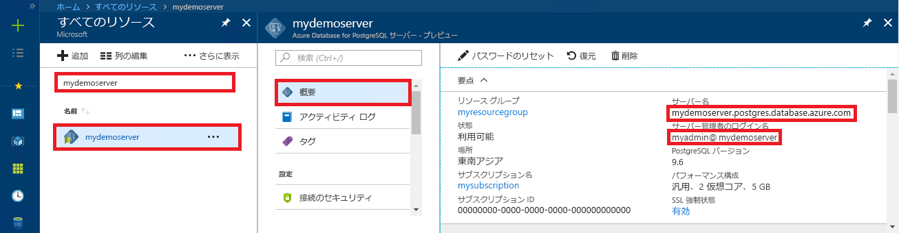

# <a name="azure-database-for-postgresql-use-java-to-connect-and-query-data"></a>Azure Database for PostgreSQL: Java を使った接続とデータの照会
このクイックスタートでは、Java アプリケーションを使用して Azure Database for PostgreSQL に接続する方法を紹介します。 ここでは、SQL ステートメントを使用してデータベース内のデータを照会、挿入、更新、削除する方法を説明します。 この記事の手順では、Java を使用した開発には慣れているものの、Azure Database for PostgreSQL の使用は初めてであるユーザーを想定しています。

## <a name="prerequisites"></a>前提条件
このクイックスタートでは、次のいずれかのガイドで作成されたリソースを出発点として使用します。
- [DB の作成 - ポータル](quickstart-create-server-database-portal.md)
- [DB の作成 - Azure CLI](quickstart-create-server-database-azure-cli.md)

さらに、以下を実行する必要があります。
- ご使用のバージョンの Java および Java Development Kit に合った [PostgreSQL JDBC ドライバー](https://jdbc.postgresql.org/download.html)をダウンロードします。
- PostgreSQL JDBC jar ファイル (例: postgresql-42.1.1.jar) をアプリケーションの classpath に追加します。 詳細については、[classpath の設定](https://jdbc.postgresql.org/documentation/head/classpath.html)に関するページを参照してください。

## <a name="get-connection-information"></a>接続情報の取得
Azure Database for PostgreSQL に接続するために必要な接続情報を取得します。 完全修飾サーバー名とログイン資格情報が必要です。

1. [Azure Portal](https://portal.azure.com/) にログインします。
2. Azure Portal の左側のメニューにある **[すべてのリソース]** をクリックし、作成したサーバー (例: **mydemoserver**) を検索します。
3. サーバー名をクリックします。
4. サーバーの **[概要]** パネルから、**[サーバー名]** と **[サーバー管理者ログイン名]** を書き留めます。 パスワードを忘れた場合も、このパネルからパスワードをリセットすることができます。
 

## <a name="connect-create-table-and-insert-data"></a>接続、テーブルの作成、データの挿入
データベースに接続し、**INSERT** SQL ステートメントが含まれた関数を使用してデータベースにデータを読み込むには、次のコードを使用します。 データベースへの接続、テーブルの削除、テーブルの作成には、[getConnection()](https://www.postgresql.org/docs/7.4/static/jdbc-use.html)、[createStatement()](https://jdbc.postgresql.org/documentation/head/query.html)、[executeQuery()](https://jdbc.postgresql.org/documentation/head/query.html) の各メソッドを使用します。 [prepareStatement](https://jdbc.postgresql.org/documentation/head/query.html) オブジェクトは、パラメーター値をバインドする setString() および setInt() と共に、挿入コマンドの作成に使用されます。 [executeUpdate()](https://jdbc.postgresql.org/documentation/head/update.html) メソッドは、パラメーターの各セットに対してコマンドを実行します。 

host、database、user、password の各パラメーターは、独自のサーバーとデータベースの作成時に指定した値に置き換えてください。

```java
import java.sql.*;
import java.util.Properties;

public class CreateTableInsertRows {

    public static void main (String[] args)  throws Exception
    {

        // Initialize connection variables.
        String host = "mydemoserver.postgres.database.azure.com";
        String database = "mypgsqldb";
        String user = "mylogin@mydemoserver";
        String password = "<server_admin_password>";

        // check that the driver is installed
        try
        {
            Class.forName("org.postgresql.Driver");
        }
        catch (ClassNotFoundException e)
        {
            throw new ClassNotFoundException("PostgreSQL JDBC driver NOT detected in library path.", e);
        }

        System.out.println("PostgreSQL JDBC driver detected in library path.");

        Connection connection = null;

        // Initialize connection object
        try
        {
            String url = String.format("jdbc:postgresql://%s/%s", host, database);
            
            // set up the connection properties
            Properties properties = new Properties();
            properties.setProperty("user", user);
            properties.setProperty("password", password);
            properties.setProperty("ssl", "true");

            // get connection
            connection = DriverManager.getConnection(url, properties);
        }
        catch (SQLException e)
        {
            throw new SQLException("Failed to create connection to database.", e);
        }
        if (connection != null) 
        { 
            System.out.println("Successfully created connection to database.");
        
            // Perform some SQL queries over the connection.
            try
            {
                // Drop previous table of same name if one exists.
                Statement statement = connection.createStatement();
                statement.execute("DROP TABLE IF EXISTS inventory;");
                System.out.println("Finished dropping table (if existed).");
    
                // Create table.
                statement.execute("CREATE TABLE inventory (id serial PRIMARY KEY, name VARCHAR(50), quantity INTEGER);");
                System.out.println("Created table.");
    
                // Insert some data into table.
                int nRowsInserted = 0;
                PreparedStatement preparedStatement = connection.prepareStatement("INSERT INTO inventory (name, quantity) VALUES (?, ?);");
                preparedStatement.setString(1, "banana");
                preparedStatement.setInt(2, 150);
                nRowsInserted += preparedStatement.executeUpdate();

                preparedStatement.setString(1, "orange");
                preparedStatement.setInt(2, 154);
                nRowsInserted += preparedStatement.executeUpdate();

                preparedStatement.setString(1, "apple");
                preparedStatement.setInt(2, 100);
                nRowsInserted += preparedStatement.executeUpdate();
                System.out.println(String.format("Inserted %d row(s) of data.", nRowsInserted));
    
                // NOTE No need to commit all changes to database, as auto-commit is enabled by default.
    
            }
            catch (SQLException e)
            {
                throw new SQLException("Encountered an error when executing given sql statement.", e);
            }       
        }
        else {
            System.out.println("Failed to create connection to database.");
        }
        System.out.println("Execution finished.");
    }
}
```

## <a name="read-data"></a>データの読み取り
**SELECT** SQL ステートメントを使用してデータを読み取るには、次のコードを使用します。 データベースへの接続と、SELECT ステートメントの作成と実行には、[getConnection()](https://www.postgresql.org/docs/7.4/static/jdbc-use.html)、[createStatement()](https://jdbc.postgresql.org/documentation/head/query.html)、[executeQuery()](https://jdbc.postgresql.org/documentation/head/query.html) の各メソッドを使用します。 結果は、[ResultSet](https://www.postgresql.org/docs/7.4/static/jdbc-query.html) オブジェクトを使用して処理されます。 

host、database、user、password の各パラメーターは、独自のサーバーとデータベースの作成時に指定した値に置き換えてください。

```java
import java.sql.*;
import java.util.Properties;

public class ReadTable {

    public static void main (String[] args)  throws Exception
    {

        // Initialize connection variables.
        String host = "mydemoserver.postgres.database.azure.com";
        String database = "mypgsqldb";
        String user = "mylogin@mydemoserver";
        String password = "<server_admin_password>";

        // check that the driver is installed
        try
        {
            Class.forName("org.postgresql.Driver");
        }
        catch (ClassNotFoundException e)
        {
            throw new ClassNotFoundException("PostgreSQL JDBC driver NOT detected in library path.", e);
        }

        System.out.println("PostgreSQL JDBC driver detected in library path.");

        Connection connection = null;

        // Initialize connection object
        try
        {
            String url = String.format("jdbc:postgresql://%s/%s", host, database);
            
            // set up the connection properties
            Properties properties = new Properties();
            properties.setProperty("user", user);
            properties.setProperty("password", password);
            properties.setProperty("ssl", "true");

            // get connection
            connection = DriverManager.getConnection(url, properties);
        }
        catch (SQLException e)
        {
            throw new SQLException("Failed to create connection to database.", e);
        }
        if (connection != null) 
        { 
            System.out.println("Successfully created connection to database.");
        
            // Perform some SQL queries over the connection.
            try
            {
    
                Statement statement = connection.createStatement();
                ResultSet results = statement.executeQuery("SELECT * from inventory;");
                while (results.next())
                {
                    String outputString = 
                        String.format(
                            "Data row = (%s, %s, %s)",
                            results.getString(1),
                            results.getString(2),
                            results.getString(3));
                    System.out.println(outputString);
                }
            }
            catch (SQLException e)
            {
                throw new SQLException("Encountered an error when executing given sql statement.", e);
            }       
        }
        else {
            System.out.println("Failed to create connection to database.");
        }
        System.out.println("Execution finished.");
    }
}

```

## <a name="update-data"></a>データの更新
**UPDATE** SQL ステートメントを使用してデータを変更するには、次のコードを使用します。 データベースへの接続と、UPDATE ステートメントの作成と実行には、[getConnection()](https://www.postgresql.org/docs/7.4/static/jdbc-use.html)、[prepareStatement()](https://jdbc.postgresql.org/documentation/head/query.html)、[executeUpdate()](https://jdbc.postgresql.org/documentation/head/update.html) の各メソッドを使用します。 

host、database、user、password の各パラメーターは、独自のサーバーとデータベースの作成時に指定した値に置き換えてください。

```java
import java.sql.*;
import java.util.Properties;

public class UpdateTable {
    public static void main (String[] args)  throws Exception
    {

        // Initialize connection variables.
        String host = "mydemoserver.postgres.database.azure.com";
        String database = "mypgsqldb";
        String user = "mylogin@mydemoserver";
        String password = "<server_admin_password>";

        // check that the driver is installed
        try
        {
            Class.forName("org.postgresql.Driver");
        }
        catch (ClassNotFoundException e)
        {
            throw new ClassNotFoundException("PostgreSQL JDBC driver NOT detected in library path.", e);
        }

        System.out.println("PostgreSQL JDBC driver detected in library path.");

        Connection connection = null;

        // Initialize connection object
        try
        {
            String url = String.format("jdbc:postgresql://%s/%s", host, database);
            
            // set up the connection properties
            Properties properties = new Properties();
            properties.setProperty("user", user);
            properties.setProperty("password", password);
            properties.setProperty("ssl", "true");

            // get connection
            connection = DriverManager.getConnection(url, properties);
        }
        catch (SQLException e)
        {
            throw new SQLException("Failed to create connection to database.", e);
        }
        if (connection != null) 
        { 
            System.out.println("Successfully created connection to database.");
        
            // Perform some SQL queries over the connection.
            try
            {
                // Modify some data in table.
                int nRowsUpdated = 0;
                PreparedStatement preparedStatement = connection.prepareStatement("UPDATE inventory SET quantity = ? WHERE name = ?;");
                preparedStatement.setInt(1, 200);
                preparedStatement.setString(2, "banana");
                nRowsUpdated += preparedStatement.executeUpdate();
                System.out.println(String.format("Updated %d row(s) of data.", nRowsUpdated));
    
                // NOTE No need to commit all changes to database, as auto-commit is enabled by default.
            }
            catch (SQLException e)
            {
                throw new SQLException("Encountered an error when executing given sql statement.", e);
            }       
        }
        else {
            System.out.println("Failed to create connection to database.");
        }
        System.out.println("Execution finished.");
    }
}
```
## <a name="delete-data"></a>データの削除
**DELETE** SQL ステートメントを使用してデータを削除するには、次のコードを使用します。 データベースへの接続と、DELETE ステートメントの作成と実行には、[getConnection()](https://www.postgresql.org/docs/7.4/static/jdbc-use.html)、[prepareStatement()](https://jdbc.postgresql.org/documentation/head/query.html)、[executeUpdate()](https://jdbc.postgresql.org/documentation/head/update.html) の各メソッドを使用します。 

host、database、user、password の各パラメーターは、独自のサーバーとデータベースの作成時に指定した値に置き換えてください。

```java
import java.sql.*;
import java.util.Properties;

public class DeleteTable {
    public static void main (String[] args)  throws Exception
    {

        // Initialize connection variables.
        String host = "mydemoserver.postgres.database.azure.com";
        String database = "mypgsqldb";
        String user = "mylogin@mydemoserver";
        String password = "<server_admin_password>";

        // check that the driver is installed
        try
        {
            Class.forName("org.postgresql.Driver");
        }
        catch (ClassNotFoundException e)
        {
            throw new ClassNotFoundException("PostgreSQL JDBC driver NOT detected in library path.", e);
        }

        System.out.println("PostgreSQL JDBC driver detected in library path.");

        Connection connection = null;

        // Initialize connection object
        try
        {
            String url = String.format("jdbc:postgresql://%s/%s", host, database);
            
            // set up the connection properties
            Properties properties = new Properties();
            properties.setProperty("user", user);
            properties.setProperty("password", password);
            properties.setProperty("ssl", "true");

            // get connection
            connection = DriverManager.getConnection(url, properties);
        }
        catch (SQLException e)
        {
            throw new SQLException("Failed to create connection to database.", e);
        }
        if (connection != null) 
        { 
            System.out.println("Successfully created connection to database.");
        
            // Perform some SQL queries over the connection.
            try
            {
                // Delete some data from table.
                int nRowsDeleted = 0;
                PreparedStatement preparedStatement = connection.prepareStatement("DELETE FROM inventory WHERE name = ?;");
                preparedStatement.setString(1, "orange");
                nRowsDeleted += preparedStatement.executeUpdate();
                System.out.println(String.format("Deleted %d row(s) of data.", nRowsDeleted));
    
                // NOTE No need to commit all changes to database, as auto-commit is enabled by default.
            }
            catch (SQLException e)
            {
                throw new SQLException("Encountered an error when executing given sql statement.", e);
            }       
        }
        else {
            System.out.println("Failed to create connection to database.");
        }
        System.out.println("Execution finished.");
    }
}
```

## <a name="next-steps"></a>次の手順
> [!div class="nextstepaction"]
> [エクスポートとインポートを使用したデータベースの移行](./howto-migrate-using-export-and-import.md)
