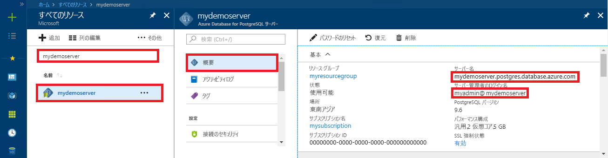

# <a name="quickstart-use-nodejs-to-connect-and-query-data-in-azure-database-for-postgresql---single-server"></a>クイック スタート:Node.js を使用して Azure Database for PostgreSQL - Single Server に接続し、データにクエリを実行する

このクイックスタートでは、Node.js アプリケーションを使用して、Azure Database for PostgreSQL に接続します。 ここでは、SQL ステートメントを使用してデータベース内のデータを照会、挿入、更新、削除する方法を説明します。 この記事の手順では、Node.js を使用した開発には慣れているものの、Azure Database for PostgreSQL の使用は初めてであるユーザーを想定しています。

## <a name="prerequisites"></a>前提条件

- アクティブなサブスクリプションが含まれる Azure アカウント。 [無料でアカウントを作成できます](https://azure.microsoft.com/free/?ref=microsoft.com&utm_source=microsoft.com&utm_medium=docs&utm_campaign=visualstudio)。

- 次の項目の完了: 「[クイックスタート: Azure Portal での Azure Database for PostgreSQL サーバーの作成」](quickstart-create-server-database-portal.md)または「[クイック スタート:Azure CLI を使用した Azure Database for PostgreSQL の作成](quickstart-create-server-database-azure-cli.md)」の手順を使用して作成されたもの)。

- [Node.js](https://nodejs.org)

## <a name="install-pg-client"></a>pg クライアントのインストール
[pg](https://www.npmjs.com/package/pg) をインストールします。pg は、Node.js 用の PostgreSQL クライアントです。

インストールするには、コマンド ラインから JavaScript の npm (node package manager) を実行して、pg クライアントをインストールします。
```bash
npm install pg
```

インストールされたパッケージを一覧表示して確認します。
```bash
npm list
```

## <a name="get-connection-information"></a>接続情報の取得
Azure Database for PostgreSQL に接続するために必要な接続情報を取得します。 完全修飾サーバー名とログイン資格情報が必要です。

1. [Azure portal](https://portal.azure.com/) で、作成したサーバー (たとえば、**mydemoserver**) を検索して選択します。

1. サーバーの **[概要]** パネルから、**サーバー名**と**管理者ユーザー名**を書き留めます。 パスワードを忘れた場合も、このパネルからパスワードをリセットすることができます。

   

## <a name="running-the-javascript-code-in-nodejs"></a>Node.js での JavaScript コードの実行
Node.js は、Bash シェル、ターミナル、または Windows コマンド プロンプトから「`node`」と入力して起動できます。起動後、サンプルの JavaScript コードをコピーし、プロンプトに貼り付けて対話形式で実行してください。 または、JavaScript コードをテキスト ファイルに保存し、パラメーターとしてそのファイル名を使用して `node filename.js` を起動して実行することもできます。

## <a name="connect-create-table-and-insert-data"></a>接続、テーブルの作成、データの挿入
接続し、**CREATE TABLE** および **INSERT INTO** SQL ステートメントを使用してデータを読み込むには、次のコードを使用します。
PostgreSQL サーバーとのインターフェイスには、[pg.Client](https://github.com/brianc/node-postgres/wiki/Client) オブジェクトを使用します。 サーバーへの接続を確立するには、[pg.Client.connect()](https://github.com/brianc/node-postgres/wiki/Client#method-connect) 関数を使用します。 PostgreSQL データベースに対して SQL クエリを実行するには、[pg.Client.query()](https://github.com/brianc/node-postgres/wiki/Query) 関数を使用します。 

host、dbname、user、password の各パラメーターは、サーバーとデータベースの作成時に指定した値に置き換えてください。

```javascript
const pg = require('pg');

const config = {
    host: '<your-db-server-name>.postgres.database.azure.com',
    // Do not hard code your username and password.
    // Consider using Node environment variables.
    user: '<your-db-username>',     
    password: '<your-password>',
    database: '<name-of-database>',
    port: 5432,
    ssl: true
};

const client = new pg.Client(config);

client.connect(err => {
    if (err) throw err;
    else {
        queryDatabase();
    }
});

function queryDatabase() {
    const query = `
        DROP TABLE IF EXISTS inventory;
        CREATE TABLE inventory (id serial PRIMARY KEY, name VARCHAR(50), quantity INTEGER);
        INSERT INTO inventory (name, quantity) VALUES ('banana', 150);
        INSERT INTO inventory (name, quantity) VALUES ('orange', 154);
        INSERT INTO inventory (name, quantity) VALUES ('apple', 100);
    `;

    client
        .query(query)
        .then(() => {
            console.log('Table created successfully!');
            client.end(console.log('Closed client connection'));
        })
        .catch(err => console.log(err))
        .then(() => {
            console.log('Finished execution, exiting now');
            process.exit();
        });
}
```

## <a name="read-data"></a>データの読み取り
接続し、**SELECT** SQL ステートメントを使用してデータを読み取るには、次のコードを使用します。 PostgreSQL サーバーとのインターフェイスには、[pg.Client](https://github.com/brianc/node-postgres/wiki/Client) オブジェクトを使用します。 サーバーへの接続を確立するには、[pg.Client.connect()](https://github.com/brianc/node-postgres/wiki/Client#method-connect) 関数を使用します。 PostgreSQL データベースに対して SQL クエリを実行するには、[pg.Client.query()](https://github.com/brianc/node-postgres/wiki/Query) 関数を使用します。 

host、dbname、user、password の各パラメーターは、サーバーとデータベースの作成時に指定した値に置き換えてください。 

```javascript
const pg = require('pg');

const config = {
    host: '<your-db-server-name>.postgres.database.azure.com',
    // Do not hard code your username and password.
    // Consider using Node environment variables.
    user: '<your-db-username>',     
    password: '<your-password>',
    database: '<name-of-database>',
    port: 5432,
    ssl: true
};

const client = new pg.Client(config);

client.connect(err => {
    if (err) throw err;
    else { queryDatabase(); }
});

function queryDatabase() {
  
    console.log(`Running query to PostgreSQL server: ${config.host}`);

    const query = 'SELECT * FROM inventory;';

    client.query(query)
        .then(res => {
            const rows = res.rows;

            rows.map(row => {
                console.log(`Read: ${JSON.stringify(row)}`);
            });

            process.exit();
        })
        .catch(err => {
            console.log(err);
        });
}
```

## <a name="update-data"></a>データの更新
接続し、**UPDATE** SQL ステートメントを使用してデータを読み取るには、次のコードを使用します。 PostgreSQL サーバーとのインターフェイスには、[pg.Client](https://github.com/brianc/node-postgres/wiki/Client) オブジェクトを使用します。 サーバーへの接続を確立するには、[pg.Client.connect()](https://github.com/brianc/node-postgres/wiki/Client#method-connect) 関数を使用します。 PostgreSQL データベースに対して SQL クエリを実行するには、[pg.Client.query()](https://github.com/brianc/node-postgres/wiki/Query) 関数を使用します。 

host、dbname、user、password の各パラメーターは、サーバーとデータベースの作成時に指定した値に置き換えてください。 

```javascript
const pg = require('pg');

const config = {
    host: '<your-db-server-name>.postgres.database.azure.com',
    // Do not hard code your username and password.
    // Consider using Node environment variables.
    user: '<your-db-username>',     
    password: '<your-password>',
    database: '<name-of-database>',
    port: 5432,
    ssl: true
};

const client = new pg.Client(config);

client.connect(err => {
    if (err) throw err;
    else {
        queryDatabase();
    }
});

function queryDatabase() {
    const query = `
        UPDATE inventory 
        SET quantity= 1000 WHERE name='banana';
    `;

    client
        .query(query)
        .then(result => {
            console.log('Update completed');
            console.log(`Rows affected: ${result.rowCount}`);
        })
        .catch(err => {
            console.log(err);
            throw err;
        });
}
```

## <a name="delete-data"></a>データの削除
接続し、**DELETE** SQL ステートメントを使用してデータを削除するには、次のコードを使用します。 PostgreSQL サーバーとのインターフェイスには、[pg.Client](https://github.com/brianc/node-postgres/wiki/Client) オブジェクトを使用します。 サーバーへの接続を確立するには、[pg.Client.connect()](https://github.com/brianc/node-postgres/wiki/Client#method-connect) 関数を使用します。 PostgreSQL データベースに対して SQL クエリを実行するには、[pg.Client.query()](https://github.com/brianc/node-postgres/wiki/Query) 関数を使用します。 

host、dbname、user、password の各パラメーターは、サーバーとデータベースの作成時に指定した値に置き換えてください。 

```javascript
const pg = require('pg');

const config = {
    host: '<your-db-server-name>.postgres.database.azure.com',
    // Do not hard code your username and password.
    // Consider using Node environment variables.
    user: '<your-db-username>',     
    password: '<your-password>',
    database: '<name-of-database>',
    port: 5432,
    ssl: true
};

const client = new pg.Client(config);

client.connect(err => {
    if (err) {
        throw err;
    } else {
        queryDatabase();
    }
});

function queryDatabase() {
    const query = `
        DELETE FROM inventory 
        WHERE name = 'apple';
    `;

    client
        .query(query)
        .then(result => {
            console.log('Delete completed');
            console.log(`Rows affected: ${result.rowCount}`);
        })
        .catch(err => {
            console.log(err);
            throw err;
        });
}
```

## <a name="next-steps"></a>次のステップ
> [!div class="nextstepaction"]
> [エクスポートとインポートを使用したデータベースの移行](./howto-migrate-using-export-and-import.md)
