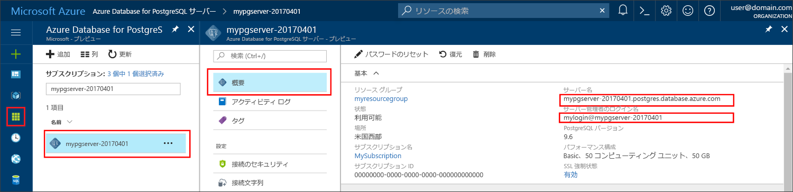

# <a name="azure-database-for-postgresql-use-php-to-connect-and-query-data"></a>Azure Database for PostgreSQL:PHP を使って接続とデータのクエリを実行する
このクイックスタートでは、[PHP](https://secure.php.net/manual/intro-whatis.php) アプリケーションを使用して Azure Database for PostgreSQL に接続する方法を紹介します。 ここでは、SQL ステートメントを使用してデータベース内のデータを照会、挿入、更新、削除する方法を説明します。 この記事の手順では、PHP を使用した開発には慣れているものの、Azure Database for PostgreSQL の使用は初めてであるユーザーを想定しています。

## <a name="prerequisites"></a>前提条件
このクイックスタートでは、次のいずれかのガイドで作成されたリソースを出発点として使用します。
- [DB の作成 - ポータル](quickstart-create-server-database-portal.md)
- [DB の作成 - Azure CLI](quickstart-create-server-database-azure-cli.md)

## <a name="install-php"></a>PHP のインストール
独自のサーバーに PHP をインストールするか、PHP が含まれた Azure [Web アプリ](../app-service/overview.md)を作成します。

### <a name="windows"></a> Windows
- [PHP 7.1.4 非スレッド セーフ バージョン (x64)](https://windows.php.net/download#php-7.1) をダウンロードします。
- PHP をインストールし、さらなる構成については [PHP マニュアル](https://secure.php.net/manual/install.windows.php)を参照します。
- このコードでは、PHP のインストールに含まれている **pgsql** クラス (ext/php_pgsql.dll) を使用します。 
- php.ini 構成ファイル (通常は `C:\Program Files\PHP\v7.1\php.ini` にあります) を編集して、**pgsql** 拡張機能を有効にします。 この構成ファイルには、`extension=php_pgsql.so` というテキスト行を含める必要があります。 このテキストが表示されていない場合は、追加してファイルを保存します。 このテキストが含まれていても、先頭にセミコロンが付いてコメント化されている場合は、セミコロンを削除してコメント解除します。

### <a name="linux-ubuntu"></a>Linux (Ubuntu)
- [PHP 7.1.4 非スレッド セーフ バージョン (x64)](https://secure.php.net/downloads.php) をダウンロードします。 
- PHP をインストールし、さらなる構成については [PHP マニュアル](https://secure.php.net/manual/install.unix.php)を参照します。
- このコードでは、**pgsql** クラス (php_pgsql.so) を使用します。 `sudo apt-get install php-pgsql` を実行してインストールします。
- `/etc/php/7.0/mods-available/pgsql.ini` 構成ファイルを編集して、**pgsql** 拡張機能を有効にします。 この構成ファイルには、`extension=php_pgsql.so` というテキスト行を含める必要があります。 このテキストが表示されていない場合は、追加してファイルを保存します。 このテキストが含まれていても、先頭にセミコロンが付いてコメント化されている場合は、セミコロンを削除してコメント解除します。

### <a name="macos"></a>MacOS
- [PHP 7.1.4 バージョン](https://secure.php.net/downloads.php)をダウンロードします。
- PHP をインストールし、さらなる構成については [PHP マニュアル](https://secure.php.net/manual/install.macosx.php)を参照します。

## <a name="get-connection-information"></a>接続情報の取得
Azure Database for PostgreSQL に接続するために必要な接続情報を取得します。 完全修飾サーバー名とログイン資格情報が必要です。

1. [Azure Portal](https://portal.azure.com/) にログインします。
2. Azure Portal の左側のメニューにある **[すべてのリソース]** をクリックし、作成したサーバー (例: **mydemoserver**) を検索します。
3. サーバー名をクリックします。
4. サーバーの **[概要]** パネルから、**[サーバー名]** と **[サーバー管理者ログイン名]** を書き留めます。 パスワードを忘れた場合も、このパネルからパスワードをリセットすることができます。
 

## <a name="connect-and-create-a-table"></a>接続とテーブルの作成
接続し、**CREATE TABLE** SQL ステートメントでテーブルを作成してから、**INSERT INTO** SQL ステートメントでそのテーブルに行を追加するには、次のコードを使用します。

このコードでは、[pg_connect()](https://secure.php.net/manual/en/function.pg-connect.php) メソッドを呼び出して、Azure Database for PostgreSQL に接続します。 次に、[pg_query()](https://secure.php.net/manual/en/function.pg-query.php) メソッドを数回呼び出して複数のコマンドを実行し、毎回エラーが発生した場合は [pg_last_error()](https://secure.php.net/manual/en/function.pg-last-error.php) を呼び出して詳細をチェックします。 その後、[pg_close()](https://secure.php.net/manual/en/function.pg-close.php) メソッドを呼び出して接続を閉じます。

`$host`、`$database`、`$user`、`$password` の各パラメーターは、実際の値に置き換えてください。 

```php
<?php
    // Initialize connection variables.
    $host = "mydemoserver.postgres.database.azure.com";
    $database = "mypgsqldb";
    $user = "mylogin@mydemoserver";
    $password = "<server_admin_password>";

    // Initialize connection object.
    $connection = pg_connect("host=$host dbname=$database user=$user password=$password") 
        or die("Failed to create connection to database: ". pg_last_error(). "<br/>");
    print "Successfully created connection to database.<br/>";

    // Drop previous table of same name if one exists.
    $query = "DROP TABLE IF EXISTS inventory;";
    pg_query($connection, $query) 
        or die("Encountered an error when executing given sql statement: ". pg_last_error(). "<br/>");
    print "Finished dropping table (if existed).<br/>";

    // Create table.
    $query = "CREATE TABLE inventory (id serial PRIMARY KEY, name VARCHAR(50), quantity INTEGER);";
    pg_query($connection, $query) 
        or die("Encountered an error when executing given sql statement: ". pg_last_error(). "<br/>");
    print "Finished creating table.<br/>";

    // Insert some data into table.
    $name = '\'banana\'';
    $quantity = 150;
    $query = "INSERT INTO inventory (name, quantity) VALUES ($1, $2);";
    pg_query($connection, $query) 
        or die("Encountered an error when executing given sql statement: ". pg_last_error(). "<br/>");

    $name = '\'orange\'';
    $quantity = 154;
    $query = "INSERT INTO inventory (name, quantity) VALUES ($name, $quantity);";
    pg_query($connection, $query) 
        or die("Encountered an error when executing given sql statement: ". pg_last_error(). "<br/>");

    $name = '\'apple\'';
    $quantity = 100;
    $query = "INSERT INTO inventory (name, quantity) VALUES ($name, $quantity);";
    pg_query($connection, $query) 
        or die("Encountered an error when executing given sql statement: ". pg_last_error()). "<br/>";

    print "Inserted 3 rows of data.<br/>";

    // Closing connection
    pg_close($connection);
?>
```

## <a name="read-data"></a>データの読み取り
接続し、**SELECT** SQL ステートメントを使用してデータを読み取るには、次のコードを使用します。 

 このコードでは、[pg_connect()](https://secure.php.net/manual/en/function.pg-connect.php) メソッドを呼び出して、Azure Database for PostgreSQL に接続します。 次に、[pg_query()](https://secure.php.net/manual/en/function.pg-query.php) メソッドを呼び出して SELECT コマンドを実行し (結果は結果セットに保持されます)、エラーが発生した場合は [pg_last_error()](https://secure.php.net/manual/en/function.pg-last-error.php) を呼び出して詳細をチェックします。  結果セットを読み取るために、ループで [pg_fetch_row()](https://secure.php.net/manual/en/function.pg-fetch-row.php) メソッドが呼び出されます。このメソッドは行ごとに 1 回呼び出され、行データは配列 `$row` に取得されます。このとき、列あたり 1 つのデータ値が各配列位置に格納されます。  結果セットを開放するために、[pg_free_result()](https://secure.php.net/manual/en/function.pg-free-result.php) メソッドが呼び出されます。 その後、[pg_close()](https://secure.php.net/manual/en/function.pg-close.php) メソッドを呼び出して接続を閉じます。

`$host`、`$database`、`$user`、`$password` の各パラメーターは、実際の値に置き換えてください。 

```php
<?php
    // Initialize connection variables.
    $host = "mydemoserver.postgres.database.azure.com";
    $database = "mypgsqldb";
    $user = "mylogin@mydemoserver";
    $password = "<server_admin_password>";
    
    // Initialize connection object.
    $connection = pg_connect("host=$host dbname=$database user=$user password=$password")
                or die("Failed to create connection to database: ". pg_last_error(). "<br/>");

    print "Successfully created connection to database. <br/>";

    // Perform some SQL queries over the connection.
    $query = "SELECT * from inventory";
    $result_set = pg_query($connection, $query) 
        or die("Encountered an error when executing given sql statement: ". pg_last_error(). "<br/>");
    while ($row = pg_fetch_row($result_set))
    {
        print "Data row = ($row[0], $row[1], $row[2]). <br/>";
    }

    // Free result_set
    pg_free_result($result_set);

    // Closing connection
    pg_close($connection);
?>
```

## <a name="update-data"></a>データの更新
接続し、**UPDATE** SQL ステートメントを使用してデータを更新するには、次のコードを使用します。

このコードでは、[pg_connect()](https://secure.php.net/manual/en/function.pg-connect.php) メソッドを呼び出して、Azure Database for PostgreSQL に接続します。 次に、[pg_query()](https://secure.php.net/manual/en/function.pg-query.php) メソッドを呼び出してコマンドを実行し、エラーが発生した場合は [pg_last_error()](https://secure.php.net/manual/en/function.pg-last-error.php) を呼び出して詳細をチェックします。 その後、[pg_close()](https://secure.php.net/manual/en/function.pg-close.php) メソッドを呼び出して接続を閉じます。

`$host`、`$database`、`$user`、`$password` の各パラメーターは、実際の値に置き換えてください。 

```php
<?php
    // Initialize connection variables.
    $host = "mydemoserver.postgres.database.azure.com";
    $database = "mypgsqldb";
    $user = "mylogin@mydemoserver";
    $password = "<server_admin_password>";

    // Initialize connection object.
    $connection = pg_connect("host=$host dbname=$database user=$user password=$password")
                or die("Failed to create connection to database: ". pg_last_error(). ".<br/>");

    print "Successfully created connection to database. <br/>";

    // Modify some data in table.
    $new_quantity = 200;
    $name = '\'banana\'';
    $query = "UPDATE inventory SET quantity = $new_quantity WHERE name = $name;";
    pg_query($connection, $query) 
        or die("Encountered an error when executing given sql statement: ". pg_last_error(). ".<br/>");
    print "Updated 1 row of data. </br>";

    // Closing connection
    pg_close($connection);
?>
```


## <a name="delete-data"></a>データの削除
接続し、**DELETE** SQL ステートメントを使用してデータを削除するには、次のコードを使用します。 

 このコードでは、[pg_connect()](https://secure.php.net/manual/en/function.pg-connect.php) メソッドを呼び出して、Azure Database for PostgreSQL に接続します。 次に、[pg_query()](https://secure.php.net/manual/en/function.pg-query.php) メソッドを呼び出してコマンドを実行し、エラーが発生した場合は [pg_last_error()](https://secure.php.net/manual/en/function.pg-last-error.php) を呼び出して詳細をチェックします。 その後、[pg_close()](https://secure.php.net/manual/en/function.pg-close.php) メソッドを呼び出して接続を閉じます。

`$host`、`$database`、`$user`、`$password` の各パラメーターは、実際の値に置き換えてください。 

```php
<?php
    // Initialize connection variables.
    $host = "mydemoserver.postgres.database.azure.com";
    $database = "mypgsqldb";
    $user = "mylogin@mydemoserver";
    $password = "<server_admin_password>";

    // Initialize connection object.
    $connection = pg_connect("host=$host dbname=$database user=$user password=$password")
            or die("Failed to create connection to database: ". pg_last_error(). ". </br>");

    print "Successfully created connection to database. <br/>";

    // Delete some data from table.
    $name = '\'orange\'';
    $query = "DELETE FROM inventory WHERE name = $name;";
    pg_query($connection, $query) 
        or die("Encountered an error when executing given sql statement: ". pg_last_error(). ". <br/>");
    print "Deleted 1 row of data. <br/>";

    // Closing connection
    pg_close($connection);
?>
```

## <a name="next-steps"></a>次の手順
> [!div class="nextstepaction"]
> [エクスポートとインポートを使用したデータベースの移行](./howto-migrate-using-export-and-import.md)
