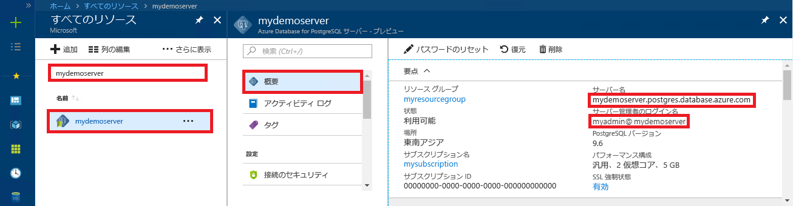

# <a name="azure-database-for-postgresql-use-python-to-connect-and-query-data"></a>Azure Database for PostgreSQL: Python を使った接続とデータの照会
このクイックスタートでは、[Python](https://python.org) を使用して Azure Database for PostgreSQL に接続する方法を紹介します。 また、macOS、Ubuntu Linux、Windows の各プラットフォームから、SQL ステートメントを使用してデータベース内のデータを照会、挿入、更新、削除する方法も紹介します。 この記事の手順では、Python を使用した開発には慣れているものの、Azure Database for PostgreSQL の使用は初めてであるユーザーを想定しています。

## <a name="prerequisites"></a>前提条件
このクイックスタートでは、次のいずれかのガイドで作成されたリソースを出発点として使用します。
- [DB の作成 - ポータル](quickstart-create-server-database-portal.md)
- [DB の作成 - CLI](quickstart-create-server-database-azure-cli.md)

以下も必要です。
- [python](https://www.python.org/downloads/) がインストールされていること。
- [pip](https://pip.pypa.io/en/stable/installing/) パッケージがインストールされていること ([python.org](https://python.org) からダウンロードした Python 2 (2.7.9 以上) または Python 3 (3.4 以上) のバイナリをご利用の場合、pip は既にインストールされています)。

## <a name="install-the-python-connection-libraries-for-postgresql"></a>PostgreSQL 用 Python 接続ライブラリのインストール
[psycopg2](http://initd.org/psycopg/docs/install.html) パッケージをインストールします。これにより、データベースに接続してクエリを実行できるようになります。 psycopg2 は、最も一般的なプラットフォーム (Linux、OSX、Windows) を対象に [wheel](https://pythonwheels.com/) パッケージ形式で [PyPI に公開](https://pypi.python.org/pypi/psycopg2/)されています。 pip install を使用して、すべての依存関係を含んだバイナリ バージョンのモジュールを取得してください。

1. ご使用のコンピューター上のコマンド ライン インターフェイスを起動します。
    - Linux では、Bash シェルを起動します。
    - macOS では、ターミナルを起動します。
    - Windows では、[スタート] メニューからコマンド プロンプトを起動します。
2. 次のようなコマンドを実行して、使用している pip が最新バージョンであることを確認します。
    ```cmd
    pip install -U pip
    ```

3. 次のコマンドを実行して、psycopg2 パッケージをインストールします。
    ```cmd
    pip install psycopg2
    ```

## <a name="get-connection-information"></a>接続情報の取得
Azure Database for PostgreSQL に接続するために必要な接続情報を取得します。 完全修飾サーバー名とログイン資格情報が必要です。

1. [Azure Portal](https://portal.azure.com/) にログインします。
2. Azure Portal の左側のメニューにある **[すべてのリソース]** をクリックし、作成したサーバー (例: **mydemoserver**) を検索します。
3. サーバー名をクリックします。
4. サーバーの **[概要]** パネルから、**[サーバー名]** と **[サーバー管理者ログイン名]** を書き留めます。 パスワードを忘れた場合も、このパネルからパスワードをリセットすることができます。
 

## <a name="how-to-run-python-code"></a>Python コードを実行する方法
この記事では、それぞれが特定の機能を実行する合計 4 つのコード サンプルを紹介しています。 テキスト ファイルを作成し、コード ブロックを挿入して、後で実行できるようファイルを保存する方法を次の手順で説明します。 独立した 4 つのファイル (コード ブロックごとに 1 つ) を作成してください。

- 任意のテキスト エディターで新しいファイルを作成します。
- 以降のセクションにあるいずれかのコード サンプルをコピーしてテキスト ファイルに貼り付けます。 **host**、**dbname**、**user**、**password** の各パラメーターは、サーバーとデータベースの作成時に指定した値に置き換えてください。
- このファイルを .py という拡張子でプロジェクト フォルダーに保存します (例: postgres.py)。 Windows 上で実行している場合は、ファイルを保存するときに必ず UTF-8 エンコーディングを選択してください。 
- コマンド プロンプト、ターミナル、Bash シェルを起動し、ディレクトリをプロジェクト フォルダー (`cd postgres` など) に変更します。
-  コードを実行するには、Python コマンドに続けてファイル名を入力します (例: `Python postgres.py`)。

> [!NOTE]
> Python バージョン 3 以降では、以下のコード ブロックを実行するときに "`SyntaxError: Missing parentheses in call to 'print'`" というエラーが表示される場合があります。その場合は、`print "string"` コマンドの呼び出し箇所をすべて、丸かっこを使用した関数呼び出しに置き換えてください (例: `print("string")`)。

## <a name="connect-create-table-and-insert-data"></a>接続、テーブルの作成、データの挿入
[psycopg2.connect](http://initd.org/psycopg/docs/connection.html) 関数と共に **INSERT** SQL ステートメントを使用して、接続してデータを読み込むには、次のコードを使用します。 PostgreSQL データベースに対して SQL クエリを実行するには、[cursor.execute](http://initd.org/psycopg/docs/cursor.html#execute) 関数を使用します。 host、dbname、user、password の各パラメーターは、サーバーとデータベースの作成時に指定した値に置き換えてください。

```Python
import psycopg2

# Update connection string information obtained from the portal
host = "mydemoserver.postgres.database.azure.com"
user = "mylogin@mydemoserver"
dbname = "mypgsqldb"
password = "<server_admin_password>"
sslmode = "require"

# Construct connection string
conn_string = "host={0} user={1} dbname={2} password={3} sslmode={4}".format(host, user, dbname, password, sslmode)
conn = psycopg2.connect(conn_string) 
print "Connection established"

cursor = conn.cursor()

# Drop previous table of same name if one exists
cursor.execute("DROP TABLE IF EXISTS inventory;")
print "Finished dropping table (if existed)"

# Create table
cursor.execute("CREATE TABLE inventory (id serial PRIMARY KEY, name VARCHAR(50), quantity INTEGER);")
print "Finished creating table"

# Insert some data into table
cursor.execute("INSERT INTO inventory (name, quantity) VALUES (%s, %s);", ("banana", 150))
cursor.execute("INSERT INTO inventory (name, quantity) VALUES (%s, %s);", ("orange", 154))
cursor.execute("INSERT INTO inventory (name, quantity) VALUES (%s, %s);", ("apple", 100))
print "Inserted 3 rows of data"

# Cleanup
conn.commit()
cursor.close()
conn.close()
```

コードが正常に実行されると、次の出力結果が表示されます。


## <a name="read-data"></a>データの読み取り
[cursor.execute](http://initd.org/psycopg/docs/cursor.html#execute) 関数と共に **SELECT** SQL ステートメントを使用して、挿入したデータを読み取るには、次のコードを使用します。 この関数はクエリを受け取り、[cursor.fetchall()](http://initd.org/psycopg/docs/cursor.html#cursor.fetchall) を使用して反復処理できる結果セットを返します。 host、dbname、user、password の各パラメーターは、サーバーとデータベースの作成時に指定した値に置き換えてください。

```Python
import psycopg2

# Update connection string information obtained from the portal
host = "mydemoserver.postgres.database.azure.com"
user = "mylogin@mydemoserver"
dbname = "mypgsqldb"
password = "<server_admin_password>"
sslmode = "require"

# Construct connection string
conn_string = "host={0} user={1} dbname={2} password={3} sslmode={4}".format(host, user, dbname, password, sslmode)
conn = psycopg2.connect(conn_string) 
print "Connection established"

cursor = conn.cursor()

# Fetch all rows from table
cursor.execute("SELECT * FROM inventory;")
rows = cursor.fetchall()

# Print all rows
for row in rows:
    print "Data row = (%s, %s, %s)" %(str(row[0]), str(row[1]), str(row[2]))

# Cleanup
conn.commit()
cursor.close()
conn.close()
```

## <a name="update-data"></a>データの更新
[cursor.execute](http://initd.org/psycopg/docs/cursor.html#execute) 関数と共に **UPDATE** SQL ステートメントを使用して、先ほど挿入した inventory 行を更新するには、次のコードを使用します。 host、dbname、user、password の各パラメーターは、サーバーとデータベースの作成時に指定した値に置き換えてください。

```Python
import psycopg2

# Update connection string information obtained from the portal
host = "mydemoserver.postgres.database.azure.com"
user = "mylogin@mydemoserver"
dbname = "mypgsqldb"
password = "<server_admin_password>"
sslmode = "require"

# Construct connection string
conn_string = "host={0} user={1} dbname={2} password={3} sslmode={4}".format(host, user, dbname, password, sslmode)
conn = psycopg2.connect(conn_string) 
print "Connection established"

cursor = conn.cursor()

# Update a data row in the table
cursor.execute("UPDATE inventory SET quantity = %s WHERE name = %s;", (200, "banana"))
print "Updated 1 row of data"

# Cleanup
conn.commit()
cursor.close()
conn.close()
```

## <a name="delete-data"></a>データの削除
[cursor.execute](http://initd.org/psycopg/docs/cursor.html#execute) 関数と共に **DELETE** SQL ステートメントを使用して、先ほど挿入した inventory 項目を削除するには、次のコードを使用します。 host、dbname、user、password の各パラメーターは、サーバーとデータベースの作成時に指定した値に置き換えてください。

```Python
import psycopg2

# Update connection string information obtained from the portal
host = "mydemoserver.postgres.database.azure.com"
user = "mylogin@mydemoserver"
dbname = "mypgsqldb"
password = "<server_admin_password>"
sslmode = "require"

# Construct connection string
conn_string = "host={0} user={1} dbname={2} password={3} sslmode={4}".format(host, user, dbname, password, sslmode)
conn = psycopg2.connect(conn_string) 
print "Connection established"

cursor = conn.cursor()

# Delete data row from table
cursor.execute("DELETE FROM inventory WHERE name = %s;", ("orange",))
print "Deleted 1 row of data"

# Cleanup
conn.commit()
cursor.close()
conn.close()
```

## <a name="next-steps"></a>次の手順
> [!div class="nextstepaction"]
> [エクスポートとインポートを使用したデータベースの移行](./howto-migrate-using-export-and-import.md)
