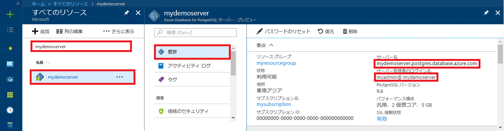

# <a name="azure-database-for-postgresql---single-server-use-ruby-to-connect-and-query-data"></a>Azure Database for PostgreSQL - Single Server: Ruby を使った接続とデータの照会
このクイックスタートでは、[Ruby](https://www.ruby-lang.org) アプリケーションを使用して Azure Database for PostgreSQL に接続する方法を紹介します。 ここでは、SQL ステートメントを使用してデータベース内のデータを照会、挿入、更新、削除する方法を説明します。 この記事の手順では、Ruby を使用した開発には慣れているものの、Azure Database for PostgreSQL の使用は初めてであるユーザーを想定しています。

## <a name="prerequisites"></a>前提条件
このクイックスタートでは、次のいずれかのガイドで作成されたリソースを出発点として使用します。
- [DB の作成 - ポータル](quickstart-create-server-database-portal.md)
- [DB の作成 - Azure CLI](quickstart-create-server-database-azure-cli.md)

また、以下のものもインストールしておく必要があります。
- [Ruby](https://www.ruby-lang.org/en/downloads/)
- Ruby pg、Ruby 用の PostgreSQL モジュール

## <a name="get-connection-information"></a>接続情報の取得
Azure Database for PostgreSQL に接続するために必要な接続情報を取得します。 完全修飾サーバー名とログイン資格情報が必要です。

1. [Azure Portal](https://portal.azure.com/) にログインします。
2. Azure Portal の左側のメニューにある **[すべてのリソース]** をクリックし、作成したサーバー (例: **mydemoserver**) を検索します。
3. サーバー名をクリックします。
4. サーバーの **[概要]** パネルから、 **[サーバー名]** と **[サーバー管理者ログイン名]** を書き留めます。 パスワードを忘れた場合も、このパネルからパスワードをリセットすることができます。
 

> [!NOTE]
> Azure Postgres ユーザー名の `@` 記号は、すべての接続文字列で `%40` として URL エンコードされています。 

## <a name="connect-and-create-a-table"></a>接続とテーブルの作成
接続し、**CREATE TABLE** SQL ステートメントでテーブルを作成してから、**INSERT INTO** SQL ステートメントでそのテーブルに行を追加するには、次のコードを使用します。

このコードでは、[new()](https://www.rubydoc.info/gems/pg/PG%2FConnection:initialize) コンストラクターを使用した [PG::Connection](https://www.rubydoc.info/gems/pg/PG/Connection) オブジェクトを使用して、Azure Database for PostgreSQL に接続します。 次に、[exec()](https://www.rubydoc.info/gems/pg/PG/Connection#exec-instance_method) メソッドを呼び出して、DROP、CREATE TABLE、INSERT INTO の各コマンドを実行します。 [PG::Error](https://www.rubydoc.info/gems/pg/PG/Error) クラスを使用して、エラーをチェックします。 その後、[close()](https://www.rubydoc.info/gems/pg/PG/Connection#lo_close-instance_method) メソッドを呼び出して、終了する前に接続を閉じます。

`host`、`database`、`user`、`password` の各文字列は、実際の値に置き換えてください。 


```ruby
require 'pg'

begin
    # Initialize connection variables.
    host = String('mydemoserver.postgres.database.azure.com')
    database = String('postgres')
    user = String('mylogin%40mydemoserver')
    password = String('<server_admin_password>')

    # Initialize connection object.
    connection = PG::Connection.new(:host => host, :user => user, :dbname => database, :port => '5432', :password => password)
    puts 'Successfully created connection to database'

    # Drop previous table of same name if one exists
    connection.exec('DROP TABLE IF EXISTS inventory;')
    puts 'Finished dropping table (if existed).'

    # Drop previous table of same name if one exists.
    connection.exec('CREATE TABLE inventory (id serial PRIMARY KEY, name VARCHAR(50), quantity INTEGER);')
    puts 'Finished creating table.'

    # Insert some data into table.
    connection.exec("INSERT INTO inventory VALUES(1, 'banana', 150)")
    connection.exec("INSERT INTO inventory VALUES(2, 'orange', 154)")
    connection.exec("INSERT INTO inventory VALUES(3, 'apple', 100)")
    puts 'Inserted 3 rows of data.'

rescue PG::Error => e
    puts e.message 
    
ensure
    connection.close if connection
end
```

## <a name="read-data"></a>データの読み取り
接続し、**SELECT** SQL ステートメントを使用してデータを読み取るには、次のコードを使用します。 

このコードでは、[new()](https://www.rubydoc.info/gems/pg/PG%2FConnection:initialize) コンストラクターを使用した [PG::Connection](https://www.rubydoc.info/gems/pg/PG/Connection) オブジェクトを使用して、Azure Database for PostgreSQL に接続します。 次に、[exec()](https://www.rubydoc.info/gems/pg/PG/Connection#exec-instance_method) メソッドを呼び出して SELECT コマンドを実行します。その際、結果は結果セットに保持されます。 結果セットのコレクションは `resultSet.each do` ループを使用して反復処理され、現在の行の値が `row` 変数に保持されます。 [PG::Error](https://www.rubydoc.info/gems/pg/PG/Error) クラスを使用して、エラーをチェックします。 その後、[close()](https://www.rubydoc.info/gems/pg/PG/Connection#lo_close-instance_method) メソッドを呼び出して、終了する前に接続を閉じます。

`host`、`database`、`user`、`password` の各文字列は、実際の値に置き換えてください。 

```ruby
require 'pg'

begin
    # Initialize connection variables.
    host = String('mydemoserver.postgres.database.azure.com')
    database = String('postgres')
    user = String('mylogin%40mydemoserver')
    password = String('<server_admin_password>')

    # Initialize connection object.
    connection = PG::Connection.new(:host => host, :user => user, :database => dbname, :port => '5432', :password => password)
    puts 'Successfully created connection to database.'

    resultSet = connection.exec('SELECT * from inventory;')
    resultSet.each do |row|
        puts 'Data row = (%s, %s, %s)' % [row['id'], row['name'], row['quantity']]
    end

rescue PG::Error => e
    puts e.message 
    
ensure
    connection.close if connection
end
```

## <a name="update-data"></a>データの更新
接続し、**UPDATE** SQL ステートメントを使用してデータを更新するには、次のコードを使用します。

このコードでは、[new()](https://www.rubydoc.info/gems/pg/PG%2FConnection:initialize) コンストラクターを使用した [PG::Connection](https://www.rubydoc.info/gems/pg/PG/Connection) オブジェクトを使用して、Azure Database for PostgreSQL に接続します。 次に、[exec()](https://www.rubydoc.info/gems/pg/PG/Connection#exec-instance_method) メソッドを呼び出し、DELETE コマンドを実行します。 [PG::Error](https://www.rubydoc.info/gems/pg/PG/Error) クラスを使用して、エラーをチェックします。 その後、[close()](https://www.rubydoc.info/gems/pg/PG/Connection#lo_close-instance_method) メソッドを呼び出して、終了する前に接続を閉じます。

`host`、`database`、`user`、`password` の各文字列は、実際の値に置き換えてください。 

```ruby
require 'pg'

begin
    # Initialize connection variables.
    host = String('mydemoserver.postgres.database.azure.com')
    database = String('postgres')
    user = String('mylogin%40mydemoserver')
    password = String('<server_admin_password>')

    # Initialize connection object.
    connection = PG::Connection.new(:host => host, :user => user, :dbname => database, :port => '5432', :password => password)
    puts 'Successfully created connection to database.'

    # Modify some data in table.
    connection.exec('UPDATE inventory SET quantity = %d WHERE name = %s;' % [200, '\'banana\''])
    puts 'Updated 1 row of data.'

rescue PG::Error => e
    puts e.message 
    
ensure
    connection.close if connection
end
```


## <a name="delete-data"></a>データの削除
接続し、**DELETE** SQL ステートメントを使用してデータを削除するには、次のコードを使用します。 

このコードでは、[new()](https://www.rubydoc.info/gems/pg/PG%2FConnection:initialize) コンストラクターを使用した [PG::Connection](https://www.rubydoc.info/gems/pg/PG/Connection) オブジェクトを使用して、Azure Database for PostgreSQL に接続します。 次に、[exec()](https://www.rubydoc.info/gems/pg/PG/Connection#exec-instance_method) メソッドを呼び出し、DELETE コマンドを実行します。 [PG::Error](https://www.rubydoc.info/gems/pg/PG/Error) クラスを使用して、エラーをチェックします。 その後、[close()](https://www.rubydoc.info/gems/pg/PG/Connection#lo_close-instance_method) メソッドを呼び出して、終了する前に接続を閉じます。

`host`、`database`、`user`、`password` の各文字列は、実際の値に置き換えてください。 

```ruby
require 'pg'

begin
    # Initialize connection variables.
    host = String('mydemoserver.postgres.database.azure.com')
    database = String('postgres')
    user = String('mylogin%40mydemoserver')
    password = String('<server_admin_password>')

    # Initialize connection object.
    connection = PG::Connection.new(:host => host, :user => user, :dbname => database, :port => '5432', :password => password)
    puts 'Successfully created connection to database.'

    # Modify some data in table.
    connection.exec('DELETE FROM inventory WHERE name = %s;' % ['\'orange\''])
    puts 'Deleted 1 row of data.'

rescue PG::Error => e
    puts e.message 
    
ensure
    connection.close if connection
end
```

## <a name="next-steps"></a>次のステップ
> [!div class="nextstepaction"]
> [エクスポートとインポートを使用したデータベースの移行](./howto-migrate-using-export-and-import.md)
