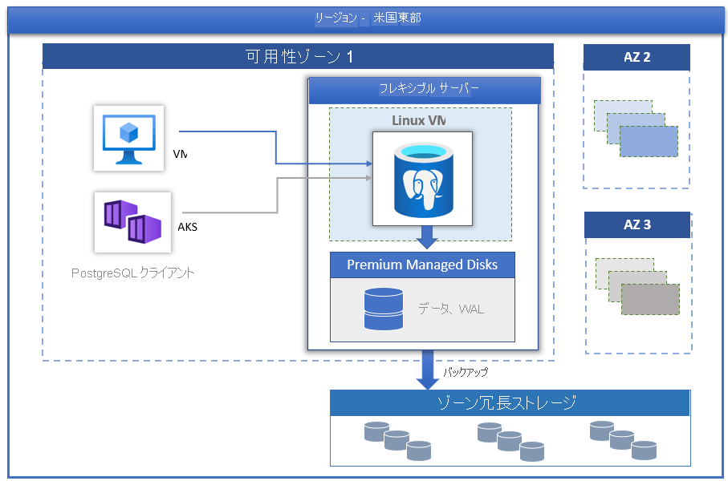

# Azure Database for PostgreSQL - フレキシブル サーバー

PostgreSQL コミュニティ エディションを使用する [Azure Database for PostgreSQL](../overview.md) は、次の 3 つのデプロイ モードで利用できます。

- [単一サーバー](../overview-single-server.md)
- フレキシブル サーバー (プレビュー)
- Hyperscale (Citus)

この記事では、フレキシブル サーバー デプロイ モデルの概要を示し、主要概念について概説します。

> [!IMPORTANT]
> Azure Database for PostgreSQL - フレキシブル サーバーはプレビュー段階です

## 概要

Azure Database for PostgreSQL - フレキシブル サーバーは、データベース管理機能と構成設定のよりきめ細かな制御と柔軟性を提供するように設計されたフル マネージド データベース サービスです。 一般には、ユーザーの要件に基づいて、より高い柔軟性とサーバー構成のカスタマイズがサービスによって提供されます。 フレキシブル サーバー アーキテクチャを使用すると、ユーザーはクライアント層を使用してデータベース エンジンを併置することで待機時間を短縮でき、1 つの可用性ゾーン内および複数の可用性ゾーン内で高可用性を選択できます。 フレキシブル サーバーには、より優れたコスト最適化制御も用意されています、これは、サーバーを停止/開始する機能や、完全なコンピューティング容量を継続的には必要としないワークロードに最適なバースト可能なコンピューティング レベルを備えています。 現在、このサービスでは、PostgreSQL 11 および 12 のコミュニティ バージョンがサポートされています。 このサービスは現時点でプレビュー段階にあり、現在さまざまな [Azure リージョン](https://azure.microsoft.com/global-infrastructure/services/)で利用できます。

フレキシブル サーバーは、以下に適しています

- より優れた制御とカスタマイズが必要なアプリケーション開発。
- ゾーン冗長の高可用性
- マネージド メンテナンス期間
  
## 高可用性

フレキシブル サーバー デプロイ モデルは、単一の可用性ゾーン内および複数の可用性ゾーンにまたがる高可用性をサポートするように設計されています。 このアーキテクチャでは、コンピューティングとストレージが分離されます。 データベース エンジンは Linux 仮想マシン上で実行され、データ ファイルは Azure ストレージ上に配置されます。 ストレージには、データベース ファイルの 3 つのローカル冗長同期コピーが保持されるので、データの持続性が確保されます。

計画済みまたは計画外のフェールオーバー イベント中にサーバーがダウンした場合、サービスでは次の自動化された手順を使用してサーバーの高可用性が維持されます。

1. 新しいコンピューティング Linux VM がプロビジョニングされます。
2. データ ファイルを含むストレージが新しい仮想マシンにマップされます
3. 新しい仮想マシン上で PostgreSQL データベース エンジンがオンラインになります。

次の図は、VM とストレージの障害の遷移を示しています。

 :::image type="content" source="./media/overview/overview-azure-postgres-flex-virtualmachine.png" alt-text="フレキシブル サーバー - VM とストレージの障害":::

ゾーン冗長の高可用性が構成されている場合は、サービスによって同じ Azure リージョン内の可用性ゾーンにホット スタンバイ サーバーがプロビジョニングされ、管理されます。 データ損失をゼロにするために、ソース サーバー上でのデータの変更は、スタンバイ サーバーに同期的にレプリケートされます。 ゾーン冗長の高可用性により、計画済みまたは計画外のフェールオーバー イベントがトリガーされると、スタンバイ サーバーが直ちにオンラインになり、受信トランザクションを処理できるようになります。 これにより、次の図に示すように、複数の可用性ゾーンをサポートする Azure リージョン内の可用性ゾーンの障害からサービスを回復できます。

 :::image type="content" source="./media/business-continuity/concepts-zone-redundant-high-availability-architecture.png" alt-text="ゾーン冗長の高可用性":::

 詳細については、[高可用性のドキュメント](./concepts-high-availability.md)を参照してください。

## マネージド メンテナンス期間によるパッチの自動適用

このサービスでは、基になるハードウェア、OS、およびデータベース エンジンの自動修正が実行されます。 パッチには、セキュリティとソフトウェアの更新プログラムが含まれています。 PostgreSQL エンジンの場合、マイナー バージョンのアップグレードも計画メンテナンス リリースの一部として含まれています。 ユーザーは、パッチ適用のスケジュールをシステム管理として構成することも、カスタム スケジュールを定義することもできます。 メンテナンス スケジュールの実行時にパッチが適用されます。更新を完了するには、パッチの適用プロセスの一環としてサーバーを再起動する必要があります。 カスタム スケジュールを使用すると、ユーザーはパッチ適用のサイクルを予測可能にし、ビジネスへの影響が最小限のメンテナンス期間を選択できます。 一般に、サービスは、継続的インテグレーションとリリースの一環として、毎月のリリース スケジュールに従います。

## 自動バックアップ

フレキシブル サーバー サービスによってサーバー バックアップが自動的に作成され、ゾーン冗長 (ZRS) 上のユーザーがローカルに構成した場所に保存されます。 バックアップを使用すると、サーバーを、バックアップのリテンション期間内の任意の時点に復元できます。 バックアップの既定のリテンション期間は 7 日です。 必要に応じて、リテンション期間を最大 35 日に構成できます。 すべてのバックアップが、AES 256 ビット暗号化を使用して暗号化されます。 詳細は、[バックアップ](./concepts-backup-restore.md)に関するページを参照してください。

## 数秒以内でのパフォーマンスの調整とスケール

フレキシブル サーバー サービスは、次の 3 つのコンピューティング レベルで使用できます:Burstable、General Purpose、Memory Optimized。 Burstable レベルは、完全なコンピューティング容量を継続的には必要としない低コストの開発およびコンカレンシーの低いワークロードに最適です。 General Purpose および Memory Optimized は、高いコンカレンシー、スケール、予測可能なパフォーマンスを必要とする運用ワークロードに適しています。 最初は月数ドルの小規模データベースでアプリケーションを構築し、後から実際のソリューションのニーズに応じて、スケールをシームレスに調整することができます。

## サーバーを停止/開始して TCO を削減する

フレキシブル サーバー サービスを使用すると、サーバーをオンデマンドで停止および開始して、TCO を削減することができます。 コンピューティング レベルの課金は、サーバーが停止すると直ちに停止されます。 これにより、開発、テスト、期限付きの予測可能な運用ワークロードにおいて、大幅なコスト削減を実現できます。 サーバーは、すぐに再起動しない限り 7 日間は停止状態のままになります。

## エンタープライズ グレードのセキュリティ

フレキシブル サーバー サービスでは、保存データのストレージ暗号化に FIPS 140-2 認証済みの暗号モジュールが使用されます。 データ (バックアップを含む) と、クエリの実行中に作成される一時ファイルは暗号化されます。 このサービスでは、Azure ストレージ暗号化に含まれる AES 256 ビット暗号が使用され、キーはシステムによって管理されます (既定)。 サービスでは、既定で適用されるトランスポート層セキュリティ (SSL/TLS) を使用して、動作中のデータが暗号化されます。 サービスでは TLS バージョン 1.2 のみが適用され、サポートされます。

フレキシブル サーバーを使用すると、Azure 仮想ネットワーク (VNet 統合) を使用してサーバーに完全にプライベートでアクセスできます。 Azure 仮想ネットワーク内のサーバーには、プライベート IP アドレスを介してのみアクセスおよび接続できます。 VNet 統合を使用すると、パブリック アクセスが拒否され、パブリック エンドポイントを使用してサーバーに到達することはできません。

## 監視とアラート

フレキシブル サーバー サービスには、組み込みのパフォーマンス監視機能とアラート機能が搭載されています。 すべての Azure メトリックは 1 分間隔で、各メトリックの 30 日間の履歴が保持されます。 メトリックにアラートを構成できます。 このサービスを使用すると、リソースの使用状況を監視するためのホスト サーバー メトリックが公開され、遅いクエリのログを構成できます。 これらのツールを使用すると、ワークロードをすばやく最適化し、最適なパフォーマンスが得られるようにサーバーを構成することができます。

## Azure Azure リージョン

Azure でワークロードを実行する利点の 1 つは、グローバルに展開できることです。 フレキシブル サーバーは、現在、次の Azure リージョンで提供されています。

| Region | 可用性 | ゾーン冗長 HA | 
| --- | --- | --- |
| 西ヨーロッパ | :heavy_check_mark: | :heavy_check_mark: |
| 北ヨーロッパ | :heavy_check_mark: | :heavy_check_mark: |
| 英国南部 | :heavy_check_mark: | :heavy_check_mark: | 
| 米国東部 2 | :heavy_check_mark: | :heavy_check_mark: |
| 米国西部 2 | :heavy_check_mark: | :heavy_check_mark: |
| 米国中部 | :heavy_check_mark: | :heavy_check_mark: | 
| 米国東部 | :heavy_check_mark: | :heavy_check_mark: | 
| Southeast Asia | :heavy_check_mark: | :heavy_check_mark: |
| Japan East | :heavy_check_mark: | :heavy_check_mark: | 
| オーストラリア東部 | :heavy_check_mark: | :heavy_check_mark: | 
| カナダ中部 | :heavy_check_mark: | :heavy_check_mark: | 

フレキシブル サーバー対応リージョンは今後さらに増える予定です。

## 移行

このサービスでは、PostgreSQL のコミュニティ バージョンが実行されます。 これにより、完全なアプリケーションの互換性が確保され、PostgreSQL エンジン上で開発された既存のアプリケーションをフレキシブル サーバーに移行するために必要なリファクタリング コストが最小限に抑えられます。 

- **ダンプと復元** – ユーザーがある程度のダウンタイムを許容できるオフライン移行の場合、pg_dump や pg_restore などのコミュニティ ツールを使用してダンプと復元を行うことで、最も迅速に移行することができます。 詳細については、[ダンプと復元を使用した移行](../howto-migrate-using-dump-and-restore.md)に関するページを参照してください。
- **Azure Database Migration Service** – 最小限のダウンタイムでフレキシブル サーバーへのシームレスかつ簡素化された移行を行うために、Azure Database Migration Service を利用できます。 [ポータル経由の DMS](../../dms/tutorial-postgresql-azure-postgresql-online-portal.md) および [CLI を介した DMS](../../dms/tutorial-postgresql-azure-postgresql-online.md) に関するページを参照してください。 Azure Database for PostgreSQL - 単一サーバーからフレキシブル サーバーに移行することができます。 詳細については、こちらの [DMS に関する記事](../../dms/tutorial-azure-postgresql-to-azure-postgresql-online-portal.md)を参照してください。

## 連絡先
Azure Database for PostgreSQL フレキシブル サーバーについての質問や提案は、Azure Database for PostgreSQL チームにメール ([@Ask Azure DB for PostgreSQL](mailto:AskAzureDBforPostgreSQL@service.microsoft.com)) でお送りください。 このメール アドレスはテクニカル サポートのエイリアスではないのでご注意ください。

さらに、適切な連絡先について次の点を考慮してください。

- Azure サポートに問い合わせる場合は、[Azure portal からチケットを申請します](https://portal.azure.com/?#blade/Microsoft_Azure_Support/HelpAndSupportBlade)。
- アカウントを使用して問題を修正するには、Azure Portal で[サポート要求](https://ms.portal.azure.com/#blade/Microsoft_Azure_Support/HelpAndSupportBlade/newsupportrequest)を提出します。
- フィードバックを提供したり、新しい機能を要求したりするには、[UserVoice](https://feedback.azure.com/forums/597976-azure-database-for-postgresql) でエントリを作成します。
  

## 次のステップ

Azure Database for PostgreSQL フレキシブル サーバー デプロイ モードの概要を確認したので、最初のサーバーを作成する準備ができました。[Azure portal を使用して Azure Database for PostgreSQL - フレキシブル サーバーを作成する](./quickstart-create-server-portal.md)