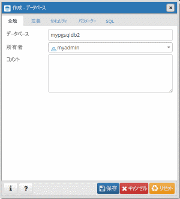

# <a name="quickstart-create-an-azure-database-for-postgresql-using-the-azure-cli"></a>クイック スタート:Azure CLI を使用した Azure Database for PostgreSQL の作成
Azure Database for PostgreSQL は、高可用性 PostgreSQL データベースをクラウドで実行、管理、および拡張することができる、管理されたサービスです。 Azure CLI は、コマンドラインやスクリプトで Azure リソースを作成および管理するために使用します。 このクイック スタートでは、Azure CLI を使用して、Azure Database for PostgreSQL サーバーを [Azure リソース グループ](https://docs.microsoft.com/azure/azure-resource-manager/resource-group-overview)に作成する方法を説明します。

Azure サブスクリプションをお持ちでない場合は、開始する前に[無料](https://azure.microsoft.com/free/)アカウントを作成してください。

[!INCLUDE [cloud-shell-try-it](../../includes/cloud-shell-try-it.md)]

CLI をローカルにインストールして使用する場合、この記事では、Azure CLI バージョン 2.0 以降を実行していることが要件です。 インストールされているバージョンを確認するには、`az --version` コマンドを実行します。 インストールまたはアップグレードする必要がある場合は、[Azure CLI のインストール]( /cli/azure/install-azure-cli)に関するページを参照してください。 

CLI をローカルで実行している場合は、[az login](/cli/azure/authenticate-azure-cli?view=interactive-log-in) コマンドを使用してアカウントにログインする必要があります。 対応するサブスクリプション名のコマンド出力で **id** プロパティを確認します。
```azurecli-interactive
az login
```

複数のサブスクリプションをお持ちの場合は、リソースが課金の対象となる適切なサブスクリプションを選択してください。 [az account set](/cli/azure/account#az_account_set) コマンドを使用して、アカウントの特定のサブスクリプション ID を選択します。 そのサブスクリプションの **az login** 出力の **id** プロパティで、subscription id プレースホルダーを置き換えます。
```azurecli-interactive
az account set --subscription <subscription id>
```

## <a name="create-a-resource-group"></a>リソース グループの作成

[az group create](/cli/azure/group#az_group_create) コマンドで [Azure リソース グループ](../azure-resource-manager/resource-group-overview.md)を作成します。 リソース グループとは、複数の Azure リソースをまとめてデプロイ、管理する際の論理コンテナーです。 一意の名前を指定する必要があります。 次の例では、`myresourcegroup` という名前のリソース グループを `westus` の場所に作成します。
```azurecli-interactive
az group create --name myresourcegroup --location westus
```

## <a name="create-an-azure-database-for-postgresql-server"></a>Azure Database for PostgreSQL サーバーの作成

[az postgres server create](/cli/azure/postgres/server#az_postgres_server_create) コマンドを使用して、[Azure Database for PostgreSQL サーバー](overview.md)を作成します。 1 つのサーバーに複数のデータベースを含めることができます。


**設定** | **値の例** | **説明**
---|---|---
name | mydemoserver | Azure Database for PostgreSQL サーバーを識別する一意の名前を選択します。 サーバー名に含めることができるのは、英小文字、数字、およびハイフン (-) のみであり、 3 ～ 63 文字にする必要があります。
resource-group | myresourcegroup | Azure リソース グループの名前を指定します。
sku-name | GP_Gen4_2 | SKU の名前。 省略表現の {価格レベル}_{コンピューティング世代}_{仮想コア} という規則に従います。 sku-name パラメーターの詳細については、この表の下方を参照してください。
backup-retention | 7 | バックアップを保持する必要のある時間。 単位は日数です。 範囲は 7 ～ 35 です。 
geo-redundant-backup | Disabled | このサーバーに対して geo 冗長バックアップを有効にする必要があるかどうかどうか。 使用できる値は以下の通りです。Enabled、Disabled
location | westus | サーバーの Azure の場所。
ssl-enforcement | Enabled | このサーバーに対して ssl を有効にする必要があるかどうかどうか。 使用できる値は以下の通りです。Enabled、Disabled
storage-size | 51200 | サーバーのストレージ容量 (単位はメガバイト)。 有効な storage-size は最小 5,120 MB で、1,024 MB ずつ増加します。 ストレージ サイズの制限の詳細については、[価格レベル](./concepts-pricing-tiers.md)についてのドキュメントを参照してください。 
version | 9.6 | PostgreSQL のメジャー バージョン。
admin-user | myadmin | 管理者ログインのユーザー名。 これを **azure_superuser**、**admin**、**administrator**、**root**、**guest**、**public** にすることはできません。
admin-password | *セキュリティで保護されたパスワード* | 管理者ユーザーのパスワード。 8 ～ 128 文字にする必要があります。 パスワードには、英大文字、英小文字、数字、英数字以外の文字のうち、3 つのカテゴリの文字が含まれている必要があります。


sku-name パラメーターの値は、次の例のように、{価格レベル}\_{コンピューティング世代}\_{仮想コア数} という規約に従います。
+ `--sku-name B_Gen4_4` は、"Basic、Gen 4、および 4 個の仮想コア" にマップされます。
+ `--sku-name GP_Gen5_32` は、"汎用、Gen 5、および 32 個の仮想コア" にマップされます。
+ `--sku-name MO_Gen5_2` は、"メモリ最適化、Gen 5、および 2 個の仮想コア" にマップされます。

リージョンごとおよびレベルごとに有効な値を理解するには、[価格レベル](./concepts-pricing-tiers.md)のドキュメントを参照してください。

次の例では、サーバー管理者ログイン `myadmin` を使用して、リソース グループ `myresourcegroup` の `mydemoserver` という名前の PostgreSQL 9.6 サーバーを米国西部に作成します。 これは、2 つの**仮想コア**を備えた **Gen 4** **汎用**サーバーです。 `<server_admin_password>` は独自の値に置き換えます。
```azurecli-interactive
az postgres server create --resource-group myresourcegroup --name mydemoserver  --location westus --admin-user myadmin --admin-password <server_admin_password> --sku-name GP_Gen4_2 --version 9.6
```


> [!IMPORTANT]
> ここで指定するサーバー管理者のログイン名とパスワードは、このクイックスタートの後半でサーバーにログインするために必要です。 後で使用するために、この情報を覚えておくか、記録しておきます。


## <a name="configure-a-server-level-firewall-rule"></a>サーバーレベルのファイアウォール規則の構成

[az postgres server firewall-rule create](/cli/azure/postgres/server/firewall-rule#az_postgres_server_firewall_rule_create) コマンドで、Azure PostgreSQL サーバーレベルのファイアウォール規則を作成します。 サーバーレベルのファイアウォール規則により、[psql](https://www.postgresql.org/docs/9.2/static/app-psql.html) や [PgAdmin](https://www.pgadmin.org/) などの外部アプリケーションが、Azure PostgreSQL サービスのファイアウォールを経由してサーバーに接続できるようになります。 

ネットワークからの接続が可能な IP 範囲を指定するファイアウォール規則を設定することができます。 次の例では、[az postgres server firewall-rule create](/cli/azure/postgres/server/firewall-rule#az_postgres_server_firewall_rule_create) を使用して、単一の IP アドレスを指定するファイアウォール規則 `AllowMyIP` を作成します。
```azurecli-interactive
az postgres server firewall-rule create --resource-group myresourcegroup --server mydemoserver --name AllowMyIP --start-ip-address 192.168.0.1 --end-ip-address 192.168.0.1
```

> [!NOTE]
> Azure PostgreSQL サーバーはポート 5432 を介して通信します。 企業ネットワーク内から接続しようとしても、ポート 5432 での送信トラフィックがネットワークのファイアウォールで禁止されている場合があります。 Azure PostgreSQL サーバーに接続するには、会社の IT 部門にポート 5432 を開放してもらう必要があります。

## <a name="get-the-connection-information"></a>接続情報の取得

サーバーに接続するには、ホスト情報とアクセス資格情報を提供する必要があります。
```azurecli-interactive
az postgres server show --resource-group myresourcegroup --name mydemoserver
```

結果は JSON 形式です。 **administratorLogin** と **fullyQualifiedDomainName** の値を書き留めておきます。
```json
{
  "administratorLogin": "myadmin",
  "earliestRestoreDate": null,
  "fullyQualifiedDomainName": "mydemoserver.postgres.database.azure.com",
  "id": "/subscriptions/00000000-0000-0000-0000-000000000000/resourceGroups/myresourcegroup/providers/Microsoft.DBforPostgreSQL/servers/mydemoserver",
  "location": "westus",
  "name": "mydemoserver",
  "resourceGroup": "myresourcegroup",
  "sku": {
    "capacity": 2,
    "family": "Gen4",
    "name": "GP_Gen4_2",
    "size": null,
    "tier": "GeneralPurpose"
  },
  "sslEnforcement": "Enabled",
  "storageProfile": {
    "backupRetentionDays": 7,
    "geoRedundantBackup": "Disabled",
    "storageMb": 5120
  },
  "tags": null,
  "type": "Microsoft.DBforPostgreSQL/servers",
  "userVisibleState": "Ready",
  "version": "9.6"
}
```

## <a name="connect-to-postgresql-database-using-psql"></a>psql を使用した PostgreSQL データベースへの接続

クライアント コンピューターに PostgreSQL がインストールされている場合は、[psql](https://www.postgresql.org/docs/current/static/app-psql.html) のローカル インスタンスを使用して Azure PostgreSQL サーバーに接続できます。 ここでは psql コマンド ライン ユーティリティを使用して、Azure PostgreSQL サーバーに接続しましょう。

1. 次の psql コマンドを実行して Azure Database for PostgreSQL に接続します。
```bash
psql --host=<servername> --port=<port> --username=<user@servername> --dbname=<dbname>
```

  たとえば次のコマンドは、アクセス資格情報を使用して、PostgreSQL サーバー **mydemoserver.postgres.database.azure.com** にある既定のデータベース **postgres** に接続します。 パスワードの入力を求められたら、選択した `<server_admin_password>` を入力します。
  
  ```bash
psql --host=mydemoserver.postgres.database.azure.com --port=5432 --username=myadmin@mydemoserver --dbname=postgres
```

2.  サーバーに接続したら、プロンプトで空のデータベースを作成します。
```sql
CREATE DATABASE mypgsqldb;
```

3.  プロンプトで次のコマンドを実行し、新しく作成したデータベース **mypgsqldb** に接続を切り替えます。
```sql
\c mypgsqldb
```

## <a name="connect-to-the-postgresql-server-using-pgadmin"></a>pgAdmin を使用して PostgreSQL サーバーに接続する

pgAdmin は PostgreSQL で使用されるオープンソース ツールです。 [pgAdmin の Web サイト](https://www.pgadmin.org/)からインストールできます。 使用する pgAdmin のバージョンは、このクイック スタートで使用されているものと異なる可能性があります。 追加のガイダンスが必要な場合は、pgAdmin のドキュメントをご覧ください。

1. クライアント コンピューターで pgAdmin アプリケーションを開きます。

2. ツール バーから **[オブジェクト]** に移動し、**[作成]** をポイントして、**[サーバー]** を選択します。

3. **[作成 - サーバー]** ダイアログ ボックスの **[全般]** タブに、サーバーの一意のフレンドリ名 (**mydemoserver** など) を入力します。

   ![[General]\(全般\) タブ](./media/quickstart-create-server-database-azure-cli/9-pgadmin-create-server.png)

4. **[作成 - サーバー]** ダイアログ ボックスの **[接続]** タブで、設定テーブルに入力します。

   ![[接続] タブ](./media/quickstart-create-server-database-azure-cli/10-pgadmin-create-server.png)

    pgAdmin パラメーター |値|説明
    ---|---|---
    ホスト名/アドレス | サーバー名 | 前の手順で Azure Database for PostgreSQL サーバーを作成したときに使用したサーバー名の値。 例に示したサーバーは、**mydemoserver.postgres.database.azure.com** です。 例で示されているように、完全修飾ドメイン名 (**\*.postgres.database.azure.com**) を使用します。 サーバー名を覚えていない場合は、前のセクションの手順に従って接続情報を取得してください。 
    ポート | 5432 | Azure Database for PostgreSQL サーバーに接続するときに使用するポート。 
    メンテナンス データベース | *postgres* | システムによって生成される既定のデータベース名。
    ユーザー名 | サーバー管理者ログイン名 | 前の手順で Azure Database for PostgreSQL サーバーを作成したときに指定したサーバー管理者ログイン ユーザー名。 ユーザー名を覚えていない場合は、前のセクションの手順に従って接続情報を取得してください。 形式は *username@servername* です。
    パスワード | 管理者パスワード | このクイック スタートでサーバーを作成したときに選択したパスワードです。
    Role | 空白 | この時点でロール名を指定する必要はありません。 このフィールドは空白にしてください。
    SSL モード | "*必須*" | pgAdmin の [SSL] タブで、SSL モードを設定できます。既定では、すべての Azure Database for PostgreSQL サーバーは SSL の強制がオンの状態で作成されます。 SSL の強制をオフにする方法については、[SSL の強制](./concepts-ssl-connection-security.md)に関する記事をご覧ください。
    
5. **[保存]** を選択します。

6. 左側の **[ブラウザー]** ウィンドウで **[サーバー]** ノードを展開します。 **mydemoserver** など、ご利用のサーバーを選択します。 クリックして接続します。

7. サーバー ノードを展開し、その下の **[Databases]\(データベース\)** を展開します。 一覧には既存の *postgres* データベースと、作成した他のデータベースすべてを含める必要があります。 Azure Database for PostgreSQL では、サーバーごとに複数のデータベースを作成できます。

8. **[データベース]** を右クリックし、**[作成]** メニューを選択して **[データベース]** を選択します。

9. **[データベース]** フィールドに、任意のデータベース名 (**mypgsqldb2** など) を入力します。

10. データベースの**所有者**をリスト ボックスから選択します。 サーバー管理者ログイン名 (例に示した **my admin** など) を選択します。

   

11. **[保存]** を選択して、新しい空のデータベースを作成します。

12. **[ブラウザー]** ウィンドウで、該当するサーバー名のデータベースの一覧で、作成したデータベースを確認できます。


## <a name="clean-up-resources"></a>リソースのクリーンアップ

[Azure リソース グループ](../azure-resource-manager/resource-group-overview.md)を削除して、クイックスタートで作成したすべてのリソースをクリーンアップします。

> [!TIP]
> このコレクションの他のクイックスタートは、このクイックスタートに基づいています。 引き続きクイックスタートの作業を行う場合は、このクイックスタートで作成したリソースをクリーンアップしないでください。 これ以上作業を行わない場合は、以下の手順に従い、このクイック スタートで作成したすべてのリソースを Azure CLI で削除してください。

```azurecli-interactive
az group delete --name myresourcegroup
```

新しく作成した 1 つのサーバーを削除するだけの場合は、[az postgres server delete](/cli/azure/postgres/server#az_postgres_server_delete) コマンドを実行してください。
```azurecli-interactive
az postgres server delete --resource-group myresourcegroup --name mydemoserver
```

## <a name="next-steps"></a>次の手順
> [!div class="nextstepaction"]
> [エクスポートとインポートを使用したデータベースの移行](./howto-migrate-using-export-and-import.md)

