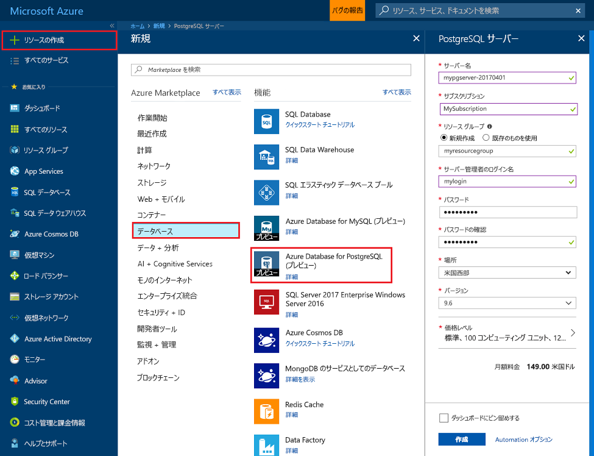
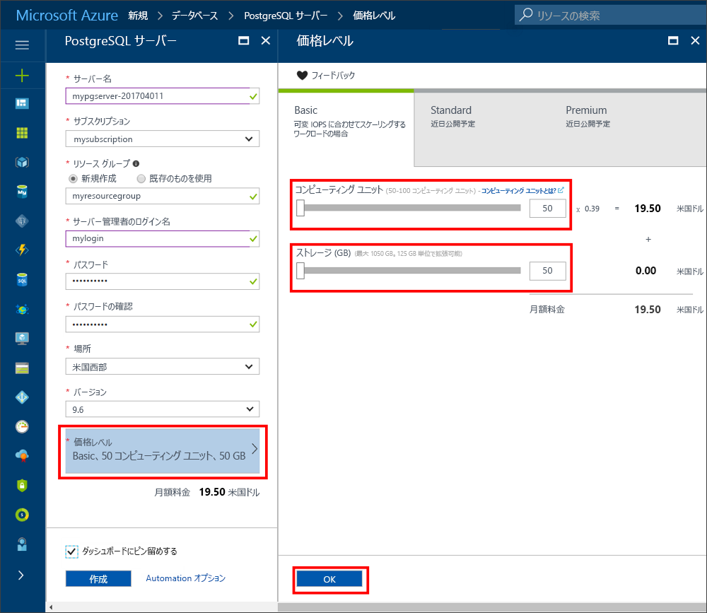
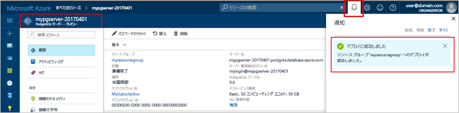
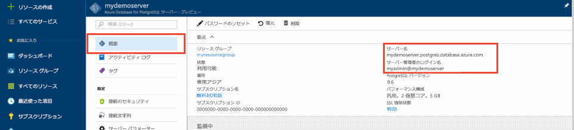
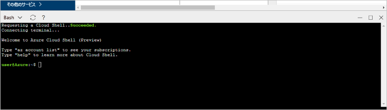
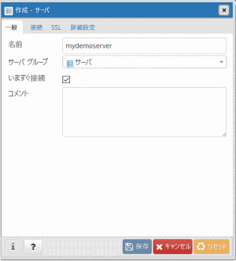
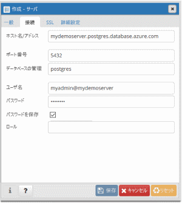

# <a name="create-an-azure-database-for-postgresql-in-the-azure-portal"></a>Azure Portal で Azure Database for PostgreSQL を作成する

Azure Database for PostgreSQL は、高可用性 PostgreSQL データベースをクラウドで実行、管理、および拡張することができる、管理されたサービスです。 このクイック スタートでは、Azure Portal を使用して Azure Database for PostgreSQL サーバーを作成する方法を説明します。

Azure サブスクリプションをお持ちでない場合は、開始する前に[無料](https://azure.microsoft.com/free/)アカウントを作成してください。

## <a name="log-in-to-the-azure-portal"></a>Azure Portal にログインする

[Azure Portal](https://portal.azure.com) にログインします。

## <a name="create-an-azure-database-for-postgresql"></a>Azure Database for PostgreSQL の作成

Azure Database for PostgreSQL サーバーは、定義済みの一連の[コンピューティング リソースとストレージ リソース](./concepts-compute-unit-and-storage.md)を使って作成されます。 サーバーは、[Azure リソース グループ](../azure-resource-manager/resource-group-overview.md)内に作成されます。

Azure Database for PostgreSQL サーバーを作成するには、次の手順に従います。
1.  Azure Portal の左上隅にある **[新規]** ボタン (+) をクリックします。
2.  **[新規]** ページで **[データベース]** を選択し、**[データベース]** ページで **[Azure Database for PostgreSQL]** を選択します。
 

3.  前の画像で示されているように、新規サーバーの詳細フォームに次の情報を入力します。

    設定|推奨値|Description
    ---|---|---
    サーバー名 |*mypgserver-20170401*|Azure Database for PostgreSQL サーバーを識別する一意の名前を選択します。 ドメイン名 *postgres.database.azure.com* が、接続先のアプリケーションに対して指定するサーバー名に追加されます。 サーバー名に含めることができるのは、英小文字、数字、およびハイフン (-) のみであり、3 ～ 63 文字にする必要があります。
    サブスクリプション|*該当するサブスクリプション*|サーバーに使用する Azure サブスクリプション。 複数のサブスクリプションをお持ちの場合は、リソースが課金の対象となっている適切なサブスクリプションを選択してください。
    リソース グループ|*myresourcegroup*| 新しいリソース グループ名を作成するか、サブスクリプションの既存のリソース グループ名を選択することができます。
    サーバー管理者のログイン |*mylogin*| サーバーに接続するときに使用される独自のログイン アカウントを作成します。 管理者のログイン名は、"azure_superuser"、"azure_pg_admin"、"admin"、"administrator"、"root"、"guest"、または "public" にすることができず、"pg_" で始めることができません。
    パスワード |*<任意>* | サーバー管理者アカウントの新しいパスワードを作成します。 8 ～ 128 文字である必要があります。 パスワードには、英大文字、英小文字、数字 (0 ～ 9)、英数字以外の文字 (!、$、#、% など) のうち、3 つのカテゴリの文字が含まれている必要があります。
    場所|*ユーザーに最も近いリージョン*| ユーザーに最も近い場所を選択します。
    PostgreSQL のバージョン|*最新バージョンを選択します*| 特別な要件がない限り、最新バージョンを選択します。
    価格レベル | **Basic**、**50 コンピューティング ユニット**、**50 GB** | **[価格レベル]** をクリックして、新しいデータベースのサービス レベルとパフォーマンス レベルを指定します。 上部のタブで Basic レベルを選択します。 [コンピューティング ユニット] スライダーの左の端をクリックして、このクイック スタートで使用可能な最小量に値を調整します。 **[OK]** をクリックして、価格レベルの選択を保存します。 次のスクリーンショットをご覧ください。
    | [ダッシュボードにピン留めする] | ○ | **[ダッシュボードにピン留めする]** オプションをオンにすると、Azure Portal のフロント ダッシュボード ページでサーバーを追跡しやすくなります。

  > [!IMPORTANT]
  > ここで指定するサーバー管理者ログインとパスワードは、このクイック スタートの後の方でサーバーとそのデータベースにログインするために必要です。 後で使用するために、この情報を覚えておくか、記録しておきます。

    

4.  **[作成]** をクリックしてサーバーをプロビジョニングします。 プロビジョニングには数分から最大で 20 分かかります。

5.  ツール バーの **[通知]** をクリックして、デプロイ プロセスを監視します。
 
   
  既定では、**postgres** データベースがサーバーに作成されます。 [postgres](https://www.postgresql.org/docs/9.6/static/app-initdb.html) は既定のデータベースで、ユーザー、ユーティリティ、およびサード パーティ製のアプリケーションが使用するためのものです。 

## <a name="configure-a-server-level-firewall-rule"></a>サーバーレベルのファイアウォール規則の構成

Azure Database for PostgreSQL サービスは、サーバーレベルでファイアウォールを作成します。 このフィアイアウォールにより、外部のアプリケーションやツールから、サーバーまたはサーバー上のすべてのデータベースへの接続が禁止されます。接続を許可するためには、特定の IP アドレスに対して、ファイアウォールを開放するファイアウォール規則を作成する必要があります。 

1.  デプロイが完了した後、サーバーを探します。 必要に応じて、検索することができます。 たとえば、左側のメニューの **[すべてのリソース]** をクリックし、サーバー名 (例の mypgserver-20170401 など) を入力して、新しく作成されたサーバーを検索します。 検索結果に一覧表示されたサーバー名をクリックします。 サーバーの [概要] ページが開き、さらに多くの構成オプションが表示されます。
 
    

2.  サーバーのページで、**[接続のセキュリティ]** を選択します。 
    

3.  **[ファイアウォール規則]** という見出しの下で、**[規則名]** 列の空白のテキスト ボックス内をクリックし、ファイアウォール規則の作成を開始します。 

    このクイック スタートでは、各列のテキスト ボックスに以下の値を入力することで、サーバーへのすべての IP アドレスを許可します。

    規則の名前 | 開始 IP | 終了 IP 
    ---|---|---
    AllowAllIps |  0.0.0.0 | 255.255.255.255

4. [接続のセキュリティ] ページの上部のツール バーで、**[保存]** をクリックします。 次に、**[X]** をクリックして、[接続のセキュリティ] ページを閉じます。

    > [!NOTE]
    > Azure PostgreSQL サーバーはポート 5432 を介して通信します。 企業ネットワーク内から接続しようとしても、ポート 5432 での送信トラフィックがネットワークのファイアウォールで禁止されている場合があります。 その場合、会社の IT 部門によってポート 5432 が開放されない限り、Azure SQL Database サーバーに接続することはできません。
  >

## <a name="get-the-connection-information"></a>接続情報の取得

Azure Database for PostgreSQL サーバーを作成したときに、**postgres** という名前の既定のデータベースも作成されています。 データベース サーバーに接続するには、サーバーの完全な名前と管理者ログイン資格情報を思い出す必要があります。 これらの値は、クイック スタートの記事の前の方でメモしてあると思われます。 メモしていなかった場合は、Azure Portal で、サーバーの [概要] ページからサーバー名とログイン情報を簡単に見つけることができます。

1. サーバーの **[概要]** ページを開きます。 **[サーバー名]** と **[サーバー管理者ログイン名]** の値を書き留めておきます。
    各フィールドの上にカーソルを合わせると、テキストの右側にコピー アイコンが表示されます。 必要に応じてコピー アイコンをクリックして値をコピーします。

 

## <a name="connect-to-postgresql-database-using-psql-in-cloud-shell"></a>Cloud Shell で psql を使用して PostgreSQL データベースに接続する

Azure Database for PostgreSQL サーバーに接続するために使用できる、多くのアプリケーションがあります。 まず、サーバーに接続する方法を示すために、psql コマンド ライン ユーティリティを使用してみましょう。  追加のソフトウェアをインストールしなくても、ここで説明するように、Web ブラウザーと Azure Cloud Shell を使用できます。 自分のマシンに psql ユーティリティがローカルにインストールしてある場合は、そこからも接続できます。

1. 上部のナビゲーション ウィンドウで、ターミナルのアイコンをクリックして Azure Cloud Shell を起動します。

   

2. Azure Cloud Shell がブラウザーで開き、bash シェル コマンドを入力できます。

   

3. Cloud Shell プロンプトの緑のプロンプトで psql コマンド ラインを入力して、Azure Database for PostgreSQL サーバーのデータベースに接続します。

    [psql](https://www.postgresql.org/docs/9.6/static/app-psql.html) ユーティリティで Azure Database for PostgreSQL サーバーに接続するには、次の形式を使用します。
    ```bash
    psql --host=<yourserver> --port=<port> --username=<server admin login> --dbname=<database name>
    ```

    たとえば、次のコマンドは、サンプル サーバーに接続します。

    ```bash
    psql --host=mypgserver-20170401.postgres.database.azure.com --port=5432 --username=mylogin@mypgserver-20170401 --dbname=postgres
    ```

    psql パラメーター |推奨値|Description
    ---|---|---
    --host | *サーバー名* | 前に Azure Database for PostgreSQL を作成したときに使用したサーバー名の値を指定します。 示されているサンプル サーバーは、mypgserver-20170401.postgres.database.azure.com です。 例で示されているように、完全修飾ドメイン名 (\*.postgres.database.azure.com) を使用します。 サーバー名を覚えていない場合は、前のセクションの手順に従って接続情報を取得します。 
    --port | **5432** | Azure Database for PostgreSQL に接続する場合は、常にポート 5432 を使用します。 
    --username | *サーバー管理者ログイン名* |前に Azure Database for PostgreSQL を作成したときに指定したサーバー管理者ログイン ユーザー名を入力します。 ユーザー名を覚えていない場合は、前のセクションの手順に従って接続情報を取得します。  形式は *username@servername* です。
    --dbname | **postgres** | 初回の接続には、システムによって生成される既定のデータベース名である *postgres* を使用します。 後で独自のデータベースを作成します。

    独自のパラメーター値で psql コマンドを実行した後、サーバー管理者パスワードの入力を求めるメッセージが表示されます。 これは、サーバーの作成時に指定したのと同じパスワードです。 

    psql パラメーター |推奨値|Description
    ---|---|---
    パスワード | *管理者パスワード* | 入力したパスワードの文字は bash プロンプトには表示されないことに注意してください。 認証して接続するには、すべての文字を入力してから Enter キーを押します。

4.  サーバーに接続したら、プロンプトで次のコマンドを入力して、空のデータベースを作成します。
    ```bash
    CREATE DATABASE mypgsqldb;
    ```

5.  プロンプトで次のコマンドを実行し、新しく作成したデータベース **mypgsqldb** に接続を切り替えます。
    ```bash
    \c mypgsqldb
    ```

6.  psql を終了するには、「\q」と入力し、Enter キーを押します。 Azure Cloud Shell を閉じることができます。

これで、Azure Database for PostgreSQL に接続し、空のユーザー データベースを作成することができました。 他の一般的なツールである pgAdmin を使用して接続するには、次のセクションに進みます。

## <a name="connect-to-postgresql-database-using-pgadmin"></a>pgAdmin を使用した PostgreSQL データベースへの接続

GUI ツール _pgAdmin_ を使用して Azure PostgreSQL に接続する手順は次のとおりです。
1.  クライアント コンピューターで _pgAdmin_ アプリケーションを起動します。 _pgAdmin_ は http://www.pgadmin.org/ からインストールできます。
2.  **[Quick Links (クイック リンク)]** メニューの **[Add New Server (新しいサーバーの追加)]** を選択します。
3.  **[Create - Server (作成 - サーバー)]** ダイアログ ボックスの **[General (全般)]** タブに、サーバーの一意のフレンドリ名を入力します (**Azure PostgreSQL Server** など)。

4.  **[Create - Server (作成 - サーバー)]** ダイアログ ボックスの **[Connection (接続)]** タブで、指定された設定を使用し、**[Save (保存)]** をクリックします。
   
    - **Host Name/Address (ホスト名/アドレス)**: mypgserver-20170401.postgres.database.azure.com 
        - 完全修飾サーバー名です。
    - **Port (ポート):** 5432
        - このデータベース サーバーで使用されるポート番号は 5432 です。
    - **Maintenance Database (メンテナンス データベース):** postgres 
        - システムによって生成される既定のデータベース名です。
    - **User Name (ユーザー名):** mylogin@mypgserver-20170401 
        - このクイック スタートの前の手順で取得したサーバー管理者ログイン (user@mypgserver) です。
    - **Password (パスワード)**: このクイック スタートでサーバーを作成するときに選択したパスワードです。
    - **SSL Mode (SSL モード):** 必須
        - 既定では、すべての Azure PostgreSQL サーバーは SSL 適用が有効化された状態で作成されます。 SSL 適用を無効にするには、[SSL の適用](./concepts-ssl-connection-security.md)に関する記事を参照してください。
5.  **[Save (保存)]** をクリックします。
6.  左側の [Browser (ブラウザー)] ウィンドウで **[Servers Groups (サーバー グループ)]** を展開します。 サーバー **Azure PostgreSQL Server** を選択します。
7.  接続した**サーバー**を選択してから、その下の **[Databases (データベース)]** を選択します。 
8.  **[Databases (データベース)]** を右クリックしてデータベースを作成します。
9.  データベース名 **mypgsqldb** と、その所有者としてサーバー管理者ログイン **mylogin** を選択します。
10. **[Save (保存)]** をクリックして、空のデータベースを作成します。
11. **[Browser (ブラウザー)]** で **[Servers (サーバー)]**を展開します。 作成したサーバーを展開すると、その下にデータベース **mypgsqldb** が表示されます。
 


## <a name="clean-up-resources"></a>リソースのクリーンアップ
[Azure リソース グループ](../azure-resource-manager/resource-group-overview.md)を削除して、クイックスタートで作成したすべてのリソースをクリーンアップします。

> [!TIP]
> このコレクションの他のクイック スタートは、このクイック スタートに基づいています。 引き続きクイック スタートの作業を行う場合は、このクイック スタートで作成したリソースをクリーンアップしないでください。 これ以上作業を行わない場合は、次の手順に従って、このクイック スタートで作成したすべてのリソースを Azure Portal で削除してください。

1.  Azure Portal の左側のメニューから、**[リソース グループ]**、**[myResourceGroup]** の順にクリックします。
2.  リソース グループのページで **[削除]** をクリックし、テキスト ボックスに「**myResourceGroup**」と入力してから [削除] をクリックします。

新しく作成したサーバーのみを削除する場合は次のようにします。
1.  Azure Portal の左側のメニューにある PostgreSQL サーバーをクリックし、作成したばかりのサーバーを検索します。
2.  [概要] ページで、上部のウィンドウの [削除] ボタンをクリックします。
3.  削除するサーバーの名前を確認し、影響を受けるデータベースをその下に表示します。 テキスト ボックスに「**mypgserver-20170401**」と入力し、[削除] をクリックします。

## <a name="next-steps"></a>次のステップ
> [!div class="nextstepaction"]
> [エクスポートとインポートを使用したデータベースの移行](./howto-migrate-using-export-and-import.md)

