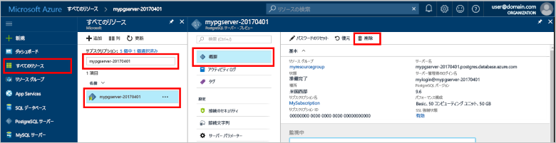

# <a name="quickstart-create-an-azure-database-for-postgresql-server-by-using-the-azure-portal"></a>クイック スタート:Azure portal を使用して Azure Database for PostgreSQL サーバーを作成する

Azure Database for PostgreSQL は、高可用性の PostgreSQL データベースをクラウドで実行、管理、スケールできるマネージド サービスです。 このクイックスタートでは、Azure portal を使用して約 5 分で単一の Azure Database for PostgreSQL サーバーを作成する方法について説明します。

Azure サブスクリプションをお持ちでない場合は、開始する前に[無料の Azure アカウント](https://azure.microsoft.com/free/)を作成してください。

## <a name="sign-in-to-the-azure-portal"></a>Azure portal にサインインする
Web ブラウザーを開き、[ポータル](https://portal.azure.com/)に移動します。 資格情報を入力してポータルにサインインします。 既定のビューはサービス ダッシュボードです。

## <a name="create-an-azure-database-for-postgresql-server"></a>Azure Database for PostgreSQL サーバーの作成

Azure Database for PostgreSQL サーバーは、構成済みの一連の[コンピューティング リソースとストレージ リソース](./concepts-pricing-tiers.md)を使って作成されます。 サーバーは、[Azure リソース グループ](../azure-resource-manager/management/overview.md)内に作成されます。

Azure Database for PostgreSQL サーバーを作成するには:

1. ポータルの左上隅にある **[リソースの作成]** を選択します。

2. **[データベース]**  >  **[Azure Database for PostgreSQL]** の順に選択します。

   > [!div class="mx-imgBorder"]
   > ![メニューにある [Azure Database for PostgreSQL] を示すスクリーンショット。](./media/quickstart-create-database-portal/1-create-database.png)

3. **[単一サーバー]** デプロイ オプションを選択します。

   > [!div class="mx-imgBorder"]
   > 

4. **[基本情報]** フォームに次の情報を入力します。

   > [!div class="mx-imgBorder"]
   > ![単一サーバーを作成する場合の [基本情報] タブを示すスクリーンショット。](./media/quickstart-create-database-portal/create-basics.png)

   設定|推奨値|説明
   ---|---|---
   サブスクリプション|お使いのサブスクリプション名|サーバーに使用する Azure サブスクリプション。 複数のサブスクリプションをお持ちの場合は、リソースの課金対象となるサブスクリプションを選択してください。
   Resource group|*myresourcegroup*| 新しいリソース グループ名、またはサブスクリプションの既存のリソース グループ名。
   サーバー名 |*mydemoserver*|Azure Database for PostgreSQL サーバーを識別する一意の名前。 指定したサーバー名にドメイン名 *postgres.database.azure.com* が追加されます。 サーバー名に含めることができるのは、英小文字、数字、ハイフン (-) のみです。 3 から 63 文字にする必要があります。
   データ ソース | **なし** | **[なし]** を選択し、最初から新しいサーバーを作成します (既存の Azure Database for PostgreSQL サーバーの geo バックアップからサーバーを作成している場合は、 **[Backup]\(バックアップ\)** を選択します)。
   管理者ユーザー名 |*myadmin*| サーバーに接続するときに使用する独自のログイン アカウント。 管理者のログイン名に **azure_superuser**、**azure_pg_admin**、**admin**、**administrator**、**root**、**guest**、または **public** は使用できません。 **pg_** で始めることはできません。
   Password |お使いのパスワード| サーバー管理者アカウントの新しいパスワード。 これには、次のうち 3 つのカテゴリから 8 から 128 文字を含める必要があります: 英大文字、英小文字、数字 (0 から 9)、英数字以外の文字 (!、$、#、% など)。
   場所|ユーザーに最も近いリージョン| ユーザーに最も近い場所。
   Version|最新のメジャー バージョン| 他の特定の要件がない場合は、最新の PostgreSQL メジャー バージョン。
   コンピューティングとストレージ | **汎用**、**Gen 5**、**2 仮想コア**、**5 GB**、**7 日**、**地理冗長** | 新しいサーバーのコンピューティング、ストレージ、およびバックアップ構成。 **[サーバーの構成]** を選択します。 次に、適切な価格レベルを選択します。 詳細については、[価格の詳細](https://azure.microsoft.com/pricing/details/postgresql/server/)に関するページをご覧ください。 サーバー バックアップを geo 冗長ストレージで有効にするには、 **[バックアップ冗長オプション]** から **[地理冗長]** を選択します。 **[OK]** を選択します。

   > [!NOTE]
   > 低負荷なコンピューティングと I/O がワークロードに適している場合は、Basic 価格レベルの使用を検討してください。 Basic 価格レベルで作成されたサーバーは、後から General Purpose またはメモリ最適化にスケーリングできないことに注意してください。 
   
5. **[確認および作成]** を選択して、選択内容を確認します。 **[作成]** を選択して、サーバーをプロビジョニングします。 この操作には数分かかる場合があります。

6. ツール バーの **[通知]** アイコン (ベル) を選択して、デプロイ プロセスを監視します。 デプロイが完了したら、 **[リソースに移動]** を選択してサーバーの **[概要]** ページを開きます。

空のデータベース **postgres** が作成されます。 また、マネージド サービス プロセスをユーザーの操作から分離するために使用される **azure_maintenance** データベースもあります。 **azure_maintenance** データベースにアクセスすることはできません。

## <a name="configure-a-server-level-firewall-rule"></a>サーバーレベルのファイアウォール規則の構成
既定では、作成したサーバーにはパブリックにアクセスできません。 自分の IP アドレスに対するアクセス許可を付与する必要があります。 Azure portal で対象のサーバー リソースに移動し、そのサーバー リソースの左側のメニューから **[接続のセキュリティ]** を選択します。 対象のリソースを見つける方法がわからない場合は、「[リソースを開く](https://docs.microsoft.com/azure/azure-resource-manager/management/manage-resources-portal#open-resources)」を参照してください。

> [!div class="mx-imgBorder"]
> 
  
**[現在のクライアント IP アドレスを追加する]** を選択し、 **[保存]** を選択します。 さらに IP アドレスを追加するか IP 範囲を指定することで、それらの IP アドレスから対象のサーバーに接続できるようになります。 詳細については、[Azure Database for PostgreSQL のファイアウォール規則](./concepts-firewall-rules.md)に関するページを参照してください。
   
> [!NOTE]
> 接続の問題を回避するには、ポート 5432 経由の送信トラフィックがネットワークで許可されているかどうかを確認します。 Azure Database for PostgreSQL では、このポートを使用します。  

## <a name="connect-to-azure-database-for-postgresql-server-by-using-psql"></a>psql を使用して Azure Database for PostgreSQL サーバーに接続する

一般的な PostgreSQL クライアントである [psql](http://postgresguide.com/utilities/psql.html) または [pgAdmin](https://www.pgadmin.org/docs/pgadmin4/latest/connecting.html) を使用できます。 このクイックスタートでは、Azure portal 内の [Azure Cloud Shell](https://docs.microsoft.com/azure/cloud-shell/overview) で psql を使用して接続します。

1. 対象のサーバーの **[概要]** セクションから、新しく作成されたサーバーのサーバー名、サーバー管理者のログイン名、パスワード、およびサブスクリプション ID をメモします。

2. 左上のアイコンを選択して、ポータルで Azure Cloud Shell を開きます。

   > [!NOTE]
   > 初めて Cloud Shell を開いた場合は、リソース グループとストレージ アカウントを作成するように求めるメッセージが表示されます。 これは 1 回限りの作業であり、それ以降はすべてのセッションで自動的に接続されます。 

   > [!div class="mx-imgBorder"]
   > 

3. Azure Cloud Shell ターミナルで次のコマンドを実行します。 値は実際のサーバー名と管理者ユーザーのログイン名に置き換えてください。 `<admin-username>@<servername>` 形式の管理者ユーザーで、空のデータベース **postgres** を使用します。

   ```azurecli-interactive
   psql --host=mydemoserver.postgres.database.azure.com --port=5432 --username=myadmin@mydemoserver --dbname=postgres
   ```
 
   Cloud Shell ターミナルでのエクスペリエンスは次のようになります。
   
   ```bash
    Requesting a Cloud Shell.Succeeded.
    Connecting terminal...

    Welcome to Azure Cloud Shell
 
    Type "az" to use Azure CLI
    Type "help" to learn about Cloud Shell

    user@Azure:~$psql --host=mydemoserver.postgres.database.azure.com --port=5432 --username=myadmin@mydemoserver --dbname=postgres
    Password for user myadmin@mydemoserver.postgres.database.azure.com:
    psql (12.2 (Ubuntu 12.2-2.pgdg16.04+1), server 11.6)
    SSL connection (protocol: TLSv1.2, cipher: ECDHE-RSA-AES256-GCM-SHA384, bits: 256, compression: off)
    Type "help" for help.

    postgres=>
    ```
4. 同じ Azure Cloud Shell ターミナルで、**guest** というデータベースを作成します。

   ```bash
   postgres=> CREATE DATABASE guest;
   ```

5. 新しく作成した **guest** データベースへの接続を切り替えます。

   ```bash
   \c guest
   ```
6. 「`\q`」と入力し、Enter キーを押して、psql を終了します。 

## <a name="clean-up-resources"></a>リソースをクリーンアップする
リソース グループに Azure Database for PostgreSQL サーバーが正常に作成されました。 これらのリソースが今後必要になると思われない場合は、リソース グループまたは PostgreSQL サーバーを削除することでこれらのリソースを削除できます。 

リソース グループを削除するには:

1. Azure portal で、「**リソース グループ**」を検索して選択します。 
2. リソース グループの一覧で、リソース グループの名前を選択します。
3. 対象のリソース グループの **[概要]** ページで、 **[リソース グループの削除]** を選択します。
4. 確認のダイアログ ボックスで対象のリリソース グループの名前を入力し、 **[削除]** を選択します。

サーバーを削除するには、対象のサーバーの **[概要]** ページで **[削除]** ボタンを選択します。

> [!div class="mx-imgBorder"]
> 

## <a name="next-steps"></a>次のステップ
> [!div class="nextstepaction"]
> [エクスポートとインポートを使用したデータベースの移行](./howto-migrate-using-export-and-import.md)
