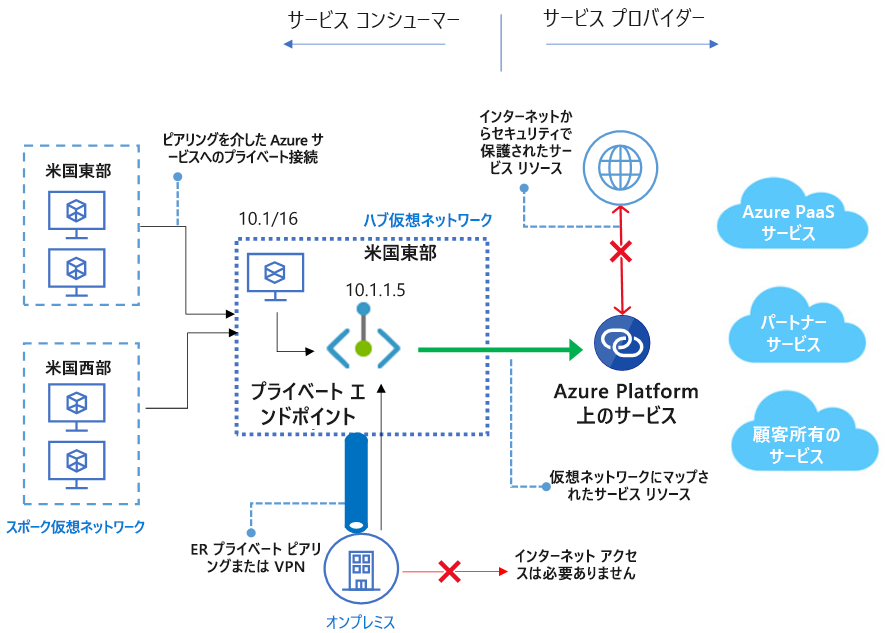

# Azure Private Link とは 
Azure Private Link を使用すると、仮想ネットワーク内の[プライベート エンドポイント](private-endpoint-overview.md)経由で Azure PaaS サービス (Azure Storage、Azure Cosmos DB、SQL Database など) と Azure でホストされている顧客/パートナー サービスにアクセスできます。 仮想ネットワークとサービスの間のトラフィックは、Microsoft のバックボーン ネットワークを経由して、パブリック インターネットからの公開を排除します。 また、独自の [Private Link サービス](private-link-service-overview.md)を仮想ネットワーク (VNet) 内に作成し、そのサービスを顧客に非公開で配信することもできます。 Azure Private Link を使用した設定と消費のエクスペリエンスは、Azure PaaS サービス、顧客所有サービス、共有パートナー サービス間で一貫しています。

> [!IMPORTANT]
> Azure Private Link は、現在、一般提供機能になっています。 プライベート エンドポイントと Private Link サービス (Standard ロード バランサーの背後にあるサービス) の両方が一般提供されています。 さまざまな Azure PaaS が異なるスケジュールで Azure Private Link にオンボードされます。 Private Link 上の Azure PaaS の正確な状態については、以下の「[可用性](https://docs.microsoft.com/azure/private-link/private-link-overview#availability)」セクションを確認してください。 既知の制約については、[プライベート エンドポイント](private-endpoint-overview.md#limitations)と [Private Link サービス](private-link-service-overview.md#limitations)の説明を参照してください。 

## 主な利点
Azure Private Link には次のような利点があります。  
- **Azure プラットフォーム上のサービスへのプライベート アクセス**: 接続元または接続先にパブリック IP アドレスを必要とせずに、Azure で実行されているサービスに仮想ネットワークをプライベートに接続します。 サービス プロバイダーは独自のローカル仮想ネットワークでサービスを非公開にすることができ、コンシューマーは自身のローカル仮想ネットワークでプライベートにサービスにアクセスできます。 Private Link プラットフォームでは、Azure のバックボーン ネットワークを介してコンシューマーとサービスの間の接続が処理されます。 
 
- **オンプレミスおよびピアリングされたネットワーク**: Azure で実行されているサービスに、ExpressRoute プライベート ピアリング/VPN トンネル (オンプレミスから) 経由およびプライベート エンドポイントを使用してピアリングされた仮想ネットワーク経由でオンプレミスからアクセスします。 パブリック ピアリングを設定したり、インターネットを経由してサービスに接続したりする必要はありません。 この機能により、ワークロードを Azure に移行する安全な方法が提供されます。
 
- **データの流出に対する保護**: Azure Private Link を使用すると、VNet 内のプライベート エンドポイントは、サービス全体ではなく、顧客の PaaS リソースの特定のインスタンスにマップされます。 プライベート エンドポイント コンシューマーを使用すると、サービス内の特定のリソースにのみ接続し、他のリソースには接続しないようにすることができます。 この組み込みメカニズムにより、データの流出のリスクを防ぐことができます。 
 
- **グローバルな展開**: 他のリージョンで実行中のサービスにプライベートに接続します。 これは、コンシューマーの仮想ネットワークがリージョン A にある場合に、リージョン B の、Private Link の背後にあるサービスに接続できることを意味します。  
 
- **独自のサービスへの拡張**: 同じエクスペリエンスと機能を活用して、独自のサービスを Azure 上の自身のコンシューマーに対してプライベートに提供できます。 Standard Load Balancer の内側にサービスを配置することで、サービスを Private Link に対して有効にすることができます。 そうすれば、コンシューマーはコンシューマー自身の VNet 内のプライベート エンドポイントを使用して、そのサービスに直接接続できます。 これらの接続要求は、簡単な承認呼び出しフローを使用して管理できます。 Azure Private Link は、異なる Active Directory テナントに属するコンシューマーとサービスに対しても機能します。 

## 可用性 
 次の表に、Private Link サービスと、それらを使用可能なリージョンの一覧を示します。 

|シナリオ  |サポートされているサービス  |対応リージョン | Status  |
|:---------|:-------------------|:-----------------|:--------|
|顧客所有サービス用の Private Link|Standard Load Balancer の背後にある Private Link サービス | すべてのパブリック リージョン  | GA   [詳細情報](https://docs.microsoft.com/azure/private-link/private-link-service-overview) |
|Azure PaaS サービス用の Private Link   | Azure Storage        |  すべてのパブリック リージョン      | プレビュー   [詳細情報](/azure/storage/common/storage-private-endpoints)  |
|  | Azure Data Lake Storage Gen2        |  すべてのパブリック リージョン      | プレビュー   [詳細情報](/azure/storage/common/storage-private-endpoints)  |
|  |  Azure SQL データベース         | すべてのパブリック リージョン      |   プレビュー   [詳細情報](https://docs.microsoft.com/azure/sql-database/sql-database-private-endpoint-overview)      |
||Azure SQL Data Warehouse| すべてのパブリック リージョン |プレビュー   [詳細情報](https://docs.microsoft.com/azure/sql-database/sql-database-private-endpoint-overview)|
||Azure Cosmos DB| 米国中西部、米国西部、米国中北部 |プレビュー   [詳細情報](https://docs.microsoft.com/azure/cosmos-db/how-to-configure-private-endpoints)|
|  |  Azure Database for PostgreSQL - 単一サーバー         | すべてのパブリック リージョン      |   プレビュー   [詳細情報](https://docs.microsoft.com/azure/postgresql/concepts-data-access-and-security-private-link)      |
|  |  Azure Database for MySQL         | すべてのパブリック リージョン      |   プレビュー   [詳細情報](https://docs.microsoft.com/azure/mysql/concepts-data-access-security-private-link)     |
|  |  Azure Database for MariaDB         | すべてのパブリック リージョン      |   プレビュー   [詳細情報](https://docs.microsoft.com/azure/mariadb/concepts-data-access-security-private-link)      |
|  |  Azure Key Vault         | すべてのパブリック リージョン      |   プレビュー     [詳細情報](https://docs.microsoft.com/azure/key-vault/private-link-service)   |

最新情報については、[Azure 仮想ネットワークの更新情報ページ](https://azure.microsoft.com/updates/?product=virtual-network)をご覧ください。

## ログ記録と監視

Azure Private Link は Azure Monitor と統合されます。そのため、ログをストレージ アカウントにアーカイブしたり、お使いのイベント ハブにイベントをストリーム配信したり、それらを Azure Monitor ログに送信したりできます。 Azure Monitor で次の情報にアクセスできます。 
- **プライベート エンドポイント**: プライベート エンドポイントによって処理されるデータ (入力/出力)
 
- **Private Link サービス**:
    - Private Link サービスによって処理されるデータ (入力/出力)
    - NAT ポートの使用可能性  
 
## 価格   
料金の詳細については、「[Azure Private Link の料金](https://azure.microsoft.com/pricing/details/private-link/)」をご覧ください。
 
## FAQ  
FAQ については、「[Azure Private Link のよくあるご質問](private-link-faq.md)」を参照してください。
 
## 制限  
制限については、[Azure Private Link の制限](../azure-resource-manager/management/azure-subscription-service-limits.md#private-link-limits)に関するページを参照してください。

## サービス レベル アグリーメント
SLA については、「[Azure Private Link の SLA](https://azure.microsoft.com/support/legal/sla/private-link/v1_0/)」を参照してください。

## 次のステップ
- [ポータルを使用して SQL Database サーバー用のプライベート エンドポイントを作成する](create-private-endpoint-portal.md)
- [PowerShell を使用して SQL Database サーバー用のプライベート エンドポイントを作成する](create-private-endpoint-powershell.md)
- [CLI を使用して SQL Database サーバー用のプライベート エンドポイントを作成する](create-private-endpoint-cli.md)
- [ポータルを使用してストレージ アカウント用のプライベート エンドポイントを作成する](create-private-endpoint-storage-portal.md)
- [ポータルを使用して Azure Cosmos アカウントのプライベート エンドポイントを作成する](../cosmos-db/how-to-configure-private-endpoints.md)
- [Azure PowerShell を使用して独自の Private Link サービスを作成する](create-private-link-service-powershell.md)

 
