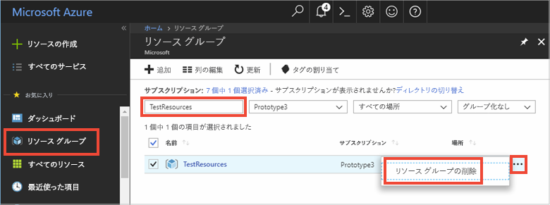

# <a name="quickstart-use-azure-redis-cache-with-a-net-application"></a>クイック スタート: .NET アプリで Azure Redis Cache を使用する


このクイック スタートでは、.NET で Microsoft Azure Redis Cache を使用する方法について説明します。 Microsoft Azure Redis Cache は、広く支持されているオープン ソースの Redis Cache がベースとなっています。 マイクロソフトによって管理されている、セキュリティで保護された専用の Redis cache にアクセスすることができます。 Azure Redis Cache を使用して作成されたキャッシュには、Microsoft Azure 内のあらゆるアプリケーションからアクセスすることができます。

このクイック スタートでは、コンソール アプリで [StackExchange.Redis](https://github.com/StackExchange/StackExchange.Redis) クライアントと C\# コードを使用します。 キャッシュを作成し、.NET クライアント アプリを構成します。 次に、キャッシュにオブジェクトを追加し、更新します。 


[!INCLUDE [quickstarts-free-trial-note](../../includes/quickstarts-free-trial-note.md)]

## <a name="prerequisites"></a>前提条件

* [Visual Studio](https://www.visualstudio.com/downloads/)
* StackExchange.Redis クライアントには、[.NET Framework 4 以降](https://www.microsoft.com/net/download/dotnet-framework-runtime)が必要です。

## <a name="create-a-cache"></a>キャッシュの作成
[!INCLUDE [redis-cache-create](../../includes/redis-cache-create.md)]

[!INCLUDE [redis-cache-access-keys](../../includes/redis-cache-access-keys.md)]

コンピューター上に *CacheSecrets.config* という名前のファイルを作成し、サンプル アプリケーションのソース コードでチェックインされない場所に置きます。 このクイック スタートでは、*CacheSecrets.config* ファイルを *C:\AppSecrets\CacheSecrets.config* に配置します。

*CacheSecrets.config* ファイルを編集し、次の内容を追加します。

```xml
<appSettings>
    <add key="CacheConnection" value="<cache-name>.redis.cache.windows.net,abortConnect=false,ssl=true,password=<access-key>"/>
</appSettings>
```

`<cache-name>` は実際のキャッシュ ホスト名に置き換えます。

`<access-key>` は、実際のキャッシュのプライマリ キーに置き換えます。


## <a name="create-a-console-app"></a>コンソール アプリを作成する

Visual Studio で、**[ファイル]** > **[新規]** > **[プロジェクト]** をクリックします。

**Visual C#** で **Windows Classic Desktop** をクリックし、**コンソール アプリ**、**[OK]** の順にクリックし、新しいコンソール アプリを作成します。


<a name="configure-the-cache-clients"></a>

## <a name="configure-the-cache-client"></a>キャッシュ クライアントの構成

このセクションでは、.NET に [StackExchange.Redis](https://github.com/StackExchange/StackExchange.Redis) クライアントを使用するようにコンソール アプリを構成します。

Visual Studio で、**[ツール]** > **[NuGet パッケージ マネージャー]** > **[パッケージ マネージャー コンソール]** の順にクリックし、[パッケージ マネージャー コンソール] ウィンドウから次のコマンドを実行します。

```powershell
Install-Package StackExchange.Redis
```

インストールが完了すると、*StackExchange.Redis* キャッシュ クライアントをプロジェクトに使用できるようになります。


## <a name="connect-to-the-cache"></a>キャッシュに接続する

Visual Studio で *App.config* ファイルを開き、*CacheSecrets.config* ファイルを参照する `appSettings` `file` 属性を含むように更新します。

```xml
<?xml version="1.0" encoding="utf-8" ?>
<configuration>
    <startup> 
        <supportedRuntime version="v4.0" sku=".NETFramework,Version=v4.7.1" />
    </startup>

    <appSettings file="C:\AppSecrets\CacheSecrets.config"></appSettings>  

</configuration>
```

ソリューション エクスプローラーで **[参照]** を右クリックし、**[参照を追加]** をクリックします。 **System.Configuration** アセンブリへの参照を追加します。

次の `using` ステートメントを *Program.cs* に追加します。

```csharp
using StackExchange.Redis;
using System.Configuration;
```

Azure Redis Cache への接続には、 `ConnectionMultiplexer` クラスを使用します。 このクラスは、クライアント アプリ全体で共有して再利用する必要があります。 操作ごとに新しい接続を作成しないでください。 

ソース コード内に資格情報を保存することは絶対に避けてください。 このサンプルを単純にするために、外部のシークレット構成ファイルのみを使用しています。 実際には [Azure Key Vault と証明書](https://docs.microsoft.com/rest/api/keyvault/certificate-scenarios)を使用することをお勧めします。

*Program.cs* で、次のメンバーをコンソール アプリの `Program` クラスに追加します。

```csharp
        private static Lazy<ConnectionMultiplexer> lazyConnection = new Lazy<ConnectionMultiplexer>(() =>
        {
            string cacheConnection = ConfigurationManager.AppSettings["CacheConnection"].ToString();
            return ConnectionMultiplexer.Connect(cacheConnection);
        });

        public static ConnectionMultiplexer Connection
        {
            get
            {
                return lazyConnection.Value;
            }
        }
```


アプリで `ConnectionMultiplexer` インスタンスを共有するこの方法では、接続されたインスタンスを返す静的プロパティを使用します。 このコードにより、接続された 1 つの `ConnectionMultiplexer` インスタンスだけがスレッドセーフな方法で初期化されます。 `abortConnect` は false に設定されており、Azure Redis Cache への接続が確立されていない場合でも呼び出しが成功します。 `ConnectionMultiplexer` の主な機能の 1 つは、ネットワーク問題などの原因が解決されると、キャッシュへの接続が自動的に復元されることです。

*CacheConnection* appSetting の値は、Azure Portal からパスワード パラメーターとしてキャッシュ接続文字列を参照するために使用されます。

## <a name="executing-cache-commands"></a>キャッシュ コマンドの実行

コンソール アプリの `Program` クラスの `Main` プロシージャに次のコードを追加します。

```csharp
        static void Main(string[] args)
        {
            // Connection refers to a property that returns a ConnectionMultiplexer
            // as shown in the previous example.
            IDatabase cache = lazyConnection.Value.GetDatabase();

            // Perform cache operations using the cache object...

            // Simple PING command
            string cacheCommand = "PING";
            Console.WriteLine("\nCache command  : " + cacheCommand);
            Console.WriteLine("Cache response : " + cache.Execute(cacheCommand).ToString());

            // Simple get and put of integral data types into the cache
            cacheCommand = "GET Message";
            Console.WriteLine("\nCache command  : " + cacheCommand + " or StringGet()");
            Console.WriteLine("Cache response : " + cache.StringGet("Message").ToString());

            cacheCommand = "SET Message \"Hello! The cache is working from a .NET console app!\"";
            Console.WriteLine("\nCache command  : " + cacheCommand + " or StringSet()");
            Console.WriteLine("Cache response : " + cache.StringSet("Message", "Hello! The cache is working from a .NET console app!").ToString());

            // Demostrate "SET Message" executed as expected...
            cacheCommand = "GET Message";
            Console.WriteLine("\nCache command  : " + cacheCommand + " or StringGet()");
            Console.WriteLine("Cache response : " + cache.StringGet("Message").ToString());

            // Get the client list, useful to see if connection list is growing...
            cacheCommand = "CLIENT LIST";
            Console.WriteLine("\nCache command  : " + cacheCommand);
            Console.WriteLine("Cache response : \n" + cache.Execute("CLIENT", "LIST").ToString().Replace("id=", "id="));

            lazyConnection.Value.Dispose();
        }
```

Azure Redis Cache には、Redis Cache 内のデータを論理的に分離する目的に使用できるデータベースがあります (既定ではデータベースの数が 16 個ですが、設定により変更できます)。 コードは、既定のデータベース DB 0 に接続されます。 詳細については、「[What are Redis databases? (Redis データベースとは)](cache-faq.md#what-are-redis-databases)」と「[既定の Redis サーバー構成](cache-configure.md#default-redis-server-configuration)」を参照してください。

キャッシュ項目の格納と取得には、`StringSet` および `StringGet`メソッドを使用します。

Redis では、ほとんどのデータが Redis 文字列として保存されますが、これらの文字列には、さまざまなデータ型を格納することができます。シリアル化したバイナリ データもその 1 つで、.NET のオブジェクトをキャッシュに保存する際に使用することができます。

**Ctrl + F5** キーを押してアプリをビルドし、実行します。

次の例では、`Message` キーは、前に Azure portal の Redis コンソールを使って設定されたキャッシュ値を持っていたことがわかります。 アプリは、そのキャッシュ値を更新しました。 また、アプリは `PING` および `CLIENT LIST` コマンドも実行しました。


## <a name="work-with-net-objects-in-the-cache"></a>キャッシュ内で .NET オブジェクトを使用する

Azure Redis Cache は .NET オブジェクトとプリミティブ データ型の両方をキャッシュできますが、.NET オブジェクトをキャッシュするためには、あらかじめシリアル化しておく必要があります。 この .NET オブジェクトのシリアル化はアプリケーション開発者が行わなければなりません。逆にそのことでシリアライザーの選択に幅が生まれ、開発者にとってのメリットとなっています。

オブジェクトをシリアル化する簡単な方法の 1 つは、[Newtonsoft.Json](https://www.nuget.org/packages/Newtonsoft.Json/) の `JsonConvert` シリアル化方法を使用して、JSON へおよび JSON からシリアル化する方法です。 このセクションでは、.NET オブジェクトをキャッシュに追加します。

Visual Studio で、**[ツール]** > **[NuGet パッケージ マネージャー]** > **[パッケージ マネージャー コンソール]** の順にクリックし、[パッケージ マネージャー コンソール] ウィンドウから次のコマンドを実行します。

```powershell
Install-Package Newtonsoft.Json
```

*Program.cs* の先頭に次の `using` ステートメントを追加します。

```charp
using Newtonsoft.Json;
```

次の `Employee` クラス定義を *Program.cs* に追加します。

```csharp
        class Employee
        {
            public string Id { get; set; }
            public string Name { get; set; }
            public int Age { get; set; }

            public Employee(string EmployeeId, string Name, int Age)
            {
                this.Id = EmployeeId;
                this.Name = Name;
                this.Age = Age;
            }
        }
```

*Program.cs* の `Main()` プロシージャの一番下と、`Dispose()` の呼び出しの前に、シリアライズ化された .NET オブジェクトをキャッシュして取得する以下のコード行を追加します。

```csharp
            // Store .NET object to cache
            Employee e007 = new Employee("007", "Davide Columbo", 100);
            Console.WriteLine("Cache response from storing Employee .NET object : " + 
                cache.StringSet("e007", JsonConvert.SerializeObject(e007)));

            // Retrieve .NET object from cache
            Employee e007FromCache = JsonConvert.DeserializeObject<Employee>(cache.StringGet("e007"));
            Console.WriteLine("Deserialized Employee .NET object :\n");
            Console.WriteLine("\tEmployee.Name : " + e007FromCache.Name);
            Console.WriteLine("\tEmployee.Id   : " + e007FromCache.Id);
            Console.WriteLine("\tEmployee.Age  : " + e007FromCache.Age + "\n");
```

**Ctrl + F5** キーを押してコンソール アプリをビルドして実行し、.NET オブジェクトのシリアル化をテストします。 


## <a name="clean-up-resources"></a>リソースのクリーンアップ

次のチュートリアルに進む場合は、このクイック スタートで作成したリソースを維持して、再利用することができます。

クイック スタートのサンプル アプリケーションの使用を終える場合は、課金を避けるために、このクイック スタートで作成した Azure リソースを削除することができます。 

> [!IMPORTANT]
> いったん削除したリソース グループを元に戻すことはできません。リソース グループとそこに存在するすべてのリソースは完全に削除されます。 間違ったリソース グループやリソースをうっかり削除しないようにしてください。 このサンプルのホストとなるリソースを、保持するリソースが含まれている既存のリソース グループ内に作成した場合は、リソース グループを削除するのではなく、個々のブレードから各リソースを個別に削除することができます。
>

[Azure ポータル](https://portal.azure.com) にサインインし、 **[リソース グループ]** をクリックします。

**[名前でフィルター]** ボックスにリソース グループの名前を入力します。 この記事の手順では、*TestResources* という名前のリソース グループを使用しました。 結果一覧でリソース グループの **[...]** をクリックし、**[リソース グループの削除]** をクリックします。



リソース グループの削除の確認を求めるメッセージが表示されます。 確認のためにリソース グループの名前を入力し、**[削除]** をクリックします。

しばらくすると、リソース グループとそこに含まれているすべてのリソースが削除されます。


<a name="next-steps"></a>

## <a name="next-steps"></a>次の手順

このクイック スタートでは、.NET アプリから Azure Redis Cache を使用する方法を説明しました。 ASP.NET Web アプリで Redis Cache を使用するには、次のクイック スタートに進みます。

> [!div class="nextstepaction"]
> [Azure Redis Cache を使用する ASP.NET Web アプリの作成。](./cache-web-app-howto.md)


