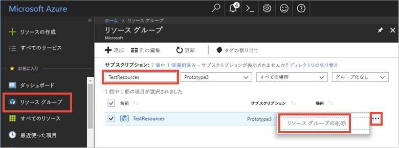

# <a name="quickstart-use-azure-redis-cache-with-python"></a>クイック スタート: Python で Azure Redis Cache を使用する


## <a name="introduction"></a>はじめに

このクイック スタートでは、Python で Azure Redis Cache に接続して、キャッシュの読み取りと書き込みを実行する方法について説明します。 


[!INCLUDE [quickstarts-free-trial-note](../../includes/quickstarts-free-trial-note.md)]

## <a name="prerequisites"></a>前提条件

* [pip](https://pypi.org/project/pip/) と共にインストールされた [Python 2 または Python 3 環境](https://www.python.org/downloads/) 

## <a name="create-a-redis-cache-on-azure"></a>Azure で Redis Cache を作成する
[!INCLUDE [redis-cache-create](../../includes/redis-cache-create.md)]

[!INCLUDE [redis-cache-create](../../includes/redis-cache-access-keys.md)]

## <a name="install-redis-py"></a>redis-py をインストールする

[redis-py](https://github.com/andymccurdy/redis-py) は、Redis Cache の Python インターフェイスです。 Python パッケージ ツールの *pip* を使用して、redis-py パッケージをインストールします。 

次の例では、Python3 の *pip3* を使用し、昇格された管理者特権で実行されている Visual Studio 2017 の開発者コマンド プロンプトを使用して、Windows 10 に redis-py パッケージをインストールします。

    pip3 install redis


## <a name="read-and-write-to-the-cache"></a>キャッシュの読み取りと書き込みを実行する

Python を実行し、コマンド ラインからキャッシュを使ってテストします。 `<Your Host Name>` と `<Your Access Key>` を、Redis Cache の値に置き換えます。 

```python
>>> import redis
>>> r = redis.StrictRedis(host='<Your Host Name>.redis.cache.windows.net',
        port=6380, db=0, password='<Your Access Key>', ssl=True)
>>> r.set('foo', 'bar')
True
>>> r.get('foo')
b'bar'
```

## <a name="create-a-python-script"></a>Python スクリプトを作成する

*PythonApplication1.py* という名前の新しいスクリプト テキスト ファイルを作成します。

*PythonApplication1.py* に次のスクリプトを追加し、ファイルを保存します。 このスクリプトでは、キャッシュへのアクセスをテストします。 `<Your Host Name>` と `<Your Access Key>` を、Redis Cache の値に置き換えます。 

```python
import redis

myHostname = "<Your Host Name>.redis.cache.windows.net"
myPassword = "<Your Access Key>"

r = redis.StrictRedis(host=myHostname, port=6380,password=myPassword,ssl=True)

result = r.ping()
print("Ping returned : " + str(result))

result = r.set("Message", "Hello!, The cache is working with Python!")
print("SET Message returned : " + str(result))

result = r.get("Message")
print("GET Message returned : " + result.decode("utf-8"))

result = r.client_list()
print("CLIENT LIST returned : ") 
for c in result:
    print("id : " + c['id'] + ", addr : " + c['addr'])
```

Python でスクリプトを実行します。


## <a name="clean-up-resources"></a>リソースのクリーンアップ

別のチュートリアルを引き続き実行する場合は、このクイック スタートで作成したリソースを保持して再利用できます。

クイック スタートのサンプル アプリケーションの使用を終える場合は、課金を避けるために、このクイック スタートで作成した Azure リソースを削除することができます。 

> [!IMPORTANT]
> いったん削除したリソース グループを元に戻すことはできません。リソース グループとそこに存在するすべてのリソースは完全に削除されます。 間違ったリソース グループやリソースをうっかり削除しないようにしてください。 このサンプルのホストとなるリソースを、保持するリソースが含まれている既存のリソース グループ内に作成した場合は、リソース グループを削除するのではなく、個々のブレードから各リソースを個別に削除することができます。
>

[Azure ポータル](https://portal.azure.com) にサインインし、 **[リソース グループ]** をクリックします。

**[名前でフィルター]** ボックスにリソース グループの名前を入力します。 この記事の手順では、*TestResources* という名前のリソース グループを使用しました。 結果一覧でリソース グループの **[...]** をクリックし、**[リソース グループの削除]** をクリックします。



リソース グループの削除の確認を求めるメッセージが表示されます。 確認のためにリソース グループの名前を入力し、**[削除]** をクリックします。

しばらくすると、リソース グループとそこに含まれているすべてのリソースが削除されます。


## <a name="next-steps"></a>次の手順

> [!div class="nextstepaction"]
> [Azure Redis Cache を使用する単純な ASP.NET Web アプリを作成する](./cache-web-app-howto.md)


<!--Image references-->
[1]: ./media/cache-python-get-started/redis-cache-new-cache-menu.png
[2]: ./media/cache-python-get-started/redis-cache-cache-create.png
