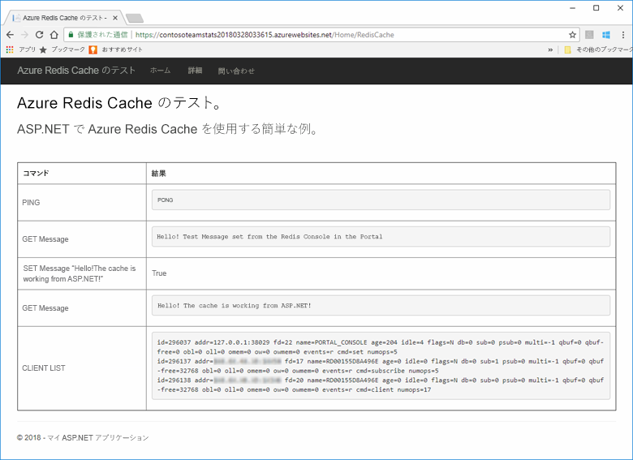
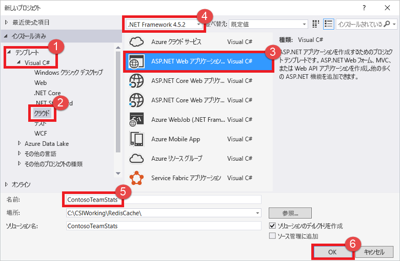
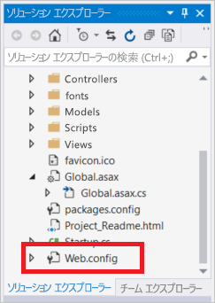
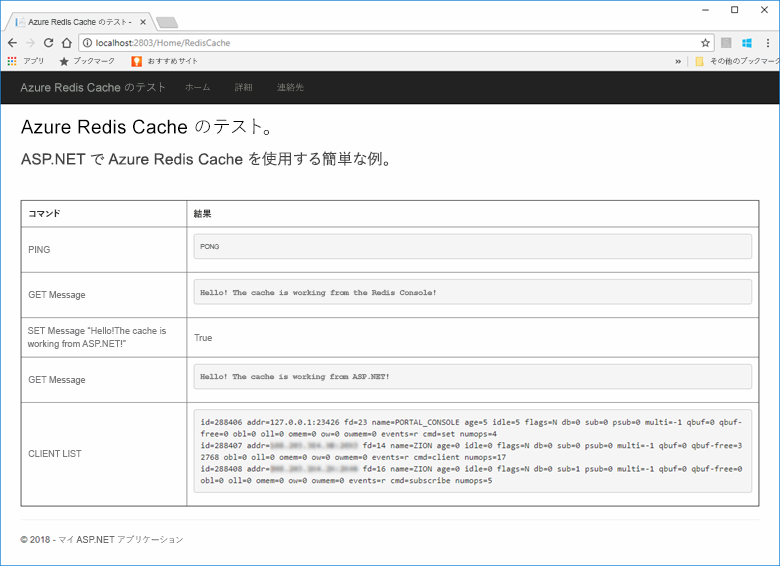
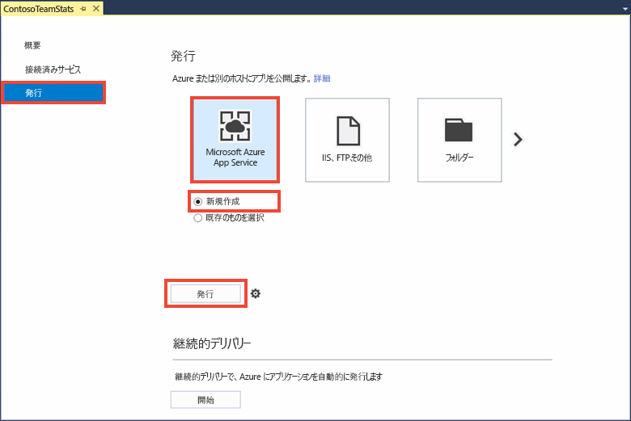
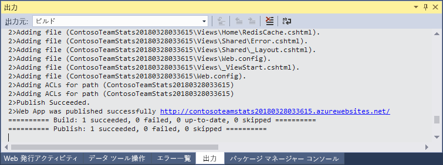
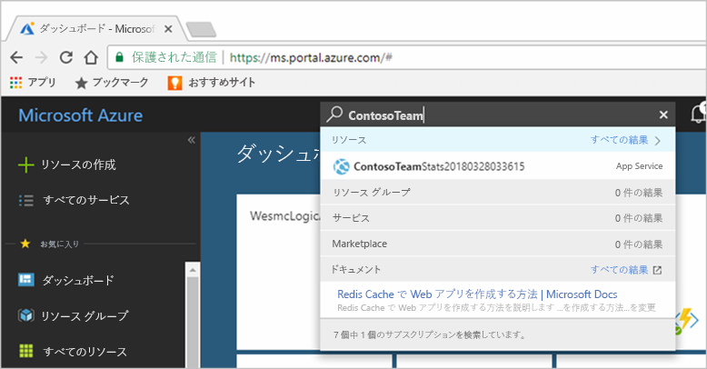

# <a name="quickstart-create-a-aspnet-web-app-with-redis-cache"></a>クイック スタート: Redis Cache を使用して ASP.NET Web アプリを作成する


## <a name="introduction"></a>はじめに

このクイック スタートでは、Visual Studio 2017 を使用して ASP.NET Web アプリケーションを作成し Azure App Service にデプロイする方法を説明します。 このサンプル アプリケーションは、Azure Redis Cache に接続して、キャッシュにデータを格納し、キャッシュからデータを取得します。 このクイック スタートを最後まで行うと、Azure Redis Cache との間で読み書きを行う Web アプリが完成し、Azure でホストされています。



[!INCLUDE [quickstarts-free-trial-note](../../includes/quickstarts-free-trial-note.md)]

## <a name="prerequisites"></a>前提条件

このクイック スタートを完了するには、次の前提条件を満たしている必要があります。

* 次のワークロードを使って、[Visual Studio 2017](https://www.visualstudio.com/downloads/) をインストールします。
    * ASP.NET および Web の開発
    * Azure 開発

## <a name="create-the-visual-studio-project"></a>Visual Studio プロジェクトの作成

Visual Studio を開き、**[ファイル]**、**[新規作成]**、**[プロジェクト]** の順にクリックします。



[新しいプロジェクト] ダイアログで、次の操作を行います。

1. **[テンプレート]** の一覧で、**[Visual C#]** ノードを展開します。
1. **[クラウド]** を選びます
1. **[ASP.NET Web アプリケーション]** をクリックします
1. **.NET Framework 4.5.2** 以降が選択されていることを確認します
1. **[名前]** ボックスでプロジェクトの名前を指定します。この例では **ContosoTeamStats** を使います
1. Click **OK**.

[新しい ASP.NET Web アプリケーション] 画面が表示されます。


プロジェクトの種類として、 **[MVC]** を選択します。

**[認証]** の設定で **[認証なし]** が指定されていることを確認します。 Visual Studio のバージョンによっては、既定値が他の値に設定されている場合があります。 これを変更するには、**[認証の変更]** をクリックし、**[認証なし]** を選択します。

**[OK]** をクリックしてプロジェクトを作成します。

## <a name="create-a-cache"></a>キャッシュの作成

次に、アプリ用のキャッシュを作成します。

[!INCLUDE [redis-cache-create](../../includes/redis-cache-create.md)]

[!INCLUDE [redis-cache-access-keys](../../includes/redis-cache-access-keys.md)]

コンピューター上に *CacheSecrets.config* という名前のファイルを作成し、サンプル アプリケーションのソース コードでチェックインされない場所に置きます。 このクイック スタートでは、*CacheSecrets.config* ファイルを *C:\AppSecrets\CacheSecrets.config* に配置します。

*CacheSecrets.config* ファイルを編集し、次の内容を追加します。

```xml
<appSettings>
    <add key="CacheConnection" value="<cache-name>.redis.cache.windows.net,abortConnect=false,ssl=true,password=<access-key>"/>
</appSettings>
```

`<cache-name>` は実際のキャッシュ ホスト名に置き換えます。

`<access-key>` は、実際のキャッシュのプライマリ キーに置き換えます。

> [!TIP]
> セカンダリ アクセス キーは、プライマリ アクセス キーを再生成する間の代替キーとして、キー ローテーションのときに使われます。
>

ファイルを保存します。

## <a name="update-the-mvc-application"></a>MVC アプリケーションを更新する

このセクションでは、Azure Redis Cache に対する簡単なテストを表示する新しいビューをサポートするようにアプリケーションを更新します。

* [キャッシュ用のアプリ設定で web.config ファイルを更新する](#Update-the-webconfig-file-with-an-app-setting-for-the-cache)
* [StackExchange.Redis クライアントを使うようにアプリケーションを構成する](#configure-the-application-to-use-stackexchangeredis)
* [HomeController とレイアウトを更新する](#update-the-homecontroller-and-layout)
* [新しい RedisCache ビューを追加する](#add-a-new-rediscache-view)

### <a name="update-the-webconfig-file-with-an-app-setting-for-the-cache"></a>キャッシュ用のアプリ設定で web.config ファイルを更新する

アプリケーションをローカルで実行すると、*CacheSecrets.config* 内の情報が、Azure Redis Cache インスタンスへの接続に使われます。 後でこのアプリケーションを Azure にデプロイします。 そのときに、アプリケーションがこのファイルの代わりにキャッシュ接続情報の取得に使用するアプリ設定を Azure 内で構成します。 *CacheSecrets.config* はアプリケーションと一緒に Azure にデプロイされず、アプリケーションのローカルなテストの間にだけ使われます。 キャッシュ データへの不正アクセスを防ぐため、この情報は可能な限り安全に保持してください。

**ソリューション エクスプローラー**で、*web.config* ファイルをダブルクリックして開きます。



*web.config* ファイルで `<appSetting>` 要素を探し、次の `file` 属性を追加します。 異なるファイル名または場所を使用した場合は、この例の値を実際の値で置き換えてください。

* 変更前: `<appSettings>`
* 変更後: ` <appSettings file="C:\AppSecrets\CacheSecrets.config">`

`<appSettings>` 要素内のマークアップは、ASP.NET ランタイムによって外部ファイルの内容と結合されます。 指定したファイルが見つからない場合、このファイル属性は無視されます。 このアプリケーションのソース コードにシークレット (キャッシュへの接続文字列) は含まれていません。 Web アプリを Azure にデプロイするときに、*CacheSecrests.config* ファイルはデプロイされません。

### <a name="configure-the-application-to-use-stackexchangeredis"></a>StackExchange.Redis を使用するようにアプリケーションを構成する

Visual Studio 用の [StackExchange.Redis](https://github.com/StackExchange/StackExchange.Redis) NuGet パッケージを使うようにアプリを構成するには、**[ツール] > [NuGet パッケージ マネージャー] > [パッケージ マネージャー コンソール]** の順にクリックします。

[`Package Manager Console`] ウィンドウで、次のコマンドを実行します。

```powershell
Install-Package StackExchange.Redis
```

クライアント アプリケーションから StackExchange.Redis Cache クライアントを使用して Azure Redis Cache にアクセスするために必要なアセンブリ参照が NuGet パッケージによってダウンロードされ追加されます。 `StackExchange.Redis` クライアント ライブラリの厳密な名前を持つバージョンを使用する場合は、`StackExchange.Redis.StrongName` パッケージをインストールします。

### <a name="update-the-homecontroller-and-layout"></a>HomeController とレイアウトを更新する

**ソリューション エクスプローラー**で **Controllers** フォルダーを展開し、*HomeController.cs* ファイルを開きます。

キャッシュ クライアントとアプリの設定をサポートするために、次の 2 つの `using` ステートメントをファイルの先頭に追加します。

```csharp
using System.Configuration;
using StackExchange.Redis;
```

新しいキャッシュに対していくつかのコマンドを実行する新しい `RedisCache` アクションをサポートするために、次のメソッドを `HomeController` クラスに追加します。

```csharp
    public ActionResult RedisCache()
    {
        ViewBag.Message = "A simple example with Azure Redis Cache on ASP.NET.";

        var lazyConnection = new Lazy<ConnectionMultiplexer>(() =>
        {
            string cacheConnection = ConfigurationManager.AppSettings["CacheConnection"].ToString();
            return ConnectionMultiplexer.Connect(cacheConnection);
        });

        // Connection refers to a property that returns a ConnectionMultiplexer
        // as shown in the previous example.
        IDatabase cache = lazyConnection.Value.GetDatabase();

        // Perform cache operations using the cache object...

        // Simple PING command
        ViewBag.command1 = "PING";
        ViewBag.command1Result = cache.Execute(ViewBag.command1).ToString();

        // Simple get and put of integral data types into the cache
        ViewBag.command2 = "GET Message";
        ViewBag.command2Result = cache.StringGet("Message").ToString();

        ViewBag.command3 = "SET Message \"Hello! The cache is working from ASP.NET!\"";
        ViewBag.command3Result = cache.StringSet("Message", "Hello! The cache is working from ASP.NET!").ToString();

        // Demostrate "SET Message" executed as expected...
        ViewBag.command4 = "GET Message";
        ViewBag.command4Result = cache.StringGet("Message").ToString();

        // Get the client list, useful to see if connection list is growing...
        ViewBag.command5 = "CLIENT LIST";
        ViewBag.command5Result = cache.Execute("CLIENT", "LIST").ToString().Replace(" id=", "\rid=");

        lazyConnection.Value.Dispose();

        return View();
    }
```

**ソリューション エクスプローラー**で、**[Views]** > **[Shared]** フォルダーを展開し、*_Layout.cshtml* ファイルを開きます。

置換前のコード:

```csharp
@Html.ActionLink("Application name", "Index", "Home", new { area = "" }, new { @class = "navbar-brand" })
```

置換後のコード:

```csharp
@Html.ActionLink("Azure Redis Cache Test", "RedisCache", "Home", new { area = "" }, new { @class = "navbar-brand" })
```

### <a name="add-a-new-rediscache-view"></a>新しい RedisCache ビューを追加する

**ソリューション エクスプローラー**で、**[Views]** フォルダーを展開し、**[Home]** フォルダーを右クリックします。 **[追加]** > **[ビュー...]** を選択します。

[ビューの追加] ダイアログで、ビューの名前に「**RedisCache**」と入力し、**[追加]** をクリックします。

*RedisCache.cshtml* ファイルのコードを次のコードに置き換えます。

```csharp
@{
    ViewBag.Title = "Azure Redis Cache Test";
}

<h2>@ViewBag.Title.</h2>
<h3>@ViewBag.Message</h3>
<br /><br />
<table border="1" cellpadding="10">
    <tr>
        <th>Command</th>
        <th>Result</th>
    </tr>
    <tr>
        <td>@ViewBag.command1</td>
        <td><pre>@ViewBag.command1Result</pre></td>
    </tr>
    <tr>
        <td>@ViewBag.command2</td>
        <td><pre>@ViewBag.command2Result</pre></td>
    </tr>
    <tr>
        <td>@ViewBag.command3</td>
        <td><pre>@ViewBag.command3Result</pre></td>
    </tr>
    <tr>
        <td>@ViewBag.command4</td>
        <td><pre>@ViewBag.command4Result</pre></td>
    </tr>
    <tr>
        <td>@ViewBag.command5</td>
        <td><pre>@ViewBag.command5Result</pre></td>
    </tr>
</table>
```

## <a name="run-the-app-locally"></a>アプリをローカルで実行する

既定では、プロジェクトはテストとデバッグのためにアプリを [IIS Express](https://docs.microsoft.com/iis/extensions/introduction-to-iis-express/iis-express-overview) にローカルにホストするように構成されます。

Visual Studio のメニューで **[デバッグ]** > **[デバッグの開始]** をクリックしてアプリをビルドし、テストとデバッグのためにアプリをローカルに開始します。

ブラウザーで、ナビゲーション バーの **[Azure Redis Cache Test]\(Azure Redis Cache のテスト\)** をクリックします。

次の例では、`Message` キーは、前にポータルの Redis コンソールを使って設定されたキャッシュ値を持っていたことがわかります。 アプリは、そのキャッシュ値を更新しました。 また、アプリは `PING` および `CLIENT LIST` コマンドも実行しました。



## <a name="publish-and-run-in-azure"></a>Azure に発行して実行する

アプリのローカル テストが正常に終了したら、アプリを Azure にデプロイして、クラウドで実行します。

### <a name="publish-the-app-to-azure"></a>アプリを Azure に発行する

Visual Studio で、ソリューション エクスプローラーのプロジェクト ノードを右クリックし、**[発行]** を選択します。

![[発行]](./media/cache-web-app-howto/cache-publish-app.png)

**[Microsoft Azure App Service]** をクリックし、**[新規作成]** を選択して、**[発行]** をクリックします。



**[App Service の作成]** ダイアログで、次のように変更します。

| Setting | 推奨値 | 説明 |
| ------- | :---------------: | ----------- |
| **アプリ名** | 既定値を使用します。 | アプリ名は、Azure へのデプロイ時にアプリのホスト名になります。 一意にするために必要な場合、名前にタイムスタンプのサフィックスが追加される場合があります。 |
| **サブスクリプション** | Azure サブスクリプションを選びます | このサブスクリプションに関連するホスティング料金が請求されます。 複数の Azure サブスクリプションがある場合は、適切なサブスクリプションを選択したことを確認します。|
| **リソース グループ** | キャッシュを作成したものと同じリソース グループを使います。 たとえば、*TestResourceGroup* などです。 | リソース グループは、すべてのリソースをグループとして管理するときに便利です。 後でアプリを削除する必要があるときは、グループを削除するだけで済みます。 |
| **App Service プラン** | **[新規]** をクリックし、*TestingPlan* という名前で新しい App Service プランを作成します。 <br />キャッシュを作成するときに使ったものと同じ **[場所]** を使います。 <br />サイズでは **[Free]** を選びます。 | App Service プランでは、Web アプリを実行するための一連のコンピューティング リソースを定義します。 |

![[App Service] ダイアログ](./media/cache-web-app-howto/cache-create-app-service-dialog.png)

App Service のホスティング設定を構成した後、**[作成]** をクリックしてアプリ用の新しい App Service を作成します。

Visual Studio の **[出力]** ウィンドウを監視し、Azure への発行の状態を確認します。 発行が正常に完了すると、App Service の URL が次に示すように記録されます。



### <a name="add-the-app-setting-for-the-cache"></a>キャッシュ用のアプリの設定を追加する

新しい App Service の発行が完了したら、新しいアプリの設定を追加します。 この設定は、キャッシュの接続情報を格納するために使われます。 Azure portal の上部にある検索バーにアプリ名を入力し、作成した新しい App Service を検索します。



キャッシュへの接続に使用する **CacheConnection** という名前の新しいアプリ設定をアプリに追加します。 *CacheSecrets.config* ファイルで `CacheConnection` 用に構成したものと同じ値を使います。 値には、キャッシュのホスト名とアクセス キーが含まれます。


### <a name="run-the-app-in-azure"></a>Azure でのアプリの実行

ブラウザーで、App Service の URL を参照します。 URL は、発行操作の結果として Visual Studio の出力ウィンドウに表示されます。 Azure portal においても、作成した App Service の [概要] ページで提供されます。

ナビゲーション バーの **[Azure Redis Cache Test]\(Azure Redis Cache のテスト\)** をクリックして、キャッシュへのアクセスをテストします。


## <a name="clean-up-resources"></a>リソースのクリーンアップ

次のチュートリアルに進む場合は、このクイック スタートで作成したリソースを維持して、再利用することができます。

クイック スタートのサンプル アプリケーションの使用を終える場合は、課金を避けるために、このクイック スタートで作成した Azure リソースを削除することができます。 

> [!IMPORTANT]
> いったん削除したリソース グループを元に戻すことはできません。リソース グループとそこに存在するすべてのリソースは完全に削除されます。 間違ったリソース グループやリソースをうっかり削除しないようにしてください。 このサンプルのホストとなるリソースを、保持するリソースが含まれている既存のリソース グループ内に作成した場合は、リソース グループを削除するのではなく、個々のブレードから各リソースを個別に削除することができます。
>

[Azure ポータル](https://portal.azure.com) にサインインし、 **[リソース グループ]** をクリックします。

**[名前でフィルター]** ボックスにリソース グループの名前を入力します。 この記事の手順では、*TestResources* という名前のリソース グループを使用しました。 結果一覧でリソース グループの **[...]** をクリックし、**[リソース グループの削除]** をクリックします。


リソース グループの削除の確認を求めるメッセージが表示されます。 確認のためにリソース グループの名前を入力し、**[削除]** をクリックします。

しばらくすると、リソース グループとそこに含まれているすべてのリソースが削除されます。

## <a name="next-steps"></a>次の手順

次のチュートリアルでは、より現実的なシナリオで Azure Redis Cache を使って、アプリのパフォーマンスを向上させます。 このアプリケーションを更新し、ASP.NET とデータベースでキャッシュ アサイド パターンを使ってスコアボードの結果をキャッシュします。

> [!div class="nextstepaction"]
> [ASP.NET でキャッシュ アサイド スコアボードを作成する](cache-web-app-cache-aside-leaderboard.md)
