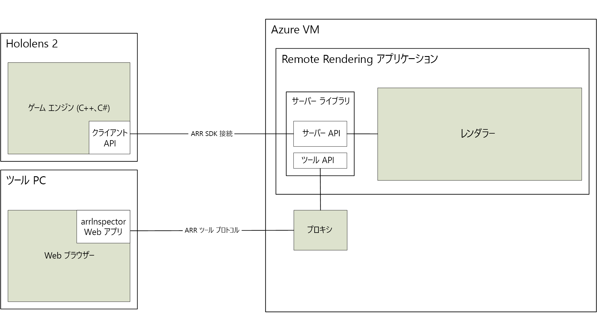

# Azure Remote Rendering について

> [!IMPORTANT]
> 現在、**Azure Remote Rendering** はパブリック プレビュー段階にあります。
> このプレビュー バージョンはサービス レベル アグリーメントなしで提供されています。運用環境のワークロードに使用することはお勧めできません。 特定の機能はサポート対象ではなく、機能が制限されることがあります。 詳しくは、[Microsoft Azure プレビューの追加使用条件](https://azure.microsoft.com/support/legal/preview-supplemental-terms/)に関するページをご覧ください。

*Azure Remote Rendering* (ARR) は、高品質でインタラクティブな 3D コンテンツをクラウドでレンダリングし、HoloLens 2 などのデバイスにリアルタイムでストリーム配信できるようにするサービスです。

テザリングされていないデバイスでは、複雑なモデルをレンダリングするための計算能力が限られます。 その一方で、多くのアプリケーションでは、視覚的な忠実性を少しでも低下させることは許容されません。

*Remote Rendering* は、レンダリング ワークロードをクラウドにあるハイエンド GPU に送ることでこの問題を解決します。 クラウドでホストされるグラフィック エンジンが、画像をレンダリングし、ビデオ ストリームとしてエンコードし、ターゲット デバイスにストリーム配信します。

## ハイブリッド レンダリング

ほとんどのアプリケーションでは、複雑なモデルをレンダリングするだけでは十分ではありません。 ユーザーに機能を提供するためのカスタム UI も必要になります。 Azure Remote Rendering では、専用の UI フレームワークを使用する必要はありません。その代わりに、"*ハイブリッド レンダリング*" をサポートしています。 これは、[MRTK](https://microsoft.github.io/MixedRealityToolkit-Unity/Documentation/GettingStartedWithTheMRTK.html) などの好みの方法を使用して、デバイス上で要素をレンダリングできることを意味します。

フレームの最後に、Azure Remote Rendering によって、ローカルにレンダリングされたコンテンツがリモートの画像と自動的に結合されます。 また、適切なオクルージョンを使用してこれを行うこともできます。

## マルチ GPU レンダリング

モデルの中は、複雑すぎてハイエンドの GPU でもインタラクティブなフレーム レートでレンダリングできないものがあります。 これは、特に産業用の視覚化で一般的な問題です。 この限界を越えるために、Azure Remote Rendering では、ワークロードを複数の GPU に分散させることができます。 結果は 1 つの画像にマージされ、プロセスはユーザーに対して完全に透過的になります。

## 大まかなアーキテクチャ

次の図は、リモート レンダリングのアーキテクチャを示しています。

画像生成の完全なサイクルには、次の手順が含まれます。

1. クライアント側:フレームのセットアップ
    1. 自分のコード: ユーザー入力が処理され、シーン グラフが更新されます
    1. ARR コード: シーン グラフが更新され、予測される頭部姿勢がサーバーに送信されます
1. サーバー側:リモート レンダリング
    1. レンダリング エンジンにより、利用可能な GPU 全体にレンダリングが分散されます
    1. 複数の GPU からの出力が単一の画像に合成されます
    1. 画像がビデオ ストリームとしてエンコードされ、クライアントに送り返されます
1. クライアント側:終了処理
    1. 自分のコード: オプションのローカル コンテンツ (UI、マーカーなど) がレンダリングされます
    1. ARR コード: ローカルにレンダリングされたコンテンツが自動的にビデオ ストリームとマージされます (存在する場合)

大きな問題になるのはネットワーク待ち時間です。 通常、要求を送信して結果を受け取るまでのターンアラウンド タイムはインタラクティブ フレーム レートには長すぎます。 したがって、複数のフレームが常にフライト中である可能性があります。

## 次のステップ

* [システム要件](system-requirements.md)
* [クイック スタート: Unity によるモデルのレンダリング](../quickstarts/render-model.md)
