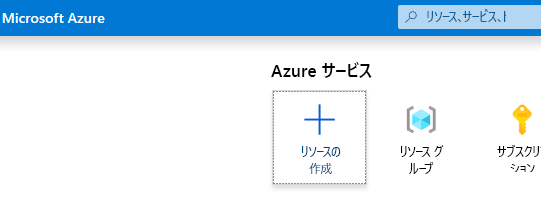
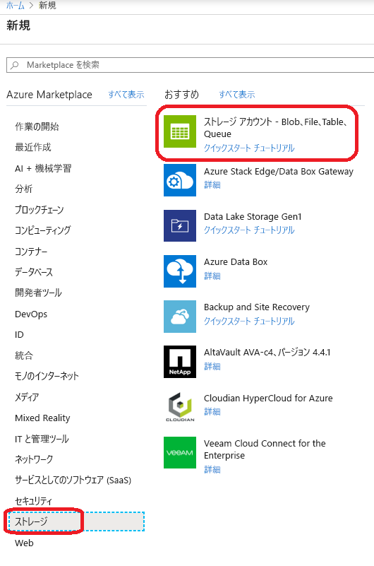
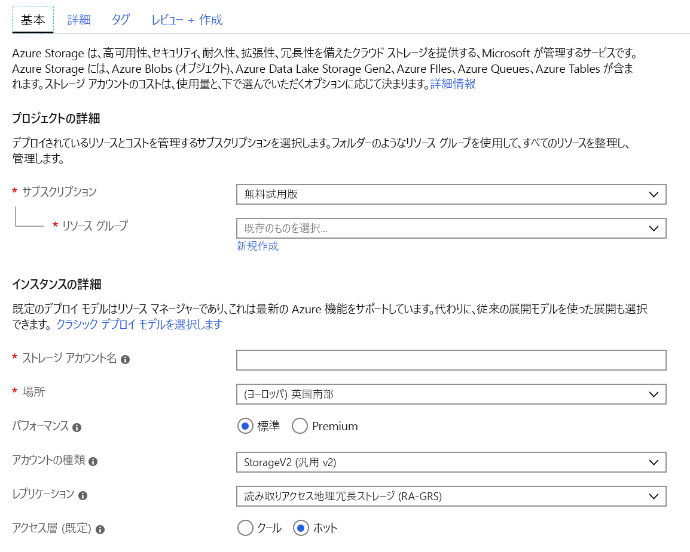
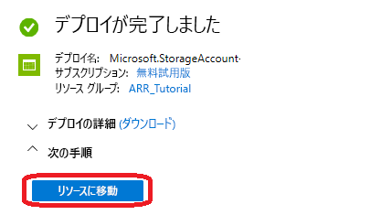
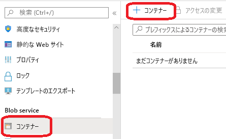
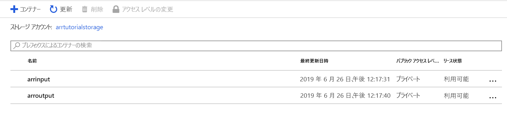
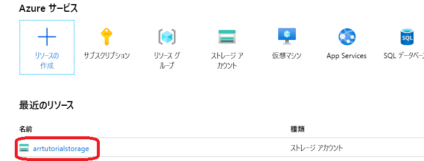
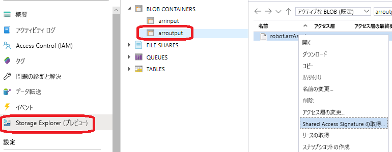

# <a name="quickstart-convert-a-model-for-rendering"></a>クイック スタート:モデルをレンダリング用に変換する

[Quickstart:Unity によるモデルのレンダリング](render-model.md)」では、Unity サンプル プロジェクトを使用して組み込みモデルをレンダリングする方法について学習しました。 このガイドでは、独自のモデルを変換する方法について説明します。

学習内容は次のとおりです。

> [!div class="checklist"]
>
> * 入力と出力用に Azure Blob Storage アカウントを設定する
> * Azure Remote Rendering で使用する 3D モデルをアップロードして変換する
> * 変換された 3D モデルをレンダリング用にアプリケーションに含める

## <a name="prerequisites"></a>前提条件

* 「[Quickstart: Unity によるモデルのレンダリング](render-model.md)」を完了する
* Azure PowerShell をインストールする [(ドキュメント)](https://docs.microsoft.com/powershell/azure/)
  * 管理者権限で PowerShell を開きます。
  * `Install-Module -Name Az -AllowClobber` を実行します。

## <a name="overview"></a>概要

サーバー上のレンダラーは、FBX や GLTF などのソース モデル形式を直接扱うことはできません。 代わりに、モデルを専用のバイナリ形式にする必要があります。
変換サービスは、Azure Blob Storage からのモデルを使用して、変換されたモデルを指定済みの Azure Blob Storage コンテナーに書き戻します。

必要なもの:

* Azure サブスクリプション
* サブスクリプション内の "StorageV2" アカウント
* 入力モデル用の BLOB ストレージ コンテナー
* 出力データ用の BLOB ストレージ コンテナー
* 変換対象のモデル。「[サンプル モデル](../samples/sample-model.md)」を参照してください。
  * [サポートされるソース形式](../how-tos/conversion/model-conversion.md#supported-source-formats)の一覧を参照してください。
  * サンプル変換スクリプトを使用するには、モデルとすべての外部依存関係 (外部のテクスチャやジオメトリなど) が含まれている入力フォルダーを準備する必要があります。

## <a name="azure-setup"></a>Azure のセットアップ

まだアカウントをお持ちでない場合は、[https://azure.microsoft.com/get-started/](https://azure.microsoft.com/get-started/) に移動し、無料アカウント オプションをクリックして、手順に従ってください。

Azure アカウントを作成したら、[https://ms.portal.azure.com/#home](https://ms.portal.azure.com/#home) にアクセスします。

### <a name="storage-account-creation"></a>ストレージ アカウントの作成

BLOB ストレージを作成するには、最初にストレージ アカウントが必要になります。
作成するには、[リソースの作成] ボタンをクリックします。



新しい画面で、左側にある **[ストレージ]** を選択した後、次の列の **[ストレージ アカウント - Blob、File、Table、Queue]** を選択します。



このボタンをクリックすると、ストレージのプロパティを入力するための次の画面が表示されます。



次の方法でフォームに入力します。

* ドロップダウン ボックスの下のリンクから新しいリソース グループを作成し、**ARR_Tutorial** という名前を付けます。
* **[ストレージ アカウント名]** に一意の名前を入力します。 **この名前はグローバルに一意である必要があります**。そうでないと、名前が既に使用されていることを知らせるプロンプトが表示されます。 このクイックスタートのスコープでは、**arrtutorialstorage** という名前を付けます。 この名前は、このクイックスタートの該当箇所すべてで、適宜自分が使用する名前に置き換える必要があります。
* 近くの **[場所]** を選択します。 他のクイックスタートでレンダリングの設定に使用するのと同じ場所を使用するのが理想的です。
* **[パフォーマンス]** を [標準] に設定します。
* **[アカウントの種類]** を [StorageV2 (general purpose v2)]\(StorageV2 (汎用 v2)\) に設定します。
* **[レプリケーション]** を [読み取りアクセス geo 冗長ストレージ (RA-GRS)] に設定します。
* **[アクセス層]** を [ホット] に設定します。

他のタブのプロパティを変更する必要はないので、 **[確認および作成]** を続行し、手順に従ってセットアップを完了してかまいません。

これで、Web サイトからデプロイの進行状況について通知されるようになり、最終的には "デプロイが完了しました" と報告されます。 次の手順については、 **[リソースに移動]** ボタンをクリックします。



### <a name="blob-storage-creation"></a>BLOB ストレージの作成

次に、2 つの BLOB コンテナーが必要です。1 つは入力用で、もう 1 つは出力用です。

上の **[リソースに移動]** ボタンから、リスト メニューを含むパネルが左側に表示されるページに移動できます。 **[Blob service]** カテゴリの下のリストで、 **[コンテナー]** ボタンをクリックします。



**[+ コンテナー]** ボタンを押して、**入力用**の BLOB ストレージ コンテナーを作成します。
作成時には、次の設定を使用します。
  
* [名前] = arrinput
* [パブリック アクセス レベル] = 非公開

コンテナーが作成されたら、 **[+ コンテナー]** を再度クリックし、**出力用**コンテナーに対してこれらの設定を繰り返します。

* [名前] = arroutput
* [パブリック アクセス レベル] = 非公開

これで、2 つの BLOB ストレージ コンテナーが作成されました。



## <a name="run-the-conversion"></a>変換を実行する

アセット変換サービスの呼び出しを簡単にするため、ユーティリティ スクリプトが用意されています。 それは *Scripts* フォルダーにあり、**Conversion.ps1** という名前が付いています。

具体的には、このスクリプトは次のように動作します。

1. 指定されたディレクトリ内のすべてのファイルを、ローカル ディスクから入力用ストレージ コンテナーにアップロードします。
1. [アセット変換 REST API](../how-tos/conversion/conversion-rest-api.md) を呼び出します。これは入力用ストレージ コンテナーからデータを取得し、変換 ID を返す変換を開始します。
1. 変換プロセスが成功または失敗で終了するまで、取得した変換 ID を使用して変換状態 API をポーリングします。
1. 出力用ストレージ内の変換されたアセットへのリンクを取得します。

このスクリプトは、*Scripts\arrconfig.json* というファイルから構成を読み取ります。 この JSON ファイルをテキスト エディターで開きます。

```json
{
    "accountSettings": {
        "arrAccountId": "8*******-****-****-****-*********d7e",
        "arrAccountKey": "R***************************************l04=",
        "region": "<your-region>"
    },
    "renderingSessionSettings": {
        "vmSize": "standard",
        "maxLeaseTime": "1:00:00"
    },
    "assetConversionSettings": {
        "localAssetDirectoryPath": "D:\\tmp\\robot",
        "resourceGroup": "ARR_Tutorial",
        "storageAccountName": "arrexamplestorage",
        "blobInputContainerName": "arrinput",
        "inputFolderPath": "robotConversion",
        "inputAssetPath": "robot.fbx",
        "blobOutputContainerName": "arroutput",
        "outputFolderPath":"converted/robot",
        "outputAssetFileName": "robot.arrAsset"
    }
}
```

**accountSettings** グループ (アカウント ID とキー) 内の構成は、[クイックスタート「Unity によるモデルのレンダリング」](render-model.md)の資格情報と同様に入力する必要があります。

**assetConversionSettings** グループ内では、**resourceGroup**、**blobInputContainerName**、**blobOutputContainerName** を必ず上記のように変更します。
値 **arrtutorialstorage** は、ストレージ アカウントの作成時に選択した一意の名前に置き換える必要があることに注意してください。

**localAssetDirectoryPath** を変更して、変換対象のモデルが含まれるディスク上のディレクトリを指すようにします。 パス内のバックスラッシュ ("\\") は、ニ重のバックスラッシュ ("\\\\") を使用して正しくエスケープするように注意してください。

**localAssetDirectoryPath** で指定されているパスのすべてのデータは、**inputFolderPath** によって指定されたサブパスにある BLOB コンテナー **blobInputContainerName** にアップロードされます。 そのため、上の構成例の "D:\\tmp\\robot" ディレクトリのコンテンツは、パス "robotConversion" のストレージ アカウント "arrtutorialstorage" にある BLOB コンテナー "arrinput" にアップロードされます。 既存のファイルは上書きされます。

**inputAssetPath** を、変換するモデルのパスに変更します。パスは localAssetDirectoryPath に対する相対パスです。 パスの区切り記号には、"\\" ではなく "/" を使用します。 そのため、"D:\\tmp\\robot" に直接配置されている "robot.fbx" ファイルには "robot.fbx" を使用します。

変換されたモデルは、**blobOutputContainerName** によって指定されたストレージ コンテナーに書き戻されます。 サブパスは、オプションの **outputFolderPath** を使用して指定できます。 上記の例では、結果の "robot.arrAsset" が "converted/robot" にある出力用の BLOB コンテナーにコピーされます。

構成設定である **outputAssetFileName** によって、変換されたアセットの名前が決まります。このパラメーターは省略可能であり、省略した場合は出力ファイル名は入力ファイル名から推測されます。 

PowerShell を開き、「[前提条件](#prerequisites)」に記載されているとおり *Azure PowerShell* がインストールされていることを確認します。 そして、次のコマンドでご自分のサブスクリプションにログインし、画面上の指示に従います。

```PowerShell
Connect-AzAccount
```

> [!NOTE]
> 組織に複数のサブスクリプションがある場合は、SubscriptionId および Tenant 引数の指定が必要になることがあります。 詳細については、[Connect-AzAccount のドキュメント](https://docs.microsoft.com/powershell/module/az.accounts/connect-azaccount)を参照してください。

`azure-remote-rendering\Scripts` ディレクトリに移動して、変換スクリプトを実行します。

```PowerShell
.\Conversion.ps1 -UseContainerSas
```

次のような結果が表示されます。

変換スクリプトによって、変換されたモデルの *Shared Access Signature (SAS)* URI が生成されます。 これで、この URI を**モデル名**としてクイックスタートのサンプル アプリにコピーできるようになりました (「[クイックスタート: Unity によるモデルのレンダリング](render-model.md)」を参照してください)。


 このサンプルは、カスタム モデルを読み込んでレンダリングするようになっています。

## <a name="optional-re-creating-a-sas-uri"></a>省略可能:SAS URI を再作成する

変換スクリプトによって作成された SAS URI は、24 時間のみ有効です。 ただし、この有効期限が切れた後に、モデルを再度変換する必要はありません。 代わりに、次の手順で説明するように、ポータルで新しい SAS を作成できます。

1. [Azure portal](https://www.portal.azure.com) に移動します
1. 自分の**ストレージ アカウント** リソースをクリックします。
1. 次の画面で、左側のパネルにある **[ストレージ エクスプローラー]** をクリックし、*arroutput* BLOB ストレージ コンテナー内にある実際の出力モデル ( *.arrAsset* ファイル) を見つけます。 対象のファイルを右クリックし、コンテキスト メニューから **[Shared Access Signature の取得]** を選択します。
1. 新しい画面が開き、そこで有効期限を選択できます。 **[作成]** をクリックし、次のダイアログに表示される URI をコピーします。 この新しい URI により、スクリプトによって作成された一時 URI が置き換えられます。

## <a name="next-steps"></a>次のステップ

これで、基本的な知識が得られたので、さらに詳しい知識を得るためのチュートリアルをご覧ください。

モデルの変換の詳細を学びたい場合は、[モデル変換 REST API](../how-tos/conversion/conversion-rest-api.md) をチェックしてみてください。

> [!div class="nextstepaction"]
> [チュートリアル:Unity プロジェクトをゼロから設定する](../tutorials/unity/project-setup.md)
