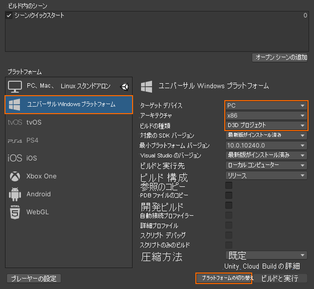

# クイック スタート:Unity のサンプルをデスクトップにデプロイする

このクイックスタートでは、Unity 用のクイックスタート サンプル アプリをデスクトップ PC にデプロイして実行する方法について説明します。

このクイックスタートでは、次の方法について説明します。

> [!div class="checklist"]
>
>* デスクトップ用のクイックスタート サンプル アプリを作成する
>* サンプルを PC にデプロイする
>* PC でサンプルを実行する

## 前提条件

このクイックスタートでは、「[クイックスタート: Unity によるモデルのレンダリング](render-model.md)」のサンプル プロジェクトをデプロイします。

シーンと共に自分の資格情報が適切に保存されており、Unity エディター内からセッションに接続できることを確認してください。

## 仮想現実のサポートを無効にする

現在、デスクトップではフラット デスクトップ アプリのみがサポートされているため、VR サポートは無効にする必要があります。

1. *[Edit]\(編集\) > [Project Settings]\(プロジェクトの設定\)* を開きます。
1. 左側にある **[Player]\(プレーヤー\)** を選択します。
1. **[Universal Windows Platform settings]\(ユニバーサル Windows プラットフォームの設定\)** タブを選択します。
1. **[XR Settings]\(XR 設定\)** を展開します。
1. **[Virtual Reality Supported]\(仮想現実のサポート\)** を無効にします。
    
1. *[XR Settings]\(XR 設定\)* の上にある **[Publishing Settings]\(公開の設定\)** を展開します。
1. **[Supported Device Families]\(サポートされるデバイス ファミリ\)** で、 **[Desktop]\(デスクトップ\)** がオンになっていることを確認します。

## サンプル プロジェクトをビルドする

1. *[File]\(ファイル\) > [Build Settings]\(ビルド設定\)* の順に開きます。
1. *[Platform]\(プラットフォーム\)* を**ユニバーサル Windows プラットフォーム**に変更します (**PC スタンドアロン**もサポートされますが、ここでは使用しません)。
1. *[Target Device]\(ターゲットデバイス\)* を **[PC]** に設定します。
1. *[Architecture]\(アーキテクチャ\)* を **[x86]** に設定します。
1. *[Build Type]\(ビルドの種類\)* を **[D3D Project]\(D3D プロジェクト\)** に設定します。
  
1. **[Switch Platform]\(プラットフォームに切り替え\)** を選択します。
1. **[Build]\(ビルド\)** (または [Build And Run]\(ビルドして実行\)) を押すと、ソリューションを格納するフォルダーを選択するよう求められます。
1. 生成された **Quickstart.sln** を Visual Studio で開きます。
1. 構成を **[Release]\(リリース\)** と **[x86]** に変更します。
1. デバッガー モードを **[Local Machine]\(ローカル コンピューター\)** に切り替えます。
  
1. ソリューションをビルドします (F7)。

> [!WARNING]
> 必ず **[x86]** を選択してください。 現在、**x64** はサポートされていません。「[プラットフォームの制限事項](../reference/limits.md#platform-limitations)」を参照してください。

## サンプル プロジェクトを起動する

Visual Studio のデバッガーを開始します (F5)。 アプリが PC に自動的にデプロイされます。

サンプル アプリが起動し、新しいセッションを開始します。 しばらくすると、セッションの準備が完了し、リモートでレンダリングされたモデルが表示されます。
サンプルを後でもう一度起動する場合は、[スタート] メニューからも検索できます。

## 次のステップ

次のクイックスタートでは、カスタム モデルの変換について確認します。

> [!div class="nextstepaction"]
> [クイック スタート: モデルをレンダリング用に変換する](convert-model.md)
