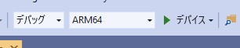

# <a name="quickstart-deploy-native-c-openxr-sample-to-hololens"></a>クイックスタート: ネイティブ C++ OpenXR サンプルを HoloLens にデプロイする

このクイックスタートでは、OpenXR ベースのネイティブ C++ チュートリアル アプリケーションを HoloLens 2 にデプロイして実行する方法について説明します。

このクイックスタートでは、次の方法について説明します。

> [!div class="checklist"]
>
>* HoloLens のチュートリアル アプリケーションをビルドする。
>* ソース コードにある ARR の資格情報を変更する。
>* デバイスにサンプルをデプロイして実行する。

## <a name="prerequisites"></a>前提条件

Azure Remote Rendering サービスにアクセスするには、まず[アカウントを作成する](../../../how-tos/create-an-account.md)必要があります。

次のソフトウェアがインストールされている必要があります。

* Windows SDK 10.0.18362.0 [(ダウンロード)](https://developer.microsoft.com/windows/downloads/windows-10-sdk)
* 最新バージョンの Visual Studio 2019 [(ダウンロード)](https://visualstudio.microsoft.com/vs/older-downloads/)
* [Visual Studio tools for Mixed Reality](/windows/mixed-reality/install-the-tools)。 特に、次の *ワークロード* のインストールは必須です。
  * **C++ によるデスクトップ開発**
  * **ユニバーサル Windows プラットフォーム (UWP) の開発**
* Git ([ダウンロード](https://git-scm.com/downloads))

## <a name="clone-the-arr-samples-repository"></a>ARR サンプル リポジトリをクローンする

グローバル Azure Remote Rendering サンプルを含む Git リポジトリをクローンします。 コマンド プロンプトを開き (Windows の [スタート] メニューで「`cmd`」と入力します)、ARR サンプル プロジェクトを格納するディレクトリに移動します。

次のコマンドを実行します。

```cmd
mkdir ARR
cd ARR
git clone https://github.com/Azure/azure-remote-rendering
```

最後のコマンドでは、Azure Remote Rendering 用のさまざまなサンプル プロジェクトを含む ARR ディレクトリにサブディレクトリを作成します。

C++ HoloLens チュートリアルは、*NativeCpp/HoloLens-OpenXr* サブディレクトリにあります。

## <a name="build-the-project"></a>プロジェクトをビルドする

*NativeCpp/HoloLens-OpenXr* サブディレクトリに格納されているソリューション ファイル *BasicXrApp.sln* を Visual Studio 2019 で開きます。

ビルド構成は、"*デバッグ*" (または "*リリース*") と *ARM64* に切り替えます。 また、デバッガー モードが "*リモート マシン*" ではなく "*デバイス*" に設定されていることを確認してください。



チュートリアルのソース コードではアカウントの資格情報がハードコーディングされているため、有効な資格情報に変更します。 そのために、Visual Studio 内で `OpenXrProgram.cpp` ファイルを開き、`InitARR()` 関数内でクライアントが作成される部分に変更を加えます。

```cpp
// 2. Create Client
{
    // Users need to fill out the following with their account data and model
    RR::SessionConfiguration init;
    init.AccountId = "00000000-0000-0000-0000-000000000000";
    init.AccountKey = "<account key>";
    init.RemoteRenderingDomain = "westus2.mixedreality.azure.com"; // <change to the region that the rendering session should be created in>
    init.AccountDomain = "westus2.mixedreality.azure.com"; // <change to the region the account was created in>
    m_modelURI = "builtin://Engine";
    m_sessionOverride = ""; // If there is a valid session ID to re-use, put it here. Otherwise a new one is created
    m_client = RR::ApiHandle(RR::RemoteRenderingClient(init));
}
```

具体的には、次の値を変更します。
* `init.AccountId`、`init.AccountKey`、`init.AccountDomain` に使用するアカウント データを実際の値に変更します。 [アカウント情報の取得](../../../how-tos/create-an-account.md#retrieve-the-account-information)方法についての段落を参照してください。
* [リージョン](../../../reference/regions.md)が `westus2` 以外である場合は、`init.RemoteRenderingDomain` 文字列のリージョン部分を変更して、リモート レンダリング セッションを作成する場所を指定します (例: `"westeurope.mixedreality.azure.com"`)。
* 加えて、`m_sessionOverride` を既存のセッション ID に変更することができます。 セッションは、このサンプルの外部で作成できます。たとえば、[PowerShell スクリプト](../../../samples/powershell-example-scripts.md#script-renderingsessionps1)を使用するか、[セッションの REST API](../../../how-tos/session-rest-api.md) を使用して直接作成できます。
サンプルを複数回実行する必要がある場合は、サンプルの外部でセッションを作成するようお勧めします。 セッションを渡さなかった場合、起動のたびに新しいセッションが作成されます。起動には数分かかる場合があります。

アプリケーションをコンパイルする準備が整いました。

## <a name="launch-the-application"></a>アプリケーションの起動

1. USB ケーブルで HoloLens をお使いの PC に接続します。
1. HoloLens の電源をオンにし、スタート メニューが表示されるまで待ちます。
1. Visual Studio のデバッガーを開始します (F5)。 アプリがデバイスに自動的にデプロイされます。

サンプル アプリが起動して、現在のアプリケーション状態を通知するテキスト パネルが表示されます。 起動時の状態は、新しいセッションの開始中か、既存のセッションへの接続中のどちらかとなります。 モデルの読み込みが完了すると、組み込みのエンジン モデルがちょうど頭の位置に表示されます。 エンジン モデルとローカルにレンダリングされた回転キューブとが、オクルージョンに関してしっかりと相互に作用し合います。

サンプルを後でもう一度起動したい場合、HoloLens のスタート メニューからサンプルを見つけることもできますが、コンパイルで組み込まれたセッション ID の有効期限が切れている可能性があるので注意してください。

## <a name="next-steps"></a>次のステップ

ARR 機能を備えたネイティブ OpenXR のサンプルを正常にコンパイルしてデプロイしたので、リモート オブジェクトに相互作用コードを追加することで、サンプルの機能拡張を開始できます。

> [!div class="nextstepaction"]
> [概念: エンティティ](../../../concepts/entities.md)

また、独自の変換されたモデルを挿入できます。

> [!div class="nextstepaction"]
> [クイックスタート: モデルを変換する](../../../quickstarts/convert-model.md)
