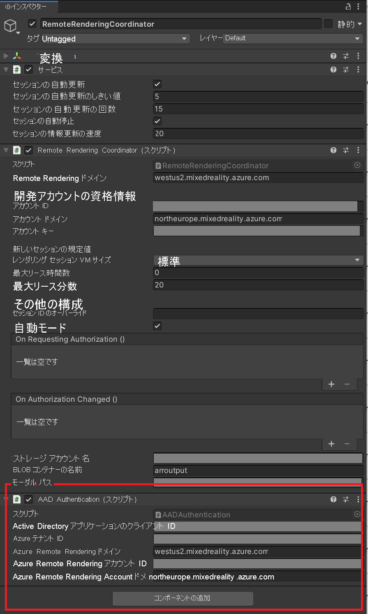

# <a name="tutorial-securing-azure-remote-rendering-and-model-storage"></a>チュートリアル:Azure Remote Rendering とモデル ストレージのセキュリティ保護

このチュートリアルでは、以下の内容を学習します。

> [!div class="checklist"]
>
> * Azure Remote Rendering モデルが格納されている Azure Blob Storage をセキュリティで保護する
> * Azure AD で認証して Azure Remote Rendering インスタンスにアクセスする
> * Azure Remote Rendering の認証に Azure の資格情報を使用する

## <a name="prerequisites"></a>前提条件

* このチュートリアルは、「[チュートリアル: 素材、ライト、および効果の調整](..\materials-lighting-effects\materials-lighting-effects.md)」に基づいて作成されています。

## <a name="why-additional-security-is-needed"></a>追加のセキュリティが必要な理由

アプリケーションの現在の状態とその Azure リソースへのアクセスは次のようになっています。


"アカウント ID + アカウント キー" と "URL + SAS トークン" は、どちらも基本的にユーザー名とパスワードを一緒に格納します。 たとえば、万一 "アカウント ID + アカウント キー" が漏えいした場合、攻撃者は、当事者が費用負担しているアクセス許可がなくても、ARR リソースをたやすく使用できることでしょう。

## <a name="securing-your-content-in-azure-blob-storage"></a>Azure Blob Storage 内のコンテンツをセキュリティで保護する

Azure Remote Rendering は、正しく構成されていれば、Azure Blob Storage のコンテンツに安全にアクセスすることができます。 [ストレージ アカウントをリンクする方法](../../../how-tos/create-an-account.md#link-storage-accounts)に関するセクションを参照して、Azure Remote Rendering インスタンスと Blob Storage アカウントを構成してください。

リンクされた Blob Storage を使用する場合、モデルの読み込みには若干異なる方法を使用します。

```cs
var loadModelParams = new LoadModelFromSasOptions(modelPath, modelEntity);
var task = ARRSessionService.CurrentActiveSession.Connection.LoadModelFromSasAsync(loadModelParams);
```

上記の行では、`FromSas` バージョンのパラメーターとセッション アクションが使用されています。 これらを非 SAS バージョンに変換する必要があります。

```cs
var loadModelParams = new LoadModelOptions(storageAccountPath, blobName, modelPath, modelEntity);
var task = ARRSessionService.CurrentActiveSession.Connection.LoadModelAsync(loadModelParams);
```

リンクされた Blob Storage アカウントからカスタム モデルを読み込むように、**RemoteRenderingCoordinator** を変更してみましょう。

1. [ストレージ アカウントをリンクする方法](../../../how-tos/create-an-account.md#link-storage-accounts)に関するセクションの作業がまだ完了していない場合は、その作業を完了させて、Blob Storage インスタンスへのアクセス許可を ARR インスタンスに付与します。
1. **RemoteRenderingCoordinator** の、現在の **LoadModel** メソッドのすぐ下に、以下に示す変更済みの **LoadModel** メソッドを追加します。

    ```cs
    /// <summary>
    /// Loads a model from blob storage that has been linked to the ARR instance
    /// </summary>
    /// <param name="storageAccountName">The storage account name, this contains the blob containers </param>
    /// <param name="blobName">The blob container name, i.e. arroutput</param>
    /// <param name="modelPath">The relative path inside the container to the model, i.e. test/MyCustomModel.arrAsset</param>
    /// <param name="parent">The parent Transform for this remote entity</param>
    /// <param name="progress">A call back method that accepts a float progress value [0->1]</param>
    /// <returns></returns>
    public async Task<Entity> LoadModel(string storageAccountName, string blobName, string modelPath, Transform parent = null, Action<float> progress = null)
    {
        //Create a root object to parent a loaded model to
        var modelEntity = ARRSessionService.CurrentActiveSession.Connection.CreateEntity();

        //Get the game object representation of this entity
        var modelGameObject = modelEntity.GetOrCreateGameObject(UnityCreationMode.DoNotCreateUnityComponents);

        //Ensure the entity will sync its transform with the server
        var sync = modelGameObject.GetComponent<RemoteEntitySyncObject>();
        sync.SyncEveryFrame = true;

        //Parent the new object under the defined parent
        if (parent != null)
        {
            modelGameObject.transform.SetParent(parent, false);
            modelGameObject.name = parent.name + "_Entity";
        }

        //Load a model that will be parented to the entity
        var loadModelParams = new LoadModelOptions($"{storageAccountName}.blob.core.windows.net", blobName, modelPath, modelEntity);
        var loadModelAsync = ARRSessionService.CurrentActiveSession.Connection.LoadModelAsync(loadModelParams, progress);
        var result = await loadModelAsync;
        return modelEntity;
    }
    ```

    このコードの大部分は元の `LoadModel` メソッドと同じですが、SAS バージョンのメソッド呼び出しが非 SAS バージョンに置き換わっています。

    また、新たに `storageAccountName` と `blobName` という入力が引数に追加されています。 この新しい **LoadModel** メソッドは、最初のチュートリアルで作成した最初の **LoadTestModel** メソッドに似た別のメソッドから呼び出すことになります。

1. **RemoteRenderingCoordinator** の **LoadTestModel** の直後に、次のメソッドを追加します。

    ```cs
    private bool loadingLinkedCustomModel = false;

    [SerializeField]
    private string storageAccountName;
    public string StorageAccountName {
        get => storageAccountName.Trim();
        set => storageAccountName = value;
    }

    [SerializeField]
    private string blobContainerName;
    public string BlobContainerName {
        get => blobContainerName.Trim();
        set => blobContainerName = value;
    }

    [SerializeField]
    private string modelPath;
    public string ModelPath {
        get => modelPath.Trim();
        set => modelPath = value;
    }

    [ContextMenu("Load Linked Custom Model")]
    public async void LoadLinkedCustomModel()
    {
        if (CurrentCoordinatorState != RemoteRenderingState.RuntimeConnected)
        {
            Debug.LogError("Please wait for the runtime to connect before loading the test model. Try again later.");
            return;
        }
        if (loadingLinkedCustomModel)
        {
            Debug.Log("Linked Test model already loading or loaded!");
            return;
        }
        loadingLinkedCustomModel = true;

        // Create a parent object to use for positioning
        GameObject testParent = new GameObject("LinkedCustomModel");
        testParent.transform.position = new Vector3(0f, 0f, 3f);

        await LoadModel(StorageAccountName, BlobContainerName, ModelPath, testParent.transform, (progressValue) => Debug.Log($"Loading Test Model progress: {Math.Round(progressValue * 100, 2)}%"));
    }
    ```

    このコードでは、**RemoteRenderingCoordinator** コンポーネントに、さらに 3 つの文字列変数が追加されます。
    

1. **RemoteRenderingCoordinator** コンポーネントに実際の値を追加します。 [モデル変換のクイックスタート](../../../quickstarts/convert-model.md)に従った場合、実際の値は次のようになります。

    * **[ストレージ アカウント名]** : 実際のストレージ アカウント名。ご利用のストレージ アカウントに対して選んだグローバルに一意な名前です。 クイックスタートでは *arrtutorialstorage* となっていましたが、実際の値は異なります。
    * **[Blob Container Name]\(BLOB コンテナー名\)** : Blob Storage コンテナー (arroutput)。
    * **[Model Path]\(モデル パス\)** : *arrconfig.json* ファイルで定義された "outputFolderPath" と "outputAssetFileName" の組み合わせ。 このクイックスタートでは、"outputFolderPath" が "converted/robot"、"outputAssetFileName" が "robot.arrAsset" となっていました。 結果的に [Model Path]\(モデル パス\) の値は "converted/robot/robot.arrAsset" となりますが、実際の値は異なります。

    >[!TIP]
    > スクリプト [**Conversion.ps1** を実行](../../../quickstarts/convert-model.md#run-the-conversion)する際に "-UseContainerSas" 引数を指定しなかった場合、SAS トークンの代わりに上記の値がすべて出力されます。 
1. カスタム モデルを読み込むためのスペースを確保するために、当面の間、GameObject **TestModel** は削除するか無効にしておいてください。
1. シーンを再生して、リモート セッションに接続します。
1. **RemoteRenderingCoordinator** を右クリックし、 **[Load Linked Custom Model]\(リンクされたカスタム モデルを読み込む\)** を選択します。
    

以上の手順では、SAS トークンをローカル アプリケーションから削除することで、アプリケーションのセキュリティが向上します。

この時点で、アプリケーションの現在の状態とその Azure リソースへのアクセスは次のようになっています。


ローカル アプリケーションから削除すべき "パスワード" はもう 1 つあります。アカウント キーです。 これは Azure Active Directory (AAD) 認証を使用して行うことができます。

## <a name="azure-active-directory-azure-ad-authentication"></a>Azure Active Directory (Azure AD) 認証

AAD 認証を使用すると、ARR を使用している個人またはグループをより制御された方法で特定することができます。 ARR には、アカウント キーを使用する代わりに、[アクセス トークン](../../../../active-directory/develop/access-tokens.md)を受け入れるためのサポートが組み込まれています。 アクセス トークンは、期限付きのユーザー固有キーと考えることができます。そのキーによって解放されるのは、それを必要とする特定のリソースの特定の領域に限られます。

**RemoteRenderingCoordinator** スクリプトには、**ARRCredentialGetter** という名前のデリゲートがあり、**SessionConfiguration** オブジェクトを返すメソッドを保持しています。これは、リモート セッション管理の構成に使用されます。 **ARRCredentialGetter** に別のメソッドを割り当て、Azure サインイン フローを使用できるようにすることで、Azure アクセス トークンを含んだ **SessionConfiguration** オブジェクトを生成できます。 このアクセス トークンは、サインインするユーザーに固有の情報です。

1. [「認証の構成方法: デプロイされたアプリケーションの認証」](../../../how-tos/authentication.md#authentication-for-deployed-applications)に従って、新しい Azure Active Directory アプリケーションを登録し、ARR インスタンスへのアクセスを構成します。
1. 新しい AAD アプリケーションを構成したら、AAD アプリケーションが次の画像のようになっていることを確認します。

    **[AAD アプリケーション] -> [認証]** :::image type="content" source="./../../../how-tos/media/azure-active-directory-app-setup.png" alt-text="アプリの認証":::

    **[AAD アプリケーション] -> [API のアクセス許可]** :::image type="content" source="./media/azure-active-directory-api-permissions-granted.png" alt-text="アプリ API":::    

1. Remote Rendering アカウントを構成したら、その構成が次の画像のようになっていることを確認します。

    **[AAR] -> [アクセス制御 (IAM)]** :::image type="content" source="./../../../how-tos/media/azure-remote-rendering-role-assignments.png" alt-text="ARR ロール":::       

    >[!NOTE]
    > クライアント アプリケーションを介してセッションを管理する場合、"*所有者*" ロールでは不十分です。 セッションの管理権限を付与したい各ユーザーに対して、**Remote Rendering クライアント** ロールを指定する必要があります。 セッションの管理とモデルの変換を行う各ユーザーに対して、**Remote Rendering 管理者** ロールを指定する必要があります。

Azure 側の設定が済んだら、AAR サービスへの接続方法に関する変更をコードに加える必要があります。 そのためには、新しい **SessionConfiguration** オブジェクトを返す、**BaseARRAuthentication** のインスタンスを実装します。 この場合は、Azure アクセス トークンを使用してアカウント情報が構成されます。

1. **AADAuthentication** という名前の新しいスクリプトを作成し、そのコードを次のように置き換えます。

    ```cs
    // Copyright (c) Microsoft Corporation. All rights reserved.
    // Licensed under the MIT License. See LICENSE in the project root for license information.
    
    using Microsoft.Azure.RemoteRendering;
    using Microsoft.Identity.Client;
    using System;
    using System.Linq;
    using System.Threading;
    using System.Threading.Tasks;
    using UnityEngine;
    
    public class AADAuthentication : BaseARRAuthentication
    {
        [SerializeField]
        private string activeDirectoryApplicationClientID;
        public string ActiveDirectoryApplicationClientID
        {
            get => activeDirectoryApplicationClientID.Trim();
            set => activeDirectoryApplicationClientID = value;
        }
    
        [SerializeField]
        private string azureTenantID;
        public string AzureTenantID
        {
            get => azureTenantID.Trim();
            set => azureTenantID = value;
        }
    
        [SerializeField]
        private string azureRemoteRenderingDomain;
        public string AzureRemoteRenderingDomain
        {
            get => azureRemoteRenderingDomain.Trim();
            set => azureRemoteRenderingDomain = value;
        }
    
        [SerializeField]
        private string azureRemoteRenderingAccountID;
        public string AzureRemoteRenderingAccountID
        {
            get => azureRemoteRenderingAccountID.Trim();
            set => azureRemoteRenderingAccountID = value;
        }
    
        [SerializeField]
        private string azureRemoteRenderingAccountDomain;
        public string AzureRemoteRenderingAccountDomain
        {
            get => azureRemoteRenderingAccountDomain.Trim();
            set => azureRemoteRenderingAccountDomain = value;
        }    
    
        public override event Action<string> AuthenticationInstructions;
    
        string authority => "https://login.microsoftonline.com/" + AzureTenantID;
    
        string redirect_uri = "https://login.microsoftonline.com/common/oauth2/nativeclient";

        string[] scopes => new string[] { "https://sts.mixedreality.azure.com//.default" };

        public void OnEnable()
        {
            RemoteRenderingCoordinator.ARRCredentialGetter = GetAARCredentials;
            this.gameObject.AddComponent<ExecuteOnUnityThread>();
        }
    
        public async override Task<SessionConfiguration> GetAARCredentials()
        {
            var result = await TryLogin();
            if (result != null)
            {
                Debug.Log("Account signin successful " + result.Account.Username);
    
                var AD_Token = result.AccessToken;
    
                return await Task.FromResult(new SessionConfiguration(AzureRemoteRenderingAccountDomain, AzureRemoteRenderingDomain, AzureRemoteRenderingAccountID, "", AD_Token, ""));
            }
            else
            {
                Debug.LogError("Error logging in");
            }
            return default;
        }
    
        private Task DeviceCodeReturned(DeviceCodeResult deviceCodeDetails)
        {
            //Since everything in this task can happen on a different thread, invoke responses on the main Unity thread
            ExecuteOnUnityThread.Enqueue(() =>
            {
                // Display instructions to the user for how to authenticate in the browser
                Debug.Log(deviceCodeDetails.Message);
                AuthenticationInstructions?.Invoke(deviceCodeDetails.Message);
            });
    
            return Task.FromResult(0);
        }
    
        public override async Task<AuthenticationResult> TryLogin()
        {
            var clientApplication = PublicClientApplicationBuilder.Create(ActiveDirectoryApplicationClientID).WithAuthority(authority).WithRedirectUri(redirect_uri).Build();
            AuthenticationResult result = null;
            try
            {
                var accounts = await clientApplication.GetAccountsAsync();
    
                if (accounts.Any())
                {
                    result = await clientApplication.AcquireTokenSilent(scopes, accounts.First()).ExecuteAsync();
    
                    return result;
                }
                else
                {
                    try
                    {
                        result = await clientApplication.AcquireTokenWithDeviceCode(scopes, DeviceCodeReturned).ExecuteAsync(CancellationToken.None);
                        return result;
                    }
                    catch (MsalUiRequiredException ex)
                    {
                        Debug.LogError("MsalUiRequiredException");
                        Debug.LogException(ex);
                    }
                    catch (MsalServiceException ex)
                    {
                        Debug.LogError("MsalServiceException");
                        Debug.LogException(ex);
                    }
                    catch (MsalClientException ex)
                    {
                        Debug.LogError("MsalClientException");
                        Debug.LogException(ex);
                        // Mitigation: Use interactive authentication
                    }
                    catch (Exception ex)
                    {
                        Debug.LogError("Exception");
                        Debug.LogException(ex);
                    }
                }
            }
            catch (Exception ex)
            {
                Debug.LogError("GetAccountsAsync");
                Debug.LogException(ex);
            }
    
            return null;
        }
    }
    ```

>[!NOTE]
> このコードは決して完全ではなく、商用アプリケーションに利用できる状態ではありません。 たとえば、最低でも、サインアウトする機能は追加する必要があります。 これは、クライアント アプリケーションが提供する `Task RemoveAsync(IAccount account)` メソッドを使用して実現できます。 このコードはあくまでチュートリアル用であり、アプリケーションごとに実装は異なります。

このコードはまず、**AquireTokenSilent** を使用してサイレントにトークンを取得しようと試みます。 ユーザーが以前にこのアプリケーションに対する認証が完了していれば、成功となります。 成功しなかった場合、よりユーザーを巻き込んだ手法がとられます。

このコードでは、[デバイス コード フロー](../../../../active-directory/develop/v2-oauth2-device-code.md)を使用してアクセス トークンを取得します。 このフローによって、ユーザーはその Azure アカウントにコンピューターまたはモバイル デバイスでサインインし、得られたトークンを HoloLens アプリケーションに送り返すことができます。

ARR の観点から見て、このクラスの最も重要な部分は次の行です。

```cs
return await Task.FromResult(new SessionConfiguration(AzureRemoteRenderingAccountDomain, AzureRemoteRenderingDomain, AzureRemoteRenderingAccountID, "", AD_Token, ""));
```

ここでは、リモート レンダリング ドメイン、アカウント ID、アカウント ドメイン、アクセス トークンを使用して新しい **SessionConfiguration** オブジェクトを作成します。 その後、このトークンは、前に構成したロールベースのアクセス許可に基づいてユーザーが承認されている限り、ARR サービスでリモート レンダリング セッションの各種の処理 (クエリ、作成、参加) を行う際に使用されます。

この変更により、アプリケーションの現在の状態とその Azure リソースへのアクセスは次のようになります。


ユーザーの資格情報がデバイスに格納されていない (この場合は、デバイスで入力されていない) ので、漏えいのリスクはきわめて低くなります。 これでデバイスは、ユーザー固有かつ期限付きのアクセス トークンを使用して ARR にアクセスするようになります。ここでは、アクセス制御 (IAM) を使用して Blob Storage にアクセスします。 以上の 2 つの手順によって、ソース コードから "パスワード" が完全に削除され、セキュリティが大幅に向上しました。 ただし、これがセキュリティの最大限度というわけではありません。モデルとセッションの管理を Web サービスに移動すれば、セキュリティはさらに向上します。 その他のセキュリティに関する考慮事項については、[商用対応](../commercial-ready/commercial-ready.md)に関する章を参照してください。

### <a name="testing-aad-auth"></a>AAD 認証をテストする

Unity エディターでは、AAD 認証がアクティブである場合、アプリケーションを起動するたびに認証を行う必要があります。 デバイス上では、認証ステップが初回に実行されます。再度必要となるのは、トークンの有効期限が切れるか、トークンが無効化されたときだけです。

1. **RemoteRenderingCoordinator** GameObject に **AADAuthentication** コンポーネントを追加します。

    

> [!NOTE]
> [ARR サンプル レポジトリ](https://github.com/Azure/azure-remote-rendering)から完了したプロジェクトを使用している場合、タイトル横のチェックボックスをクリックして **AAD Authentication** コンポーネントを有効にしてください。

1. クライアント ID とテナント ID の値を入力します。 これらの値は、[アプリの登録] の [概要] ページで確認できます。

    * **[Active Directory Application Client ID]\(Active Directory アプリケーション クライアント ID\)** は、AAD アプリの登録にある *[アプリケーション (クライアント) ID]* です (下図参照)。
    * **[Azure Tenant ID]\(Azure テナント ID\)** は、AAD アプリの登録にある *[ディレクトリ (テナント) ID]* です (下図参照)。
    * **[Azure Remote Rendering Domain]\(Azure Remote Rendering ドメイン\)** は、**RemoteRenderingCoordinator** の Remote Rendering ドメインで使用しているものと同じドメインです。
    * **[Azure Remote Rendering Account ID]\(Azure Remote Rendering アカウント ID\)** は、**RemoteRenderingCoordinator** に使用しているものと同じ **アカウント ID** です。
    * **[Azure Remote Rendering Account Domain]\(Azure Remote Rendering アカウント ドメイン\)** は、**RemoteRenderingCoordinator** で使用しているものと同じ **アカウント ドメイン** です。

    :::image type="content" source="./media/azure-active-directory-app-overview.png" alt-text="アプリケーション (クライアント) ID とディレクトリ (テナント) ID が強調表示されているスクリーンショット。":::

1. Unity エディターの [Play]\(再生\) を押し、セッションの実行に同意します。
    **AAD Authentication** コンポーネントはビュー コントローラーを備えているため、セッション承認のモーダル パネルの後にプロンプトを表示するように自動的にフックアップされます。
1. **AppMenu** の右側のパネルに表示される手順に従います。
    次のように表示されます。
    
    指定されたコードをセカンダリ デバイス (または同じデバイス上のブラウザー) に入力した後、自分の資格情報を使用してログインすると、要求元のアプリケーション (この場合は Unity エディター) にアクセス トークンが返されます。

その後は、アプリケーションのすべての処理が通常どおりに続行されます。 想定したとおりに一連のステージが進行しない場合は、何かエラーが発生していないか Unity コンソールで確認してください。

## <a name="build-to-device"></a>デバイスにビルドする

MSAL を使用してアプリケーションをデバイスにビルドする場合、プロジェクトの **Assets** フォルダーにファイルを追加する必要があります。 そうすることで、**チュートリアル アセット** に含まれている *Microsoft.Identity.Client.dll* を使用して、アプリケーションがコンパイラによって適切にビルドされます。

1. **Assets** に、**link.xml** という名前の新しいファイルを追加します。
1. そのファイルに次の内容を追加します。

    ```xml
    <linker>
        <assembly fullname="Microsoft.Identity.Client" preserve="all"/>
        <assembly fullname="System.Runtime.Serialization" preserve="all"/>
        <assembly fullname="System.Core">
            <type fullname="System.Linq.Expressions.Interpreter.LightLambda" preserve="all" />
        </assembly>
    </linker>
    ```

1. 変更を保存します

[「クイックスタート: Unity のサンプルを HoloLens にデプロイする」の「サンプル プロジェクトをビルドする」](../../../quickstarts/deploy-to-hololens.md#build-the-sample-project)の手順に従って、HoloLens にビルドしてください。

## <a name="next-steps"></a>次のステップ

一連のチュートリアルの最後に、Azure Remote Rendering を使用した本番運用対応のアプリケーションを作成するための概念トピックをいくつか取り上げます。

> [!div class="nextstepaction"]
> [次:商用対応](../commercial-ready/commercial-ready.md)