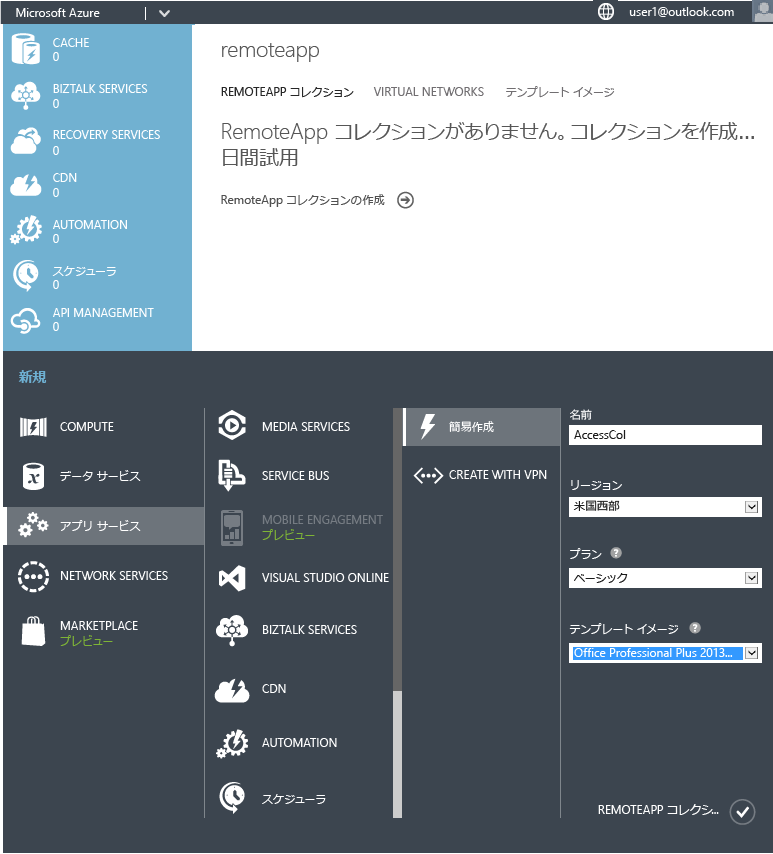
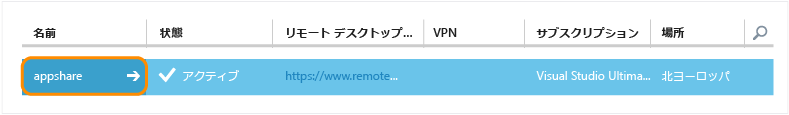
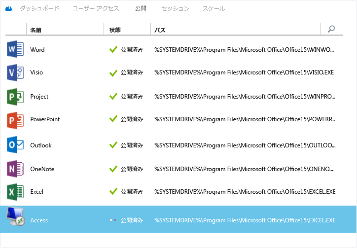
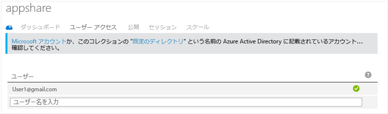
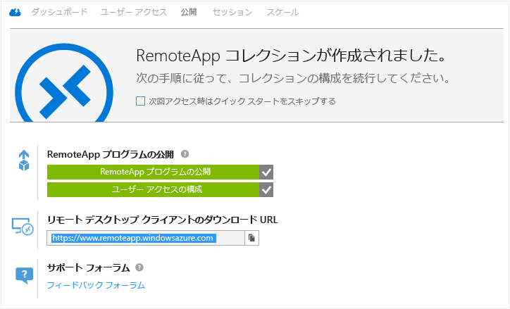
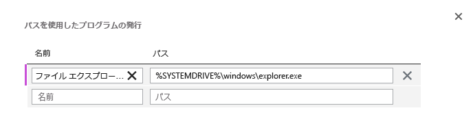
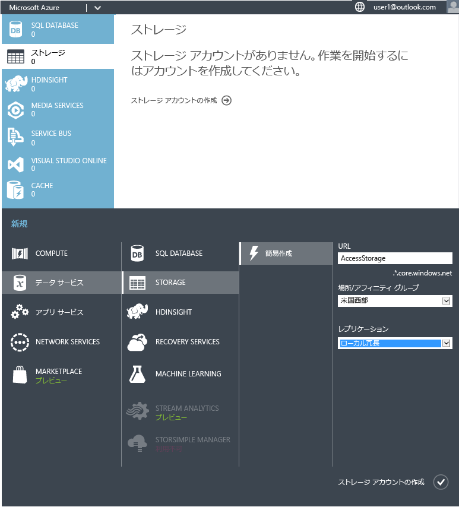
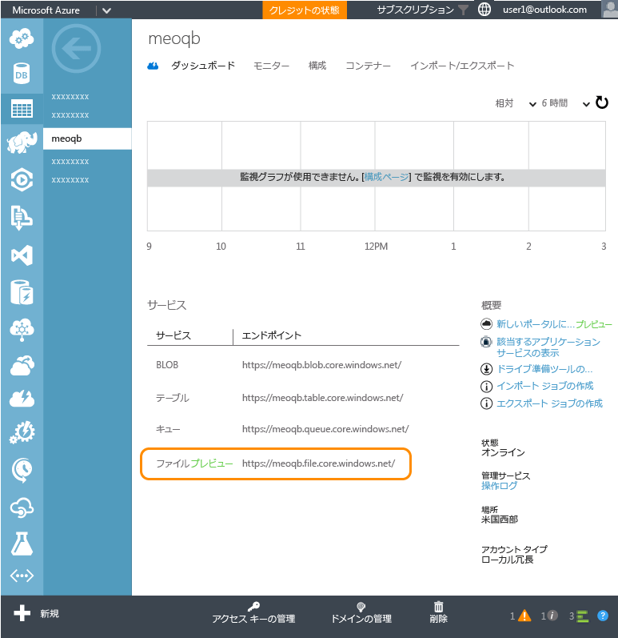
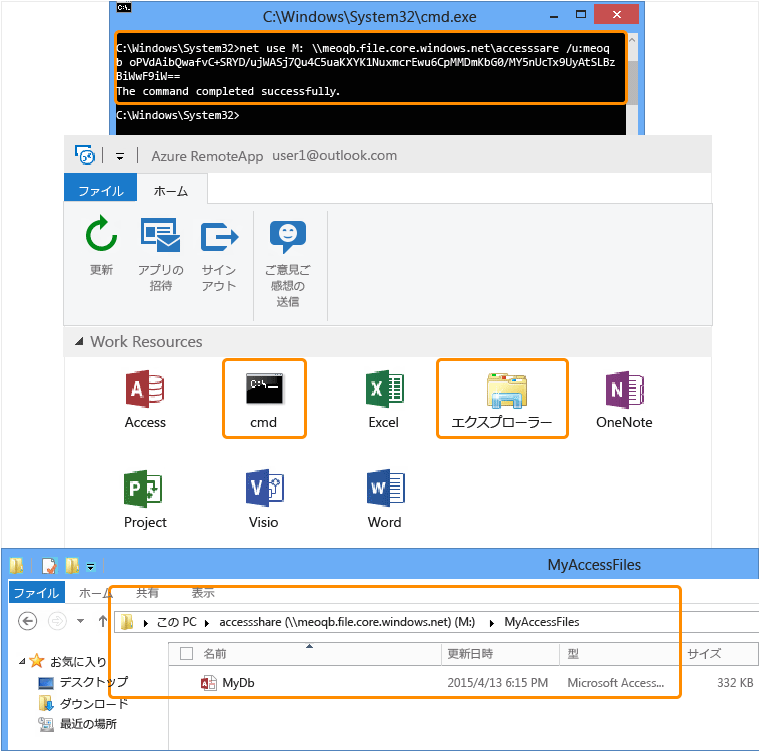
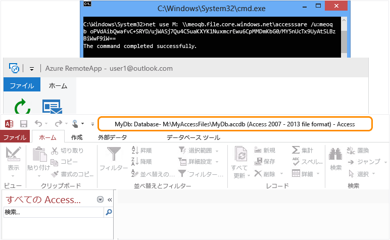

# Azure RemoteApp を使用して任意のデバイス上で任意の Windows アプリを実行する
> [!IMPORTANT]
> Azure RemoteApp の提供は終了しました。 詳細については、 [お知らせ](https://go.microsoft.com/fwlink/?linkid=821148) をご覧ください。
> 
> 

Azure RemoteApp を使用すると、Windows アプリケーションを、どこでどんなデバイスを使っていても、今すぐ実行できるようなります。 10 年も昔に作成したカスタム アプリケーションであっても、Office アプリであっても、ユーザーは、それらの少数のアプリケーションのために特定のオペレーティング システム (Windows XP など) を使い続ける必要はもうありません。

Azure RemoteApp を使用すれば、ユーザーも、自分の Android や Apple デバイスを使用して Windows (または Windows Phone) でするのと同じエクスペリエンスが得られます。 これは、インターネット接続のあるどこからでもユーザーがアクセスできる Azure 上の Windows 仮想マシンに Windows アプリケーションがホストされることにより、実現されます。 

これを行う方法の例をご確認ください。

この記事では、すべてのユーザーと Access を共有します。 ただし、実際には任意のアプリを使用できます。 Windows Server 2012 R2 コンピューターにインストールできるアプリであれば、次の手順に従ってアプリを共有できます。 アプリが動作することを確認するには、 [アプリの要件](remoteapp-appreqs.md) に関するページを参照してください。

Access はデータベースです。せっかくのデータベースが役立つように、ユーザーが Access データ共有にアクセスできるようにするいくつかの手順を実行しましょう。 使用するアプリがデータベースではない場合や、ユーザーがファイル共有にアクセスできるようにする必要がない場合、このチュートリアルではこれらの手順をスキップできます。

> [!NOTE]
> このチュートリアルを完了するには、Azure アカウントが必要です。
> 
> * 無料で [Azure アカウントを開く](https://azure.microsoft.com/free/?WT.mc_id=A261C142F)ことができます。Azure の有料サービスを試用できるクレジットが提供されます。このクレジットを使い切ってもアカウントは維持されるため、Websites など無料の Azure サービスをご利用になれます。 明示的に設定を変更して課金を求めない限り、クレジット カードに課金されることはありません。
> * [MSDN サブスクライバーの特典を有効にする](https://azure.microsoft.com/pricing/member-offers/msdn-benefits-details/?WT.mc_id=A261C142F) こともできます - MSDN サブスクリプションにより、有料の Azure のサービスを使用できるクレジットが毎月与えられます。
> 
> 

## RemoteApp コレクションの作成
コレクションの作成から始めましょう。 コレクションは、アプリとユーザーのコンテナーとして機能します。 各コレクションは 1 つのイメージに基づいており、独自に作成するか、サブスクリプションで提供されるものを使用することができます。 このチュートリアルでは、共有しようとしているアプリを含む、Office 2013 試用版のイメージを使用します。

1. Azure ポータルの左側のナビゲーション ツリーで、RemoteApp が表示されるまで下へスクロールします。 そのページを開きます。
2. **[RemoteApp コレクションを作成する]**をクリックします。
3. **[簡易作成]** をクリックし、コレクションの名前を入力します。
4. コレクションの作成に使用するリージョンを選択します。 最適に利用するには、ユーザーがアプリにアクセスする場所と地理的に最も近いリージョンを選択します。 一例として、このチュートリアルでは、ユーザーがワシントン州レドモンドにいるものと想定しましょう。 最も近い Azure リージョンは **米国西部**です。
5. 使用する課金プランを選択します。 Basic 課金プランでは、1 つの大型 Azure VM に 16 人のユーザーが設定され、Standard 課金プランの場合は 10 人のユーザーが設定されます。 一般的に、Basic プランはデータ エントリ型のワークフローに適しています。 Office のような生産性アプリの場合は、Standard プランが適しています。
6. 最後に、Office Professional 2013 のイメージを選択します。 このイメージには、Office 2013 アプリが含まれています。 確認 - このイメージは、評価版のコレクションおよび POC にのみ有効です。 このイメージは実稼働環境コレクションでは使用できません。
7. ここで、 **[RemoteApp コレクションの作成]**をクリックします。

これでコレクションの作成が開始しますが、この作業には 1 時間ほどかかる場合があります。

次に、ユーザーを追加しましょう。

## ユーザーとのアプリの共有
コレクションが正常に作成されたら、ユーザーに対して Access を発行し、アクセス権を持つユーザーを追加する段階になります。

コレクションの作成時に、Azure RemoteApp のノードから移動している場合は、まず Azure ホーム ページから元の場所に戻ります。

1. 作成しておいたコレクションをクリックし、追加のオプションにアクセスして、コレクションを構成します。
   
2. **[発行しています]** タブの画面の下部にある **[発行]** をクリックしてから、**[[スタート] メニューのプログラムの発行]** をクリックします。
   
3. 一覧から発行するアプリを選択します。 ここでは Access を選択します。 **[完了]**をクリックします。 アプリの発行が完了するまで待機します。
   
4. アプリの発行が完了したら、 **[ユーザー アクセス]** タブに移動して、アプリにアクセスする必要があるユーザーを全員追加します。 ユーザーのユーザー名 (電子メール アドレス) を入力して、 **[保存]**をクリックします。

1. 次はいよいよ、これらの新しいアプリへのアクセス方法をユーザーに通知する段階です。 そのためには、リモート デスクトップ クライアントのダウンロード URL を示す電子メールをユーザーに送信します。
   

## Access へのアクセスの構成
一部のアプリケーションでは、RemoteApp でデプロイした後に追加の構成が必要になります。 ここでは、特に Access で、任意のユーザーがアクセスできるファイル共有を Azure 上に作成しようとしています。 (その必要がない場合は、ユーザーがローカル ネットワーク上のファイルと情報にアクセスできる[ハイブリッド コレクション](remoteapp-create-hybrid-deployment.md)を、クラウド コレクションの代わりに作成することもできます)。それから、ユーザーのコンピューターのローカル ドライブを Azure ファイル システムにマップするように、ユーザーに通知する必要があります。

管理者として行う最初の部分です。 次に、ユーザーが行ういくつかの手順があります。

1. まず、コマンド ライン インターフェイス (cmd.exe) を発行します。 **[発行しています]** タブで **[cmd]** を選択し、次に **[発行]、[パスを使用したプログラムの発行]** の順にクリックします。
2. アプリの名前、およびパスを入力します。 ここでは、名前には「File Explorer」、パスには「%SYSTEMDRIVE%\windows\explorer.exe」を使用します。
   
3. ここで、Azure [ストレージ アカウント](../storage/storage-create-storage-account.md)を作成する必要があります。 サンプルには「accessstorage」という名前が付いています。 わかりやすい名前を 1 つ選んでください (「accessstorage」という名前は 1 つしか使えないため)。 
4. 次に、ダッシュボードに戻り、ストレージ (エンドポイントの場所) へのパスを取得します。 しばらくの間使用するので、このパスをどこかにコピーしておいてください。
   
5. ストレージ アカウントが作成されたら、次は、プライマリ アクセス キーが必要になります。 **[アクセス キーの管理]**をクリックして、プライマリ アクセス キーをコピーします。
6. ここで、ストレージ アカウントのコンテキストを設定し、Access 用の新しいファイル共有を作成します。 管理者特権の Windows PowerShell ウィンドウで、次のコマンドレットを実行します。
   
        $ctx=New-AzureStorageContext <account name> <account key>
        $s = New-AzureStorageShare <share name> -Context $ctx
   
    このチュートリアルの共有で実行するコマンドレットは次のとおりです。
   
        $ctx=New-AzureStorageContext accessstorage <key>
        $s = New-AzureStorageShare <share name> -Context $ctx

次は、ユーザーの番です。 まず、ユーザーに [RemoteApp クライアント](remoteapp-clients.md)をインストールしてもらいます。 次に、作成してある Azure ファイル共有にユーザーが各自のアカウントからドライブをマップし、各自の Access ファイルを追加する必要があります。 以下の方法でこれを実行できます。

1. RemoteApp クライアントで、発行されたアプリにアクセスします。 cmd.exe プログラムを起動します。
2. コンピューターからファイル共有にドライブをマップするには、次のコマンドを実行します。
   
        net use z: \\<accountname>.file.core.windows.net\<share name> /u:<user name> <account key>
   
    **/persistent** パラメーターを yes に設定した場合は、マップされたドライブがセッション間で保持されます。
3. 次に、RemoteApp から、ファイル エクスプローラーのアプリを起動します。 共有アプリで使用する任意の Access ファイルを、ファイル共有にコピーします。
   
4. 最後に、Access を起動し、共有したデータベースを開きます。 クラウドで実行されている Access のデータが表示されるはずです。
   

これで、どんなデバイスであっても、RemoteApp クライアントをインストールしておけば Access を使用できます。

<!--Every topic should have next steps and links to the next logical set of content to keep the customer engaged-->
## 次のステップ
コレクションの作成方法を習得できたので、 [Office 365 を使用するコレクション](remoteapp-tutorial-o365anywhere.md)を作成してみてください。 あるいは、ローカル ネットワークにアクセスする [ハイブリッド コレクション ](remoteapp-create-hybrid-deployment.md)を作成することもできます。

<!--Image references-->

<!--HONumber=Dec16_HO2-->

