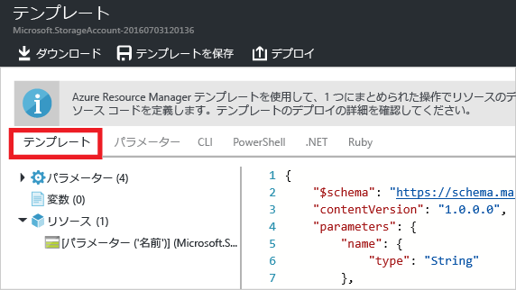

<properties
	pageTitle="Azure Resource Manager テンプレートをエクスポートする | Microsoft Azure"
	description="Azure Resource Manager を使用して、既存のリソース グループからテンプレートをエクスポートします。"
	services="azure-resource-manager"
	documentationCenter=""
	authors="tfitzmac"
	manager="timlt"
	editor="tysonn"/>

<tags
	ms.service="azure-resource-manager"
	ms.workload="multiple"
	ms.tgt_pltfrm="na"
	ms.devlang="na"
	ms.topic="get-started-article"
	ms.date="08/03/2016"
	ms.author="tomfitz"/>

# 既存のリソースから Azure Resource Manager テンプレートをエクスポートする

Resource Manager を使用すると、サブスクリプション内の既存のリソースから Resource Manager テンプレートをエクスポートできます。この生成されたテンプレートを使用すると、テンプレートの構文を学習したり、必要に応じてソリューションの再デプロイを自動化したりすることができます。

テンプレートのエクスポートには 2 つの異なる方法があることに注意する必要があります。

- デプロイに使用した実際のテンプレートをエクスポートできます。エクスポートしたテンプレートには、元のテンプレートで定義されたのと同じパラメーターと変数がすべて含まれます。この方法は、ポータルからリソースをデプロイした場合に役立ちます。それらのリソースを作成するためのテンプレートの構築方法をご確認ください。
- リソース グループの現在の状態を表すテンプレートをエクスポートできます。エクスポートしたテンプレートは、デプロイに使用したテンプレートに基づいていません。代わりに、リソース グループのスナップショットであるテンプレートが作成されます。エクスポートしたテンプレートにはハードコーディングされた多くの値が含まれ、おそらく、通常定義するのと同程度のパラメーターは含まれません。この方法は、ポータルまたはスクリプトでリソース グループを修正してあり、そのリソース グループをテンプレートとしてキャプチャする必要が生じた場合に役に立ちます。

このトピックでは、両方の方法を示します。記事「[エクスポートした Azure Resource Manager テンプレートのカスタマイズ](resource-manager-customize-template.md)」では、リソース グループの現在の状態から生成されたテンプレートを取得し、ソリューションの再デプロイに活用する方法について確認できます。

このチュートリアルではまず、Azure ポータルにサインインし、ストレージ アカウントを作成して、そのストレージ アカウントのテンプレートをエクスポートします。次に、仮想ネットワークを追加してリソース グループに変更を加えます。最後に、その最新の状態を表す新しいテンプレートをエクスポートします。この記事では、単純なインフラストラクチャを扱っていますが、より複雑なソリューションのテンプレートのエクスポートにも、同様の手順を使用できます。

## ストレージ アカウントの作成

1. [Azure ポータル](https://portal.azure.com)で、**[新規]**、**[データ + ストレージ]**、**[ストレージ アカウント]** の順に選択します。

      

2. ストレージ アカウントを作成し、名前を **storage**、自分のイニシャル、日付の組み合わせにします。ストレージ アカウント名は Azure 内で一意である必要があります。最初に指定した名前が既に使用されていた場合は、別の名前を指定してください。リソース グループには、**ExportGroup** を使用します。他のプロパティには既定値をそのまま使用します。**[作成]** を選択します。

      

デプロイが完了すると、サブスクリプションにストレージ アカウントが含まれた状態になります。

## デプロイ履歴からのテンプレートのエクスポート

1. 新しいリソース グループのリソース グループ ブレードに移動します。ブレードに直前のデプロイの結果が表示されていることがわかります。そのリンクを選択します。

      

2. グループのデプロイの履歴が表示されます。このケースでは、ブレードに表示されるデプロイはおそらく 1 つだけです。このデプロイを選択します。

     

3. ブレードにデプロイの概要が表示されます。概要には、デプロイの状態とその操作、およびパラメーターに指定した値が含まれています。デプロイに使用されたテンプレートを表示するには、**[テンプレートの表示]** を選択します。

     

4. Resource Manager によって、次の 6 つのファイルが取得されます。

   1. **Template** - ソリューションのインフラストラクチャを定義するテンプレート。ポータルでストレージ アカウントを作成したときに、Resource Manager はテンプレートを使用してそれをデプロイし、今後参照できるようにテンプレートを保存しました。
   2. **Parameters** - デプロイ中に値を渡すために使用できるパラメーター ファイル。最初のデプロイ中に指定した値が含まれていますが、テンプレートを再デプロイするときに任意の値を変更することができます。
   3. **CLI** - テンプレートをデプロイするために使用できる Azure CLI (コマンド ライン インターフェイス) スクリプト ファイル。
   4. **PowerShell** - テンプレートをデプロイするために使用できる Azure PowerShell スクリプト ファイル。
   5. **.NET** - テンプレートをデプロイするために使用できる .NET クラス。
   6. **Ruby** - テンプレートをデプロイするために使用できる Ruby クラス。

     ファイルは、ブレードのリンクを通じて使用できます。テンプレートは、このブレードに既定で表示されます。

       

     特にテンプレートに気を付けてください。テンプレートは次のようになっているはずです。

        {
          "$schema": "https://schema.management.azure.com/schemas/2015-01-01/deploymentTemplate.json#",
          "contentVersion": "1.0.0.0",
          "parameters": {
            "name": {
              "type": "String"
            },
            "accountType": {
              "type": "String"
            },
            "location": {
              "type": "String"
            },
            "encryptionEnabled": {
              "defaultValue": false,
              "type": "Bool"
            }
          },
          "resources": [
            {
              "type": "Microsoft.Storage/storageAccounts",
              "sku": {
                "name": "[parameters('accountType')]"
              },
              "kind": "Storage",
              "name": "[parameters('name')]",
              "apiVersion": "2016-01-01",
              "location": "[parameters('location')]",
              "properties": {
                "encryption": {
                  "services": {
                    "blob": {
                      "enabled": "[parameters('encryptionEnabled')]"
                    }
                  },
                  "keySource": "Microsoft.Storage"
                }
              }
            }
          ]
        }
 
これは、ストレージ アカウントの作成に使用した実際のテンプレートです。さまざまな種類のストレージ アカウントをデプロイできるパラメーターが含まれていることに注目してください。テンプレートの構造の詳細については、「[Azure Resource Manager のテンプレートの作成](resource-group-authoring-templates.md)」を参照してください。テンプレートで使用できる関数の完全な一覧については、「[Azure Resource Manager のテンプレートの関数](resource-group-template-functions.md)」を参照してください。


## 仮想ネットワークの追加

前のセクションでダウンロードしたテンプレートは、元のデプロイのインフラストラクチャを表しています。デプロイ後に行われた変更には対応できません。この問題をわかりやすく示すために、ポータルで仮想ネットワークを追加して、リソース グループを変更してみましょう。

1. リソース グループのブレードで、**[追加]** を選択します。

      

2. 利用可能なリソースから、**[Virtual Network]** を選択します。

      

2. 仮想ネットワークの名前を **VNET** にし、その他のプロパティには既定値を使用します。**[作成]** を選択します。

      

3. 仮想ネットワークがリソース グループに正常にデプロイされた後で、デプロイの履歴を見直してください。今度は 2 つのデプロイが表示されます。2 つ目のデプロイが表示されない場合は、リソース グループのブレードを閉じてもう一度開く必要があります。最新のデプロイを選択します。

      

4. そのデプロイのテンプレートを確認します。仮想ネットワークを追加するために行った変更だけが定義されていることに注意してください。

一般的には、ソリューションのすべてのインフラストラクチャを 1 回の操作でデプロイするテンプレートを使用することをお勧めします。その方が、デプロイするテンプレートをいくつも覚えておくよりも信頼性の点で有利です。


## リソース グループからのテンプレートのエクスポート

各デプロイには、リソース グループに対して行った変更のみが表示されますが、いつでもテンプレートをエクスポートしてリソース グループ全体の属性を表示できます。

> [AZURE.NOTE] 200 を超えるリソースが含まれるリソース グループのテンプレートをエクスポートすることはできません。

1. リソース グループのテンプレートを表示するには、**[Automation スクリプト]** を選択します。

      

     テンプレート関数のエクスポートは、すべてのリソースの種類でサポートされているわけではありません。この記事で紹介するストレージ アカウントと仮想ネットワークのみがリソース グループに含まれる場合、エラーは表示されません。しかし、他のリソースの種類を作成した場合、エクスポートに関する問題が存在することを示すエラーが表示される可能性があります。これらの問題に対処する方法については、「[エクスポートの問題の修正](#fix-export-issues)」セクションで説明します。

      

2. ソリューションを再デプロイするために使用できる 6 個のファイルが再び表示されますが、今度のテンプレートは少し異なります。このテンプレートには、パラメーターが 2 つだけあります (ストレージ アカウント名用が 1 つと、仮想ネットワーク名用が 1 つ)。

        "parameters": {
          "virtualNetworks_VNET_name": {
            "defaultValue": "VNET",
            "type": "String"
          },
          "storageAccounts_storagetf05092016_name": {
            "defaultValue": "storagetf05092016",
            "type": "String"
          }
        },

     Resource Manager は、デプロイ時に使用されたテンプレートを取得しませんでした。代わりに、リソースの現在の構成に基づいて、新しいテンプレートを生成しました。たとえばこのテンプレートでは、ストレージ アカウントの場所とレプリケーションの値が、次のように設定されます。

        "location": "northeurope",
        "tags": {},
        "properties": {
            "accountType": "Standard_RAGRS"
        },

3. ローカルに作業できるように、テンプレートをダウンロードします。

      

4. ダウンロードした .zip ファイルを検索し、内容を展開します。このダウンロードしたテンプレートは、インフラストラクチャを再デプロイするために使用できます。

## エクスポートの問題の修正

テンプレート関数のエクスポートは、すべてのリソースの種類でサポートされているわけではありません。リソースの種類によっては、機密データの公開を防止するために、Resource Manager によってエクスポートされないものもあります。たとえば、サイトの構成内に接続文字列がある場合、エクスポートしたテンプレートにそれが表示されるのは望ましくありません。この問題は、欠けているリソースを対象のテンプレートに手動で追加することで回避できます。

> [AZURE.NOTE] エクスポートの問題は、リソース グループからエクスポートする場合にのみ発生します。デプロイ履歴からのエクスポートでは発生しません。最後のデプロイがリソース グループの現在の状態を正確に表しているようであれば、リソース グループからではなく、デプロイ履歴からテンプレートをエクスポートすることをお勧めします。単一のテンプレートで定義されていない変更をリソース グループに加えた場合にのみ、リソース グループからエクスポートしてください。

たとえば、Web アプリ、SQL Database、サイト構成内の接続文字列が含まれたリソース グループのテンプレートをエクスポートすると、次のようなメッセージが表示されます。


メッセージを選択すると、エクスポートされなかったリソースの種類が正確に表示されます。
     


このトピックでは、次の一般的な修正について説明します。これらのリソースを実装するには、パラメーターをテンプレートに追加する必要があります。詳細については、[エクスポートしたテンプレートのカスタマイズと再デプロイ](resource-manager-customize-template.md)に関するページを参照してください。

### 接続文字列

Web サイト リソースで、接続文字列の定義をデータベースに追加します。

```
{
  "type": "Microsoft.Web/sites",
  ...
  "resources": [
    {
      "apiVersion": "2015-08-01",
      "type": "config",
      "name": "connectionstrings",
      "dependsOn": [
          "[concat('Microsoft.Web/Sites/', parameters('<site-name>'))]"
      ],
      "properties": {
          "DefaultConnection": {
            "value": "[concat('Data Source=tcp:', reference(concat('Microsoft.Sql/servers/', parameters('<database-server-name>'))).fullyQualifiedDomainName, ',1433;Initial Catalog=', parameters('<database-name>'), ';User Id=', parameters('<admin-login>'), '@', parameters('<database-server-name>'), ';Password=', parameters('<admin-password>'), ';')]",
              "type": "SQLServer"
          }
      }
    }
  ]
}
```    

### Web サイト拡張機能

Web サイト リソースで、インストールするコードの定義を追加します。

```
{
  "type": "Microsoft.Web/sites",
  ...
  "resources": [
    {
      "name": "MSDeploy",
      "type": "extensions",
      "location": "[resourceGroup().location]",
      "apiVersion": "2015-08-01",
      "dependsOn": [
        "[concat('Microsoft.Web/sites/', parameters('<site-name>'))]"
      ],
      "properties": {
        "packageUri": "[concat(parameters('<artifacts-location>'), '/', parameters('<package-folder>'), '/', parameters('<package-file-name>'), parameters('<sas-token>'))]",
        "dbType": "None",
        "connectionString": "",
        "setParameters": {
          "IIS Web Application Name": "[parameters('<site-name>')]"
        }
      }
    }
  ]
}
```

### 仮想マシン拡張機能

仮想マシン拡張機能の例については、「[Azure Windows VM 拡張機能の構成サンプル](./virtual-machines/virtual-machines-windows-extensions-configuration-samples.md)」を参照してください。

### 仮想ネットワーク ゲートウェイ

仮想ネットワーク ゲートウェイのリソースの種類を追加します。

```
{
  "type": "Microsoft.Network/virtualNetworkGateways",
  "name": "[parameters('<gateway-name>')]",
  "apiVersion": "2015-06-15",
  "location": "[resourceGroup().location]",
  "properties": {
    "gatewayType": "[parameters('<gateway-type>')]",
    "ipConfigurations": [
      {
        "name": "default",
        "properties": {
          "privateIPAllocationMethod": "Dynamic",
          "subnet": {
            "id": "[resourceId('Microsoft.Network/virtualNetworks/subnets', parameters('<vnet-name>'), parameters('<new-subnet-name>'))]"
          },
          "publicIpAddress": {
            "id": "[resourceId('Microsoft.Network/publicIPAddresses', parameters('<new-public-ip-address-Name>'))]"
          }
        }
      }
    ],
    "enableBgp": false,
    "vpnType": "[parameters('<vpn-type>')]"
  },
  "dependsOn": [
    "Microsoft.Network/virtualNetworks/codegroup4/subnets/GatewaySubnet",
    "[concat('Microsoft.Network/publicIPAddresses/', parameters('<new-public-ip-address-Name>'))]"
  ]
},
```

### ローカル ネットワーク ゲートウェイ

ローカル ネットワーク ゲートウェイのリソースの種類を追加します。

```
{
    "type": "Microsoft.Network/localNetworkGateways",
    "name": "[parameters('<local-network-gateway-name>')]",
    "apiVersion": "2015-06-15",
    "location": "[resourceGroup().location]",
    "properties": {
      "localNetworkAddressSpace": {
        "addressPrefixes": "[parameters('<address-prefixes>')]"
      }
    }
}
```

### 接続

接続のリソースの種類を追加します。

```
{
    "apiVersion": "2015-06-15",
    "name": "[parameters('<connection-name>')]",
    "type": "Microsoft.Network/connections",
    "location": "[resourceGroup().location]",
    "properties": {
        "virtualNetworkGateway1": {
        "id": "[resourceId('Microsoft.Network/virtualNetworkGateways', parameters('<gateway-name>'))]"
      },
      "localNetworkGateway2": {
        "id": "[resourceId('Microsoft.Network/localNetworkGateways', parameters('<local-gateway-name>'))]"
      },
      "connectionType": "IPsec",
      "routingWeight": 10,
      "sharedKey": "[parameters('<shared-key>')]"
    }
},
```


## 次のステップ

ご利用ありがとうございます。 ポータルで作成したリソースからテンプレートをエクスポートする方法について説明しました。

- このチュートリアルのパート 2 では、ダウンロードしたテンプレートにパラメーターを追加してカスタマイズし、スクリプトで再デプロイします。[エクスポートしたテンプレートのカスタマイズと再デプロイ](resource-manager-customize-template.md)に関するページを参照してください。
- PowerShell を使用してテンプレートをエクスポートする方法を確認するには、「[Azure Resource Manager での Azure PowerShell の使用](powershell-azure-resource-manager.md)」を参照してください。
- Azure CLI を使用してテンプレートをエクスポートする方法を確認するには、「[Azure Resource Manager での、Mac、Linux、および Windows 用 Azure CLI の使用](xplat-cli-azure-resource-manager.md)」を参照してください。

<!---HONumber=AcomDC_0928_2016-->