# <a name="move-resources-across-regions-in-powershell"></a>PowerShell でリソースをリージョン間で移動する

この記事では、[Azure Resource Mover](overview.md) で PowerShell を使用して Azure リソースを別の Azure リージョンに移動する方法について説明します。

このチュートリアルでは、以下の内容を学習します。

> [!div class="checklist"]
> * 前提条件と要件を確認する。
> * 移動コレクションを設定する。
> * 移動コレクションにリソースを追加し、依存関係を解決する。
> * ソース リソース グループを準備して移動する。 
> * 他のリソースを準備して移動する。
> * 移動を破棄するか、コミットするかを決定する。 
> * 必要に応じて、移動後にソース リージョンのリソースを削除する。

> [!NOTE]
> 各チュートリアルでは、シナリオを試すための最も簡単な方法を紹介し、既定のオプションを使用します。 

Azure サブスクリプションをお持ちでない場合は、開始する前に [無料アカウント](https://azure.microsoft.com/pricing/free-trial/) を作成してください。 次に、[Azure Portal](https://portal.azure.com) にサインインします。

## <a name="prerequisites"></a>前提条件
**要件** | **説明**
--- | ---
**サブスクリプションのアクセス許可** | 移動するリソースを含むサブスクリプションに "*所有者*" アクセス権があることを確認します<br/><br/> **所有者アクセスが必要な理由:** Azure サブスクリプションの特定のソースと宛先のペアに対してリソースを初めて追加すると、Resource Mover では、サブスクリプションによって信頼されている[システム割り当てマネージド ID](../active-directory/managed-identities-azure-resources/overview.md#managed-identity-types) (旧称: Managed Service ID (MSI)) が作成されます。 ID を作成し、必要なロール (ソース サブスクリプションの共同作成者またはユーザー アクセス管理者) に割り当てるには、リソースを追加するのに使用するアカウントに、サブスクリプションに対する "*所有者*" 権限が必要です。 Azure ロールの詳細については、[こちらを参照してください](../role-based-access-control/rbac-and-directory-admin-roles.md#azure-roles)。
**Resource Mover のサポート** | サポートされているリージョンとその他の一般的な質問を[確認](common-questions.md)します。
**VM のサポート** |  移動するすべての VM がサポートされていることを確認します。<br/><br/> - サポートされている Windows VM を[確認](support-matrix-move-region-azure-vm.md#windows-vm-support)します。<br/><br/> - サポートされている Linux VM とカーネルのバージョンを[確認](support-matrix-move-region-azure-vm.md#linux-vm-support)します。<br/><br/> - サポートされている[コンピューティング](support-matrix-move-region-azure-vm.md#supported-vm-compute-settings)、[ストレージ](support-matrix-move-region-azure-vm.md#supported-vm-storage-settings)、[ネットワーク](support-matrix-move-region-azure-vm.md#supported-vm-networking-settings)の設定を確認します。
**SQL サポート** | SQL リソースを移動する場合は、[SQL の要件一覧](tutorial-move-region-sql.md#check-sql-requirements)を確認してください。
**宛先サブスクリプション** | 宛先リージョンのサブスクリプションには、ターゲット リージョンで移動するリソースを作成するのに十分なクォータが必要です。 クォータがない場合は、[追加の制限を要求](../azure-resource-manager/management/azure-subscription-service-limits.md)します。
**宛先リージョンの料金** | VM の移動先となるターゲット リージョンに関連付する料金と課金を確認します。 [料金計算ツール](https://azure.microsoft.com/pricing/calculator/)を使用すると便利です。

### <a name="review-powershell-requirements"></a>PowerShell の要件を確認する

リソースの移動操作は、Azure portal と PowerShell のいずれを使用しても、ほとんどの場合同じですが、いくつかの例外があります。

**操作** | **PowerShell** | **ポータル**
--- | --- | ---
**移動コレクションを作成する** | 移動コレクション (移動しようとしているすべてのリソースの一覧) は、自動的に作成されます。 必要な ID のアクセス許可は、ポータルによってバックエンドで割り当てられます。 | 以下を実行するには、PowerShell コマンドレットを使用します。<br/><br/> - 移動コレクションのリソース グループを作成し、その場所を指定する。<br/><br/> - マネージド ID をコレクションに割り当てる。<br/><br/> - リソースをコレクションに追加する。
**移動コレクションを削除する** | ポータルでは、移動コレクションを直接削除することはできません。 | 移動コレクションを削除するには、PowerShell コマンドレットを使用します。
**リソースの移動操作**<br/><br/> (準備、移動の開始、コミットなど)。| Resource Mover による自動検証を使用した単一の手順。 | 以下を実行するには、PowerShell コマンドレットを使用します。<br/><br/> 1) 依存関係を検証する。<br/><br/> 2) 移動を実行する。
**ソース リソースを削除する** | Resource Mover ポータルで直接実行します。 | リソースの種類レベルで PowerShell コマンドレットを実行します。


### <a name="sample-values"></a>サンプルの値

スクリプトの例では、以下の値を使用します。

**設定** | **Value** 
--- | ---
サブスクリプション ID | subscription-id
ソース リージョン |  米国中部
ターゲット リージョン | 米国中西部
リソース グループ (移動コレクションのメタデータを保持) | RG-MoveCollection-demoRMS
移動コレクション名 | PS-centralus-westcentralus-demoRMS
リソース グループ (ソース リージョン) | PSDemoRM 
リソース グループ (ターゲット リージョン) | PSDemoRM-target
リソース移動サービスの場所 | 米国東部 2
IdentityType | SystemAssigned
移動する VM | PSDemoVM


## <a name="sign-into-azure"></a>Azure にサインインする

Connect-AzAccount コマンドレットを使用して、自分の Azure サブスクリプションにサインインします。

```azurepowershell-interactive
Connect-AzAccount – Subscription "<subscription-id>"
```

## <a name="set-up-the-move-collection"></a>移動コレクションを設定する

MoveCollection オブジェクトには、移動するリソースに関するメタデータと構成情報が格納されます。 移動コレクションを設定するには、次の手順を実行します。

- 移動コレクションのリソース グループを作成します。
- MoveCollection リソースを作成できるように、サービス プロバイダーをサブスクリプションに登録します。
- マネージド ID を使用して MoveCollection オブジェクトを作成します。 Resource Mover サービスが配置されているサブスクリプションに MoveCollection オブジェクトがアクセスできるようにするには、サブスクリプションによって信頼されている[システム割り当てマネージド ID](../active-directory/managed-identities-azure-resources/overview.md#managed-identity-types) (旧称: マネージド サービス ID (MSI)) が必要です。
- マネージド ID に Resource Mover サブスクリプションへのアクセスを許可します。

### <a name="create-the-resource-group"></a>リソース グループを作成する

次のとおり、移動コレクションのメタデータと構成情報のリソース グループを作成します。

```azurepowershell-interactive
New-AzResourceGroup -Name "RG-MoveCollection-demoRMS" -Location "East US 2"
```
**出力**:

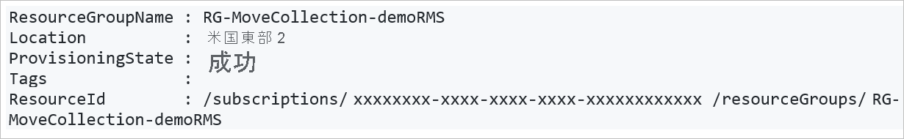

### <a name="register-the-resource-provider"></a>リソース プロバイダーの登録

1. MoveCollection リソースを作成できるように、次のとおり、Microsoft.Migrate リソース プロバイダーを登録します。

    ```azurepowershell-interactive
    Register-AzResourceProvider -ProviderNamespace Microsoft.Migrate
    
2. Wait for registration:

    ```azurepowershell-interactive 
    While(((Get-AzResourceProvider -ProviderNamespace Microsoft.Migrate)| where {$_.RegistrationState -eq "Registered" -and $_.ResourceTypes.ResourceTypeName -eq "moveCollections"}|measure).Count -eq 0)
    {
        Start-Sleep -Seconds 5
        Write-Output "Waiting for registration to complete."
    }
    ```
### <a name="create-a-movecollection-object"></a>MoveCollection オブジェクトを作成する

次のとおり、MoveCollection オブジェクトを作成し、これにマネージド ID を割り当てます。 

```azurepowershell-interactive
New-AzResourceMoverMoveCollection -Name "PS-centralus-westcentralus-demoRMS"  -ResourceGroupName "RG-MoveCollection-demoRMS" -SourceRegion "centralus" -TargetRegion "westcentralus" -Location "centraluseuap" -IdentityType "SystemAssigned"
```

**出力**:

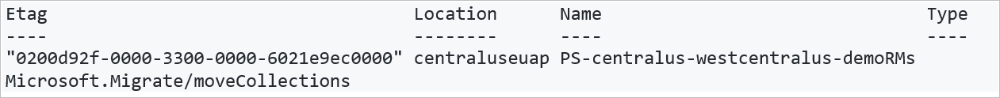


### <a name="grant-access-to-the-managed-identity"></a>マネージド ID にアクセスを許可する

次のとおり、マネージド ID に Resource Mover サブスクリプションへのアクセスを許可します。 自分がサブスクリプションの所有者でなければなりません。

1. MoveCollection オブジェクトから ID の詳細を取得します。

    ```azurepowershell-interactive
    $moveCollection = Get-AzResourceMoverMoveCollection -SubscriptionId $subscriptionId -ResourceGroupName "RG-MoveCollection-demoRMS" -Name "PS-centralus-westcentralus-demoRMS"

    $identityPrincipalId = $moveCollection.IdentityPrincipalId   
    ``` 

2. Azure Resource Mover がサブスクリプションにアクセスしてリソースを移動しやすいように、必要なロールを ID に割り当てます。

    ```azurepowershell-interactive
    New-AzRoleAssignment -ObjectId $identityPrincipalId -RoleDefinitionName Contributor -Scope "/subscriptions/$subscriptionId"

    New-AzRoleAssignment -ObjectId $identityPrincipalId -RoleDefinitionName "User Access Administrator" -Scope "/subscriptions/$subscriptionId"
    ``` 

## <a name="add-resources-to-the-move-collection"></a>移動コレクションにリソースを追加する

移動する既存のソース リソースの ID を取得します。 移動先リソース設定オブジェクトを作成し、移動コレクションにリソースを追加します。

> [!NOTE]
> 移動コレクションに追加されたリソースは、同じサブスクリプション内に存在する必要がありますが、異なるリソース グループに存在することができます。

次のとおり、リソースを追加します。

1. ソース リソース ID を取得します。

    ```azurepowershell-interactive
    Get-AzResource -Name PSDemoVM -ResourceGroupName PSDemoRM
    ```

    **出力**

    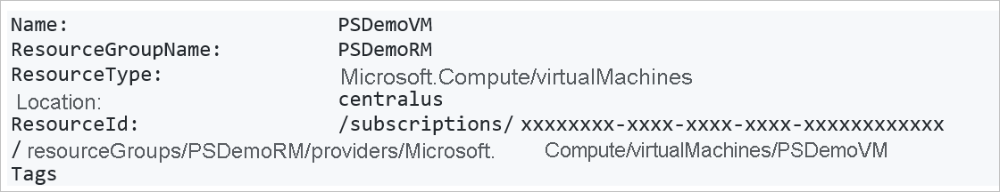

2. 移動しようとしているリソースに基づいて、ターゲット リソース設定オブジェクトを作成します。 このケースでは VM です。

    ```azurepowershell-interactive
    $targetResourceSettingsObj = New-Object Microsoft.Azure.PowerShell.Cmdlets.ResourceMover.Models.Api202101.VirtualMachineResourceSettings
    ```

3. オブジェクトに対し、リソースの種類とターゲット リソース名を設定します。

    ```azurepowershell-interactive
    $targetResourceSettingsObj.ResourceType = "Microsoft.Compute/virtualMachines"
    $targetResourceSettingsObj.TargetResourceName = "PSDemoVM"
    ```
    > [!NOTE]
    > ターゲット VM には、ソース リージョン内の VM と同じ名前が付けられています。 別の名前を選択することもできます。

4. 取得したリソース ID と作成したターゲット設定オブジェクトを使用して、ソース リソースを移動コレクションに追加します。

    ```azurepowershell-interactive
    Add-AzResourceMoverMoveResource -ResourceGroupName "RG-MoveCollection-demoRMS" -MoveCollectionName "PS-centralus-westcentralus-demoRMS" -SourceId "/subscriptions/xxxxxxxx-xxxx-xxxx-xxxx xxxxxxxxxxxx/resourceGroups/
    PSDemoRM/providers/Microsoft.Compute/virtualMachines/PSDemoVM" -Name "PSDemoVM" -ResourceSetting $targetResourceSettingsObj
    ```

    **出力** 

## <a name="validate-and-add-dependencies"></a>依存関係を検証および追加する

追加したリソースが他のリソースに依存しているかどうかを確認し、必要に応じて追加します。 

1. 次のとおり、依存関係を検証します。

    ```azurepowershell-interactive
    Resolve-AzResourceMoverMoveCollectionDependency -ResourceGroupName "RG-MoveCollection-demoRMS" -MoveCollectionName "PS-centralus-westcentralus-demoRMS"
    ```
    **出力 (依存関係が存在する場合)**

    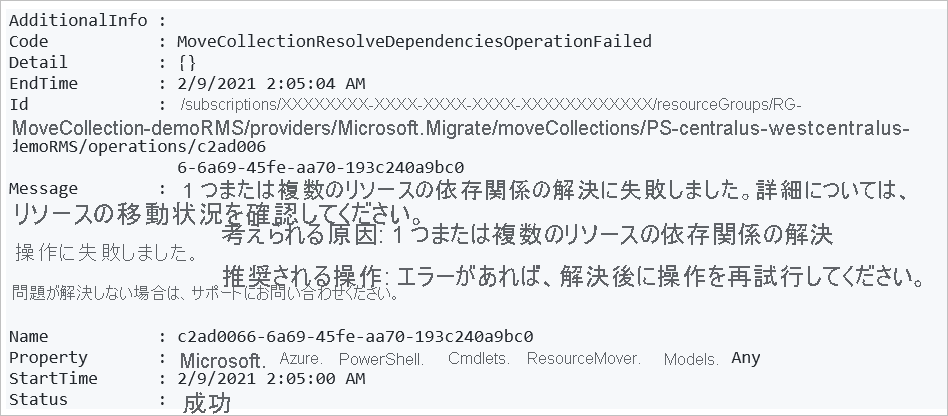

2. 不足している依存関係を特定します。

    - 不足しているすべての依存関係の一覧を取得する場合:

        ```azurepowershell-interactive
        Get-AzResourceMoverUnresolvedDependency -MoveCollectionName "PS-centralus-westcentralus-demoRMS" -ResourceGroupName "RG-MoveCollection-demoRMS" -DependencyLevel Descendant"
        ```
        **出力**   

    - 第 1 レベルの依存関係 (リソースの直接の依存関係) のみを取得する場合:

        ```azurepowershell-interactive
        Get-AzResourceMoverUnresolvedDependency -MoveCollectionName "PS-centralus-westcentralus-demoRMS" -ResourceGroupName "RG-MoveCollection-demoRMS" -DependencyLevel Direct
        ```
        **出力**   

3. 不足している未解決の依存関係を追加するには、上記の手順を繰り返して[リソースを移動コレクションに追加](#add-resources-to-the-move-collection)し、未解決のリソースがなくなるまで再検証します。

> [!NOTE]
> 何かの理由でリソース コレクションからリソースを削除する場合は、[こちらの記事](remove-move-resources.md)の手順に従ってください。

## <a name="add-the-source-resource-group"></a>ソース リソース グループを追加する

移動するリソースが含まれたソース リソース グループを、移動コレクションに追加します。

1. リソース グループの ID を取得します。

    ```azurepowershell-interactive
    Get-AzResourceMoverUnresolvedDependency -MoveCollectionName "PS-centralus-westcentralus-demoRMS" -ResourceGroupName "RG-MoveCollection-demoRMS" -DependencyLevel Direct
    ```
    **出力**   

    > [!NOTE]
    > ここでは、ターゲット リージョンに既に存在するリソース グループを使用しています。

 
2. 取得した ID を使用して、リソース グループをコレクションに追加します。

    ```azurepowershell-interactive
    Add-AzResourceMoverMoveResource -ResourceGroupName "RG-MoveCollection-demoRMS"  -MoveCollectionName "PS-centralus-westcentralus-demoRMS" -SourceId "/subscriptions/xxxxxxxx-xxxx-xxxx-xxxx-xxxxxxxxxxxx/resourcegroups/psdemorm"  -Name "psdemorm"  -ExistingTargetId "/subscriptions/xxxxxxxx-xxxx-xxxx-xxxx-xxxxxxxxxxxx/resourcegroups/PSDemoRM-target"
    ```
    **出力** 

3. リソース グループを追加した後、依存関係を確認して、不足しているものがないことを確かめます。

    ```azurepowershell-interactive
    Resolve-AzResourceMoverMoveCollectionDependency -ResourceGroupName "RG-MoveCollection-demoRMS" -MoveCollectionName "PS-centralus-westcentralus-demoRMS"
    ```
4. 未解決の依存関係がないことがわかります。

    **出力** 


## <a name="prepare-resources"></a>リソースを準備する

通常は、移動前にソース リージョンでリソースを準備する必要があります。 次に例を示します。

- Azure 仮想ネットワーク、ネットワーク アダプター、ロード バランサー、ネットワーク セキュリティ グループなどのステートレス リソースを移動するには、Azure Resource Manager テンプレートのエクスポートが必要になることがあります。
- Azure VM や SQL データベースなどのステートフル リソースを移動するには、ソースからターゲット リージョンにリソースのレプリケートを開始する必要がある場合があります。

このチュートリアルでは VM を移動するので、ソース リソース グループを準備し、その移動を開始してコミットする必要があります。その後で、VM の準備を開始できます。

> [!NOTE]
> 既存のターゲット リソース グループがある場合は、ソース リソース グループの移動を直接コミットし、準備および移動の開始ステージをスキップできます。

  
### <a name="prepare-the-source-resource-group"></a>ソース リソース グループを準備する

1. リソース グループを準備します。

    ```azurepowershell-interactive
    Invoke-AzResourceMoverPrepare -ResourceGroupName "RG-MoveCollection-demoRMS" -MoveCollectionName "PS-centralus-westcentralus-demoRMS"  -MoveResource “PSDemoRM”
    ```
    **出力**

    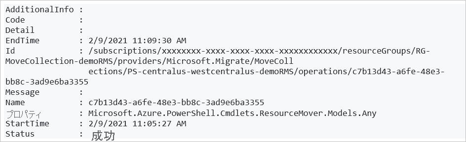

2. ソース リソース グループの移動を開始します。

    ```azurepowershell-interactive
    "RG-MoveCollection-demoRMS" -MoveCollectionName "PS-centralus-westcentralus-demoRMS"  -MoveResource “PSDemoRM”
    ```
    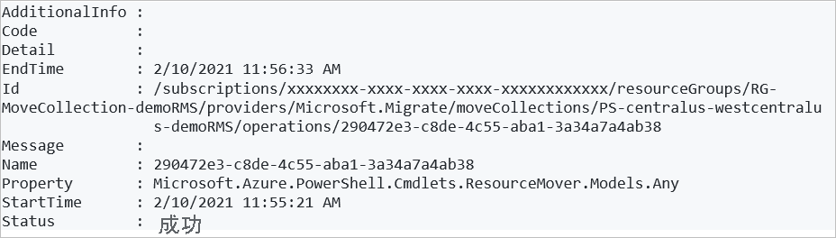

3. ソース リソース グループの移動をコミットします。

    ```azurepowershell-interactive
    Invoke-AzResourceMoverCommit -ResourceGroupName "RG-MoveCollection-demoRMS" -MoveCollectionName "PS-centralus-westcentralus-demoRMS"  -MoveResource “PSDemoRM”
    ```
    **出力**

    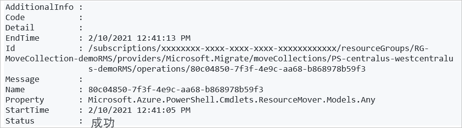


### <a name="prepare-vm-resources"></a>VM リソースを準備する

ソース リソース グループを準備して移動した後で、移動する VM リソースを準備することができます。

1. VM リソースを準備する前に、依存関係を検証します。

    ```azurepowershell-interactive
    $resp = Invoke-AzResourceMoverPrepare -ResourceGroupName "RG-MoveCollection-demoRMS" -MoveCollectionName "PS-centralus-westcentralus-demoRMS"  -MoveResource $('psdemovm') -ValidateOnly
    ```
    **出力**

    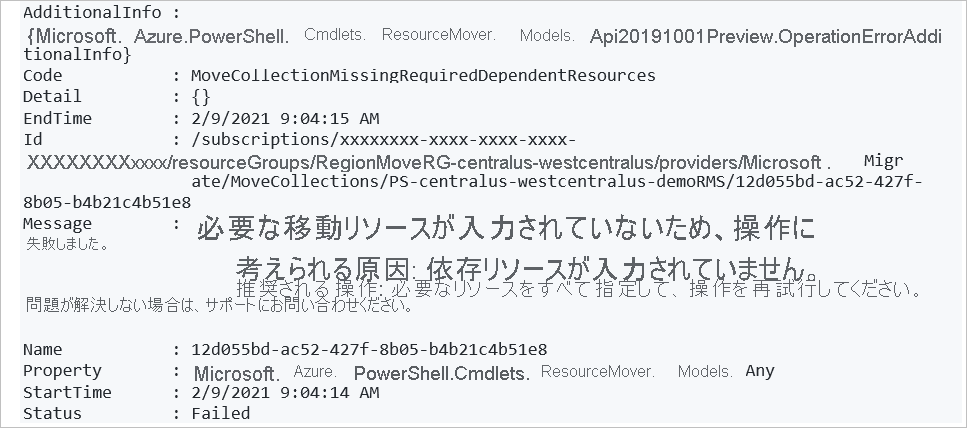

2. VM と共に準備する必要がある依存リソースを取得します。

    ```azurepowershell-interactive
    $resp.AdditionalInfo[0].InfoMoveResource
    ```
    **出力**

    

3. すべての依存リソースの準備プロセスを開始します。

    ```azurepowershell-interactive
    Invoke-AzResourceMoverPrepare -ResourceGroupName "RG-MoveCollection-demoRMS" -MoveCollectionName "PS-centralus-westcentralus-demoRMS"  -MoveResource $('PSDemoVM','psdemovm111', 'PSDemoRM-vnet','PSDemoVM-nsg')
    ```
    **出力**

    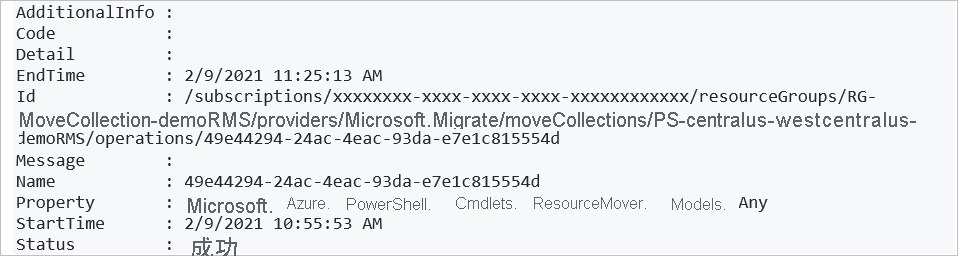


    > [!NOTE]
    > 準備コマンドレットだけでなく、移動の開始コマンドレットやコミット コマンドレットでも、入力パラメーターとして、リソース名の代わりにソース リソース ID を指定することができます。 これを行うには、次を実行します。


    ```azurepowershell-interactive
        Invoke-AzResourceMoverPrepare -ResourceGroupName "RG-MoveCollection-demoRMS" -MoveCollectionName "PS-centralus-westcentralus-demoRMS" -MoveResourceInputType MoveResourceSourceId  -MoveResource $('/subscriptions/xxxxxxxx-xxxx-xxxx-xxxx-xxxxxxxxxxxx/resourceGroups/PSDemoRMS/providers/Microsoft.Network/networkSecurityGroups/PSDemoVM-nsg')
    ```

## <a name="initiate-move-of-vm-resources"></a>VM リソースの移動を開始する

1. VM リソースが "*移動の開始が保留中*" の状態になっていることを確認します。

    ```azurepowershell-interactive
    Get-AzResourceMoverMoveResource  -SubscriptionId “ xxxxxxxx-xxxx-xxxx-xxxx-xxxxxxxxxxxx “ -ResourceGroupName “RG-MoveCollection-demoRMS” -MoveCollectionName “PS-centralus-westcentralus-demoRMS ”   | Where-Object {  $_.MoveStatusMoveState -eq “InitiateMovePending” } | Select Name
    ```    

    **出力**

    

2. 移動を開始します。

    ```azurepowershell-interactive
    Invoke-AzResourceMoverInitiateMove -ResourceGroupName "RG-MoveCollection-demoRMS" -MoveCollectionName "PS-centralus-westcentralus-demoRMS"  -MoveResource $('psdemovm111', 'PSDemoRM-vnet','PSDemoVM-nsg', ‘PSDemoVM’) -MoveResourceInputType "MoveResourceId"
    ```    

    **出力**

    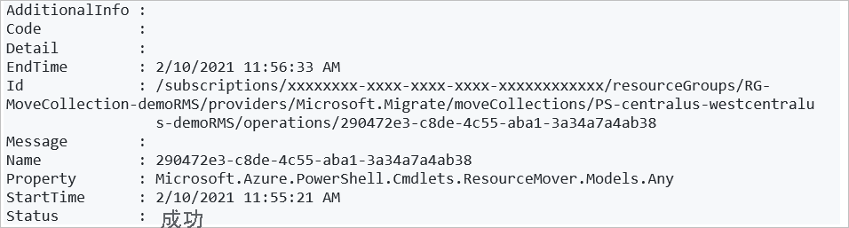


## <a name="discard-or-commit"></a>破棄またはコミットしますか?

最初の移動後に、移動をコミットするか、破棄するかを決定できます。 

- **破棄**: テストする場合は移動を破棄できますが、実際にはソース リソースを移動したくありません。 移動を破棄すると、リソースが "*移動の開始が保留中*" の状態に戻ります。 このとき必要に応じて、移動をもう一度開始できます。
- **コミット**:コミットすると、ターゲット リージョンへの移動が完了します。 コミット後、ソース リソースは "*ソースの削除が保留中*" の状態になり、削除するかどうかを決定できます。

### <a name="discard-the-move"></a>移動を破棄する

移動を破棄するには、以下を実行します。

```azurepowershell-interactive
Invoke-AzResourceMoverDiscard -ResourceGroupName "RG-MoveCollection-demoRMS" -MoveCollectionName "PS-centralus-westcentralus-demoRMS"  -MoveResource $('psdemovm111', 'PSDemoRM-vnet','PSDemoVM-nsg', ‘PSDemoVM’) -MoveResourceInputType "MoveResourceId"
```
**出力**

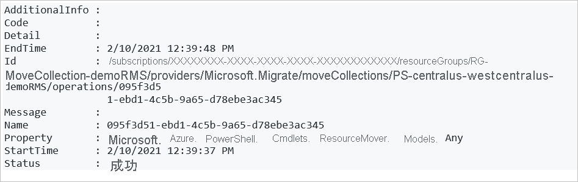


### <a name="commit-the-move"></a>移動をコミットする

1. 次のようにして、移動をコミットします。

    ```azurepowershell-interactive
    Invoke-AzResourceMoverCommit -ResourceGroupName "RG-MoveCollection-demoRMS" -MoveCollectionName "PS-centralus-westcentralus-demoRMS"  -MoveResource $('psdemovm111', 'PSDemoRM-vnet','PSDemoVM-nsg', ‘PSDemoVM’) -MoveResourceInputType "MoveResourceId"
    ```
    **出力**

    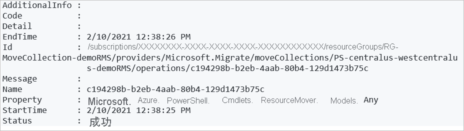

2. すべてのリソースがターゲット リージョンに移動していることを確認します。

    ```azurepowershell-interactive
    Get-AzResourceMoverMoveResource  -ResourceGroupName “RG-MoveCollection-demoRMS ” -MoveCollectionName “PS-centralus-westcentralus-demoRMS”   
    ```
    すべてのリソースが、ターゲット リージョンで "*ソースの削除が保留中*" の状態になりました。

## <a name="delete-source-resources"></a>ソース リソースを削除する

移動をコミットし、ターゲット リージョンでリソースが想定どおりに動作することを確認したら、[Azure portal](../azure-resource-manager/management/manage-resources-portal.md#delete-resources)、[PowerShell](../azure-resource-manager/management/manage-resources-powershell.md#delete-resources)、または [Azure CLI](../azure-resource-manager/management/manage-resources-cli.md#delete-resources) を使用して各ソース リソースを削除できます。

## <a name="next-steps"></a>次のステップ

このチュートリアルでは、次の作業を行いました。

> [!div class="checklist"]
> * PowerShell を使用して Azure VM を別の Azure リージョンに移動しました。
> * VM に関連付けられているリソースを別のリージョンに移動しました。

次は、ポータルを使用して Azure VM の移動を試みます

> [!div class="nextstepaction"]
> [ポータルで Azure VM を移動する](./tutorial-move-region-virtual-machines.md)


