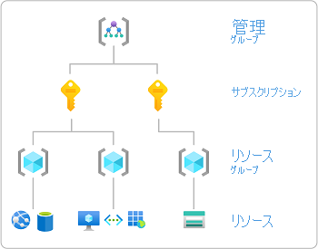
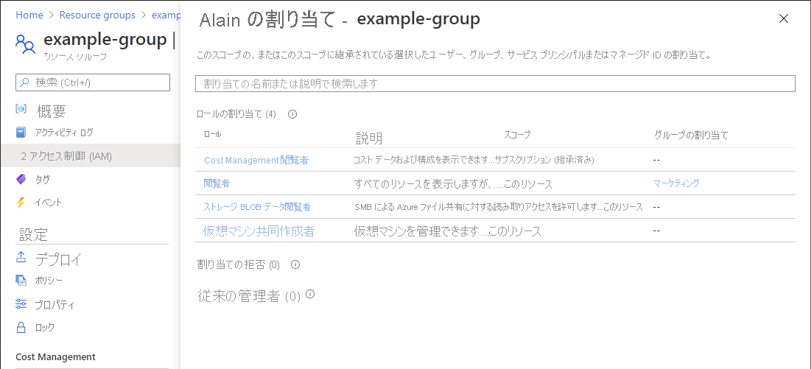
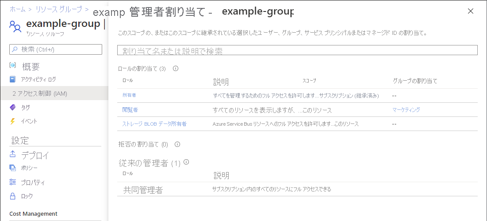

# クイックスタート: Azure リソースに対するユーザーのアクセス権を確認する

一連の Azure リソースに対するユーザーのアクセス権を確認することが必要な場合があります。 アクセス権を確認するには、割り当ての一覧を表示します。 1 人のユーザーのアクセス権を簡単に確認する方法として、 **[アクセス制御 (IAM)]** ページの **[アクセスの確認]** 機能を使用します。

## 手順 1:Azure リソースを開く

ユーザーのアクセス権を確認するには、まず、アクセス権を確認する Azure リソースを開く必要があります。 Azure リソースは、通常 "*スコープ*" と呼ばれるレベルに整理されています。 Azure では、範囲の広いものから順に、管理グループ、サブスクリプション、リソース グループ、リソースの 4 つのレベルでスコープを指定できます。

次の手順に従って、アクセス権を確認する Azure リソースのセットを開きます。

1. [Azure Portal](https://portal.azure.com)を開きます。

1. **管理グループ**、**サブスクリプション**、**リソース グループ**、特定のリソースなど、Azure リソースのセットを開きます。

1. そのスコープの特定のリソースをクリックします。

    リソース グループの例を次に示します。

    

## 手順 2:ユーザーのアクセスを確認

次の手順に従って、前に選択した Azure リソースに対する単一のユーザー、グループ、サービス プリンシパル、またはマネージド ID のアクセス権を確認します。

1. **[アクセス制御 (IAM)]** をクリックします。

    リソース グループの [アクセス制御 (IAM)] ページの例を次に示します。

    ![リソース グループのアクセス制御 - [アクセスの確認] タブ](./media/shared/rg-access-control.png)

1. **[アクセスの確認]** タブの **[検索]** の一覧で、アクセス権を確認するユーザー、グループ、サービス プリンシパル、またはマネージド ID を選択します。

1. 検索ボックスに、表示名、メール アドレス、またはオブジェクト識別子のディレクトリを検索するための文字列を入力します。

    ![[アクセスの確認] の選択リスト](./media/shared/rg-check-access-select.png)

1. セキュリティ プリンシパルをクリックして **[割り当て]** ウィンドウを開きます。

    このペインでは、このスコープで選択されたセキュリティ プリンシパルと、このスコープに継承されたセキュリティ プリンシパルのアクセス権を確認できます。 子スコープでの割り当ては表示されません。 次の割り当てが表示されます。

    - Azure RBAC で追加されたロールの割り当て。
    - Azure Blueprints または Azure マネージド アプリを使用して追加された拒否の割り当て。
    - クラシック デプロイの従来のサービス管理者または共同管理者の割り当て。 

    

## 手順 3:自分のアクセス権を確認する

次の手順に従って、前に選択した Azure リソースに対する自分のアクセス権を確認します。

1. **[アクセス制御 (IAM)]** をクリックします。

1. **[アクセスの確認]** タブで、 **[View my access]\(自分のアクセスの表示\)** ボタンをクリックします。

    割り当てペインが表示され、このスコープでのアクセス権とこのスコープに継承されたアクセス権が一覧表示されます。 子スコープでの割り当ては表示されません。

    

## 次のステップ

> [!div class="nextstepaction"]
> [Azure portal を使用して Azure でのロールの割り当てを一覧表示する](role-assignments-list-portal.md)
