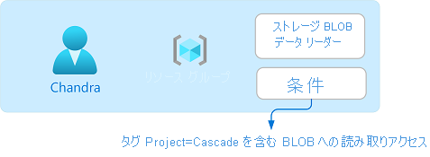
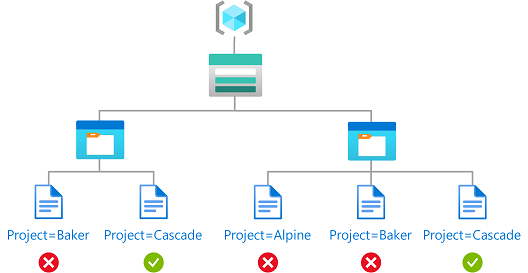

# <a name="what-is-azure-attribute-based-access-control-azure-abac-preview"></a>Azure の属性ベースのアクセス制御 (Azure ABAC) とは (プレビュー)

> [!IMPORTANT]
> Azure ABAC と Azure のロールの割り当て条件は、現在プレビュー段階です。
> このプレビュー バージョンはサービス レベル アグリーメントなしで提供されています。運用環境のワークロードに使用することはお勧めできません。 特定の機能はサポート対象ではなく、機能が制限されることがあります。
> 詳しくは、[Microsoft Azure プレビューの追加使用条件](https://azure.microsoft.com/support/legal/preview-supplemental-terms/)に関するページをご覧ください。

属性ベースのアクセス制御 (ABAC) は、セキュリティ プリンシパル、リソース、環境に関連付けられている属性に基づいてアクセスを定義する認可システムです。 ABAC を使用すると、属性に基づいてセキュリティ プリンシパルにリソースへのアクセス権を付与できます。 Azure ABAC は、Azure 向けに実装された ABAC を指します。

## <a name="what-are-role-assignment-conditions"></a>ロールの割り当て条件とは

Azure のロールベースのアクセス制御 (Azure RBAC) は、Azure リソースにアクセスできるユーザー、そのユーザーがそれらのリソースに対して実行できること、そのユーザーがアクセスできる領域を管理するのに役立つ認可システムです。 ほとんどの場合、Azure RBAC でロールの定義とロールの割り当てを使用すれば、必要なアクセス管理を実現できます。 しかし、もっと詳細にアクセスを管理したり、数百にも及ぶロールの割り当ての管理を簡略化したりすることが必要になることもあるでしょう。

Azure ABAC は、Azure RBAC を基盤としたものであり、特定のアクションのコンテキストにおける属性に基づいたロールの割り当て条件を追加することにより構築されます。 *ロールの割り当て条件* は、ロールの割り当てに追加することによってさらにきめ細かなアクセス制御を可能にする確認のしくみの 1 つです。 条件は、ロールの定義とロールの割り当ての一環として付与されたアクセス許可を絞り込むものです。 たとえば、特定のタグが設定されたオブジェクトしか読み取れない、という条件を設定できます。 条件を使用して特定のリソースに対するアクセスを明示的に拒否することはできません。

## <a name="why-use-conditions"></a>条件を使用する理由

ロールの割り当て条件を使用する利点は主に 3 つあります。

- **さらにきめ細かなアクセス制御を実現する** - ロールの割り当てでは、アクションやデータ アクションを使ったロールの定義を使用して、セキュリティ プリンシパルにアクセス許可を付与します。 条件を使うと、このようなアクセス許可を絞り込み、さらにきめ細かなアクセス制御を実現できます。 このほか、特定のアクションに条件を追加することもできます。 たとえば、自分のサブスクリプションにある BLOB のうち、Project=Blue というタグが設定されているものだけについて、John という人物にアクセス権を付与することができます。 
- **ロールの割り当ての件数を減らす** - Azure サブスクリプションには、ロールの割り当ての上限が定められています。 シナリオによっては、ロールの割り当てが何千件も必要になることがあります。 そのようなロールの割り当てはいずれも、管理が必要です。 このようなシナリオでは、条件を追加することによって使用するロールの割り当てを大幅に減らせる可能性があります。 
- **ビジネスにおいて特定の意味を持つ属性を使用する** - 条件を使うと、ビジネスにおいて特定の意味を持つ属性をアクセス制御に利用できます。 属性の例としては、プロジェクト名、ソフトウェアの開発段階、分類レベルなどがあります。 これらのリソース属性の値は動的なものであり、ユーザーが所属するチームやプロジェクトが変わるのに応じて変化します。

## <a name="example-scenarios-for-conditions"></a>条件のシナリオ例

ロールの割り当てに条件を追加するシナリオをいくつか紹介します。 次に例をいくつか示します。

- タグ Project=Cascade が設定されている BLOB に対する読み取りアクセス
- 新しい BLOB にタグ Project=Cascade を設定する必要がある
- 既存の BLOB に、Project キーまたは Program キーのタグを少なくとも 1 つ設定しておく必要がある
- 既存の BLOB に、Project キーのほかに Cascade、Baker、または Skagit の値のタグを設定しておく必要がある
- blobs-example-container という名前のコンテナーにある BLOB の読み取り、書き込み、または削除
- blobs-example-container という名前のコンテナーにあり、かつ readonly というパスの BLOB に対する読み取りアクセス
- Contosocorp という名前のコンテナーにあり、かつ uploads/contoso というパスの BLOB に対する書き込みアクセス
- タグ Program=Alpine と、logs というパスが設定されている BLOB に対する読み取りアクセス

ここに挙げた例の作成方法の詳細については、「[Azure のロールの割り当て条件の例](../storage/common/storage-auth-abac-examples.md)」を参照してください。

## <a name="where-can-conditions-be-added"></a>条件を追加できる場所

現時点では、[ストレージ BLOB データ アクション](conditions-format.md#actions)がある組み込みまたはカスタムのロールの割り当てに対して条件を追加できます。 これらには、次の組み込みロールが含まれます。

- [ストレージ BLOB データ共同作成者](built-in-roles.md#storage-blob-data-contributor)
- [ストレージ BLOB データ所有者](built-in-roles.md#storage-blob-data-owner)
- [ストレージ BLOB データ閲覧者](built-in-roles.md#storage-blob-data-reader)

条件が追加されるのは、ロールの割り当てと同じスコープです。 条件を追加するには、ロールの割り当てと同じく `Microsoft.Authorization/roleAssignments/write` のアクセス許可が必要です。

条件で使用できるストレージ属性は次のとおりです。

- コンテナー名
- BLOB パス
- BLOB インデックス タグ キー
- BLOB インデックス タグ

> [!TIP]
> BLOB ではほかにも、ユーザー定義による任意のキー値メタデータを格納する機能がサポートされています。 メタデータと BLOB インデックス タグはよく似ていますが、条件では BLOB インデックス タグを使用する必要があります。 詳細については、「[BLOB インデックス タグを使用して Azure BLOB データを管理および検索する (プレビュー)](../storage/blobs/storage-manage-find-blobs.md)」を参照してください。

## <a name="what-does-a-condition-look-like"></a>条件の外観

条件は、新規または既存のロールの割り当てに追加できます。 ここでは、[ストレージ BLOB データ閲覧者](built-in-roles.md#storage-blob-data-reader)ロールが、リソース グループのスコープ内の Chandra というユーザーに割り当てられています。 また、タグ Project=Cascade が設定されている BLOB に対する読み取りアクセスのみを許可する条件が追加されています。



Chandra が Project=Cascade タグの設定されていない BLOB を読み取ろうとしても、アクセスが許可されません。



条件は、Azure portal で次のように表示されます。

![[式の作成] セクション。BLOB インデックス タグの値が表示されています。](./media/shared/condition-expressions.png)

条件をコードで示すと、次のようになります。

```
(
    (
        !(ActionMatches{'Microsoft.Storage/storageAccounts/blobServices/containers/blobs/read'}
        AND
        @Request[subOperation] ForAnyOfAnyValues:StringEqualsIgnoreCase {'Blob.Read.WithTagConditions'})
    )
    OR
    (
        @Resource[Microsoft.Storage/storageAccounts/blobServices/containers/blobs/tags:Project<$key_case_sensitive$>] StringEqualsIgnoreCase 'Cascade'
    )
)
```

条件の形式の詳細については、「[Azure のロールの割り当て条件の形式と構文](conditions-format.md)」を参照してください。

## <a name="conditions-and-privileged-identity-management-pim"></a>条件と Privileged Identity Management (PIM)

Privileged Identity Management (PIM) を使用して、資格のあるロールの割り当てに条件を追加することもできます。 PIM を使用する場合、エンド ユーザーは、資格のあるロールの割り当てをアクティブ化して、特定のアクションを実行するためのアクセス許可を取得する必要があります。 PIM で条件を使用すると、きめ細かな条件を使用してリソースへのユーザーのアクセスを制限できるだけでなく、PIM を使用して、期限付きの設定、承認ワークフロー、監査証跡などでそれを保護することもできます。 詳細については、「[Privileged Identity Management で Azure リソース ロールを割り当てる](../active-directory/privileged-identity-management/pim-resource-roles-assign-roles.md)」を参照してください。

## <a name="terminology"></a>用語

用語の一覧です。Azure RBAC と Azure ABAC について理解を深めたいときは、適宜ここに戻って参照してください。

| 期間 | 定義 |
| --- | --- |
| 属性ベースのアクセス制御 (ABAC) | セキュリティ プリンシパル、リソース、環境に関連付けられている属性に基づいてアクセスを定義する認可システムです。 ABAC を使用すると、属性に基づいてセキュリティ プリンシパルにリソースへのアクセス権を付与できます。 |
| Azure ABAC | Azure 向けに実装された ABAC を指します。 |
| ロールの割り当て条件 | ロールの割り当てに追加することによってさらにきめ細かなアクセス制御を可能にする確認のしくみの 1 つです。 |
| 属性 (attribute) | このコンテキストでは、Project=Blue などのキーと値のペアです。Project が属性キー、Blue が属性値です。 属性とタグは、アクセス制御に関しては同義です。 |
| expression | 条件の中にあって true と false のいずれかの評価結果を出すステートメントです。 式の形式は、&lt;属性&gt; &lt;演算子&gt; &lt;値&gt; です。 |

## <a name="next-steps"></a>次のステップ

- [Azure のロールの割り当て条件のよくあるご質問 (プレビュー)](conditions-faq.md)
- [Azure ロール割り当て条件の例 (プレビュー)](../storage/common/storage-auth-abac-examples.md)
- [チュートリアル: Azure portal を使用して BLOB へのアクセスを制限するロール割り当て条件を追加する (プレビュー)](../storage/common/storage-auth-abac-portal.md)
