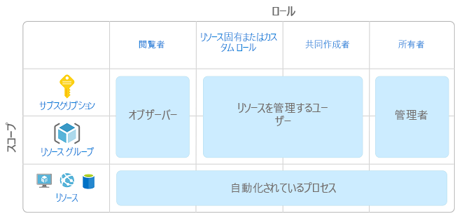
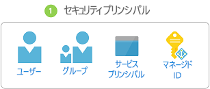
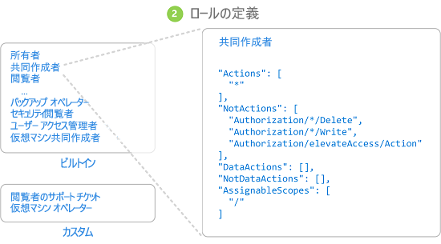
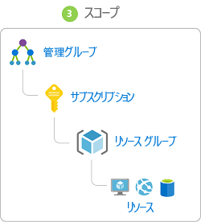
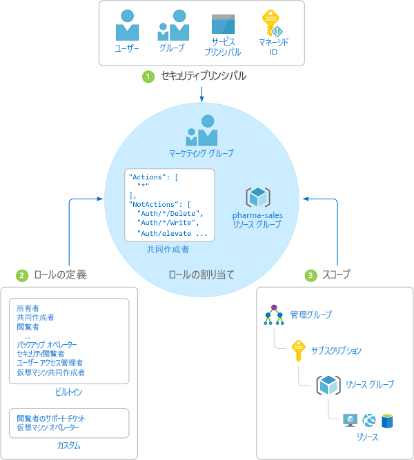

# ロールベースのアクセス制御 (RBAC) とは

クラウド リソースに対するアクセスの管理は、クラウドが使用している組織にとって重要な機能です。 ロールベースのアクセス制御 (RBAC) は、Azure のリソースにアクセスできるユーザー、そのユーザーがそれらのリソースに対して実行できること、そのユーザーがアクセスできる領域を管理するのに役立ちます。

Azure RBAC は [Azure Resource Manager](../azure-resource-manager/resource-group-overview.md) 上に構築された承認システムであり、Azure 内のリソースに対するアクセスをきめ細かく管理できます。

## RBAC でできること

RBAC でできることの例を次に示します。

- あるユーザーにサブスクリプション内の仮想マシンの管理を許可し、別のユーザーに仮想ネットワークの管理を許可します
- DBA グループにサブスクリプション内の SQL データベースの管理を許可します
- あるユーザーに、仮想マシン、Web サイト、サブネットなど、リソース グループ内のすべてのリソースの管理を許可します
- あるアプリケーションに、リソース グループ内のすべてのリソースへのアクセスを許可します

## RBAC を使用するためのベスト プラクティス

RBAC を使用して、チーム内で職務を分離し、職務に必要なアクセス許可のみをユーザーに付与します。 すべてのユーザーに Azure サブスクリプションまたはリソースで無制限のアクセス許可を付与するのではなく、特定のスコープで特定の操作のみを許可することができます。

アクセス制御戦略を計画する場合のベスト プラクティスは、ユーザーの作業を実行できる最低限の特権をユーザーに付与することです。 次の図は、RBAC を使用するための推奨パターンを示しています。

## RBAC のしくみ

RBAC を使用してリソースへのアクセスを制御するには、ロールの割り当てを作成します。 これは、アクセス許可が適用される方法であり、理解する必要のある重要な概念です。 ロールの割り当ては、セキュリティ プリンシパル、ロールの定義、スコープの 3 つの要素で構成されています。

### セキュリティ プリンシパル

"*セキュリティ プリンシパル*" は、Azure リソースへのアクセスを要求するユーザー、グループ、サービス プリンシパルを表すオブジェクトです。

- ユーザー - Azure Active Directory 内にプロファイルを持つ個人です。 他のテナント内のユーザーにロールを割り当てることもできます。 他の組織のユーザーについては、「[Azure Active Directory B2B](/azure/active-directory/active-directory-b2b-what-is-azure-ad-b2b)」をご覧ください。
- グループ - Azure Active Directory 内に作成されたユーザーのセットです。 グループにロールを割り当てると、そのグループ内のすべてのユーザーがそのロールを持つようになります。 
- サービス プリンシパル - 特定の Azure リソースにアクセスするためにアプリケーションまたはサービスによって使用されるセキュリティ ID です。 アプリケーションに対する "*ユーザー ID*" (ユーザー名とパスワード、または証明書) と考えることができます。

### ロール定義

*ロール定義*はアクセス許可のコレクションです。 単に*ロール*と呼ばれることもあります。 ロール定義には、実行できる操作 (読み取り、書き込み、削除など) が登録されています。 ロールは、所有者のように高レベルにすることも、仮想マシン リーダーのように限定することもできます。

Azure には複数の[組み込みロール](built-in-roles.md)があり、使用することができます。 4 つの基本的な組み込みロールを次に示します。 最初の 3 つは、すべてのリソースの種類に適用されます。

- [所有者](built-in-roles.md#owner) - 他のユーザーへアクセス権を委任する権限を含め、すべてのリソースへのフル アクセス権を持ちます。
- [共同作成者](built-in-roles.md#contributor) - Azure リソースのすべての種類を作成および管理できますが、他のユーザーへアクセス権を付与することはできません。
- [閲覧者](built-in-roles.md#reader) - 既存の Azure リソースを表示できます。
- [ユーザー アクセス管理者](built-in-roles.md#user-access-administrator) - Azure リソースへのユーザー アクセスを管理できます。

残りの組み込みロールは、特定の Azure リソースの管理を許可します。 たとえば、[仮想マシン共同作成者](built-in-roles.md#virtual-machine-contributor)ロールが割り当てられたユーザーには、仮想マシンの作成と管理が許可されます。 組み込みロールが組織の特定のニーズを満たさない場合は、独自の[カスタム ロール](custom-roles.md)を作成することができます。

Azure には、オブジェクト内のデータへのアクセスを許可できるようにするデータ操作 (現在プレビュー段階) が導入されています。 たとえば、ユーザーがあるストレージ アカウントへのデータの読み取りアクセス許可を持っている場合、そのユーザーはそのストレージ アカウント内の BLOB またはメッセージを読み取ることができます。 詳しくは、「[ロール定義について](role-definitions.md)」をご覧ください。

### Scope (スコープ)

"*スコープ*" は、アクセスが適用される境界です。 ロールを割り当てるときに、スコープを定義することによって、許可される操作をさらに制限できます。 これは、1 つのリソース グループについてのみ、あるユーザーを [Web サイトの共同作業者](built-in-roles.md#website-contributor)として指定する場合に便利です。

Azure では、複数のレベル ([管理グループ](../azure-resource-manager/management-groups-overview.md)、サブスクリプション、リソース グループ、リソース) でスコープを指定できます。 スコープは親子関係で構造化されています。

親スコープでアクセス権を付与すると、それらのアクセス許可が子スコープに継承されます。 例: 

- 管理グループ スコープでユーザーに[所有者](built-in-roles.md#owner)ロールを割り当てた場合、そのユーザーは、その管理グループに存在する全サブスクリプションの内容をすべて管理することができます。
- [閲覧者](built-in-roles.md#reader)ロールをサブスクリプション スコープでグループに割り当てた場合、そのグループのメンバーは、サブスクリプション内のすべてのリソース グループとリソースを見ることができます。
- [共同作成者](built-in-roles.md#contributor)ロールをリソース グループ スコープでアプリケーションに割り当てた場合、そのアプリケーションは、そのリソース グループ内のすべての種類のリソースを管理できますが、サブスクリプション内の他のリソース グループは管理できません。

### ロール割り当て

"*ロールの割り当て*" は、アクセスの許可を目的として、特定のスコープで、ユーザー、グループ、またはサービス プリンシパルにロールの定義をバインドするプロセスです。 アクセスは、ロールの割り当てを作成することによって許可され、ロールの割り当てを削除することによって取り消されます。

次の図では、ロールの割り当ての例を示します。 この例では、Marketing グループには、pharma-sales リソース グループに対する[共同作成者](built-in-roles.md#contributor)ロールが割り当てられています。 つまり、Marketing グループのユーザーは、pharma-sales リソース グループ内の任意の Azure リソースを作成または管理できます。 Marketing ユーザーは、別のロール割り当ての一部になっていない限り、pharma-sales リソース グループに含まれないリソースにはアクセスできません。

ロールの割り当ては、Azure portal、Azure CLI、Azure PowerShell、Azure SDK、または REST API を使用して作成できます。 各サブスクリプションには、最大 2,000 個のロールの割り当てを保持できます。 ロールの割り当てを作成および削除するには、`Microsoft.Authorization/roleAssignments/*` アクセス許可が必要です。 このアクセス許可は、[所有者](built-in-roles.md#owner)ロールまたは[ユーザー アクセス管理者](built-in-roles.md#user-access-administrator)ロールを通じて許可されます。

## 次の手順

- [クイック スタート: RBAC と Azure portal を使用してユーザーにアクセス権を付与する](quickstart-assign-role-user-portal.md)
- [RBAC と Azure portal を使用してアクセスを管理する](role-assignments-portal.md)
- [Azure での各種ロールについて](rbac-and-directory-admin-roles.md)
