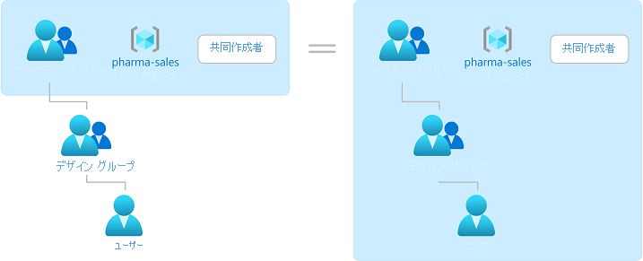

# Azure ロールベースのアクセス制御 (Azure RBAC) とは

クラウド リソースに対するアクセスの管理は、クラウドが使用している組織にとって重要な機能です。 Azure ロールベースのアクセス制御 (Azure RBAC) は、Azure のリソースにアクセスできるユーザー、そのユーザーがそれらのリソースに対して実行できること、そのユーザーがアクセスできる領域を管理するのに役立ちます。

Azure RBAC は [Azure Resource Manager](../azure-resource-manager/management/overview.md) 上に構築された承認システムであり、Azure リソースに対するアクセスをきめ細かく管理できます。

このビデオでは、Azure RBAC の概要を簡単に説明します。

>[!VIDEO https://www.youtube.com/embed/Dzhm-garKBM]

## Azure RBAC でできること

Azure RBAC でできることの例を次に示します。

- あるユーザーにサブスクリプション内の仮想マシンの管理を許可し、別のユーザーに仮想ネットワークの管理を許可します
- DBA グループにサブスクリプション内の SQL データベースの管理を許可します
- あるユーザーに、仮想マシン、Web サイト、サブネットなど、リソース グループ内のすべてのリソースの管理を許可します
- あるアプリケーションに、リソース グループ内のすべてのリソースへのアクセスを許可します

## Azure RBAC のしくみ

Azure RBAC を使用してリソースへのアクセスを制御するには、Azure のロールを割り当てます。 これは理解する必要のある重要な概念です。これではアクセス許可を適用できます。 ロールの割り当ては、セキュリティ プリンシパル、ロールの定義、スコープの 3 つの要素で構成されています。

### セキュリティ プリンシパル

"*セキュリティ プリンシパル*" は、Azure リソースへのアクセスを要求するユーザー、グループ、サービス プリンシパル、またはマネージド ID を表すオブジェクトです。 これらのセキュリティ プリンシパルのいずれかに、ロールを割り当てることができます。

### ロール定義

*ロール定義* はアクセス許可のコレクションです。 通常は単に "*ロール*" と呼ばれます。 ロール定義には、実行できるアクション (読み取り、書き込み、削除など) が登録されています。 ロールは、所有者のように高レベルにすることも、仮想マシン リーダーのように限定することもできます。

Azure には複数の[組み込みロール](built-in-roles.md)があり、使用することができます。 たとえば、[仮想マシン共同作成者](built-in-roles.md#virtual-machine-contributor)ロールが割り当てられたユーザーには、仮想マシンの作成と管理が許可されます。 組み込みロールが組織の特定のニーズを満たさない場合は、独自の [Azure カスタム ロール](custom-roles.md)を作成することができます。

このビデオでは、組み込みロールとカスタム ロールの概要を簡単に説明します。

>[!VIDEO https://www.youtube.com/embed/I1mefHptRgo]

Azure には、オブジェクト内のデータへのアクセスを許可できるようにするデータ アクションが用意されています。 たとえば、ユーザーがあるストレージ アカウントへのデータの読み取りアクセス許可を持っている場合、そのユーザーはそのストレージ アカウント内の BLOB またはメッセージを読み取ることができます。

詳細については、[Azure ロールの定義の概要](role-definitions.md)に関するページを参照してください。

### Scope

"*スコープ*" は、アクセスが適用されるリソースのセットです。 ロールを割り当てるときに、スコープを定義することによって、許可される操作をさらに制限できます。 これは、1 つのリソース グループについてのみ、あるユーザーを [Web サイトの共同作業者](built-in-roles.md#website-contributor)として指定する場合に便利です。

Azure では、4 つのレベル ([管理グループ](../governance/management-groups/overview.md)、サブスクリプション、[リソース グループ](../azure-resource-manager/management/overview.md#resource-groups)、リソース) でスコープを指定できます。 スコープは親子関係で構造化されています。 これらのスコープレベルのいずれかで、ロールを割り当てることができます。

スコープの詳細については、[スコープについての理解](scope-overview.md)に関する記事を参照してください。

### ロールの割り当て

"*ロールの割り当て*" は、アクセスの許可を目的として、特定のスコープで、ユーザー、グループ、サービス プリンシパル、またはマネージド ID にロールの定義をアタッチするプロセスです。 アクセスは、ロールの割り当てを作成することによって許可され、ロールの割り当てを削除することによって取り消されます。

次の図では、ロールの割り当ての例を示します。 この例では、Marketing グループには、pharma-sales リソース グループに対する[共同作成者](built-in-roles.md#contributor)ロールが割り当てられています。 つまり、Marketing グループのユーザーは、pharma-sales リソース グループ内の任意の Azure リソースを作成または管理できます。 Marketing ユーザーは、別のロール割り当ての一部になっていない限り、pharma-sales リソース グループに含まれないリソースにはアクセスできません。

ロールは Azure portal、Azure CLI、Azure PowerShell、Azure SDK、REST API のいずれかを使用して割り当てることができます。

詳細については、[Azure ロールを割り当てる手順](role-assignments-steps.md)を参照してください。

## グループ

ロールの割り当ては、グループに対して推移的です。つまり、ユーザーがあるグループのメンバーであり、そのグループがロール割り当てのある別のグループのメンバーである場合、そのユーザーにそのロールの割り当てのアクセス許可が与えられます。

## 複数のロールの割り当て

複数のロールの割り当てが重複しているとどうなるでしょうか。 Azure RBAC は加算方式のモデルであるため、自分で行ったロール割り当ての合計が自分の実際のアクセス許可になります。 ここで、ユーザーにサブスクリプション スコープの共同作成者ロールとリソース グループの閲覧者ロールが付与されている例を考えてみましょう。 共同作成者アクセス許可と閲覧者アクセス許可を足すと、実質的にサブスクリプションの共同作成者ロールになります。 そのため、この場合、閲覧者ロールの割り当ては効果がありません。

## 拒否割り当て

これまでの Azure RBAC は拒否のない許可のみのモデルでしたが、限定的にですが Azure RBAC で拒否の割り当てがサポートされるようになりました。 ロールの割り当てと同様に、"*拒否割り当て*" ではアクセスの拒否を目的として、特定のスコープでユーザー、グループ、サービス プリンシパル、またはマネージド ID に一連の拒否アクションがアタッチされます。 ロールの割り当てでは "*許可される*" アクションのセットを定義しますが、拒否割り当てでは "*許可されない*" アクションのセットを定義します。 つまり、拒否割り当てでは、ロールの割り当てでアクセスを許可されている場合であっても、指定したアクションがユーザーによって実行されるのをブロックします。 ロールの割り当てより拒否割り当ての方が優先されます。

詳細については、[Azure 拒否割り当ての概要](deny-assignments.md)に関するページを参照してください。

## ユーザーがリソースへのアクセス権を持っているどうかを Azure RBAC が特定する方法

リソースへのアクセス権をユーザーが持っているかどうかを特定するために Azure RBAC が使用する手順の概要を次に示します。 これらの手順は、Azure Resource Manager または Azure RBAC と統合されたデータ プレーン サービスに適用されます。 これは、アクセスの問題のトラブルシューティングを行う場合に理解していると役に立ちます。

1. ユーザー (またはサービス プリンシパル) は、Azure Resource Manager に対するトークンを取得します。

    トークンには、ユーザーのグループ メンバーシップが含まれています (推移的なグループ メンバーシップを含みます)。

1. ユーザーは、トークンを添付して Azure Resource Manager への REST API の呼び出しを行います。

1. Azure Resource Manager では、アクション実行対象リソースに適用されるすべてのロール割り当てと拒否割り当てが取得されます。

1. 拒否割り当てが適用される場合、アクセスはブロックされます。 それ以外の場合は、評価が続行されます。

1. Azure Resource Manager は、このユーザーまたはユーザーのグループに適用されるロールの割り当てを絞り込み、このリソースに対してユーザーが持っているロールを特定します。

1. Azure Resource Manager は、API 呼び出しでのアクションが、このリソースに対してユーザーが持っているロールに含まれるかどうかを判別します。 ワイルドカード (`*`) が使用された `Actions` がロールに含まれている場合、有効なアクセス許可は、許可された `Actions` から `NotActions` を減算することによって計算されます。 同様に、同じ減算がすべてのデータ アクションに対して行われます。

    `Actions - NotActions = Effective management permissions`

    `DataActions - NotDataActions = Effective data permissions`

1. 要求されたスコープのアクションを含むロールをユーザーが持っていない場合、アクセスは許可されません。 それ以外の場合は、すべての条件が評価されます。

1. ロールの割り当てに条件が含まれる場合は、それらが評価されます。 それ以外の場合は、アクセスが許可されます。

1. 条件が満たされた場合は、アクセスが許可されます。 それ以外の場合、アクセスは許可されません。

次の図は、評価ロジックの概要です。

## ライセンスの要件

[!INCLUDE [Azure AD free license](../../includes/active-directory-free-license.md)]

## 次のステップ

- [Azure portal を使用して Azure ロールを割り当てる](role-assignments-portal.md)
- [各種ロールについて](rbac-and-directory-admin-roles.md)
- [クラウド導入フレームワーク:Azure でのリソース アクセス管理](/azure/cloud-adoption-framework/govern/resource-consistency/resource-access-management)
