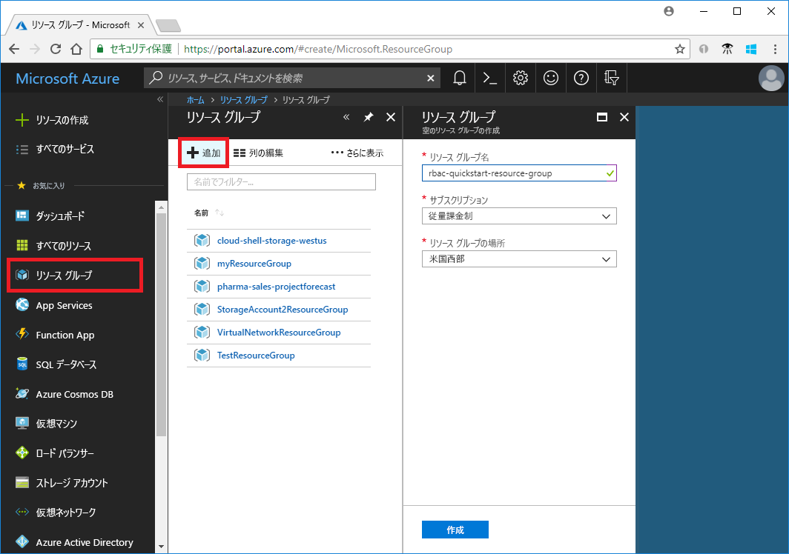
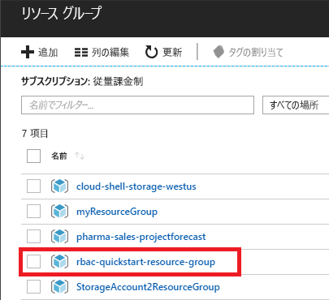
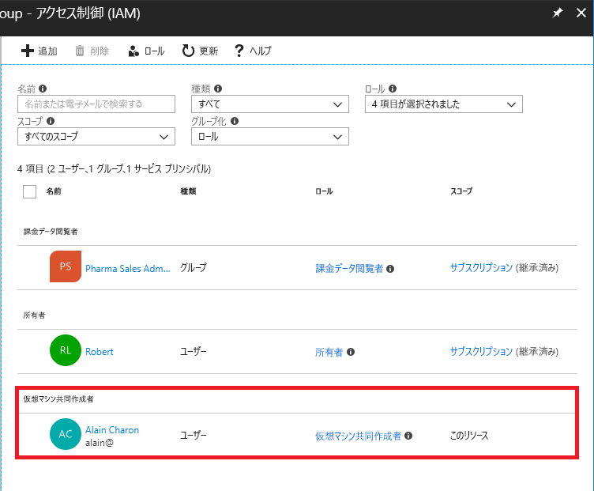
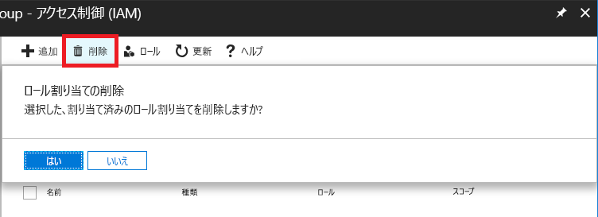
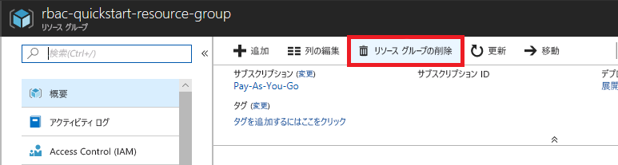

# チュートリアル:Azure portal を使用して Azure リソースへのアクセス権をユーザーに付与する

[Azure ロールベースのアクセス制御 (Azure RBAC)](overview.md) は、Azure のリソースに対するアクセスを管理するための手法です。 このチュートリアルでは、ユーザーに対してリソース グループ内で仮想マシンを作成および管理するアクセス許可を付与します。

このチュートリアルでは、以下の内容を学習します。

> [!div class="checklist"]
> * リソース グループをスコープとするユーザーのアクセス権の付与
> * アクセス権の削除

Azure サブスクリプションをお持ちでない場合は、開始する前に [無料アカウント](https://azure.microsoft.com/free/?WT.mc_id=A261C142F) を作成してください。

## Azure へのサインイン

Azure Portal ( https://portal.azure.com ) にサインインします。

## リソース グループを作成する

1. ナビゲーション リストで、 **[リソース グループ]** をクリックします。

1. **[追加]** を選択して **[リソース グループ]** ブレードを開きます。

   

1. **[リソース グループ名]** に **rbac-resource-group** と入力します。

1. サブスクリプションと場所を選択します。

1. **[作成]** をクリックしてリソース グループを作成します。

1. **[更新]** をクリックしてリソース グループの一覧を更新します。

   新しいリソース グループがリソース グループの一覧に表示されます。

   

## アクセス権の付与

Azure RBAC でアクセス権を付与するには、ロールの割り当てを作成します。

1. **[リソース グループ]** の一覧で、新しい **rbac-resource-group** リソース グループをクリックします。

1. **[アクセス制御 (IAM)]** をクリックします。

1. **[ロールの割り当て]** タブをクリックして、ロールの割り当ての現在の一覧を表示します。

   ![リソース グループの [アクセス制御 (IAM)] ブレード](./media/quickstart-assign-role-user-portal/access-control.png)

1. **[追加]**  >  **[ロールの割り当ての追加]** をクリックして、[ロールの割り当ての追加] ウィンドウを開きます。

   ロールを割り当てるためのアクセス許可がない場合は、[ロールの割り当ての追加] オプションは無効になります。

   ![[追加] メニュー](./media/role-assignments-portal/add-menu.png)

   ![[ロールの割り当ての追加] ウィンドウ](./media/quickstart-assign-role-user-portal/add-role-assignment.png)

1. **[ロール]** ドロップダウン リストで、 **[仮想マシン共同作成者]** を選択します。

1. **[選択]** 一覧で、自分または別のユーザーを選択します。

1. **[保存]** をクリックして、ロールの割り当てを作成します。

   しばらくすると、rbac-resource-group リソース グループ スコープにおける仮想マシン共同作成者ロールがユーザーに割り当てられます。

   

## アクセス権の削除

Azure RBAC でアクセス権を削除するには、ロールの割り当てを削除します。

1. ロールの割り当ての一覧で、仮想マシン共同作成者ロールを持つユーザーの横にチェック マークを追加します。

1. **[削除]** をクリックします。

   

1. ロールの割り当ての削除メッセージが表示されたら、 **[はい]** をクリックします。

## クリーンアップ

1. ナビゲーション リストで、 **[リソース グループ]** をクリックします。

1. **rbac-resource-group** をクリックしてリソース グループを開きます。

1. **[リソース グループの削除]** をクリックしてリソース グループを削除します。

   

1. **[削除しますか]** ブレードにリソース グループ名 **rbac-resource-group** を入力します。

1. **[削除する]** をクリックしてリソース グループを削除します。

## 次のステップ

> [!div class="nextstepaction"]
> [チュートリアル:Azure PowerShell を使用して Azure リソースへのアクセス権をユーザーに付与する](tutorial-role-assignments-user-powershell.md)
