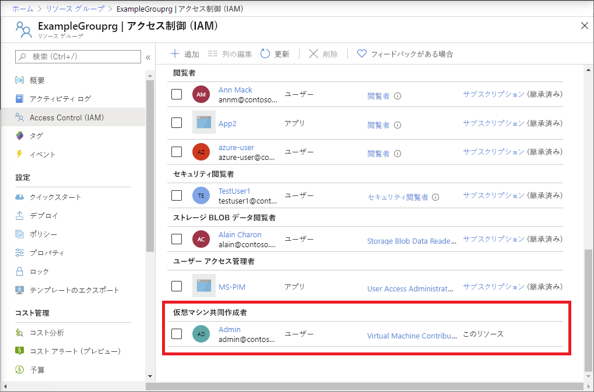

# <a name="quickstart-add-an-azure-role-assignment-using-an-azure-resource-manager-template"></a>クイック スタート:Azure Resource Manager テンプレートを使用して Azure でのロールの割り当てを追加する

[Azure ロールベースのアクセス制御 (Azure RBAC)](overview.md) は、Azure のリソースに対するアクセスを管理するための手法です。 このクイックスタートでは、リソース グループを作成し、リソース グループ内で仮想マシンを作成および管理するアクセス権をユーザーに付与します。 このクイックスタートでは、Resource Manager テンプレートを使用してアクセス権を付与します。

[!INCLUDE [About Azure Resource Manager](../../includes/resource-manager-quickstart-introduction.md)]

Azure サブスクリプションをお持ちでない場合は、開始する前に [無料アカウント](https://azure.microsoft.com/free/?WT.mc_id=A261C142F) を作成してください。

## <a name="prerequisites"></a>前提条件

ロールの割り当てを追加するには、以下が必要です。

* `Microsoft.Authorization/roleAssignments/write` および `Microsoft.Authorization/roleAssignments/delete` のアクセス許可 ([ユーザー アクセス管理者](built-in-roles.md#user-access-administrator)や[所有者](built-in-roles.md#owner)など)

## <a name="create-a-role-assignment"></a>役割の割り当ての作成

ロールの割り当てを追加するには、セキュリティ プリンシパル、ロールの定義、スコープの 3 つの要素を指定する必要があります。 このクイックスタートでは、セキュリティ プリンシパルは自分またはディレクトリ内の別のユーザーであり、ロールの定義は[仮想マシン共同作成者](built-in-roles.md#virtual-machine-contributor)、スコープは指定したリソース グループです。

### <a name="review-the-template"></a>テンプレートを確認する

このクイックスタートで使用されるテンプレートは [Azure クイックスタート テンプレート](https://azure.microsoft.com/resources/templates/101-rbac-builtinrole-resourcegroup/)からのものです。 テンプレートには、3 つのパラメーターとリソース セクションがあります。 リソース セクションには、ロールの割り当ての 3 つの要素 (セキュリティ プリンシパル、ロールの定義、スコープ) が含まれることに注意してください。 

:::code language="json" source="~/quickstart-templates/101-rbac-builtinrole-resourcegroup/azuredeploy.json" highlight="30-32":::

テンプレート内に定義されているリソース:

- [Microsoft.Authorization/roleAssignments](/azure/templates/Microsoft.Authorization/roleAssignments)

### <a name="deploy-the-template"></a>テンプレートのデプロイ

1. [Azure portal](https://portal.azure.com) にサインインします。

1. Azure サブスクリプションに関連付けられた電子メール アドレスを指定します。 または、ディレクトリ内の別のユーザーの電子メール アドレスを指定します。

1. PowerShell 用の Azure Cloud Shell を開きます。

1. 次のスクリプトをコピーして Cloud Shell に貼り付けます。

    ```azurepowershell
    $resourceGroupName = Read-Host -Prompt "Enter a resource group name (i.e. ExampleGrouprg)"
    $emailAddress = Read-Host -Prompt "Enter an email address for a user in your directory"
    $location = Read-Host -Prompt "Enter a location (i.e. centralus)"
    
    $roleAssignmentName = New-Guid
    $principalId = (Get-AzAdUser -Mail $emailAddress).id
    $roleDefinitionId = (Get-AzRoleDefinition -name "Virtual Machine Contributor").id
    $templateUri = "https://raw.githubusercontent.com/Azure/azure-quickstart-templates/master/101-rbac-builtinrole-resourcegroup/azuredeploy.json"
    
    New-AzResourceGroup -Name $resourceGroupName -Location $location
    New-AzResourceGroupDeployment -ResourceGroupName $resourceGroupName -TemplateUri $templateUri -roleAssignmentName $roleAssignmentName -roleDefinitionID $roleDefinitionId -principalId $principalId
    ```

1. リソース グループ名 (ExampleGrouprg など) を入力します。

1. 自分またはディレクトリ内の別のユーザーの電子メール アドレスを入力します。

1. リソース グループの場所 (米国中部など) を入力します。

1. 必要に応じて、Enter キーを押し、New-AzResourceGroupDeployment コマンドを実行します。

    [New-AzResourceGroup](/powershell/module/az.resources/new-azresourcegroup) コマンドにより、新しいリソース グループが作成され、[New-AzResourceGroupDeployment](/powershell/module/az.resources/new-azresourcegroupdeployment) コマンドによって、ロールの割り当てを追加するテンプレートがデプロイされます。

    次のような出力が表示されます。

    ```azurepowershell
    PS> New-AzResourceGroupDeployment -ResourceGroupName $resourceGroupName -TemplateUri $templateUri -roleAssignmentName $roleAssignmentName -roleDefinitionID $roleDefinitionId -principalId $principalId
    
    DeploymentName          : azuredeploy
    ResourceGroupName       : ExampleGrouprg
    ProvisioningState       : Succeeded
    Timestamp               : 5/22/2020 9:01:30 PM
    Mode                    : Incremental
    TemplateLink            :
                              Uri            : https://raw.githubusercontent.com/Azure/azure-quickstart-templates/master/101-rbac-builtinrole-resourcegroup/azuredeploy.json
                              ContentVersion : 1.0.0.0
    
    Parameters              :
                              Name                  Type                       Value
                              ====================  =========================  ==========
                              roleAssignmentName    String                     {roleAssignmentName}
                              roleDefinitionID      String                     9980e02c-c2be-4d73-94e8-173b1dc7cf3c
                              principalId           String                     {principalId}
    
    Outputs                 :
    DeploymentDebugLogLevel :
    ```

## <a name="review-deployed-resources"></a>デプロイされているリソースを確認する

1. Azure portal で、作成したリソース グループを開きます。

1. 左側のメニューで **[アクセス制御 (IAM)]** をクリックします。

1. **[ロールの割り当て]** タブをクリックします。

1. 指定したユーザーに**仮想マシン共同作成者**ロールが割り当てられていることを確認します。

   

## <a name="clean-up-resources"></a>リソースをクリーンアップする

作成したロールの割り当てとリソース グループを削除するには、次の手順に従います。

1. 次のスクリプトをコピーして Cloud Shell に貼り付けます。

    ```azurepowershell
    $emailAddress = Read-Host -Prompt "Enter the email address of the user with the role assignment to remove"
    $resourceGroupName = Read-Host -Prompt "Enter the resource group name to remove (i.e. ExampleGrouprg)"
    
    $principalId = (Get-AzAdUser -Mail $emailAddress).id
    
    Remove-AzRoleAssignment -ObjectId $principalId -RoleDefinitionName "Virtual Machine Contributor" -ResourceGroupName $resourceGroupName
    Remove-AzResourceGroup -Name $resourceGroupName
    ```
    
1. 削除するロールの割り当てを持つユーザーの電子メール アドレスを入力します。

1. 削除するリソース グループ名 (ExampleGrouprg など) を入力します。

1. 必要に応じて、Enter キーを押し、Remove-AzResourceGroup コマンドを実行します。

1. 「**Y**」を入力して、リソース グループを削除することを確認します。

## <a name="next-steps"></a>次のステップ

> [!div class="nextstepaction"]
> [チュートリアル:Azure PowerShell を使用して Azure リソースへのアクセス権をユーザーに付与する](tutorial-role-assignments-user-powershell.md)