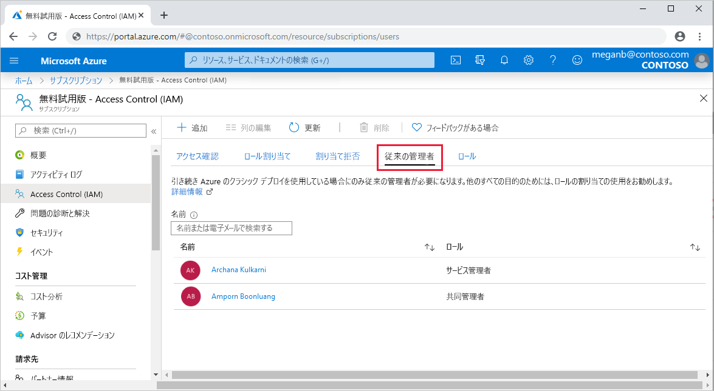
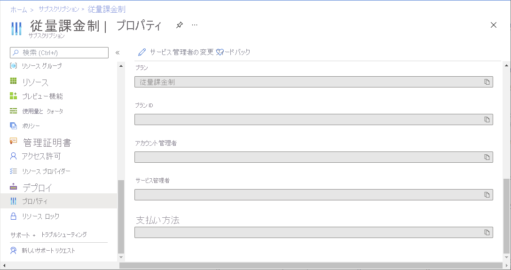
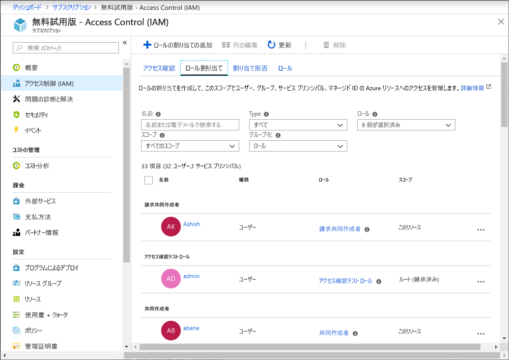
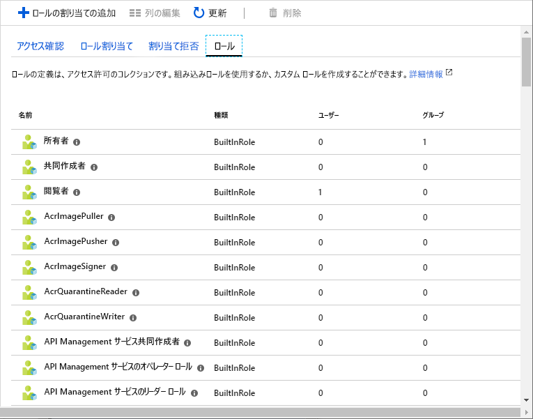
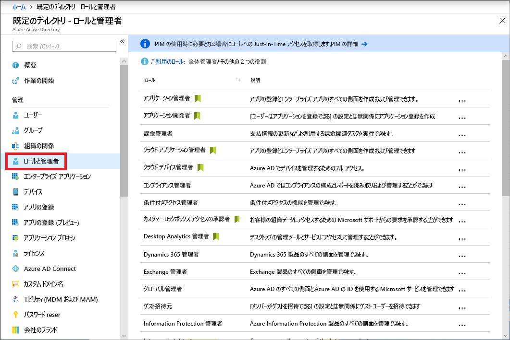
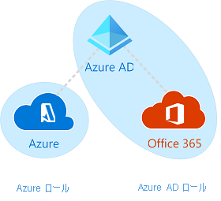

# 従来のサブスクリプション管理者ロール、Azure RBAC ロール、および Azure AD 管理者ロール

Azure を初めて使用する場合、Azure のさまざまなロールを理解することは少し難しいかもしれません。 この記事では、以下のロールと、それぞれをどのような場合に使用するかについて説明します。
- 従来のサブスクリプション管理者ロール
- Azure ロールベース アクセス制御 (RBAC) ロール
- Azure Active Directory (Azure AD) 管理者ロール

## 各ロールの関係

Azure のロールをよりよく理解するには、歴史の一部を知ることが役立ちます。 Azure が最初にリリースされたとき、リソースへのアクセスは次の 3 つの管理者ロールで管理されました:アカウント管理者、サービス管理者、共同管理者。 その後、Azure リソース用に、ロールベース アクセス制御 (RBAC) が追加されました。 Azure RBAC は、Azure リソースに対するきめ細かいアクセス管理を提供する、より新しい承認システムです。 RBAC には多数の組み込みロールがあり、異なるスコープで割り当てることができます。また、独自のカスタム ロールを作成することができます。 ユーザー、グループ、ドメインなどの、Azure AD のリソースを管理するためには、いくつかの Azure AD 管理者ロールがあります。

次の図は、従来のサブスクリプション管理者ロール、Azure RBAC ロール、および Azure AD 管理者ロールがどのように関連しているかを大まかに示しています。

## 従来のサブスクリプション管理者ロール

アカウント管理者、サービス管理者、および共同管理者は、Azure の従来の 3 種類のサブスクリプション管理者ロールです。 従来のサブスクリプション管理者には、Azure サブスクリプションへのフル アクセス権があります。 Azure portal、Azure Resource Manager API、およびクラシック デプロイ モデル API を使用して、リソースを管理することができます。 Azure へのサインアップに使用されたアカウントは、自動的にアカウント管理者とサービス管理者の両方として設定されます。 その後、共同管理者を追加できます。 サービス管理者および共同管理者は、サブスクリプション スコープで所有者ロール (Azure RBAC ロール) が割り当てられているユーザーと同等のアクセス権を持ちます。 次の表では、これら 3 つの従来のサブスクリプション管理ロールの違いについて説明します。

| 従来のサブスクリプション管理者 | 制限 | アクセス許可 | Notes |
| --- | --- | --- | --- |
| アカウント管理者 | 1 Azure アカウントに 1 人 | <ul><li>[Azure アカウント センター](https://account.azure.com/Subscriptions)にアクセスする</li><li>アカウントのすべてのサブスクリプションを管理する</li><li>新しいサブスクリプションを作成する</li><li>サブスクリプションを取り消す</li><li>サブスクリプションの課金を変更する</li><li>サービス管理者を変更する</li></ul> | 概念的には、サブスクリプションの課金の所有者です。 アカウント管理者には、Azure portal へのアクセス権が与えられません。 |
| サービス管理者 | 1 Azure サブスクリプションに 1 人 | <ul><li>[Azure portal](https://portal.azure.com) でサービスを管理する</li><li>サブスクリプションを取り消す</li><li>共同管理者ロールにユーザーを割り当てる</li></ul> | 既定で、新しいサブスクリプションのアカウント管理者はサービス管理者でもあります。 サービス管理者は、サブスクリプション スコープで所有者ロールを割り当てられているユーザーと同等のアクセス権を持ちます。 サービス管理者には、Azure portal へのフル アクセス権が与えられます。 |
| 共同管理者 | サブスクリプションあたり 200 人 | <ul><li>サービス管理者と同じアクセス権を持っているものの、サブスクリプションと Azure ディレクトリとの関連付けを変更することはできない</li><li>共同管理者ロールにユーザーを割り当てる。ただし、サービス管理者を変更することはできない</li></ul> | 共同管理者は、サブスクリプション スコープで所有者ロールを割り当てられているユーザーと同等のアクセス権を持ちます。 |

Azure portal では、 **[従来の管理者]** タブを使用して、共同管理者を管理したり、サービス管理者を表示したりできます。

Azure portal では、お使いのサブスクリプションのプロパティ ブレードで、サービス管理者を表示または変更したり、アカウント管理者を表示したりすることができます。

詳しくは、「[Azure の従来のサブスクリプション管理者](classic-administrators.md)」をご覧ください。

### Azure アカウントと Azure サブスクリプション

Azure アカウントは、請求関係を表します。 Azure アカウントは、ユーザー ID、1 つ以上の Azure サブスクリプション、および関連する Azure リソースのセットです。 アカウントを作成する人は、そのアカウントで作成されるすべてのサブスクリプションのアカウント管理者です。 その人は、サブスクリプションの既定のサービス管理者でもあります。

Azure サブスクリプションは、Azure リソースへのアクセスを整理するために役立ちます。 さらに、リソースの使用状況の報告、課金、および支払い方法の制御にも役立ちます。 サブスクリプションごとに異なる課金および支払いを設定することができるため、オフィス別、部門別、プロジェクト別などで、異なるサブスクリプションや異なるプランを利用することができます。 すべてのサービスがサブスクリプションに所属し、プログラムによる操作ではサブスクリプション ID が必要になることがあります。

すべてのサブスクリプションは Azure AD ディレクトリと関連付けられています。 サブスクリプションが関連付けられているディレクトリを検索するには、Azure portal で **[サブスクリプション]** を開き、ディレクトリを表示するサブスクリプションを選択します。

アカウントとサブスクリプションは、[Azure アカウント センター](https://account.azure.com/Subscriptions)で管理されます。

## Azure RBAC ロール

Azure RBAC は、コンピューティングやストレージなどの Azure リソースに対するきめ細かなアクセス管理を提供する、[Azure Resource Manager](../azure-resource-manager/management/overview.md) 上に構築された承認システムです。 Azure RBAC には、70 を超える組み込みロールが含まれています。 4 つの基本的な RBAC ロールがあります。 最初の 3 つは、すべてのリソースの種類に適用されます。

| Azure RBAC ロール | アクセス許可 | Notes |
| --- | --- | --- |
| [所有者](built-in-roles.md#owner) | <ul><li>すべてのリソースへのフル アクセス</li><li>アクセスを他のユーザーに委任する</li></ul> | サービス管理者と共同管理者は、サブスクリプション スコープで所有者ロールを割り当てられます すべてのリソースの種類に適用されます。 |
| [Contributor](built-in-roles.md#contributor) | <ul><li>すべての種類の Azure リソースを作成および管理する</li><li>Azure Active Directory で新しいテナントを作成する</li><li>他のユーザーにアクセスを許可することはできない</li></ul> | すべてのリソースの種類に適用されます。 |
| [Reader](built-in-roles.md#reader) | <ul><li>Azure リソースを表示する</li></ul> | すべてのリソースの種類に適用されます。 |
| [User Access Administrator](built-in-roles.md#user-access-administrator) | <ul><li>Azure リソースに対するユーザー アクセスを管理する</li></ul> |  |

残りの組み込みロールは、特定の Azure リソースの管理を許可します。 たとえば、[仮想マシン共同作成者](built-in-roles.md#virtual-machine-contributor)ロールが割り当てられたユーザーには、仮想マシンの作成と管理が許可されます。 すべての組み込みロールの一覧については、「[Azure リソースの組み込みロール](built-in-roles.md)」をご覧ください。

RBAC は、Azure portal と Azure Resource Manager API のみでサポートされています。 RBAC ロールが割り当てられているユーザー、グループ、およびアプリケーションは、[Azure クラシック デプロイ モデル API](../azure-resource-manager/management/deployment-models.md) を使用できません。

Azure portal では、RBAC を使用したロールの割り当ては **[アクセス制御 (IAM)]** ブレードに表示されます。 このブレードは、管理グループ、サブスクリプション、リソース グループ、各種リソースなど、ポータル全体で表示されます。

**[ロール]** タブをクリックすると、組み込みロールとカスタム ロールの一覧が表示されます。

詳しくは、「[RBAC と Azure portal を使用して Azure リソースへのアクセスを管理する](role-assignments-portal.md)」をご覧ください。

## Azure AD 管理者ロール

Azure AD 管理者ロールは、ディレクトリ内の Azure AD リソースの管理に使用されます。たとえば、ユーザーの作成や編集、他のユーザーへの管理ロールの割り当て、ユーザー パスワードのリセット、ユーザー ライセンスの管理、ドメインの管理などです。 次の表では、より重要な Azure AD 管理者ロールのいくつかについて説明します。

| Azure AD 管理者ロール | アクセス許可 | Notes |
| --- | --- | --- |
| [全体管理者](../active-directory/users-groups-roles/directory-assign-admin-roles.md#company-administrator-permissions) | <ul><li>Azure Active Directory のすべての管理機能や、Azure Active Directory に統合されたサービスへのアクセスを管理する</li><li>他のユーザーに管理者ロールを割り当てる</li><li>すべてのユーザーと他のすべての管理者のパスワードをリセットする</li></ul> | Azure Active Directory テナントにサインアップしたユーザーが全体管理者になります。 |
| [ユーザー管理者](../active-directory/users-groups-roles/directory-assign-admin-roles.md#user-administrator) | <ul><li>ユーザーとグループのすべての側面を作成および管理する</li><li>サポート チケットの管理</li><li>サービス正常性の監視</li><li>ユーザー、ヘルプデスク管理者、およびその他のユーザー管理者のパスワードを変更する</li></ul> |  |
| [課金管理者](../active-directory/users-groups-roles/directory-assign-admin-roles.md#billing-administrator) | <ul><li>購入する</li><li>サブスクリプションの管理</li><li>サポート チケットの管理</li><li>サービスの正常性を監視する</li></ul> |  |

Azure portal では、Azure AD 管理者ロールの一覧が **[ロールと管理者]** ブレードに表示されます。 すべての Azure AD 管理者ロールの一覧については、「[Azure Active Directory での管理者ロールのアクセス許可](../active-directory/users-groups-roles/directory-assign-admin-roles.md)」をご覧ください。

## Azure RBAC ロールと Azure AD 管理者ロールの違い

高レベルでは、Azure RBAC ロールは Azure リソースを管理するアクセス許可を制御し、Azure AD 管理者ロールは Azure Active Directory リソースを管理するアクセス許可を制御します。 次の表は、相違点の一部を比較しています。

| Azure RBAC ロール | Azure AD 管理者ロール |
| --- | --- |
| Azure のリソースへのアクセスの管理 | Azure Active Directory リソースへのアクセスを管理する |
| カスタム ロールをサポートする | カスタム ロールをサポートする |
| スコープを複数のレベル (管理グループ、サブスクリプション、リソース グループ、リソース) で指定できる | スコープはテナント レベルで |
| ロール情報には、Azure portal、Azure CLI、Azure PowerShell、Azure Resource Manager テンプレート、REST API でアクセスできる | ロール情報には、Azure 管理ポータル、Microsoft 365 管理センター、Microsoft Graph、AzureAD PowerShell でアクセスできる |

### Azure RBAC ロールと Azure AD 管理者ロールは重なり合うか

既定では、Azure RBAC ロールと Azure AD 管理者ロールは、Azure と Azure AD にまたがっていません。 ただし、全体管理者が Azure portal で **[全体管理者は、Azure サブスクリプションと管理グループを管理できます]** スイッチを選択して自分のアクセスを昇格させた場合、全体管理者は特定のテナントのすべてのサブスクリプションに対する[ユーザー アクセス管理者](built-in-roles.md#user-access-administrator)ロール (RBAC ロール) を許可されます。 ユーザー アクセス管理者ロールを使用すると、ユーザーは他のユーザーに Azure リソースに対するアクセス権を付与できます。 このスイッチは、サブスクリプションへのアクセス権を回復する場合に便利です。 詳細については、[Azure AD 管理者としてのアクセス権の昇格](elevate-access-global-admin.md)に関するページを参照してください。

いくつかの Azure AD 管理者ロール (全体管理者ロールやユーザー管理者ロールなど) は、Azure AD と Microsoft Office 365 にまたがっています。 たとえば、全体管理者ロールのメンバーであれば、Azure AD および Office 365 で全体管理者機能を持っています。たとえば、Microsoft Exchange や Microsoft SharePoint を変更する機能などです。 ただし、既定では、全体管理者は Azure リソースにアクセスできません。

## 次のステップ

- [Azure リソースのロールベースのアクセス制御 (RBAC) の概要](overview.md)
- [Azure Active Directory での管理者ロールのアクセス許可](../active-directory/users-groups-roles/directory-assign-admin-roles.md)
- [Azure の従来のサブスクリプション管理者](classic-administrators.md)
- [クラウド導入フレームワーク:Azure でのリソース アクセス管理](/azure/cloud-adoption-framework/govern/resource-consistency/resource-access-management)
