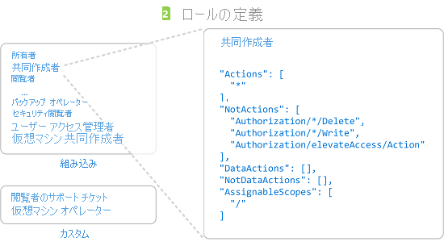
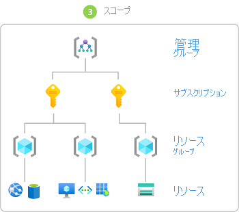

# Azure ロールを割り当てる手順

[!INCLUDE [Azure RBAC definition grant access](../../includes/role-based-access-control/definition-grant.md)] この記事では、[Azure portal](role-assignments-portal.md)、[Azure PowerShell](role-assignments-powershell.md)、[Azure CLI](role-assignments-cli.md)、または [REST API](role-assignments-rest.md)を使用して、Azure ロールを割り当てる手順の概要について説明します。

## 手順 1:アクセスが必要なユーザーを決定する

まず、アクセス権が必要なユーザーを決定する必要があります。 ロールを、ユーザー、グループ、サービス プリンシパル、またはマネージド ID に割り当てることができます。 これは *セキュリティ プリンシパル* とも呼ばれます。

- ユーザー - Azure Active Directory 内にプロファイルを持つ個人です。 他のテナント内のユーザーにロールを割り当てることもできます。 他の組織のユーザーについては、「[Azure Active Directory B2B](../active-directory/external-identities/what-is-b2b.md)」をご覧ください。
- グループ - Azure Active Directory 内に作成されたユーザーのセットです。 グループにロールを割り当てると、そのグループ内のすべてのユーザーがそのロールを持つようになります。 
- サービス プリンシパル - 特定の Azure リソースにアクセスするためにアプリケーションまたはサービスによって使用されるセキュリティ ID です。 アプリケーションに対する "*ユーザー ID*" (ユーザー名とパスワード、または証明書) と考えることができます。
- マネージド ID - Azure によって自動的に管理される Azure Active Directory 内の ID。 通常、[マネージド ID](../active-directory/managed-identities-azure-resources/overview.md) は、Azure サービスに対する認証を受けるための資格情報を管理するクラウド アプリケーションを開発するときに使用します。

## 手順 2:適切なロールを選択する

アクセス許可は"*ロールの定義*"でまとめてグループ化されます。 通常は単に "*ロール*" と呼ばれます。 いくつかの組み込みロールの一覧から選択できます。 組み込みロールが組織の特定のニーズを満たさない場合は、独自のカスタム ロールを作成することができます。

4 つの基本的な組み込みロールを次に示します。 最初の 3 つは、すべてのリソースの種類に適用されます。

- [所有者](built-in-roles.md#owner) - 他のユーザーへアクセス権を委任する権限を含め、すべてのリソースへのフル アクセス権を持ちます。
- [共同作成者](built-in-roles.md#contributor) - すべての種類の Azure リソースを作成および管理できます。他のユーザーにアクセス権を付与することはできません。
- [閲覧者](built-in-roles.md#reader) - 既存の Azure リソースを表示できます。
- [ユーザー アクセス管理者](built-in-roles.md#user-access-administrator) - Azure リソースへのユーザー アクセスを管理できます。

残りの組み込みロールは、特定の Azure リソースの管理を許可します。 たとえば、[仮想マシン共同作成者](built-in-roles.md#virtual-machine-contributor)ロールが割り当てられたユーザーには、仮想マシンの作成と管理が許可されます。

1. まず、包括的な記事である「[Azure 組み込みロール](built-in-roles.md)」から始めます。 この記事の冒頭にある表は、記事の後の方にある詳細説明へのインデックスです。

1. この記事で、アクセス許可を付与する対象リソースのサービス カテゴリ (コンピューティング、ストレージ、データベースなど) に移動します。 通常、探しているものを見つけるのに最も簡単な方法は、"BLOB"、"仮想マシン" などの関連キーワードをページ内で検索することです。

1. サービス カテゴリに一覧表示されているロールを確認し、必要な特定の操作を特定します。 繰り返しになりますが、常に、最も制限の厳しいロールから始めるようにしてください。

    たとえば、セキュリティ プリンシパルが Azure Storage アカウントの BLOB を読み取る必要がある一方で、書き込みアクセスを必要としない場合は、[ストレージ BLOB データ共同作成者](built-in-roles.md#storage-blob-data-contributor)ではなく[ストレージ BLOB データ閲覧者](built-in-roles.md#storage-blob-data-reader)を選択します (決して管理者レベルの[ストレージ BLOB データ所有者](built-in-roles.md#storage-blob-data-owner)ロールを選択しないようにしてください)。 ロールの割り当ては、必要に応じて後でいつでも更新できます。

1. 適切なロールが見つからない場合は、[カスタム ロール](custom-roles.md)を作成できます。

## 手順 3:必要なスコープを特定する

"*スコープ*" は、アクセスが適用されるリソースのセットです。 Azure では、4 つのレベル ([管理グループ](../governance/management-groups/overview.md)、サブスクリプション、[リソース グループ](../azure-resource-manager/management/overview.md#resource-groups)、リソース) でスコープを指定できます。 スコープは親子関係で構造化されています。 階層のレベルごとに、スコープがより限定的になります。 これらのスコープレベルのいずれかで、ロールを割り当てることができます。 選択するレベルで、ロールの適用範囲が決まります。 上位レベルのロールのアクセス許可が下位レベルに継承されます。 

親スコープでロールを割り当てると、それらのアクセス許可が子スコープに継承されます。 次に例を示します。

- 管理グループ スコープでユーザーに[閲覧者](built-in-roles.md#reader)ロールを割り当てた場合、そのユーザーは、その管理グループに存在する全サブスクリプションの内容をすべて閲覧できます。
- [課金データ閲覧者](built-in-roles.md#billing-reader)ロールをサブスクリプション スコープでグループに割り当てた場合、そのグループのメンバーは、サブスクリプション内のすべてのリソース グループとリソースの課金データを読み取ることができます。
- [共同作成者](built-in-roles.md#contributor)ロールをリソース グループ スコープでアプリケーションに割り当てた場合、そのアプリケーションは、そのリソース グループ内のすべての種類のリソースを管理できますが、サブスクリプション内の他のリソース グループは管理できません。

 詳細については、[スコープの概要](scope-overview.md)に関する記事を参照してください。

## 手順 4. 前提条件を確認する

ロールを割り当てるには、ロールを割り当てようとしているスコープで、ロールの割り当て書き込みのアクセス許可を持つロールが割り当てられているユーザー ([所有者](built-in-roles.md#owner)、[ユーザー アクセス管理者](built-in-roles.md#user-access-administrator) など) でサインインする必要があります。 同様に、ロールの割り当てを削除するには、ロールの割り当ての削除のアクセス許可が必要です。

- `Microsoft.Authorization/roleAssignments/write`
- `Microsoft.Authorization/roleAssignments/delete`

ご自分のサブスクリプション内でロールを割り当てるためのアクセス許可がご自分のユーザー アカウントにない場合は、ご自分のアカウントが "does not have authorization to perform action 'Microsoft.Authorization/roleAssignments/write' ('Microsoft.Authorization/roleAssignments/write' に対するアクションの実行を承認されていません)" というエラー メッセージが表示されます。この場合は、自分の代わりにアクセス許可を割り当てることができるサブスクリプションの管理者に連絡してください。

## 手順 5. ロールを割り当てる

セキュリティ プリンシパル、ロール、およびスコープについて理解できたら、ロールを割り当てることができます。 ロールは Azure portal、Azure PowerShell、Azure CLI、Azure SDK、または REST API を使用して割り当てることができます。 各サブスクリプションには、最大 **2,000** 個のロールの割り当てを保持できます。 この制限には、サブスクリプション、リソース グループ、およびリソースのスコープでのロールの割り当てが含まれます。 各管理グループには、最大 **500** 個のロールの割り当てを保持できます。

ロールを割り当てる方法の詳細な手順については、次の記事をご覧ください。

- [Azure portal を使用して Azure ロールを割り当てる](role-assignments-portal.md)
- [Azure PowerShell を使用して Azure ロールを割り当てる](role-assignments-powershell.md)
- [Azure CLI を使用して Azure ロールを割り当てる](role-assignments-cli.md)
- [REST API を使用して Azure ロールを割り当てる](role-assignments-rest.md)

## 次のステップ

- [チュートリアル:Azure portal を使用して Azure リソースへのアクセス権をユーザーに付与する](quickstart-assign-role-user-portal.md)