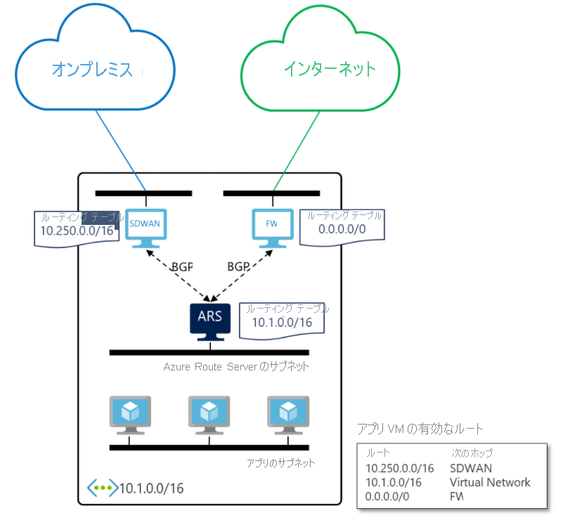

# Azure Route Server (プレビュー) とは 

Azure Route Server を使用すると、ネットワーク仮想アプライアンス (NVA) と仮想ネットワークの間の動的ルーティングが簡単になります。 これにより、ルート テーブルを手動で構成したり管理したりすることなく、BGP ルーティング プロトコルをサポートする NVA と Azure Virtual Network (VNET) 内の Azure ソフトウェア定義ネットワーク (SDN) 間で Border Gateway Protocol (BGP) ルーティング プロトコルを介して、ルーティング情報を直接交換することができます。 Azure Route Server は高可用性を使用して構成されたフル マネージド サービスです。

> [!IMPORTANT]
> Azure Route Server (プレビュー) は現在、パブリック プレビュー段階にあります。
> このプレビュー バージョンはサービス レベル アグリーメントなしで提供されています。運用環境のワークロードに使用することはお勧めできません。 特定の機能はサポート対象ではなく、機能が制限されることがあります。
> 詳しくは、[Microsoft Azure プレビューの追加使用条件](https://azure.microsoft.com/support/legal/preview-supplemental-terms/)に関するページをご覧ください。

## それはどのように機能しますか?

次の図は、Azure Route Server が SDWAN NVA および仮想ネットワーク内のセキュリティ NVA とどのように連携するかを示しています。 BGP ピアリングを確立すると、Azure Route Server によって SDWAN アプライアンスからオンプレミスのルート (10.250.0.0/16) が受信され、ファイアウォールから既定のルート (0.0.0.0/0) が受信されます。 その後、これらのルートは、仮想ネットワーク内の VM で自動的に構成されます。 その結果、オンプレミス ネットワーク宛てのすべてのトラフィックが SDWAN アプライアンスに送信されます。 一方、インターネット経由のトラフィックはすべてファイアウォールに送信されます。 その反対方向に、Azure Route Server から仮想ネットワーク アドレス (10.1.0.0/16) が両方の NVA に送信されます。 SDWAN アプライアンスからオンプレミス ネットワークにそれをさらに伝達することができます。

## 主な利点 

Azure Route Server を使用すると、仮想ネットワークでの NVA の構成、管理、デプロイが簡単になります。  

* 仮想ネットワーク アドレスが更新されるたびに、NVA のルーティング テーブルを手動で更新する必要がなくなりました。 

* NVA により新しいルートがアナウンスされたり、古いルートが取り消されたりするたびに、[ユーザー定義のルート](../virtual-network/virtual-networks-udr-overview.md)を手動で更新する必要がなくなりました。 

* NVA の複数のインスタンスを Azure Route Server にピアリングすることができます。 BGP の属性を NVA で構成したり、実際の設計 (パフォーマンスを意図したアクティブ/アクティブ、回復性を意図したアクティブ/パッシブなど) に応じて、どの NVA インスタンスがアクティブで、どの NVA インスタンスがパッシブであるかを Azure Route Server に知らせたりすることができます。 

* NVA と Azure Route Server 間のインターフェイスは、共通の標準プロトコルに基づいています。 NVA で BGP がサポートされている限り、Azure Route Server とピアリングすることができます。 詳細については、[ルート サーバーでサポートされるルーティング プロトコル](route-server-faq.md#protocol)に関するページを参照してください。

* Azure Route Server は、新規または既存の仮想ネットワークのいずれかにデプロイできます。 

## よく寄せられる質問

Azure Route Server に関してよく寄せられる質問については、[Azure Route Server に関する FAQ](route-server-faq.md) についてのページを参照してください。

## 次のステップ

- [Azure Route Server を構成する方法について学習する](quickstart-configure-route-server-powershell.md)
- [Azure Route Server が Azure ExpressRoute および Azure VPN とどのように連携するかについて学習する](expressroute-vpn-support.md)
