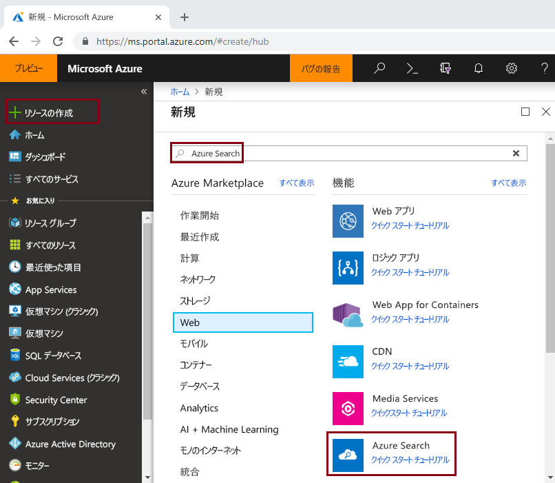
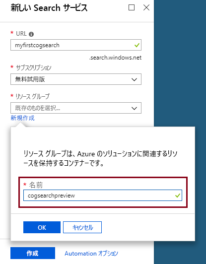
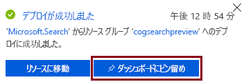
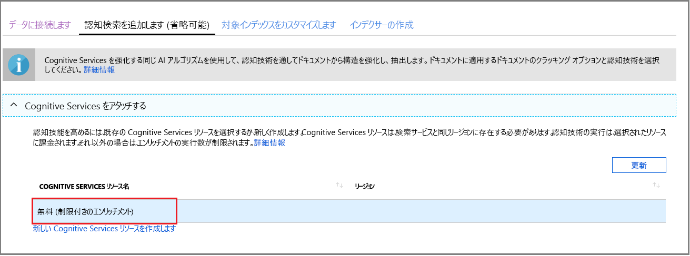

# クイック スタート:スキルとサンプル データを使用してコグニティブ検索パイプラインを作成する

コグニティブ検索 (プレビュー) は、データの抽出、自然言語処理 (NLP)、画像処理のスキルを Azure Search インデックス作成パイプラインに追加して、検索できないコンテンツや非構造化コンテンツを検索可能にします。 

コグニティブ検索パイプラインは、[OCR](cognitive-search-skill-ocr.md)、[言語検出](cognitive-search-skill-language-detection.md)、[エンティティ認識](cognitive-search-skill-entity-recognition.md)などの [Cognitive Services リソース](https://azure.microsoft.com/services/cognitive-services/)をインデックス作成プロセスに統合します。 Cognitive Services の AI アルゴリズムは、ソース データ内のパターン、機能、特性の検索に使用され、Azure Search に基づくフルテキスト検索ソリューション内で使用できる構造とテキスト コンテンツを返します。

このクイック スタートでは、1 行のコードを記述する前に、[Azure portal](https://portal.azure.com) 上で最初のエンリッチメント パイプラインを作成します。

> [!div class="checklist"]
> * Azure Blob Storage のサンプル データから始める
> * [データのインポート ウィザード](search-import-data-portal.md)をコグニティブのインデックス作成とエンリッチメント用に構成する 
> * ウィザードを実行する (エンティティ スキルで人、場所、および組織を検出する)
> * [Search エクスプローラー](search-explorer.md)を使って、エンリッチされたデータのクエリを実行する

##  サポートされているリージョン

コグニティブ検索は、次の地域で作成された Azure Search サービスで試してみることができます。

* 米国中西部
* 米国中南部
* 米国東部
* 米国東部 2
* 米国西部 2
* カナダ中部
* 西ヨーロッパ
* 英国南部
* 北ヨーロッパ
* ブラジル南部
* 東南アジア
* インド中部
* オーストラリア東部

Azure サブスクリプションをお持ちでない場合は、開始する前に [無料アカウント](https://azure.microsoft.com/free/?WT.mc_id=A261C142F) を作成してください。

> [!NOTE]
> 2018 年 12 月 21 日から、Azure Search のスキルセットに Cognitive Services リソースを関連付けることができるようになります。 これにより、スキルセットの実行への課金が開始されるようになります。 また、この日には、ドキュメント クラッキング ステージの一部として画像抽出への課金も開始されます。 ドキュメントからのテキスト抽出は、引き続き追加コストなしで提供されます。
>
> 組み込みスキルの実行は、既存の [Cognitive Services の従来課金制の価格](https://azure.microsoft.com/pricing/details/cognitive-services/)で課金されます。 画像抽出の価格はプレビュー価格で課金されますが、[Azure Search 価格のページ](https://go.microsoft.com/fwlink/?linkid=2042400)で説明されています。 [詳細情報](cognitive-search-attach-cognitive-services.md)。

## 前提条件

[「コグニティブ検索とは」](cognitive-search-concept-intro.md) では、エンリッチメントのアーキテクチャとコンポーネントについて説明しています。 

Azure サービスはこのシナリオでのみ使用されます。 必要なサービスの作成は、準備の一環です。

+ [Azure Blob Storage](https://azure.microsoft.com/services/storage/blobs/) ではソース データが提供されます
+ [Cognitive Services](https://azure.microsoft.com/services/cognitive-services/) では AI が提供されます (これらのリソースはパイプラインを指定する際にインラインで作成できます)
+ [Azure Search](https://azure.microsoft.com/services/search/) では、カスタム アプリ内で使用するためのエンリッチされたインデックス作成パイプラインと充実した自由形式のテキスト検索エクスペリエンスが提供されます

### Azure Search を設定する

最初に、Azure Search サービスにサインアップします。 

1. [Azure Portal](https://portal.azure.com) に移動し、Azure アカウントを使用してサインインします。

1. **[リソースの作成]** をクリックし、Azure Search を検索して、**[作成]** をクリックします。 Search サービスを設定するのが初めてのために、さらにサポートが必要な場合は、「[ポータルでの Azure Search サービスの作成](search-create-service-portal.md)」をご覧ください。

  

1. [リソース グループ] では、このクイック スタートで作成するすべてのリソースを含める新しいリソース グループを作成します。 これにより、クイックスタートが完了した後で、リソースをクリーンアップしやすくなります。

1. [場所] には、コグニティブ検索が[サポートされているリージョン](#supported-regions)を 1 つ選択します。

1. [価格レベル] では、チュートリアルとクイックスタートを完了するために、**Free** のサービスを作成することができます。 独自のデータを使用して詳しく調査する場合は、**Basic** や **Standard** などの[有料のサービス](https://azure.microsoft.com/pricing/details/search/)を作成します。 

  Free サービスは、3 つのインデックス、16 MB の最大 BLOB サイズ、および 2 分のインデックス作成に制限されていて、コグニティブ検索の全機能をテストするには不十分です。 さまざまなレベルの制限を確認するには、「[サービスの制限](search-limits-quotas-capacity.md)」をご覧ください。

  

  > [!NOTE]
  > コグニティブ検索はパブリック プレビュー段階です。 スキルセットの実行は、現時点では無料を含むすべてのレベルで使用可能です。 有料の Cognitive Services リソースを関連付けることなく、限られた数のエンリッチメントを実行することができます。 [詳細情報](cognitive-search-attach-cognitive-services.md)。

1. サービス情報にすばやくアクセスするために、サービスをダッシュボードにピン留めします。

  

### Azure BLOB サービスを設定し、サンプル データを読み込む

エンリッチメント パイプラインは、[Azure Search インデクサー](search-indexer-overview.md)でサポートされる Azure データ ソースから取得されます。 コグニティブ検索では Azure Table Storage はサポートされていないことに注意してください。 この演習では、BLOB ストレージを使用して複数のコンテンツ タイプを示します。

1. さまざまなタイプの小さいファイル セットで構成されている[サンプル データをダウンロード](https://1drv.ms/f/s!As7Oy81M_gVPa-LCb5lC_3hbS-4)します。 

1. Azure Blob Storage にサインアップしてストレージ アカウントを作成し、Storage Explorer にサインインしてコンテナーを作成します。 パブリック アクセス レベルは**コンテナー**に設定します。 詳しくは、非構造化データの検索のチュートリアルの「[コンテナーを作成する](../storage/blobs/storage-unstructured-search.md#create-a-container)」セクションをご覧ください。

1. 作成したコンテナーで、**[アップロード]** をクリックしてサンプル ファイルをアップロードします。

  

## エンリッチメント パイプラインを作成する

Azure Search サービスのダッシュボード ページに戻り、コマンド バーの **[データのインポート]** をクリックして、4 つの手順でコグニティブ エンリッチメントを設定します。

  ![[データのインポート] コマンド](media/cognitive-search-quickstart-blob/import-data-cmd2.png)

### ステップ 1:データ ソースを作成する

**[データへの接続]** で、**[Azure Blob Storage]** を選択し、作成したアカウントとコンテナーを選択します。 データ ソースの名前を指定し、残りの部分には既定値を使用します。 

  

次のページに進みます。

  

### 手順 2:コグニティブ スキルを追加する

次に、エンリッチメント ステップをインデックス作成パイプラインに追加します。 Cognitive Services リソースがない場合、毎日 20 トランザクションが提供される無料版にサインアップできます。 サンプル データは 14 ファイルで構成されるので、このウィザードの実行後は 1 日分の割り当てのほとんどが使用されます。

1. **[Cognitive Services をアタッチする]** を展開して、Cognitive Services APIs のリソース割り当てのオプションを表示します。 このチュートリアルの目的には、**[Free]** リソースを使用できます。

  

2. **[エンリッチメントの追加]** を展開し、自然言語処理を実行するスキルを選択します。 このクイックスタートでは、人、組織、および場所のエンティティの認識を選択します。

  

  ポータルでは、OCR 処理とテキスト分析用の組み込みスキルが提供されます。 Portal では、スキルセットは 1 つのソース フィールドで動作します。 それは小さいターゲットのように見えることもありますが、Azure BLOB の場合は `content` フィールドにほとんどの BLOB ドキュメント (たとえば、Word 文書または PowerPoint デッキ) が含まれています。 そのため、BLOB のすべてのコンテンツがここにあるため、このフィールドは理想的な入力です。

3. 次のページに進みます。

  

> [!NOTE]
> 自然言語処理スキルは、サンプルのデータ セット内のテキスト コンテンツで動作します。 OCR オプションは選択していないので、サンプルのデータ セット内にある JPEG および PNG ファイルはこのクイック スタートでは処理されません。 

### 手順 3:インデックスの構成

通常、ウィザードでは既定のインデックスを推測できます。 この手順では、生成されたインデックス スキーマを表示し、必要に応じて任意の設定を変更できます。 以下は、デモの BLOB データ セット用に作成された既定のインデックスです。

このクイックスタートでは、ウィザードによって妥当な既定値が適切に設定されます。 

+ 既定の名前は *azureblob-index* です。
+ 既定のキーは *metadata_storage_path* です (このフィールドには、一意の値が含まれています)。
+ 既定のデータ型と属性は、フルテキスト検索のシナリオに対して有効です。

`content` フィールドから **[取得可能]** を消去することを検討してください。 BLOB では、このフィールドは数千行に達することがあります。 検索結果の一覧で Word 文書や PowerPoint デッキなどの大量のコンテンツを含むファイルを JSON として表示することがどれほど困難かは想像できます。 

スキルセットを定義したので、ウィザードでは、元のソース データ フィールドに加えて、コグニティブ パイプラインによって作成される出力フィールドが必要であると想定します。 このため、Portal で `content`、`people`、`organizations`、および `locations` のインデックス フィールドが追加されます。 ウィザードではこれらのフィールドの **[取得可能]** と **[検索可能]** が自動的に有効になることに注意してください。 **[検索可能]** は、フィールドが検索可能であることを示します。 **[取得可能]** は、結果で返すことができることを意味します。 

  
  
次のページに進みます。

  

### 手順 4:インデクサーを構成する

インデクサーは、インデックス作成プロセスを開始する高度なリソースです。 これは、データ ソース名、ターゲット インデックス、および実行の頻度を指定します。 **データのインポート** ウィザードの最終的な結果は常に、繰り返し実行できるインデクサーです。

**[インデクサー]** ページで、既定の名前を受け入れ、**[一度だけ実行する ]** スケジュール オプションを使用して即時にこれを実行できます。 

  

**[送信]** をクリックして、インデクサーを作成し、同時に実行します。

## インデックス作成の監視

エンリッチメント手順は、一般的なテキストベースのインデックス作成よりも完了までに時間がかかります。 進行状況を追跡できるように、ウィザードの [概要] ページにインデクサーの一覧が開きます。 自己ナビゲーションを行うには、[概要] ページに移動し、**[インデクサー]** をクリックします。

JPG および PNG ファイルはイメージ ファイルであり、このパイプラインからは OCR スキルを省略したので、警告が発生します。 切り捨ての通知が表示されることもあります。 Free レベルの Azure Search では、抽出が 32,000 文字に制限されます。

  

インデックス作成とエンリッチメントには時間がかかることがあるため、初期の探索には小さいデータ セットが推奨されます。 

## Search エクスプローラーでクエリを実行する

インデックスを作成した後は、クエリを送信して、インデックスからドキュメントを返すことができます。 Portal で、**Search エクスプローラー**を使用してクエリを実行し、結果を表示します。 

1. Search サービスのダッシュボード ページで、コマンド バーの **[Search エクスプローラー]** をクリックします。

1. 一番上にある **[インデックスの変更]** を選択して、作成したインデックスを選択します。

1. インデックスのクエリを実行する検索文字列 (`search=Microsoft&searchFields=organizations` など) を入力します。

結果は JSON で返されます。これは、Azure BLOB から送信された大きいドキュメントでは特に、詳細で読み取りにくい場合があります。 簡単に結果に目を通すことができない場合は、CTRL + F キーを使用してドキュメント内で検索します。 このクエリでは、特定の用語を JSON 内で検索できます。 

CTRL + F キーでは、特定の結果セット内のドキュメントの数を確認することもできます。 Azure BLOB の場合は、各値がドキュメントごとに一意であるため、Portal でキーとして "metadata_storage_path" が選択されます。 ドキュメントの数を取得するには、CTRL + F キーを使用して "metadata_storage_path" を検索します。 

  

## 重要なポイント

これで、最初のコグニティブ エンリッチされたインデックス作成の演習が完了しました。 このクイックスタートの目的は、重要な概念について紹介し、ウィザードについて説明して、独自のデータを使用したコグニティブ検索ソリューションのプロトタイプを短時間で作成できるようにすることでした。

習得していただきたい主な概念には、Azure データ ソースの依存関係が含まれます。 コグニティブ検索エンリッチメントは、インデクサーにバインドされ、インデクサーに Azure とソースに固有です。 このクイックスタートでは Azure Blob Storage を使用していますが、他の Azure データ ソースも使用可能です。 詳細については、「[Azure Search のインデクサー](search-indexer-overview.md)」をご覧ください。

もう 1 つの重要な概念は、スキルが入力フィールドで動作することです。 Portal では、すべてのスキル用に 1 つのソース フィールドを選択する必要があります。 コードでは、入力は、その他のフィールドであることも、アップストリーム スキルの出力であることもあります。

 スキルへの入力は、インデックス内の出力フィールドにマップされます。 内部的には、Portal が[注釈](cognitive-search-concept-annotations-syntax.md)を設定し、[スキルセット](cognitive-search-defining-skillset.md)を定義して、操作と一般的なフローの順序を確立します。 これらの手順は Portal には表示されませんが、コードの記述を開始するときは、これらの概念が重要になります。

最後に、結果はインデックスのクエリを実行することで表示されることを学習しました。 最終的に、Azure Search が提供するものは、[単純](https://docs.microsoft.com/rest/api/searchservice/simple-query-syntax-in-azure-search)または[完全に拡張されたクエリ構文](https://docs.microsoft.com/rest/api/searchservice/lucene-query-syntax-in-azure-search)のいずれかを使用してクエリを実行できる、検索可能なインデックスです。 エンリッチされたフィールドを含むインデックスは、他のフィールドと同様です。 標準または[カスタム アナライザー](search-analyzers.md)、[スコアリング プロファイル](https://docs.microsoft.com/rest/api/searchservice/add-scoring-profiles-to-a-search-index)、[シノニム](search-synonyms.md)、[ファセット フィルター](search-filters-facets.md)、地理空間検索、またはその他の Azure Search 機能を組み込みたい場合は、確実に実行できます。

## リソースのクリーンアップ

探索が終了している場合に、最も速くクリーンアップする方法は、Azure Search サービスと Azure BLOB サービスが含まれているリソース グループを削除することです。  

両方のサービスを同じグループに配置すると仮定した場合は、ここでリソース グループを削除すると、この演習用に作成したサービスと保存したコンテンツを含み、そのリソース グループ内のすべてのものが完全に削除されます。 Portal では、リソース グループ名は各サービスの [概要] ページに表示されます。

## 次の手順

Cognitive Services リソースをプロビジョニングした方法に応じて、スキルとソース データ フィールドを使ってウィザードを再実行して、インデックス作成とエンリッチメントを試してみることができます。 この手順を繰り返すには、インデックスとインデクサーを削除してから、選択項目の新しい組み合わせでインデクサーを再作成します。

+ **[概要]** > **[インデックス]** で、作成したインデックスを選択し、**[削除]** をクリックします。

+ **[概要]** で、**[インデクサー]** タイルをダブルクリックします。 作成したインデクサーを見つけて、削除します。

または、サンプル データと作成したサービスを再利用し、次のチュートリアルで、同じタスクをプログラムで実行する方法について学習します。 

> [!div class="nextstepaction"]
> [チュートリアル:コグニティブ検索 REST API について学習する](cognitive-search-tutorial-blob.md)
