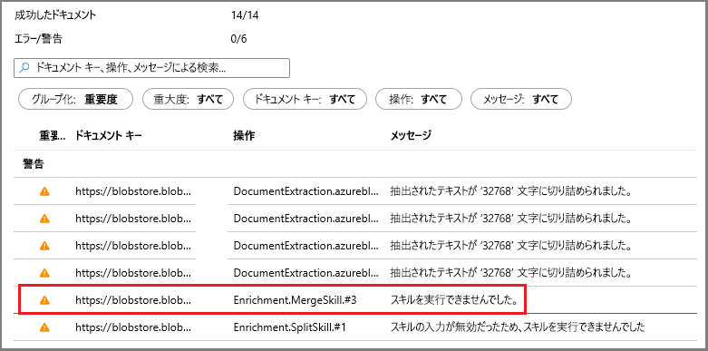
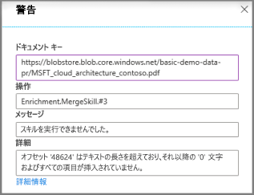

# クイック スタート:Azure Cognitive Search コグニティブ スキルセットを Azure portal で作成する

スキルセットとは、構造化されていない大量のテキストや画像ファイルから情報や構造を抽出し、Azure Cognitive Search でフルテキスト検索クエリを実行できるよう、インデックスを作成して検索できるようにする AI の機能です。 

このクイックスタートでは、Azure クラウドのサービスとデータを組み合わせてスキルセットを作成します。 すべての準備が整ったら、ポータルの**データ インポート** ウィザードを実行して、それらを 1 つにまとめます。 最終的な成果物は、AI 処理によって作成されたデータを投入した検索可能なインデックスで、ポータル ([Search エクスプローラー](search-explorer.md)) から照会することができます。

Azure サブスクリプションをお持ちでない場合は、開始する前に [無料アカウント](https://azure.microsoft.com/free/?WT.mc_id=A261C142F) を作成してください。

## サービスを作成してデータを読み込む

このクイックスタートでは、Azure Cognitive Search、[Azure Blob Storage](https://docs.microsoft.com/azure/storage/blobs/)、[Azure Cognitive Services](https://azure.microsoft.com/services/cognitive-services/) を AI に使用します。 

ワークロードは非常に小さいので、最大 20 トランザクションの処理を無料で使うことができる Cognitive Services を内部で利用しています。 そのような小さいデータ セットでは、Cognitive Services リソースの作成またはアタッチはスキップしてかまいません。

1. さまざまなタイプの小さいファイル セットで構成されている[サンプル データをダウンロード](https://1drv.ms/f/s!As7Oy81M_gVPa-LCb5lC_3hbS-4)します。 .zip ファイルを解凍します

1. [Azure Storage アカウントを作成](https://docs.microsoft.com/azure/storage/common/storage-quickstart-create-account?tabs=azure-portal)するか、[既存のアカウントを検索](https://ms.portal.azure.com/#blade/HubsExtension/BrowseResourceBlade/resourceType/Microsoft.Storage%2storageAccounts/)してください。 

   帯域幅の料金を避けるため、リージョンは、Azure Cognitive Search と同じものを選択してください。 
   
   後で別のチュートリアルのナレッジ ストア機能を試してみたい場合は、アカウントの種類として StorageV2 (General Purpose V2) を選択してください。 それ以外の場合、種類はどれでもかまいません。

1. Blob service ページを開き、コンテナーを作成します。 既定のパブリック アクセス レベルを使用できます。 

1. コンテナーの **[アップロード]** をクリックして、最初の手順でダウンロードしたサンプル ファイルをアップロードします。 ネイティブ形式ではフルテキスト検索ができない画像やアプリケーション ファイルなど、さまざまな種類のコンテンツがあることがわかります。

   

1. [Azure Cognitive Search サービスを作成](search-create-service-portal.md)するか、[既存のサービスを見つけます](https://ms.portal.azure.com/#blade/HubsExtension/BrowseResourceBlade/resourceType/Microsoft.Search%2FsearchServices)。 このクイック スタート用には、無料のサービスを使用できます。

これでデータ インポート ウィザードに進む準備が整いました。

## データ インポート ウィザードを実行する

Search サービスの概要ページにあるコマンド バーの **[データのインポート]** をクリックし、4 つの手順でコグニティブ エンリッチメントを設定します。

  ![[データのインポート] コマンド](media/cognitive-search-quickstart-blob/import-data-cmd2.png)

### 手順 1 - データ ソースを作成する

1. **[データへの接続]** で、 **[Azure Blob Storage]** を選択し、作成したストレージ アカウントとコンテナーを選択します。 データ ソースの名前を指定し、残りの部分には既定値を使用します。 

   

    次のページに進みます。

### 手順 2 - コグニティブ スキルを追加する

次に、OCR、画像分析、自然言語処理を呼び出すための AI エンリッチメントを構成します。 

1. このクイックスタートでは、**無料**の Cognitive Services リソースを使用します。 サンプル データは 14 個のファイルで構成されているため、このクイックスタートでは、Cognitive Services の無料枠である 20 トランザクションで十分間に合います。 

   

1. **[エンリッチメントの追加]** を展開して、選択項目 4 か所について設定を行います。 

   画像分析スキルをウィザード ページに追加するために OCR を有効にします。

   テキストをより小さなチャンクに分割するために、粒度を "ページ" に設定します。 いくつかのテキスト スキルは、入力が 5 KB に制限されます。

   エンティティの認識 (人物、組織、場所) と画像分析スキルを選択します。

   

   次のページに進みます。

### 手順 3 - インデックスを構成する

検索可能なコンテンツがインデックスに格納され、**データ インポート** ウィザードでは通常、データ ソースをサンプリングすることによってスキーマを自動的に作成することができます。 この手順では、生成されたスキーマを確認し、必要であれば設定に変更を加えます。 以下は、デモの BLOB データ セット用に作成された既定のスキーマです。

このクイックスタートでは、ウィザードによって妥当な既定値が適切に設定されます。  

+ 既定のフィールドは、既存の BLOB のプロパティに加え、エンリッチメントの出力を格納するための新しいフィールド (`people`、`organizations`、`locations` など) に基づきます。 データ型は、メタデータとデータのサンプリングから推定されます。

+ 既定のドキュメント キーは *metadata_storage_path* です (このフィールドが選択されるのは一意の値が含まれるため)。

+ これらのフィールドの既定の属性は **[取得可能]** と **[検索可能]** です。 **[検索可能]** は、フィールドのフルテキスト検索を許可します。 **[取得可能]** は、フィールド値を結果で取得できることを意味します。 これらのフィールドはスキルセットを介して作成されていることから、取得可能かつ検索可能にするのがユーザーの意図であると見なされます。

  

`content` フィールドの近くにある **[取得可能]** 属性の取り消し線と疑問符に注目してください。 テキスト量の多い BLOB ドキュメントでは、`content` フィールドにファイルの大部分が格納され、それは数千行にも及ぶ可能性があります。 このようなフィールドは、検索結果では扱いにくく、このデモでは除外する必要があります。 

ただし、ファイルの内容をクライアント コードに渡す必要がある場合は必ず、 **[取得可能]** をオンにしておいてください。 それ以外の場合、抽出された要素 (`people`、`organizations`、`locations` など) だけで問題がなければ、この `content` の属性はオフにすることを検討してください。

フィールドを **[取得可能]** としてマークしたからといって、このフィールドが検索結果に "*必ず*" 存在するという意味ではありません。 検索結果の構成は、対象となるフィールドを **$select** クエリ パラメーターを使用して指定することにより、厳密に制御することができます。 テキスト量の多いフィールド (`content` など) には、 **$select** パラメーターが役立ちます。アプリケーションのユーザーには扱いやすい検索結果を提供しつつ、クライアント コードからは必要なすべての情報にアクセスできる状態を **[取得可能]** 属性で確保できます。
  
次のページに進みます。

### 手順 4 - インデクサーを構成する

インデクサーは、インデックス作成プロセスを開始する高度なリソースです。 これは、データ ソース名、ターゲット インデックス、および実行の頻度を指定します。 **データ インポート** ウィザードでは、いくつかのオブジェクトが作成されます。その中には、繰り返し実行できるインデクサーが常に含まれます。

1. **[インデクサー]** ページで、既定の名前を受け入れ、**一度だけ**実行するスケジュール オプションをクリックすれば、即時にこれを実行できます。 

   

1. **[送信]** をクリックして、インデクサーを作成し、同時に実行します。

## 状態を監視する

コグニティブ スキル、特に OCR と画像分析のインデックス作成は、一般的なテキストベースのインデックス作成よりも完了までに時間がかかります。 進行状況を監視するには、概要ページに移動して、ページの中央にある **[インデクサー]** をクリックします。

  

多様なコンテンツ タイプを考えると、警告は正常です。 一部のコンテンツ タイプは特定のスキルでは無効であり、低いレベルでは[インデクサーの制限](search-limits-quotas-capacity.md#indexer-limits)に遭遇することがよくあります。 たとえば、Free レベルでは、インデクサーの制限として 32,000 文字の切り捨てが通知されます。 それよりも高いレベルでこのデモを実行した場合、切り捨てに関する警告の多くは消えます。

警告またはエラーを確認するには、インデクサー一覧で警告状態をクリックし、[実行履歴] ページを開いてください。

そのページで警告状態をもう一度クリックすると、以下に示したような警告が一覧表示されます。 

  

特定の状態の行をクリックすると、詳細が表示されます。 PDF が大きいために、最大しきい値に達してマージが停止したことがこの警告からわかります。

  

## Search エクスプローラーでクエリを実行する

インデックスを作成した後は、クエリを実行して結果を取得することができます。 このタスクは、ポータルから **Search エクスプローラー**を使用して行います。 

1. Search サービスのダッシュボード ページで、コマンド バーの **[Search エクスプローラー]** をクリックします。

1. 一番上にある **[インデックスの変更]** を選択して、作成したインデックスを選択します。

1. インデックスのクエリを実行する検索文字列 (`search=Microsoft&$select=people,organizations,locations,imageTags` など) を入力します。

結果は JSON として返されます。これは、Azure BLOB から送信された大きいドキュメントでは特に、詳細で読み取りにくい場合があります。 このツールで検索するためのいくつかのヒントを次に示します。

+ `$select` を追加して、結果に含めるフィールドを指定します。 
+ JSON 内で特定のプロパティまたは用語を検索するには、Ctrl + F キーを押します。

クエリ文字列は大文字と小文字が区別されます。"不明なフィールド" というメッセージが返された場合は、 **[フィールド]** または **[インデックス定義 (JSON)]** をチェックして名前と大文字と小文字の区別を確認してください。 

  

## 重要なポイント

初めてのスキルセットの作成を通じて、独自のデータを使って、エンリッチメントされた検索ソリューションのプロトタイプを作成するために役立つ重要な概念を見てきました。

習得していただきたい主な概念には、Azure データ ソースの依存関係が含まれます。 スキルセットはインデクサーにバインドされ、インデクサーは Azure とソースに固有です。 このクイックスタートでは Azure Blob Storage を使用していますが、他の Azure データ ソースも使用可能です。 詳細については、[Azure Cognitive Search のインデクサー](search-indexer-overview.md)に関するページを参照してください。 

もう 1 つの重要な概念は、スキルがさまざまな種類のコンテンツにわたって動作するため、異種コンテンツで使用すると、いくつかの入力がスキップされるということです。 また、ファイルまたはフィールドが大きいと、ご利用のサービス レベルのインデクサーの制限を超過してしまう可能性があります。 そうした状況で警告が発生するのは異常ではありません。 

出力は、検索インデックスに送られます。また、インデックス作成時に作成される名前と値の組と、インデックス内の個々のフィールドとの間にはマッピングが存在します。 内部的には、Portal が[注釈](cognitive-search-concept-annotations-syntax.md)を設定し、[スキルセット](cognitive-search-defining-skillset.md)を定義して、操作と一般的なフローの順序を確立します。 これらの手順は Portal には表示されませんが、コードの記述を開始するときは、これらの概念が重要になります。

最後に、インデックスに対してクエリを実行することで内容を確認できることを学習しました。 最終的に、Azure Cognitive Search が提供するものは、[単純](https://docs.microsoft.com/rest/api/searchservice/simple-query-syntax-in-azure-search)または[完全に拡張されたクエリ構文](https://docs.microsoft.com/rest/api/searchservice/lucene-query-syntax-in-azure-search)のいずれかを使用してクエリを実行できる、検索可能なインデックスです。 エンリッチされたフィールドを含むインデックスは、他のフィールドと同様です。 標準または[カスタム アナライザー](search-analyzers.md)、[スコアリング プロファイル](https://docs.microsoft.com/rest/api/searchservice/add-scoring-profiles-to-a-search-index)、[シノニム](search-synonyms.md)、[ファセット フィルター](search-filters-facets.md)、地理空間検索、またはその他の Azure Cognitive Search 機能を組み込みたい場合は、確実に実行できます。

## リソースをクリーンアップする

独自のサブスクリプションを使用している場合は、プロジェクトの最後に、作成したリソースがまだ必要かどうかを確認してください。 リソースを実行したままにすると、お金がかかる場合があります。 リソースは個別に削除することも、リソース グループを削除してリソースのセット全体を削除することもできます。

ポータルの左側のナビゲーション ウィンドウにある **[すべてのリソース]** または **[リソース グループ]** リンクを使って、リソースを検索および管理できます。

無料サービスを使っている場合は、3 つのインデックス、インデクサー、およびデータソースに制限されることに注意してください。 ポータルで個別の項目を削除して、制限を超えないようにすることができます。 

## 次のステップ

スキルセットは、ポータル、.NET SDK、または REST API を使用して作成できます。 さらに知識を深めたければ、Postman と他のサンプル データを使って REST API を試してみてください。

> [!div class="nextstepaction"]
> [チュートリアル:REST API を使用して JSON BLOB からテキストと構造を抽出する](cognitive-search-tutorial-blob.md)

> [!Tip]
> ここに示した手順をもう一度やってみたい場合や、別の AI エンリッチメントに関するチュートリアルに挑戦してみたい場合には、ポータルからインデクサーを削除してください。 インデクサーを削除すると、Cognitive Services の処理に関する 1 日あたりの無料トランザクションのカウンターがリセットされ、ゼロに戻ります。