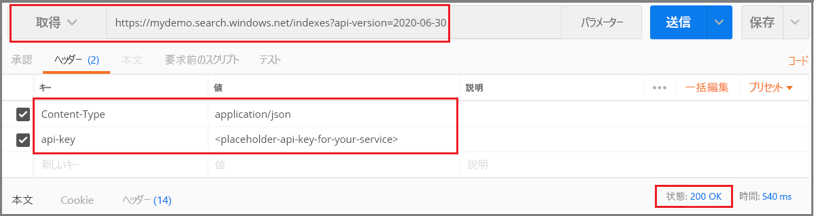

# <a name="tutorial-extract-text-and-structure-from-json-blobs-in-azure-using-rest-apis-azure-cognitive-search"></a>チュートリアル:REST Api (Azure Cognitive Search) を使用して Azure の JSON BLOB からテキストと構造を抽出する

Azure Blob Storage に非構造化テキストまたは画像のコンテンツがある場合、[AI エンリッチメント パイプライン](cognitive-search-concept-intro.md)を使用すると、情報を抽出し、フルテキスト検索やナレッジ マイニングのシナリオに役立つ新しいコンテンツを作成することができます。 パイプラインでは画像ファイル (JPG、PNG、TIFF) を処理できますが、このチュートリアルでは、ワードベースのコンテンツに焦点を当て、言語検出とテキスト分析を適用して、クエリ、ファセット、およびフィルターで利用できる新しいフィールドと情報を作成します。

> [!div class="checklist"]
> * まずは、Azure Blob Storage で、PDF、MD、DOCX、PPTX などのドキュメント全体 (非構造化テキスト) から始める。
> * テキストの抽出、言語の検出、エンティティの認識、キー フレーズの検出を行うパイプラインを定義する。
> * 出力 (生コンテンツと、パイプラインで生成された名前と値のペア) を格納するためのインデックスを定義する。
> * 変換と分析を開始し、インデックスを作成して読み込むパイプラインを実行する。
> * フルテキスト検索と豊富なクエリ構文を使用して結果を探索する。

このチュートリアルを完了するには、いくつかのサービスに加えて、REST API 呼び出しを行うための [Postman デスクトップ アプリ](https://www.getpostman.com/)または別の Web テスト ツールが必要です。 

Azure サブスクリプションをお持ちでない場合は、開始する前に[無料アカウント](https://azure.microsoft.com/free/?WT.mc_id=A261C142F)を作成してください。

## <a name="download-files"></a>ファイルをダウンロードする

1. こちらの [OneDrive フォルダー](https://1drv.ms/f/s!As7Oy81M_gVPa-LCb5lC_3hbS-4)を開き、左上隅の **[ダウンロード]** をクリックして、コンピューターにファイルをコピーします。 

1. ZIP ファイルを右クリックし、 **[すべて展開]** を選択します。 さまざまな種類のファイルが 14 個あります。 この演習では、7 個を使用します。

## <a name="1---create-services"></a>1 - サービスを作成する

このチュートリアルでは、インデックス作成とクエリに Azure Cognitive Search を使用するほか、AI エンリッチメントには Cognitive Services を、データ提供には Azure Blob Storage を使用します。 可能である場合は、近接性と管理性を高めるために、3 つのサービスすべてを同じリージョンおよびリソース グループ内に作成します。 実際には、Azure Storage アカウントは任意のリージョンに置くことができます。

### <a name="start-with-azure-storage"></a>Azure Storage の使用を開始する

1. [Azure portal にサインイン](https://portal.azure.com/)し、 **[+ リソースの作成]** をクリックします。

1. *[ストレージ アカウント]* を検索し、Microsoft のストレージ アカウント オファリングを選択します。

   

1. [基本] タブでは、次の項目が必要です。 それ以外のすべてのものには、既定値をそのまま使用します。

   + **リソース グループ**。 既存のものを選択するか、新しいものを作成します。ただし、すべてのサービスに同じグループを使用して、それらをまとめて管理できるようにします。

   + **ストレージ アカウント名**。 同じ種類のリソースが複数存在することになると考えられる場合は、名前を使用して、種類とリージョンを基に区別が付くようにします (たとえば、*blobstoragewestus*)。 

   + **場所**。 可能であれば、Azure Cognitive Search と Cognitive Services に使用するのと同じ場所を選択します。 1 つの場所であれば、帯域幅の料金がかかりません。

   + **アカウントの種類**。 既定値の *[StorageV2 (general purpose v2)]\(StorageV2 (汎用 v2)\)* を選択します。

1. **[確認および作成]** をクリックしてサービスを作成します。

1. 作成されたら、 **[Go to the resource]\(リソースに移動\)** をクリックして [概要] ページを開きます。

1. **[BLOB]** サービスをクリックします。

1. **[+ コンテナー]** をクリックしてコンテナーを作成し、*cog-search-demo* という名前を付けます。

1. *[cog-search-demo]* を選択し、 **[アップロード]** をクリックして、ダウンロード ファイルを保存したフォルダーを開きます。 画像以外のすべてのファイルを選択します。 7 個のファイルがあるはずです。 **[OK]** をクリックしてアップロードします。

   

1. Azure Storage を終了する前に、Azure Cognitive Search で接続を作成できるように、接続文字列を取得します。 

   1. 自分のストレージ アカウント (例として *blobstragewestus* を使用しています) の [概要] ページに戻ります。 
   
   1. 左側のナビゲーション ウィンドウで、 **[アクセス キー]** を選択し、いずれかの接続文字列をコピーします。 

   接続文字列は、次の例のような URL です。

      ```http
      DefaultEndpointsProtocol=https;AccountName=cogsrchdemostorage;AccountKey=<your account key>;EndpointSuffix=core.windows.net
      ```

1. メモ帳に接続文字列を保存します。 これは、後でデータ ソース接続を設定するときに必要になります。

### <a name="cognitive-services"></a>Cognitive Services

AI エンリッチメントは、自然言語と画像の処理のための Text Analytics や Computer Vision など、Cognitive Services によってサポートされています。 実際のプロトタイプまたはプロジェクトを完成させることが目的であれば、この時点で (Azure Cognitive Search と同じリージョンに) Cognitive Services をプロビジョニングして、インデックス作成操作にアタッチできるようにします。

ただし、この演習では、Azure Cognitive Search がバックグラウンドで Cognitive Services に接続し、インデクサーの実行ごとに 20 個の無料トランザクションを提供できるため、リソースのプロビジョニングをスキップできます。 このチュートリアルで使用するトランザクションは 7 個であるため、無料の割り当てで十分です。 より大規模なプロジェクトの場合は、従量課金制の S0 レベルで Cognitive Services をプロビジョニングすることを計画してください。 詳細については、[Cognitive Services のアタッチ](cognitive-search-attach-cognitive-services.md)に関するページを参照してください。

### <a name="azure-cognitive-search"></a>Azure Cognitive Search

3 番目のコンポーネントは Azure Cognitive Search であり、[ポータルで作成](search-create-service-portal.md)できます。 このチュートリアルは Free レベルを使用して完了できます。 

Azure Blob Storage と同様に、アクセス キーを収集してください。 さらに、要求の構築を始めるときに、各要求の認証に使用されるエンドポイントと管理者 API キーを指定する必要があります。

### <a name="get-an-admin-api-key-and-url-for-azure-cognitive-search"></a>Azure Cognitive Search のための管理者 API キーと URL を取得する

1. [Azure portal にサインイン](https://portal.azure.com/)し、自分の検索サービスの **[概要]** ページで、自分の検索サービスの名前を確認します。 エンドポイント URL を見ることで、自分のサービス名を確かめることができます。 エンドポイント URL が `https://mydemo.search.windows.net` だったら、自分のサービス名は `mydemo` になります。

2. **[設定]**  >  **[キー]** で、サービスに対する完全な権限の管理キーを取得します。 管理キーをロールオーバーする必要がある場合に備えて、2 つの交換可能な管理キーがビジネス継続性のために提供されています。 オブジェクトの追加、変更、および削除の要求には、主キーまたはセカンダリ キーのどちらかを使用できます。

    クエリ キーも入手します。 読み取り専用アクセスを使用してクエリ要求を発行することをお勧めします。


すべての要求で、自分のサービスに送信される各要求のヘッダーに API キーが必要になります。 有効なキーにより、要求を送信するアプリケーションとそれを処理するサービスの間で、要求ごとに信頼が確立されます。

## <a name="2---set-up-postman"></a>2 - Postman を設定する

Postman を開始し、HTTP 要求を設定します。 このツールに慣れていない場合は、[Postman を使用して Azure Cognitive Search REST API を調べる方法](search-get-started-postman.md)に関するページを参照してください。

このチュートリアルで使用した要求メソッドは **POST**、**PUT**、**GET** です。 これらのメソッドを使用して、検索サービスに対して 4 つの API 呼び出しを行い、データ ソース、スキルセット、インデックス、およびインデクサーを作成します。

ヘッダーで "Content-type" を `application/json` に設定し、`api-key` に自分の Azure Cognitive Search サービスの管理者 API キーを設定します。 ヘッダーを設定したら、この演習の各要求でそれらを使用できます。

  

## <a name="3---create-the-pipeline"></a>3 - パイプラインを作成する

Azure Cognitive Search では、AI 処理はインデックス作成 (またはデータ インジェスト) 中に行われます。 チュートリアルのこの部分では、データ ソース、インデックス定義、スキルセット、インデクサーという 4 つのオブジェクトを作成します。 

### <a name="step-1-create-a-data-source"></a>手順 1:データ ソースを作成する

[データ ソース オブジェクト](https://docs.microsoft.com/rest/api/searchservice/create-data-source)は、ファイルが格納されている BLOB コンテナーへの接続文字列を提供します。

1. **POST** と次の URL を使用します。YOUR-SERVICE-NAME は、実際のサービス名に置き換えてください。

   ```http
   https://[YOUR-SERVICE-NAME].search.windows.net/datasources?api-version=2019-05-06
   ```

1. 要求の**本文**に次の JSON 定義をコピーします。`connectionString` は、自分のストレージ アカウントの実際の接続に置き換えてください。 

   コンテナー名も忘れずに編集してください。 前の手順でコンテナー名として推奨した名前は、"cog-search-demo" です。

    ```json
    {
      "name" : "cog-search-demo-ds",
      "description" : "Demo files to demonstrate cognitive search capabilities.",
      "type" : "azureblob",
      "credentials" :
      { "connectionString" :
        "DefaultEndpointsProtocol=https;AccountName=<YOUR-STORAGE-ACCOUNT>;AccountKey=<YOUR-ACCOUNT-KEY>;"
      },
      "container" : { "name" : "<YOUR-BLOB-CONTAINER-NAME>" }
    }
    ```
1. 要求を送信します。 成功を確認する状態コード 201 が表示されるはずです。 

403 または 404 エラーが発生した場合は、要求の構造を確認してください。`api-version=2019-05-06` はエンドポイント上にある必要があり、`api-key` は `Content-Type` の後のヘッダーにある必要があり、その値は Search サービスに対して有効である必要があります。 構文が正しいことを確認するために、オンラインの JSON 検証ツールを使用して JSON ドキュメントを実行することができます。 

### <a name="step-2-create-a-skillset"></a>手順 2:スキルセットを作成する

[スキルセット オブジェクト](https://docs.microsoft.com/rest/api/searchservice/create-skillset)は、コンテンツに適用される一連のエンリッチメント手順です。 

1. **PUT** と次の URL を使用します。YOUR-SERVICE-NAME は、実際のサービス名に置き換えてください。

    ```http
    https://[YOUR-SERVICE-NAME].search.windows.net/skillsets/cog-search-demo-ss?api-version=2019-05-06
    ```

1. 要求の**本文**に次の JSON 定義をコピーします。 このスキルセットは、次の組み込みスキルで構成されています。

   | スキル                 | 説明    |
   |-----------------------|----------------|
   | [エンティティの認識](cognitive-search-skill-entity-recognition.md) | BLOB コンテナーのコンテンツから、人、組織、および場所の名前を抽出します。 |
   | [言語検出](cognitive-search-skill-language-detection.md) | コンテンツの言語を検出します。 |
   | [テキスト分割](cognitive-search-skill-textsplit.md)  | キー フレーズの抽出スキルを呼び出す前に、大きいコンテンツを小さいチャンクに分割します。 キー フレーズ抽出は、50,000 文字以下の入力を受け入れます。 いくつかのサンプル ファイルは、分割してこの制限内に収める必要があります。 |
   | [キー フレーズ抽出](cognitive-search-skill-keyphrases.md) | 上位のキー フレーズを抜き出します。 |

   各スキルは、ドキュメントのコンテンツで実行されます。 処理中に、Azure Cognitive Search が各ドキュメントを解析して、さまざまなファイル形式からコンテンツを読み取ります。 ソース ファイルから配信されたテキストが見つかると、ドキュメントごとに 1 つずつ、生成された ```content``` フィールドに配置されます。 そのため、入力は ```"/document/content"``` になります。

   キー フレーズの抽出では、テキスト スプリッター スキルを使用して大きなファイルをページに分割するため、キー フレーズ抽出スキルのコンテキストは ```"/document/content"``` ではなく、```"document/pages/*"``` (ドキュメント内の各ページ) になります。

    ```json
    {
      "description": "Extract entities, detect language and extract key-phrases",
      "skills":
      [
        {
          "@odata.type": "#Microsoft.Skills.Text.EntityRecognitionSkill",
          "categories": [ "Person", "Organization", "Location" ],
          "defaultLanguageCode": "en",
          "inputs": [
            { "name": "text", "source": "/document/content" }
          ],
          "outputs": [
            { "name": "persons", "targetName": "persons" },
            { "name": "organizations", "targetName": "organizations" },
            { "name": "locations", "targetName": "locations" }
          ]
        },
        {
          "@odata.type": "#Microsoft.Skills.Text.LanguageDetectionSkill",
          "inputs": [
            { "name": "text", "source": "/document/content" }
          ],
          "outputs": [
            { "name": "languageCode", "targetName": "languageCode" }
          ]
        },
        {
          "@odata.type": "#Microsoft.Skills.Text.SplitSkill",
          "textSplitMode" : "pages",
          "maximumPageLength": 4000,
          "inputs": [
            { "name": "text", "source": "/document/content" },
            { "name": "languageCode", "source": "/document/languageCode" }
          ],
          "outputs": [
            { "name": "textItems", "targetName": "pages" }
          ]
        },
        {
          "@odata.type": "#Microsoft.Skills.Text.KeyPhraseExtractionSkill",
          "context": "/document/pages/*",
          "inputs": [
            { "name": "text", "source": "/document/pages/*" },
            { "name":"languageCode", "source": "/document/languageCode" }
          ],
          "outputs": [
            { "name": "keyPhrases", "targetName": "keyPhrases" }
          ]
        }
      ]
    }
    ```
    スキルセットのグラフィカル表示を以下に示します。 

    

1. 要求を送信します。 Postman によって、成功を確認する状態コード 201 が返されるはずです。 

> [!NOTE]
> 出力はインデックスにマップすることができ、ダウンストリーム スキルへの入力として、または言語コードと同様に両方として使用されます。 インデックスでは、言語コードはフィルター処理に役立ちます。 入力としての言語コードは、テキスト分析スキルによって、単語区切りに基づく言語学的規則を通知するために使用されます。 スキルセットの基礎の詳細については、[スキルセットを定義する方法](cognitive-search-defining-skillset.md)に関するページをご覧ください。

### <a name="step-3-create-an-index"></a>手順 3:インデックスを作成する

[インデックス](https://docs.microsoft.com/rest/api/searchservice/create-index)は、Azure Cognitive Search の逆インデックスおよびその他の構成要素でコンテンツの物理的な表現を作成するために使用されるスキーマを提供します。 インデックスの最大コンポーネントはフィールド コレクションであり、そこではデータ型と属性によって Azure Cognitive Search でのコンテンツと動作が決まります。

1. **PUT** と次の URL を使用して、インデックスに名前を付けます。YOUR-SERVICE-NAME は、実際のサービス名に置き換えてください。

   ```http
   https://[YOUR-SERVICE-NAME].search.windows.net/indexes/cog-search-demo-idx?api-version=2019-05-06
   ```

1. 要求の**本文**に次の JSON 定義をコピーします。 `content` フィールドには、ドキュメント自体が格納されます。 `languageCode`、`keyPhrases`、および `organizations` の追加フィールドは、スキルセットによって作成される新しい情報 (フィールドと値) を表します。

    ```json
    {
      "fields": [
        {
          "name": "id",
          "type": "Edm.String",
          "key": true,
          "searchable": true,
          "filterable": false,
          "facetable": false,
          "sortable": true
        },
        {
          "name": "metadata_storage_name",
          "type": "Edm.String",
          "searchable": false,
          "filterable": false,
          "facetable": false,
          "sortable": false
        },
        {
          "name": "content",
          "type": "Edm.String",
          "sortable": false,
          "searchable": true,
          "filterable": false,
          "facetable": false
        },
        {
          "name": "languageCode",
          "type": "Edm.String",
          "searchable": true,
          "filterable": false,
          "facetable": false
        },
        {
          "name": "keyPhrases",
          "type": "Collection(Edm.String)",
          "searchable": true,
          "filterable": false,
          "facetable": false
        },
        {
          "name": "persons",
          "type": "Collection(Edm.String)",
          "searchable": true,
          "sortable": false,
          "filterable": true,
          "facetable": true
        },
        {
          "name": "organizations",
          "type": "Collection(Edm.String)",
          "searchable": true,
          "sortable": false,
          "filterable": true,
          "facetable": true
        },
        {
          "name": "locations",
          "type": "Collection(Edm.String)",
          "searchable": true,
          "sortable": false,
          "filterable": true,
          "facetable": true
        }
      ]
    }
    ```

1. 要求を送信します。 Postman によって、成功を確認する状態コード 201 が返されるはずです。 

### <a name="step-4-create-and-run-an-indexer"></a>手順 4:インデクサーの作成と実行

[インデクサー](https://docs.microsoft.com/rest/api/searchservice/create-indexer)は、パイプラインを駆動するものです。 これまでに作成した 3 つのコンポーネント (データ ソース、スキルセット、インデックス) は、インデクサーへの入力です。 Azure Cognitive Search でのインデクサーの作成は、パイプライン全体の動作を引き起こすイベントです。 

1. **PUT** と次の URL を使用して、インデクサーに名前を付けます。YOUR-SERVICE-NAME は、実際のサービス名に置き換えてください。

   ```http
   https://[servicename].search.windows.net/indexers/cog-search-demo-idxr?api-version=2019-05-06
   ```

1. 要求の**本文**に次の JSON 定義をコピーします。 フィールド マッピング要素に注目してください。これらのマッピングは、データ フローを定義するものであるため、重要です。 

   スキルセットの前に `fieldMappings` が処理されて、データ ソースからインデックス内のターゲット フィールドにコンテンツが送信されます。 フィールド マッピングを使用して、変更されていない既存のコンテンツをインデックスに送信します。 フィールド名と型が両側で共通していれば、マッピングは必要ありません。

   `outputFieldMappings` はスキルによって作成されるフィールド用であるため、スキルセットの実行後に処理されます。 `outputFieldMappings` での `sourceFieldNames` への参照は、ドキュメント解析またはエンリッチメントによって作成されるまでは存在しません。 `targetFieldName` はインデックス内のフィールドであり、インデックス スキーマで定義されています。

    ```json
    {
      "name":"cog-search-demo-idxr",    
      "dataSourceName" : "cog-search-demo-ds",
      "targetIndexName" : "cog-search-demo-idx",
      "skillsetName" : "cog-search-demo-ss",
      "fieldMappings" : [
        {
          "sourceFieldName" : "metadata_storage_path",
          "targetFieldName" : "id",
          "mappingFunction" :
            { "name" : "base64Encode" }
        },
        {
          "sourceFieldName" : "metadata_storage_name",
          "targetFieldName" : "metadata_storage_name",
          "mappingFunction" :
            { "name" : "base64Encode" }
        },
        {
          "sourceFieldName" : "content",
          "targetFieldName" : "content"
        }
      ],
      "outputFieldMappings" :
      [
        {
          "sourceFieldName" : "/document/persons",
          "targetFieldName" : "persons"
        },
        {
          "sourceFieldName" : "/document/organizations",
          "targetFieldName" : "organizations"
        },
        {
          "sourceFieldName" : "/document/locations",
          "targetFieldName" : "locations"
        },
        {
          "sourceFieldName" : "/document/pages/*/keyPhrases/*",
          "targetFieldName" : "keyPhrases"
        },
        {
          "sourceFieldName": "/document/languageCode",
          "targetFieldName": "languageCode"
        }
      ],
      "parameters":
      {
        "maxFailedItems":-1,
        "maxFailedItemsPerBatch":-1,
        "configuration":
        {
          "dataToExtract": "contentAndMetadata",
          "parsingMode": "default",
          "firstLineContainsHeaders": false,
          "delimitedTextDelimiter": ","
        }
      }
    }
    ```

1. 要求を送信します。 Postman によって、処理の成功を確認する状態コード 201 が返されるはずです。 

   この手順は完了までに数分かかる予定です。 データ セットが小さい場合でも、分析スキルは計算を集中的に行います。 

> [!NOTE]
> インデクサーを作成すると、パイプラインが呼び出されます。 データ、入力と出力のマッピング、または操作の順序に及ぶ問題がある場合は、この段階で現れます。 コードまたはスクリプトに変更を加えてパイプラインを再実行するには、最初にオブジェクトを削除する必要がある場合があります。 詳細については、「[リセットして再実行する](#reset)」をご覧ください。

#### <a name="about-indexer-parameters"></a>インデクサーのパラメーターについて

スクリプトで ```"maxFailedItems"``` を -1 に設定します。これにより、インデックス作成エンジンに、データのインポート中のエラーを無視するよう指示します。 デモのデータ ソースにはドキュメントがほとんどないため、これは許容できます。 大きいデータ ソースの場合は、この値を 0 より大きい値に設定します。

```"dataToExtract":"contentAndMetadata"``` ステートメントは、さまざまなファイル形式と、各ファイルに関連するメタデータからコンテンツを自動的に抽出するようにインデクサーに指示します。 

コンテンツが抽出されるときに、```imageAction``` を設定して、データ ソース内にある画像からテキストを抽出することができます。 ```"imageAction":"generateNormalizedImages"``` 構成は、OCR スキルおよびテキスト マージ スキルと組み合わされて、イメージからテキスト (たとえば、一時停止の道路標識から "stop" という単語) を抽出し、それをコンテンツ フィールドの一部として埋め込むよう、インデクサーに指示します。 この動作は、ドキュメントに埋め込まれているイメージ (PDF 内のイメージを考えてください) と、データ ソース内にあるイメージ (たとえば、JPG ファイル) の両方に適用されます。

## <a name="4---monitor-indexing"></a>4 - インデックス作成を監視する

インデックス作成とエンリッチメントは、インデクサー作成要求を送信するとすぐに開始されます。 定義したコグニティブ スキルによっては、インデックス作成に時間がかかる場合があります。 インデクサーがまだ実行中かどうかを調べるには、次の要求を送信して、インデクサーの状態を確認します。

1. **GET** と次の URL を使用して、インデクサーに名前を付けます。YOUR-SERVICE-NAME は、実際のサービス名に置き換えてください。

   ```http
   https://[YOUR-SERVICE-NAME].search.windows.net/indexers/cog-search-demo-idxr/status?api-version=2019-05-06
   ```

1. 応答を調べて、インデクサーが実行されているかどうかを確認するか、エラーと警告の情報を確認します。  

Free レベルを使用している場合は、次のメッセージが表示されます: "Could not extract content or metadata from your document. Truncated extracted text to '32768' characters." (ドキュメントからコンテンツまたはメタデータを抽出できませんでした。抽出されたテキストが '32768' 文字に切り詰められました。) このメッセージが表示されるのは、Free レベルでの BLOB のインデックス作成には、[文字の抽出に 32K の制限](search-limits-quotas-capacity.md#indexer-limits)があるためです。 より上位のレベルでは、このデータ セットに対してこのメッセージは表示されません。 

> [!NOTE]
> 警告は一部のシナリオで一般的であり、必ずしも問題を示すとは限りません。 たとえば、BLOB コンテナーに画像ファイルが含まれていて、パイプラインで画像を処理しない場合、画像が処理されなかったことを示す警告が表示されます。

## <a name="5---search"></a>5 - 検索する

新しいフィールドと情報を作成したので、いくつかのクエリを実行して、コグニティブ検索の価値を理解しましょう。コグニティブ検索は、一般的な検索シナリオに関連しています。

ドキュメント全体が単一の `content` フィールドにパッケージ化されている BLOB コンテンツから始めたことを思い出してください。 このフィールドを検索して、クエリに一致するものを見つけることができます。

1. **GET** と次の URL を使用して、用語や語句の出現箇所を検索します。YOUR-SERVICE-NAME は、実際のサービス名に置き換えてください。これにより、`content` フィールドと、一致するドキュメントの数が返されます。

   ```http
   https://[YOUR-SERVICE-NAME].search.windows.net/indexes/cog-search-demo-idx?search=*&$count=true&$select=content?api-version=2019-05-06
   ```
   
   このクエリでは、結果としてドキュメントのコンテンツが返されます。これは、コグニティブ検索パイプラインなしで BLOB インデクサーを使用した場合に取得されるのと同じ結果です。 このフィールドは検索可能ですが、ファセット、フィルター、またはオートコンプリートを使用したいと思っても、動作しません。

   
   
1. 2 番目のクエリでは、パイプラインによって作成された新しいフィールドの一部 (persons、organizations、locations、languageCode) が返されます。 簡潔にするために keyPhrases は省略していますが、それらの値を確認したい場合は含める必要があります。

   ```http
   https://mydemo.search.windows.net/indexes/cog-search-demo-idx/docs?search=*&$count=true&$select=metadata_storage_name,persons,organizations,locations,languageCode&api-version=2019-05-06
   ```
   $select ステートメントのフィールドには、Cognitive Services の自然言語処理機能によって作成された新しい情報が含まれています。 予想どおり、結果内のノイズやドキュメント間のバリエーションもいくらかあるものの、多くの場合、分析モデルによって正確な結果が生成されます。

   次の図は、Satya Nadella が Microsoft で CEO に就任したときの公開書簡に対する結果を示しています。

   

1. これらのフィールドをどのように活用できるかを確認するには、ファセット パラメーターを追加して、場所ごとの一致するドキュメントの集計を返します。

   ```http
   https://[YOUR-SERVICE-NAME].search.windows.net/indexes/cog-search-demo-idx/docs?search=*&facet=locations&api-version=2019-05-06
   ``` 

   この例では、場所ごとに 2 件または 3 件の一致があります。

   
   

1. この最後の例では、組織のコレクションにフィルターを適用します。それにより、NASDAQ に基づくフィルター条件に対して 2 件の一致が返されます。

   ```http
   cog-search-demo-idx/docs?search=*&$filter=organizations/any(organizations: organizations eq 'NASDAQ')&$select=metadata_storage_name,organizations&$count=true&api-version=2019-05-06
   ```

これらのクエリは、Cognitive Search によって作成された新しいフィールドでクエリ構文やフィルターを操作するいくつかの方法を示しています。その他のクエリの例については、[Search Documents REST API の例](https://docs.microsoft.com/rest/api/searchservice/search-documents#bkmk_examples)、[単純構文クエリの例](search-query-simple-examples.md)、および[完全な Lucene クエリの例](search-query-lucene-examples.md)に関するページを参照してください。

<a name="reset"></a>

## <a name="reset-and-rerun"></a>リセットして再実行する

パイプライン開発の初期の実験的な段階では、設計反復のための最も実用的なアプローチは、Azure Cognitive Search からオブジェクトを削除してリビルドできるようにすることです。 リソース名は一意です。 オブジェクトを削除すると、同じ名前を使用して再作成することができます。

新しい定義でドキュメントのインデックスを再作成するには、以下の操作を行います。

1. インデクサー、インデックス、およびスキルセットを削除します。
2. オブジェクトを変更します。
3. サービス上で再作成してパイプラインを実行します。 

ポータルを使用して、インデックス、インデクサー、およびスキルセットを削除できます。または、**DELETE** を使用し、各オブジェクトの URL を指定することもできます。 次のコマンドは、インデクサーを削除します。

```http
DELETE https://[YOUR-SERVICE-NAME]].search.windows.net/indexers/cog-search-demo-idxr?api-version=2019-05-06
```

正常に削除されると、状態コード 204 が返されます。

コードが成熟したら、リビルド戦略を改善することもできます。 詳細については、[インデックスをリビルドする方法](search-howto-reindex.md)に関するページをご覧ください。

## <a name="takeaways"></a>ここまでのポイント

このチュートリアルでは、構成要素 (データ ソース、スキルセット、インデックス、およびインデクサー) の作成によってエンリッチされたインデックス作成パイプラインを作成するための、基本的な手順を示します。

[組み込みのスキル](cognitive-search-predefined-skills.md)については、スキルセットの定義と、入力と出力を介したスキルの連結のしくみと共に説明しました。 また、Azure Cognitive Search サービス上の検索可能なインデックスに対し、エンリッチされた値をパイプラインからルーティングするには、インデクサーの定義に `outputFieldMappings` が必要であることも学習しました。

最後に、結果をテストし、今後の反復のためにシステムをリセットする方法について学習しました。 インデックスに対するクエリを発行すると、エンリッチされたインデックス作成パイプラインによって作成された出力が返されることを学習しました。 

## <a name="clean-up-resources"></a>リソースのクリーンアップ

チュートリアルの後に最も短時間でクリーンアップする方法は、Azure Cognitive Search サービスと Azure Blob service が含まれているリソース グループを削除することです。 両方のサービスを同じグループに配置すると仮定した場合は、ここでリソース グループを削除すると、このチュートリアル用に作成したサービスと保存したコンテンツを含み、そのリソース グループ内のすべてのものが完全に削除されます。 Portal では、リソース グループ名は各サービスの [概要] ページに表示されます。

## <a name="next-steps"></a>次の手順

カスタム スキルを使ってパイプラインをカスタマイズまたは拡張します。 カスタム スキルを作成してスキルセットに追加すると、自分で作成したテキストまたは画像分析をオンボードできます。 

> [!div class="nextstepaction"]
> [例:AI エンリッチメント用のカスタム スキルを作成する](cognitive-search-create-custom-skill-example.md)