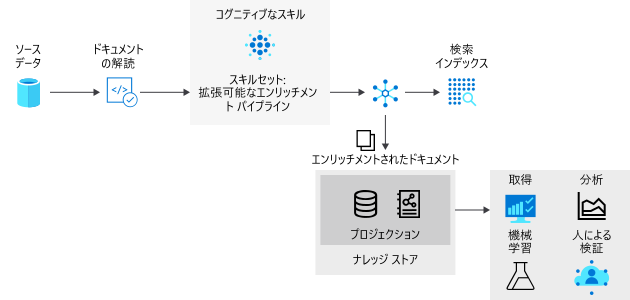

# <a name="introduction-to-knowledge-stores-in-azure-cognitive-search"></a>Azure Cognitive Search のナレッジ ストアの概要

> [!IMPORTANT] 
> ナレッジ ストアは現在、パブリック プレビューの段階です。 プレビュー段階の機能はサービス レベル アグリーメントなしで提供しています。運用環境のワークロードに使用することはお勧めできません。 詳しくは、[Microsoft Azure プレビューの追加使用条件](https://azure.microsoft.com/support/legal/preview-supplemental-terms/)に関するページをご覧ください。 プレビュー機能は [REST API バージョン 2019-05-06-Preview](search-api-preview.md) で提供しています。 現時点でポータルによるサポートは一部のみにとどまります。また、.NET SDK によるサポートはありません。

ナレッジ ストアは、Azure Cognitive Search の機能です。[AI エンリッチメント パイプライン](cognitive-search-concept-intro.md)からの出力を、独立した分析またはダウンストリーム処理に使用できるよう永続化するものです。 "*エンリッチメントされたドキュメント*" とは、AI プロセスを使用して抽出、構造化、および分析されたコンテンツから作成される、パイプラインの出力のことです。 標準的な AI パイプラインでは、エンリッチメントされたドキュメントは一時的なものであり、インデックス作成時にのみ使用され、その後破棄されます。 エンリッチメントされたドキュメントは、ナレッジ ストアを使用して保存されます。 

過去にコグニティブ スキルを使用したことがある方であれば、"*スキルセット*" によって、ドキュメントが一連のエンリッチメントを通じて移動されることを既にご存じと思われます。 結果は、検索インデックスまたは (このプレビューの新機能である) ナレッジ ストア内のプロジェクションです。 2 つの出力 (検索インデックスとナレッジ ストア) は、同じパイプラインから生成され、同じ入力から派生しますが、結果としては、非常に異なった形式で出力が構造化、格納、および使用されます。

物理的には、ナレッジ ストアは [Azure Storage](https://docs.microsoft.com/azure/storage/common/storage-account-overview) です。つまり Azure Table Storage か Azure Blob Storage、またはその両方になります。 Azure Storage に接続できるすべてのツールまたはプロセスは、ナレッジ ストアのコンテンツを使用できます。



## <a name="benefits-of-knowledge-store"></a>ナレッジ ストアのメリット

ナレッジ ストアでは、BLOB などの非構造化および半構造化データ ファイル、分析が実行されたイメージ ファイル、または新しいフォームに整形された構造化データから収集された構造体、コンテキスト、および実際のコンテンツが提供されます。 [ステップ バイ ステップ チュートリアル](knowledge-store-create-rest.md)では、高密度の JSON ドキュメントが下部構造にパーティション分割される方法、新しい構造体に再構築される方法、または機械学習やデータ サイエンスのワークロードなどのダウンストリーム プロセスで使用できるようにする方法を直接確認できます。

AI エンリッチメント パイプラインで何を生成できるかを確認するのに便利ですが、ナレッジ ストアの真の可能性はデータを整形する機能にあります。 基本的なスキルセットから開始し、反復処理して構造のレベルを追加し、それを Azure Cognitive Search 以外のアプリ内でも使用できるように新しい構造に結合できます。

ナレッジ ストアのメリットの列挙には以下が含まれます。

+ 検索以外の[分析およびレポート作成ツール](#tools-and-apps)内でエンリッチメントされたドキュメントを使用する。 Power Query を使用した Power BI は魅力的な選択肢ですが、Azure Storage に接続できる任意のツールまたはアプリで、作成するナレッジ ストアからプルできます。

+ 手順とスキルセットの定義をデバッグ中に、AI インデックス作成パイプラインを調整する。 ナレッジ ストアによって、AI インデックス作成パイプライン内のスキルセット定義の製品が示されます。 これらの結果を使用すると、エンリッチメントがどのようになるかを正確に確認できるので、より優れたスキルセットを設計できます。 Azure Storage 内で [Storage Explorer](https://docs.microsoft.com/azure/vs-azure-tools-storage-manage-with-storage-explorer?tabs=windows) を使用して、ナレッジ ストアのコンテンツを表示できます。

+ データを新しいフォームに整形する。 整形はスキルセット内で体系化されていますが、ポイントは、スキルセットでこの機能を提供できるようになったことです。 Azure Cognitive Search 内の [Shaper スキル](cognitive-search-skill-shaper.md)は、このタスクに対応するために拡張されました。 整形により、関係を維持しながら、データの使用目的に合致したプロジェクションを定義することができます。

> [!Note]
> AI エンリッチメントとコグニティブ スキルは初めてですか。 Azure Cognitive Search は Cognitive Services の Vision および Language 機能と統合され、イメージ ファイルの光学式文字認識 (OCR)、エンティティの認識、テキスト ファイルからのキー フレーズの抽出などを使用してソース データが抽出およびエンリッチメントされます。 詳細については、[Azure Cognitive Search の AI エンリッチメント](cognitive-search-concept-intro.md)に関するページを参照してください。

## <a name="physical-storage"></a>物理ストレージ

ナレッジストアの物理的表現は、スキルセットの `knowledgeStore` 定義の `projections` 要素を通じて表されます。 プロジェクションは、意図された用途に一致するように出力の構造を定義します。

プロジェクションは、テーブル、オブジェクト、またはファイルとして表すことができます。

```json
"knowledgeStore": { 
    "storageConnectionString": "<YOUR-AZURE-STORAGE-ACCOUNT-CONNECTION-STRING>", 
    "projections": [ 
        { 
            "tables": [ ], 
            "objects": [ ], 
            "files": [ ]
        },
                { 
            "tables": [ ], 
            "objects": [ ], 
            "files": [ ]
        }
```

この構造で指定するプロジェクションの種類によって、ナレッジ ストアによって使用されるストレージの種類が決まります。

+ テーブル ストレージは、`tables` を定義するときに使用されます。 分析ツールへの入力のために表形式のレポート構造が必要な場合や、データ フレームとして他のデータ ストアにエクスポートする場合は、テーブル プロジェクションを定義します。 複数の `tables` を指定して、エンリッチメントされたドキュメントのサブセットまたは断面を取得することができます。 同じプロジェクション グループ内では、テーブルのリレーションシップが保持されるため、すべてのテーブルを操作できます。

+ BLOB ストレージは、`objects` または `files` を定義するときに使用されます。 `object` の物理的表現は、エンリッチメントされたドキュメントを表す階層型の JSON 構造体です。 `file` は、ドキュメントから抽出され、BLOB ストレージにそのまま転送されるイメージです。

1 つのプロジェクション オブジェクトには `tables`、`objects`、`files` の 1 つのセットが含まれ、多くのシナリオで、1 つのプロジェクションを作成するだけで十分な場合があります。 

ただし、`table`-`object`-`file` プロジェクションの複数のセットを作成することは可能であり、異なったデータ リレーションシップが必要な場合にそうすることができます。 セット内では、それらのリレーションシップが存在し、検出できることを前提として、データが関連付けられます。 追加のセットを作成する場合、各グループ内のドキュメントは決して関連付けられません。 複数のプロジェクション グループを使用する例として、オンライン システムで使用するために同じデータをプロジェクションし、それを特定の方式で表現する必要がある場合に、異なる方式で表現されるデータ サイエンス パイプラインで使用するために同じデータをさらにプロジェクションする、というものがあります。

## <a name="requirements"></a>必要条件 

[Azure Storage](https://docs.microsoft.com/azure/storage/) が必要です。 物理ストレージを提供します。 BLOB ストレージ、テーブル ストレージ、またはその両方を使用できます。 BLOB ストレージは、通常、出力の行き先がダウンストリーム プロセスであるときに、そのままのエンリッチメントされたドキュメントに対して使用されます。 テーブル ストレージは、エンリッチメントされたドキュメントのスライス用であり、一般的には分析とレポートに使用されます。

[スキルセット](cognitive-search-working-with-skillsets.md)が必要です。 `knowledgeStore` 定義が含まれており、エンリッチメントされたドキュメントの構造と構成を決定します。 空のスキルセットを使用してナレッジ ストアを作成することはできません。 スキルセットには少なくとも 1 つのスキルが必要です。

[インデクサー](search-indexer-overview.md)が必要です。 スキルセットは、実行を駆動するインデクサーによって呼び出されます。 インデクサーには、独自の要件と属性のセットがあります。 これらの属性のいくつかは、ナレッジ ストアと直接の関連があります。

+ インデクサーには、[サポートされている Azure データ ソース](search-indexer-overview.md#supported-data-sources)が必要です (最終的にナレッジ ストアを作成するパイプラインは、Azure でサポートされているソースからデータをプルすることから始まります)。 

+ インデクサーには検索インデックスが必要です。 インデクサーでは、使用する予定がない場合でも、インデックス スキーマを指定する必要があります。 最小インデックスには、キーとして指定される 1 つの文字列フィールドがあります。

+ インデクサーには、変換元フィールドの別名を変換先フィールドに指定するために使用される、省略可能なフィールド マッピングが用意されています。 既定のフィールド マッピングに変更が必要な場合 (別の名前または型を使用する場合) は、インデクサー内で[フィールド マッピング](search-indexer-field-mappings.md)を作成できます。 ナレッジ ストアの出力では、BLOB オブジェクトまたはテーブルのフィールドを変換先として指定できます。

+ インデクサーにはスケジュールがあり、さまざまなデータ ソースによって提供される変更検出メカニズムなど、その他のプロパティもナレッジ ストアに適用できます。 たとえば、コンテンツを更新するために、エンリッチメントを定期的に[スケジュール](search-howto-schedule-indexers.md)することができます。 

## <a name="how-to-create-a-knowledge-store"></a>ナレッジ ストアの作成方法

ナレッジ ストアを作成するには、ポータルまたはプレビュー REST API (`api-version=2019-05-06-Preview`) を使用します。

### <a name="use-the-azure-portal"></a>Azure ポータルの使用

**[データのインポート]** ウィザードには、ナレッジ ストアを作成するためのオプションが含まれています。 初期探索のために、[4 つの手順で最初のナレッジ ストアを作成します](knowledge-store-connect-power-bi.md)。

1. サポートされているデータ ソースを選択します。

1. エンリッチメントの指定: リソースを添付し、スキルを選択し、ナレッジ ストアを指定します。 

1. インデックス スキーマを作成します。 これはウィザードによって要求され、ウィザードに推測してもらうことができます。

1. ウィザードを実行します。 この最後の手順で、抽出、エンリッチメント、および格納が行われます。

### <a name="use-create-skillset-and-the-preview-rest-api"></a>スキルセットの作成とプレビュー REST API を使用する

[スキルセット](cognitive-search-working-with-skillsets.md)内で `knowledgeStore` が定義されます。次に、スキルセットが[インデクサー](search-indexer-overview.md)によって呼び出されます。 エンリッチメント中に、Azure Cognitive Search によって Azure Storage アカウント内にスペースが作成され、ご利用の構成に応じて BLOB として、またはテーブルに、エンリッチメントされたドキュメントがプロジェクションされます。

現時点では、プレビュー REST API は、プログラムによってナレッジ ストアを作成できる唯一のメカニズムです。 探索する簡単な方法は、[Postman と REST API を使用して最初のナレッジ ストアを作成する](knowledge-store-create-rest.md)ことです。

このプレビュー機能のリファレンス コンテンツは、この記事内の「[API リファレンス](#kstore-rest-api)」にあります。 

<a name="tools-and-apps"></a>

## <a name="how-to-connect-with-tools-and-apps"></a>ツールやアプリと接続する方法

エンリッチメントがストレージ内に存在した後、Azure Blob または Table Storage に接続する任意のツールまたはテクノロジを使用して、コンテンツを探索、分析、または使用できます。 次の一覧が開始点です。

+ エンリッチメントされたドキュメントの構造とコンテンツを表示する [Storage Explorer](knowledge-store-view-storage-explorer.md)。 これは、ナレッジ ストアのコンテンツを表示するためのベースライン ツールと考えてください。

+ レポートと分析のための [Power BI](knowledge-store-connect-power-bi.md)。 

+ さらに操作するための [Azure Data Factory](https://docs.microsoft.com/azure/data-factory/)。

<a name="kstore-rest-api"></a>

## <a name="api-reference"></a>API リファレンス

REST API バージョン `2019-05-06-Preview` では、スキルセットの追加の定義を通じてナレッジ ストアが提供されています。 このリファレンスに加えて、[Postman を使用したナレッジ ストアの作成](knowledge-store-create-rest.md)に関する記事を参照し、API の呼び出し方法の詳細をご確認ください。

+ スキルセットを作成する [(api-version=2019-05-06-Preview)](https://docs.microsoft.com/rest/api/searchservice/2019-05-06-preview/create-skillset) 
+ [スキルセットを更新する (api-version=2019-05-06-Preview)](https://docs.microsoft.com/rest/api/searchservice/2019-05-06-preview/update-skillset) 


## <a name="next-steps"></a>次のステップ

ナレッジ ストアは、エンリッチメントされたドキュメントを永続化する手段として、スキルセットを設計する際に役立つほか、Azure Storage アカウントにアクセスする機能を備えた、あらゆるクライアント アプリケーションから利用する新しい構造やコンテンツを作成する際にも役立てることができます。

エンリッチメントされたドキュメントを作成する最も簡単なアプローチは、[ポータルを使用する](knowledge-store-create-portal.md)ことですが、Postman と REST API を使用する方法もあります。オブジェクトがどのように作成され、参照されるのかについて深く理解する必要がある場合には、後者の方が便利です。

> [!div class="nextstepaction"]
> [Postman と REST を使用してナレッジ ストアを作成する](knowledge-store-create-rest.md)

プロジェクション、機能、および[スキルセットでそれらを定義する方法](knowledge-store-projection-overview.md)の詳細を確認します

> [!div class="nextstepaction"]
> [ナレッジ ストアでのプロジェクション](knowledge-store-projection-overview.md)

スライス、インラインの整形、リレーションシップなどの高度なプロジェクションの概念について説明するチュートリアルについては、「[ナレッジ ストアでプロジェクションを定義する](knowledge-store-projections-examples.md)」を開始してください。

> [!div class="nextstepaction"]
> [ナレッジ ストアでのプロジェクションを定義する](knowledge-store-projections-examples.md)