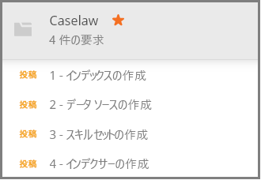

# <a name="how-to-get-started-with-knowledge-store-in-azure-search"></a>Azure Search でナレッジ ストアの使用を開始する方法

> [!Note]
> ナレッジ ストアはプレビュー段階にあり、運用環境での使用は意図していません。 [REST API バージョン 2019-05-06-Preview](search-api-preview.md) でこの機能を提供します。 現時点で .NET SDK のサポートはありません。
>
[ナレッジ ストア](knowledge-store-concept-intro.md)には、他のアプリでのダウンストリーム データ マイニング用に Azure ストレージ アカウントにインデックスを付けている間に作成される、AI でエンリッチメントされたドキュメントが保存されます。 保存されているエンリッチメントを使用して、Azure Search インデックス作成パイプラインを理解し、絞り込むこともできます。 

ナレッジ ストアは、"*スキルセット*" によって定義され、"*インデクサー*" によって作成されます。 ナレッジ ストアの物理表現は、ストレージ内のデータ構造を決定する "*プロジェクション*" を通じて指定されます。 このチュートリアルを完了すると、これらのオブジェクトの作成がすべて終わり、それらすべてがどのように組み合わされるのかがわかります。 

この演習では、サンプル データ、サービス、およびツールから開始して、スキルセット定義に重点を置いて、最初のナレッジ ストアの作成と使用の基本的なワークフローを確認します。

## <a name="prerequisites"></a>前提条件

ナレッジ ストアは複数のサービスの中心にあり、そこでは物理ストレージを提供する Azure Blob Storage と Azure Table Storage のほか、オブジェクトの作成用および更新用の Azure Search と Cognitive Services が使用されます。 このチュートリアルでは、[基本のアーキテクチャ](knowledge-store-concept-intro.md)を理解していることが前提条件です。

このクイック スタートでは、次のサービスとツールを使用します。 

+ Azure Search に HTTP 要求を送信するために使用される [Postman デスクトップ アプリを入手](https://www.getpostman.com/)します。

+ サンプル データとナレッジ ストアを格納するための [Azure ストレージ アカウントを作成](https://docs.microsoft.com/azure/storage/common/storage-quickstart-create-account)します。 ナレッジ ストアは、Azure ストレージ内に存在します。

+ [Cognitive Services リソースを](https://docs.microsoft.com/azure/cognitive-services/cognitive-services-apis-create-account) S0 従量課金制レベルで作成し、AI エンリッチメント内で使用されるさまざまなスキルに幅広くアクセスできるようにします。 コグニティブ サービスと自分の Azure Search サービスは同じリージョンに属している必要があります。

+ [Azure Search サービスを作成](search-create-service-portal.md)するか、現在のサブスクリプションから[既存のサービスを見つけます](https://ms.portal.azure.com/#blade/HubsExtension/BrowseResourceBlade/resourceType/Microsoft.Search%2FsearchServices)。 このチュートリアル用には、無料のサービスを使用できます。 

サンプル JSON ドキュメントと Postman コレクション ファイルも必要です。 追加のファイルを探して読み込む手順は、「[サンプル データの準備](#prepare-sample-data)」セクションにあります。

## <a name="get-a-key-and-url"></a>キーと URL を入手する

REST 呼び出しには、要求ごとにサービス URL とアクセス キーが必要です。 両方を使用して検索サービスが作成されるので、Azure Search をサブスクリプションに追加した場合は、次の手順に従って必要な情報を入手してください。

1. [Azure portal にサインイン](https://portal.azure.com/)し、ご使用の検索サービスの **[概要]** ページで、URL を入手します。 たとえば、エンドポイントは `https://mydemo.search.windows.net` のようになります。

1. **[設定]**  >  **[キー]** で、サービスに対する完全な権限の管理者キーを取得します。 管理キーをロールオーバーする必要がある場合に備えて、2 つの交換可能な管理キーがビジネス継続性のために提供されています。 オブジェクトの追加、変更、および削除の要求には、主キーまたはセカンダリ キーのどちらかを使用できます。

    

すべての要求では、サービスに送信されるすべての要求に API キーが必要です。 以下のセクションでは、各 HTTP 要求でサービス名と API キーを指定します。

<a name="prepare-sample-data"></a>

## <a name="prepare-sample-data"></a>サンプル データの準備

ナレッジ ストアには、エンリッチメント パイプラインの出力が含まれます。 入力は "使用できない" データで構成されます。これは、パイプラインを通過すると最終的に "使用できる" ようになります。 使用できないデータの例には、テキストまたは画像の特性について分析する必要がある画像ファイルや、エンティティ、キー フレーズ、またはセンチメントについて分析できる難解なテキスト ファイルなどがあります。 

この演習では、難解なテキスト ファイル (判例の情報) を使用します。これは、[Caselaw Access Project](https://case.law/bulk/download/) の「Public Bulk Data (パブリック一括データ)」ダウンロード ページから取得したものです。 この演習用に 10 ドキュメントのサンプルを GitHub にアップロードしました。 

このタスクでは、パイプラインへの入力として使用するそれらのドキュメント用に、Azure BLOB コンテナーを作成します。 

1. [Azure Search のサンプル データ](https://github.com/Azure-Samples/azure-search-sample-data/tree/master/caselaw)のリポジトリをダウンロードして抽出し、[判例データ セット](https://github.com/Azure-Samples/azure-search-sample-data/tree/master/caselaw)を取得します。 

1. [Azure portal にサインインし](https://portal.azure.com)、Azure ストレージ アカウントに移動して **[BLOB]** をクリックし、 **[+ コンテナー]** をクリックします。

1. サンプル データを含める [BLOB コンテナーを作成](https://docs.microsoft.com/azure/storage/blobs/storage-quickstart-blobs-portal)します。 

   1. コンテナーに `caselaw-test` という名前を付けます。 
   
   1. パブリック アクセス レベルを有効な任意の値に設定します。

1. コンテナーが作成されたら、コンテナーを開いてコマンド バーの **[アップロード]** を選択します。

   ![コマンド バーの [アップロード]](media/search-semi-structured-data/upload-command-bar.png "コマンド バーの [アップロード]")

1. **caselaw-sample.json** サンプル ファイルを含むフォルダーに移動します。 ファイルを選択し、 **[アップロード]** をクリックします。

1. Azure ストレージで、接続文字列とコンテナー名を取得します。  これらの文字列は、どちらも[データ ソースの作成](#create-data-source)で必要になります。

   1. 概要ページで、 **[アクセス キー]** をクリックして、"*接続文字列*" をコピーします。 これは `DefaultEndpointsProtocol=https;` で始まり、`EndpointSuffix=core.windows.net` で終わります。 その間にアカウント名とキーが含まれています。 

   1. コンテナー名は、`caselaw-test` または自分が割り当てた任意の名前です。


## <a name="set-up-postman"></a>Postman の設定

Postman は、要求と JSON ドキュメントを Azure Search に送信するために使用するクライアント アプリです。 要求のいくつかは、この記事の情報のみを使用して作成できます。 ただし、最大の要求のうち 2 つ (インデックスの作成とスキルセットの作成) には、記事に埋め込むには大きすぎる詳細な JSON が含まれています。 

すべての JSON ドキュメントと要求を完全に使用可能にするために、Microsoft は Postman コレクション ファイルを作成しました。 このファイルをダウンロードしてインポートすることが、クライアントを設定するうえでの最初のタスクです。

1. [Azure Search の Postman サンプル](https://github.com/Azure-Samples/azure-search-postman-samples)のリポジトリをダウンロードして解凍します。

1. Postman を起動して、Caselaw Postman コレクションをインポートします。

   1. **[Import]\(インポート\)**  >  **[Import files]\(ファイルのインポート\)**  >  **[Choose files]\(ファイルの選択\)** の順にクリックします。 

   1. \azure-search-postman-samples-master\azure-search-postman-samples-master\Caselaw フォルダーに移動します。

   1. **Caselaw.postman_collection_v2.json** を選択します。 コレクション内に 4 つの **POST** 要求があることがわかります。

   
   

## <a name="create-an-index"></a>インデックスを作成する
    
最初の要求では、[インデックスの作成 API](https://docs.microsoft.com/rest/api/searchservice/create-data-source) を使用して、検索可能なすべてのデータを格納する Azure Search インデックスを作成します。 インデックスでは、すべてのフィールド、パラメーター、属性を指定します。

ナレッジ マイニングにインデックスは必ずしも必要ではありませんが、インデックスを指定しないとインデクサーは実行されません。 

1. URL `https://YOUR-AZURE-SEARCH-SERVICE-NAME.search.windows.net/indexes?api-version=2019-05-06-Preview` の `YOUR-AZURE-SEARCH-SERVICE-NAME` を自分の検索サービスの名前に置き換えます。 

1. ヘッダー セクションで、`<YOUR AZURE SEARCH ADMIN API-KEY>` を Azure Search の管理者 API キーに置き換えます。

1. 本文セクションでは、JSON ドキュメントはインデックス スキーマです。 見やすいように折りたたむと、インデックスの外側のシェルは次の要素で構成されています。 fields コレクションは、判例データ セットのフィールドに対応します。

   ```json
   {
      "name": "caselaw",
      "defaultScoringProfile": null,
      "fields": [],
      "scoringProfiles": [],
      "corsOptions": null,
      "suggesters": [],
      "analyzers": [],
      "tokenizers": [],
      "tokenFilters": [],
      "charFilters": [],
      "encryptionKey": null
   }
   ```

1. `fields` コレクションを展開します。 これには、単純なフィールド、入れ子になったサブ構造体を備える[複合型フィールド](search-howto-complex-data-types.md)、およびコレクションで構成された大量のインデックス定義が含まれています。

   少し時間を取って、行 302 から 384 にある `casebody` 複合型フィールドのフィールド定義を確認してください。 複合型フィールドでは、階層表現が必要な場合に他の複合型フィールドを含めることができることに注意してください。 階層構造は、ここに示すとおりインデックスでモデル化できるほか、スキルセットでプロジェクションとしてもモデル化できます。そのため、ナレッジ ストアで入れ子のデータ構造が作成されます。

   ```json
   {
    "name": "casebody",
    "type": "Edm.ComplexType",
    "fields": [
        {
            "name": "status",
            "type": "Edm.String",
            "searchable": true,
            "filterable": true,
            "retrievable": true,
            "sortable": true,
            "facetable": true,
            "key": false,
            "indexAnalyzer": null,
            "searchAnalyzer": null,
            "analyzer": null,
            "synonymMaps": []
        },
        {
            "name": "data",
            "type": "Edm.ComplexType",
            "fields": [
                {
                    "name": "head_matter",
                    "type": "Edm.String",
                    "searchable": true,
                    "filterable": false,
                    "retrievable": true,
                    "sortable": false,
                    "facetable": false,
                    "key": false,
                    "indexAnalyzer": null,
                    "searchAnalyzer": null,
                    "analyzer": null,
                    "synonymMaps": []
                },
                {
                    "name": "opinions",
                    "type": "Collection(Edm.ComplexType)",
                    "fields": [
                        {
                            "name": "author",
                            "type": "Edm.String",
                            "searchable": true,
                            "filterable": true,
                            "retrievable": true,
                            "sortable": false,
                            "facetable": true,
                            "key": false,
                            "indexAnalyzer": null,
                            "searchAnalyzer": null,
                            "analyzer": null,
                            "synonymMaps": []
                        },
                        {
                            "name": "text",
                            "type": "Edm.String",
                            "searchable": true,
                            "filterable": false,
                            "retrievable": true,
                            "sortable": false,
                            "facetable": false,
                            "key": false,
                            "indexAnalyzer": null,
                            "searchAnalyzer": null,
                            "analyzer": null,
                            "synonymMaps": []
                        },
                        {
                            "name": "type",
                            "type": "Edm.String",
                            "searchable": true,
                            "filterable": true,
                            "retrievable": true,
                            "sortable": false,
                            "facetable": true,
                            "key": false,
                            "indexAnalyzer": null,
                            "searchAnalyzer": null,
                            "analyzer": null,
                            "synonymMaps": []
                        }
                    ]
                },
    . . .
   ```

1. **[送信]** をクリックして、要求を実行します。  "**状態: 201 Created**" というメッセージが、応答として表示されるはずです。

<a name="create-data-source"></a>

## <a name="create-a-data-source"></a>データ ソースを作成する

2 つ目の要求では、[データ ソースの作成 API](https://docs.microsoft.com/rest/api/searchservice/create-data-source) を使用して、Azure Blob Storage に接続します。 

1. URL `https://YOUR-AZURE-SEARCH-SERVICE-NAME.search.windows.net/datasources?api-version=2019-05-06-Preview` の `YOUR-AZURE-SEARCH-SERVICE-NAME` を自分の検索サービスの名前に置き換えます。 

1. ヘッダー セクションで、`<YOUR AZURE SEARCH ADMIN API-KEY>` を Azure Search の管理者 API キーに置き換えます。

1. 本文セクションでは、JSON ドキュメントにストレージ アカウントの接続文字列と BLOB コンテナー名が含まれます。 接続文字列は、Azure portal のストレージ アカウントの **[アクセス キー]** にあります。 

    ```json
    {
        "name": "caselaw-ds",
        "description": null,
        "type": "azureblob",
        "subtype": null,
        "credentials": {
            "connectionString": "DefaultEndpointsProtocol=https;AccountName=<YOUR-STORAGE-ACCOUNT>;AccountKey=<YOUR-STORAGE-KEY>;EndpointSuffix=core.windows.net"
        },
        "container": {
            "name": "<YOUR-BLOB-CONTAINER-NAME>",
            "query": null
        },
        "dataChangeDetectionPolicy": null,
        "dataDeletionDetectionPolicy": null
    }
    ```

1. **[送信]** をクリックして、要求を実行します。  "**状態: 201 Created**" というメッセージが、応答として表示されるはずです。


<a name="create-skillset"></a>

## <a name="create-a-skillset-and-knowledge-store"></a>スキルセットとナレッジ ストアの作成

3 つ目の要求では、[スキルセットの作成 API](https://docs.microsoft.com/rest/api/searchservice/create-skillset) を使用して、Azure Search オブジェクトを作成します。これによって、呼び出すコグニティブ スキル、スキルをチェーンする方法、およびこのチュートリアルで最も重要な、ナレッジ ストアを指定する方法が指定されます。

1. URL `https://YOUR-AZURE-SEARCH-SERVICE-NAME.search.windows.net/skillsets?api-version=2019-05-06-Preview` の `YOUR-AZURE-SEARCH-SERVICE-NAME` を自分の検索サービスの名前に置き換えます。 

1. ヘッダー セクションで、`<YOUR AZURE SEARCH ADMIN API-KEY>` を Azure Search の管理者 API キーに置き換えます。

1. 本文セクションでは、JSON ドキュメントはスキルセット定義です。 見やすいように折りたたむと、スキルセットの外側のシェルは次の要素で構成されています。 `skills` コレクションではメモリ内エンリッチメントを定義しますが、`knowledgeStore` 定義では出力を格納する方法を指定します。 `cognitiveServices` 定義は、AI エンリッチメント エンジンへの接続です。

   ```json
   {
    "name": "caselaw-ss",
    "description": null,
    "skills": [],
    "cognitiveServices": [],
    "knowledgeStore": []
   }
   ```

1. 接続情報を指定できるように、`cognitiveServices` と `knowledgeStore` を展開します。 この例では、これらの文字列は、スキルセットの定義の後の、要求本文の最後の方に配置されています。 

   `cognitiveServices` では、Azure Search と同じリージョンにある S0 レベルのリソースをプロビジョニングします。 cognitiveServices の名前とキーは、Azure portal の同じページから取得できます。 
   
   `knowledgeStore` では、判例 BLOB コンテナーに使用されているのと同じ接続文字列を使用できます。

    ```json
    "cognitiveServices": {
        "@odata.type": "#Microsoft.Azure.Search.CognitiveServicesByKey",
        "description": "YOUR-SAME-REGION-S0-COGNITIVE-SERVICES-RESOURCE",
        "key": "YOUR-COGNITIVE-SERVICES-KEY"
    },
    "knowledgeStore": {
        "storageConnectionString": "YOUR-STORAGE-ACCOUNT-CONNECTION-STRING",
    ```

1. skills コレクションを展開します (具体的には、85 行目および 179 行目の各シェーパー スキル)。 シェーパー スキルは、ナレッジ マイニングに必要なデータ構造をアセンブルするので重要です。 スキルセットの実行中には、これらの構造はメモリ内のみにありますが、次の手順に進むと、この出力をナレッジ ストアに保存してさらに探索する方法がわかります。

   次のコードは 217 行目のものです。 

    ```json
    "name": "Opinions",
    "source": null,
    "sourceContext": "/document/casebody/data/opinions/*",
    "inputs": [
        {
            "name": "Text",
            "source": "/document/casebody/data/opinions/*/text"
        },
        {
            "name": "Author",
            "source": "/document/casebody/data/opinions/*/author"
        },
        {
            "name": "Entities",
            "source": null,
            "sourceContext": "/document/casebody/data/opinions/*/text/pages/*/entities/*",
            "inputs": [
                {
                    "name": "Entity",
                    "source": "/document/casebody/data/opinions/*/text/pages/*/entities/*/value"
                },
                {
                    "name": "EntityType",
                    "source": "/document/casebody/data/opinions/*/text/pages/*/entities/*/category"
                }
            ]
        }
    ]
   . . .
   ```

1. 262 行から始まる、`knowledgeStore` の `projections` 要素を展開します。 プロジェクションでは、ナレッジ ストアの構成を指定します。 プロジェクションは、テーブルとオブジェクトのペアで指定されますが、現在は一度に 1 つのみ指定されます。 最初のプロジェクションでわかるように、`tables` が指定されていますが `objects` は指定されていません。 2 番目では、その逆になっています。

   Azure ストレージでは、作成する各テーブルの Table Storage 内にテーブルが作成され、各オブジェクトによって Blob Storage 内のコンテナーが取得されます。

   通常、BLOB オブジェクトにはエンリッチメントの完全な表現が含まれています。 通常、テーブルには、特定の目的に合わせて準備する組み合わせで、部分的なエンリッチメントが含まれます。 この例は、Cases テーブルと Opinions テーブルを示していますが、Entities、Attorneys、Judges、Parties などの他のテーブルは示されていません。

    ```json
    "projections": [
        {
            "tables": [
                {
                    "tableName": "Cases",
                    "generatedKeyName": "CaseId",
                    "source": "/document/Case"
                },
                {
                    "tableName": "Opinions",
                    "generatedKeyName": "OpinionId",
                    "source": "/document/Case/OpinionsSnippets/*"
                }
            ],
            "objects": []
        },
        {
            "tables": [],
            "objects": [
                {
                    "storageContainer": "enrichedcases",
                    
                    "source": "/document/CaseFull"
                }
            ]
        }
    ]
    ```

1. **[送信]** をクリックして、要求を実行します。 応答は **201** である必要があり、応答の最初の部分を示している次の例のようになります。

    ```json
    {
    "name": "caselaw-ss",
    "description": null,
    "skills": [
        {
            "@odata.type": "#Microsoft.Skills.Text.SplitSkill",
            "name": "SplitSkill#1",
            "description": null,
            "context": "/document/casebody/data/opinions/*/text",
            "defaultLanguageCode": "en",
            "textSplitMode": "pages",
            "maximumPageLength": 5000,
            "inputs": [
                {
                    "name": "text",
                    "source": "/document/casebody/data/opinions/*/text
                }
            ],
            "outputs": [
                {
                    "name": "textItems",
                    "targetName": "pages"
                }
            ]
        },
        . . .
    ```

## <a name="create-and-run-an-indexer"></a>インデクサーの作成と実行

4 つ目の要求では、[インデクサーの作成 API](https://docs.microsoft.com/rest/api/searchservice/create-indexer) を使用して、Azure Search インデクサーを作成します。 インデクサーは、インデックス作成パイプラインの実行エンジンです。 これまでに作成したすべての定義は、この手順で実行されます。

1. URL `https://YOUR-AZURE-SEARCH-SERVICE-NAME.search.windows.net/indexers?api-version=2019-05-06-Preview` の `YOUR-AZURE-SEARCH-SERVICE-NAME` を自分の検索サービスの名前に置き換えます。 

1. ヘッダー セクションで、`<YOUR AZURE SEARCH ADMIN API-KEY>` を Azure Search の管理者 API キーに置き換えます。

1. 本文セクションでは、JSON ドキュメントによってインデクサー名が指定されます。 インデクサーにはデータ ソースとインデックスが必要です。 スキルセットは、インデクサーでは省略可能ですが、AI エンリッチメントには必須です。

    ```json
    {
        "name": "caselaw-idxr",
        "description": null,
        "dataSourceName": "caselaw-ds",
        "skillsetName": "caselaw-ss",
        "targetIndexName": "caselaw",
        "disabled": null,
        "schedule": null,
        "parameters": { },
        "fieldMappings": [],
        "outputFieldMappings": [ ]
    ```

1. outputFieldMappings を展開します。 fieldMappings がデータ ソースのフィールドとインデックスのフィールドの間のカスタム マッピングに使用されるのに対して、outputFieldMappings は、(パイプラインによって作成および設定された) エンリッチメントされたフィールドをインデックスまたはプロジェクションの出力フィールドにマッピングするために使用されます。

    ```json
    "outputFieldMappings": [
        {
            "sourceFieldName": "/document/casebody/data/opinions/*/text/pages/*/people/*",
            "targetFieldName": "people",
            "mappingFunction": null
        },
        {
            "sourceFieldName": "/document/casebody/data/opinions/*/text/pages/*/organizations/*",
            "targetFieldName": "orginizations",
            "mappingFunction": null
        },
        {
            "sourceFieldName": "/document/casebody/data/opinions/*/text/pages/*/locations/*",
            "targetFieldName": "locations",
            "mappingFunction": null
        },
        {
            "sourceFieldName": "/document/Case/OpinionsSnippets/*/Entities/*",
            "targetFieldName": "entities",
            "mappingFunction": null
        },
        {
            "sourceFieldName": "/document/casebody/data/opinions/*/text/pages/*/keyPhrases/*",
            "targetFieldName": "keyPhrases",
            "mappingFunction": null
        }
    ]
    ```

1. **[送信]** をクリックして、要求を実行します。 応答は **201** である必要があり、応答本文は指定した要求ペイロードとほぼ同じである必要があります (簡潔にするために切り取っています)。

    ```json
    {
        "name": "caselaw-idxr",
        "description": null,
        "dataSourceName": "caselaw-ds",
        "skillsetName": "caselaw-ss",
        "targetIndexName": "caselaw",
        "disabled": null,
        "schedule": null,
        "parameters": { },
        "fieldMappings": [],
        "outputFieldMappings": [ ]
    }
    ```

## <a name="explore-knowledge-store"></a>ナレッジ ストアの探索

最初のドキュメントがインポートされたらすぐに、検索を始めることができます。 この作業には、ポータル内で [**Storage Explorer**](https://docs.microsoft.com/azure/storage/blobs/storage-quickstart-blobs-storage-explorer) を使用します。

ナレッジ ストアが Azure Search から完全にデタッチされていることを認識することが重要です。 Azure Search インデックスとナレッジ ストアの両方にデータ表現とコンテンツが含まれますが、そこから分かれています。 フルテキスト検索、フィルター検索、および Azure Search でサポートされるすべてのシナリオにインデックスを使用します。 または、ナレッジ ストアだけを使用して先に進み、他のツールをアタッチしてコンテンツを分析します。

## <a name="takeaways"></a>重要なポイント

Azure ストレージ内に最初のナレッジ ストアを作成し、Storage Explorer を使用してエンリッチメントを表示しました。 これは、ストアド エンリッチメントを操作するための基本的なエクスペリエンスです。 

## <a name="next-steps"></a>次の手順

シェーパー スキルでは、新しいシェイプに結合できるきめ細かなデータ フォームの作成における手間のかかる作業が処理されます。 次の手順として、このスキルのリファレンス ページで使用方法の詳細を確認します。

> [!div class="nextstepaction"]
> [シェーパー スキルのリファレンス](cognitive-search-skill-shaper.md)


<!---
## Keep This

How to convert unformatted JSON into an indented JSON document structure that allows you to quickly identify nested structures. Useful for creating an index that includes complex types.

1. Use Visual Studio Code.
2. Open data.jsonl
--->
