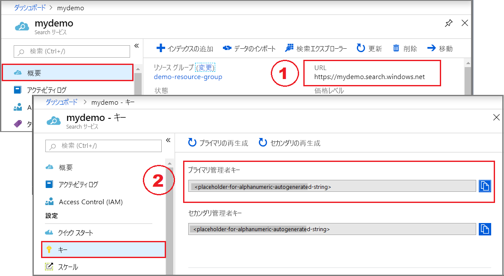

# <a name="quickstart-create-an-azure-search-index-using-powershell-and-the-rest-api"></a>クイック スタート:PowerShell および REST API を使用した Azure Search インデックスの作成
> [!div class="op_single_selector"]
> * [PowerShell (REST)](search-create-index-rest-api.md)
> * [C#](search-create-index-dotnet.md)
> * [Postman (REST)](search-fiddler.md)
> * [ポータル](search-create-index-portal.md)
> 

この記事では、PowerShell および [Azure Search サービス REST API](https://docs.microsoft.com/rest/api/searchservice/) を使用して Azure Search の[インデックス](search-what-is-an-index.md)を作成、読み込み、およびクエリを実行するプロセスについて説明します。 インデックス定義と検索可能なコンテンツは、適切な形式の JSON コンテンツとして要求本文で提供されます。

## <a name="prerequisites"></a>前提条件

このクイック スタートでは、次のサービスとツールを使用します。 

[Azure Search サービスを作成](search-create-service-portal.md)するか、現在のサブスクリプションから[既存のサービスを見つけます](https://ms.portal.azure.com/#blade/HubsExtension/BrowseResourceBlade/resourceType/Microsoft.Search%2FsearchServices)。 このクイック スタート用には、無料のサービスを使用できます。 

[PowerShell 5.1 以降](https://github.com/PowerShell/PowerShell) (シーケンシャルおよび対話型の手順で [Invoke-restmethod](https://docs.microsoft.com/powershell/module/Microsoft.PowerShell.Utility/Invoke-RestMethod) を使用します)。

## <a name="get-a-key-and-url"></a>キーと URL を入手する

REST 呼び出しには、要求ごとにサービス URL とアクセス キーが必要です。 両方を使用して検索サービスが作成されるので、Azure Search をサブスクリプションに追加した場合は、次の手順に従って必要な情報を入手してください。

1. [Azure portal にサインイン](https://portal.azure.com/)し、ご使用の検索サービスの **[概要]** ページで、URL を入手します。 たとえば、エンドポイントは `https://mydemo.search.windows.net` のようになります。

2. **[設定]** > **[キー]** で、サービスに対する完全な権限の管理者キーを取得します。 管理キーをロールオーバーする必要がある場合に備えて、2 つの交換可能な管理キーがビジネス継続性のために提供されています。 オブジェクトの追加、変更、および削除の要求には、主キーまたはセカンダリ キーのどちらかを使用できます。



すべての要求では、サービスに送信されるすべての要求に API キーが必要です。 有効なキーがあれば、要求を送信するアプリケーションとそれを処理するサービスの間で、要求ごとに信頼を確立できます。

## <a name="connect-to-azure-search"></a>Azure Search への接続

PowerShell では、**$headers** オブジェクトを作成して、コンテンツ タイプと API キーを格納します。 このヘッダーはセッション中に 1 度設定するだけで済みますが、すべての要求に追加されます。 

```powershell
$headers = @{
   'api-key' = '<your-admin-api-key>'
   'Content-Type' = 'application/json' 
   'Accept' = 'application/json' }
```

サービスのインデックスのコレクションを指定する **$url** オブジェクトを作成します。 `mydemo` サービス名はプレースホルダーとして用意されています。 これは、この例の全体にわたり、現在のサブスクリプションの有効な検索サービスに置き換えてください。

```powershell
$url = "https://mydemo.search.windows.net/indexes?api-version=2017-11-11"
```

**Invoke-restmethod** を実行して、サービスに GET 要求を送信し、接続を確認します。 **Convertto-json** を追加して、サービスから返信された応答を表示できるようにします。

```powershell
Invoke-RestMethod -Uri $url -Headers $headers | ConvertTo-Json
```

サービスが空で、インデックスが含まれていない場合、結果は次の例のようになります。 それ以外の場合は、インデックス定義の JSON 表現が表示されます。

```
{
    "@odata.context":  "https://mydemo.search.windows.net/$metadata#indexes",
    "value":  [

              ]
}
```

## <a name="1---create-an-index"></a>1 - インデックスの作成

ポータルを使用している場合を除き、データを読み込むには、サービスにインデックスが存在する必要があります。 この手順では、インデックスを定義して、それをサービスにプッシュします。 [インデックスの作成 (REST API)](https://docs.microsoft.com/rest/api/searchservice/create-index) は、この手順のために使用します。

インデックスの必要な要素には、名前とフィールド コレクションが含まれます。 フィールド コレクションは*ドキュメント*の構造を定義します。 各フィールドには、名前、型、およびその使用方法を決定する属性 (たとえば、フルテキスト検索可能、フィルター可能、または検索結果で取得可能) があります。 インデックス内には、`Edm.String` 型のフィールドのいずれかをドキュメント ID の*キー*として指定する必要があります。

このインデックスは "hotels" という名前で、次に示すようにフィールド定義が含まれています。 インデックス定義は、フランス語のテキストを格納することを目的としているため、`description_fr` フィールドに[言語アナライザー](index-add-language-analyzers.md)を指定しています。これは後の例で追加します。

この例を PowerShell に貼り付けて、インデックス スキーマを含む **$body** オブジェクトを作成します。

```powershell
$body = @"
{
    "name": "hotels",  
    "fields": [
        {"name": "hotelId", "type": "Edm.String", "key": true, "searchable": false, "sortable": false, "facetable": false},
        {"name": "baseRate", "type": "Edm.Double"},
        {"name": "description", "type": "Edm.String", "filterable": false, "sortable": false, "facetable": false},
        {"name": "description_fr", "type": "Edm.String", "filterable": false, "sortable": false, "facetable": false, "analyzer": "fr.lucene"},
        {"name": "hotelName", "type": "Edm.String", "facetable": false},
        {"name": "category", "type": "Edm.String"},
        {"name": "tags", "type": "Collection(Edm.String)"},
        {"name": "parkingIncluded", "type": "Edm.Boolean", "sortable": false},
        {"name": "smokingAllowed", "type": "Edm.Boolean", "sortable": false},
        {"name": "lastRenovationDate", "type": "Edm.DateTimeOffset"},
        {"name": "rating", "type": "Edm.Int32"},
        {"name": "location", "type": "Edm.GeographyPoint"}
    ]
}
"@
```

サービスのインデックスのコレクションと *hotels* インデックスへの URI を設定します。

```powershell
$url = "https://mydemo.search.windows.net/indexes/hotels?api-version=2017-11-11"
```

**$url**、**$headers**、および **$body** を使用してコマンドを実行して、サービスにインデックスを作成します。 

```powershell
Invoke-RestMethod -Uri $url -Headers $headers -Method Put -Body $body | ConvertTo-Json
```
結果は、次のようになります (簡潔にするため最初の 2 つのフィールドに切り捨てられています)。

```
{
    "@odata.context":  "https://mydemo.search.windows.net/$metadata#indexes/$entity",
    "@odata.etag":  "\"0x8D6A99E2DED96B0\"",
    "name":  "hotels",
    "defaultScoringProfile":  null,
    "fields":  [
                   {
                       "name":  "hotelId",
                       "type":  "Edm.String",
                       "searchable":  false,
                       "filterable":  true,
                       "retrievable":  true,
                       "sortable":  false,
                       "facetable":  false,
                       "key":  true,
                       "indexAnalyzer":  null,
                       "searchAnalyzer":  null,
                       "analyzer":  null,
                       "synonymMaps":  ""
                   },
                   {
                       "name":  "baseRate",
                       "type":  "Edm.Double",
                       "searchable":  false,
                       "filterable":  true,
                       "retrievable":  true,
                       "sortable":  true,
                       "facetable":  true,
                       "key":  false,
                       "indexAnalyzer":  null,
                       "searchAnalyzer":  null,
                       "analyzer":  null,
                       "synonymMaps":  ""
                   },
. . .
```

> [!Tip]
> 検証のために、ポータルでインデックスの一覧を確認することも、サービス接続の検証に使用されるコマンドを再実行して、インデックス コレクションに一覧表示される *hotels* インデックスを確認することもできます。

<a name="load-documents"></a>

## <a name="2---load-documents"></a>2 - ドキュメントを読み込む

ドキュメントをプッシュするには、インデックスの URL エンドポイントに対する HTTP POST 要求を使用します。 このタスクの REST API は、[ドキュメントの追加、更新、または削除](https://docs.microsoft.com/rest/api/searchservice/addupdate-or-delete-documents)です。

この例を PowerShell に貼り付けて、アップロードするドキュメントを含む **$body** オブジェクトを作成します。 

この要求には、2 つの完全なレコードと 1 つの部分的なレコードが含まれています。 部分的なレコードは、不完全なドキュメントをアップロードすることを示します。 `@search.action` パラメーターは、インデックス作成を行う方法を指定します。 有効な値には、upload、merge、mergeOrUpload、および delete が含まれます。 mergeOrUpload の動作では、hotelId = 3 の新しい文書が作成されるか、内容が既に存在している場合はそれが更新されます。

```powershell
$body = @"
{
    "value": [
        {
            "@search.action": "upload",
            "hotelId": "1",
            "baseRate": 199.0,
            "description": "Best hotel in town",
            "hotelName": "Fancy Stay",
            "category": "Luxury",
            "tags": ["pool", "view", "wifi", "concierge"],
            "parkingIncluded": false,
            "smokingAllowed": false,
            "lastRenovationDate": "2010-06-27T00:00:00Z",
            "rating": 5,
            "location": { "type": "Point", "coordinates": [-122.131577, 47.678581] }
        },
        {
            "@search.action": "upload",
            "hotelId": "2",
            "baseRate": 79.99,
            "description": "Cheapest hotel in town",
            "hotelName": "Roach Motel",
            "category": "Budget",
            "tags": ["motel", "budget"],
            "parkingIncluded": true,
            "smokingAllowed": true,
            "lastRenovationDate": "1982-04-28T00:00:00Z",
            "rating": 1,
            "location": { "type": "Point", "coordinates": [-122.131577, 49.678581] }
        },
        {
            "@search.action": "mergeOrUpload",
            "hotelId": "3",
            "baseRate": 129.99,
            "description": "Close to town hall and the river"
        }
    ]
}
"@
```

*hotels* ドキュメント コレクションへのエンドポイントを設定し、インデックス操作 (indexes/hotels/docs/index) を含めます。

```powershell
$url = "https://mydemo.search.windows.net/indexes/hotels/docs/index?api-version=2017-11-11"
```

**$url**、**$headers**、および **$body** を使用してコマンドを実行して、hotels インデックス内にドキュメントを読み込みます。

```powershell
Invoke-RestMethod -Uri $url -Headers $headers -Method Post -Body $body | ConvertTo-Json
```
結果は次の例のようになります。 状態コード 201 が表示されます。 すべての状態コードの詳細については、「[HTTP 状態コード (Azure Search)](https://docs.microsoft.com/rest/api/searchservice/HTTP-status-codes)」を参照してください。

```
{
    "@odata.context":  "https://mydemo.search.windows.net/indexes(\u0027hotels\u0027)/$metadata#Collection(Microsoft.Azure.Search.V2017_11_11.IndexResult)",
    "value":  [
                  {
                      "key":  "1",
                      "status":  true,
                      "errorMessage":  null,
                      "statusCode":  201
                  },
                  {
                      "key":  "2",
                      "status":  true,
                      "errorMessage":  null,
                      "statusCode":  201
                  },
                  {
                      "key":  "3",
                      "status":  true,
                      "errorMessage":  null,
                      "statusCode":  201
                  }
              ]
}
```

## <a name="3---search-an-index"></a>3 - インデックスの検索

この手順では、[Search Documents API](https://docs.microsoft.com/rest/api/searchservice/search-documents) を使用してインデックスのクエリを実行する方法を示します。

*hotels* ドキュメント コレクションへのエンドポイントを設定し、**search** パラメーターを追加してクエリ文字列を含めます。 この文字列は空の検索であり、すべてのドキュメントのランク付けされていないリストを返します。

```powershell
$url = 'https://mydemo.search.windows.net/indexes/hotels/docs?api-version=2017-11-11&search=*'
```

コマンドを実行して、**$url** をサービスに送信します。

```powershell
Invoke-RestMethod -Uri $url -Headers $headers | ConvertTo-Json
```

結果は次の出力のようになります。

```
{
    "@odata.context":  "https://mydemo.search.windows.net/indexes(\u0027hotels\u0027)/$metadata#docs(*)",
    "value":  [
                  {
                      "@search.score":  1.0,
                      "hotelId":  "1",
                      "baseRate":  199.0,
                      "description":  "Best hotel in town",
                      "description_fr":  null,
                      "hotelName":  "Fancy Stay",
                      "category":  "Luxury",
                      "tags":  "pool view wifi concierge",
                      "parkingIncluded":  false,
                      "smokingAllowed":  false,
                      "lastRenovationDate":  "2010-06-27T00:00:00Z",
                      "rating":  5,
                      "location":  "@{type=Point; coordinates=System.Object[]; crs=}"
                  },
                  {
                      "@search.score":  1.0,
                      "hotelId":  "2",
                      "baseRate":  79.99,
                      "description":  "Cheapest hotel in town",
                      "description_fr":  null,
                      "hotelName":  "Roach Motel",
                      "category":  "Budget",
                      "tags":  "motel budget",
                      "parkingIncluded":  true,
                      "smokingAllowed":  true,
                      "lastRenovationDate":  "1982-04-28T00:00:00Z",
                      "rating":  1,
                      "location":  "@{type=Point; coordinates=System.Object[]; crs=}"
                  },
                  {
                      "@search.score":  1.0,
                      "hotelId":  "3",
                      "baseRate":  129.99,
                      "description":  "Close to town hall and the river",
                      "description_fr":  null,
                      "hotelName":  null,
                      "category":  null,
                      "tags":  "",
                      "parkingIncluded":  null,
                      "smokingAllowed":  null,
                      "lastRenovationDate":  null,
                      "rating":  null,
                      "location":  null
                  }
              ]
}
```

構文について大まかに把握するため、その他のクエリ例をいくつか試してください。 文字列の検索、逐語的な $filter クエリの実行、結果セットの制限、特定のフィールドへの検索範囲の設定などを行うことができます。

```powershell
# Query example 1
# Search the entire index for the term 'budget'
# Return only the `hotelName` field, "Roach hotel"
$url = 'https://mydemo.search.windows.net/indexes/hotels/docs?api-version=2017-11-11&search=budget&$select=hotelName'

# Query example 2 
# Apply a filter to the index to find hotels cheaper than $150 per night
# Returns the `hotelId` and `description`. Two documents match.
$url = 'https://mydemo.search.windows.net/indexes/hotels/docs?api-version=2017-11-11&search=*&$filter=baseRate lt 150&$select=hotelId,description'

# Query example 3
# Search the entire index, order by a specific field (`lastRenovationDate`) in descending order
# Take the top two results, and show only `hotelName` and `lastRenovationDate`
$url = 'https://mydemo.search.windows.net/indexes/hotels/docs?api-version=2017-11-11&search=*&$top=2&$orderby=lastRenovationDate desc&$select=hotelName,lastRenovationDate'
```
## <a name="clean-up"></a>クリーンアップ 

不要になった場合は、インデックスを削除する必要があります。 無料のサービスは、3 つのインデックスに制限されています。 その他のチュートリアルの手順を実行できるように、積極的に使用していないインデックスの削除が必要な場合があります。

```powershell
# Set the URI to the hotel index
$url = 'https://mydemo.search.windows.net/indexes/hotels?api-version=2017-11-11'

# Delete the index
Invoke-RestMethod -Uri $url -Headers $headers -Method Delete
```

## <a name="next-steps"></a>次の手順

インデックスにフランス語の説明を追加してみます。 次の例にはフランス語の文字列が含まれていて、追加の検索アクションを示しています。 mergeOrUpload を使用して作成するか、既存のフィールドに追加します。 次の文字列は UTF-8 でエンコードする必要があります。

```json
{
    "value": [
        {
            "@search.action": "mergeOrUpload",
            "hotelId": "1",
            "description_fr": "Meilleur hôtel en ville"
        },
        {
            "@search.action": "merge",
            "hotelId": "2",
            "description_fr": "Hôtel le moins cher en ville"
        }
    ]
}
```
