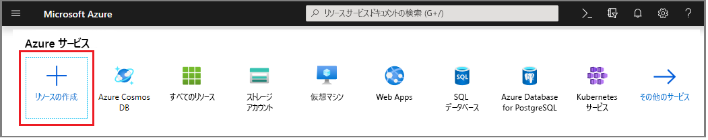
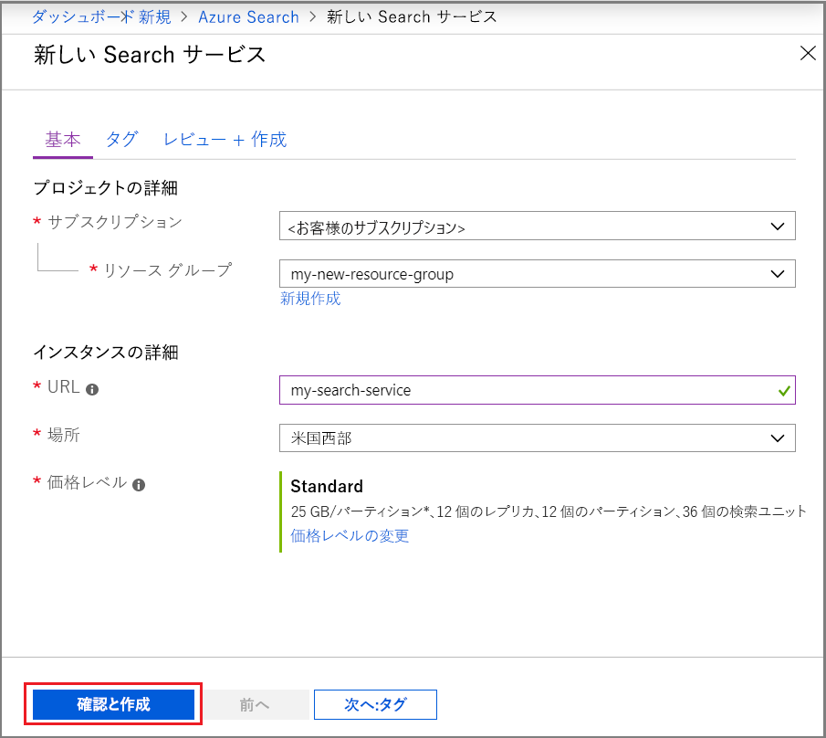
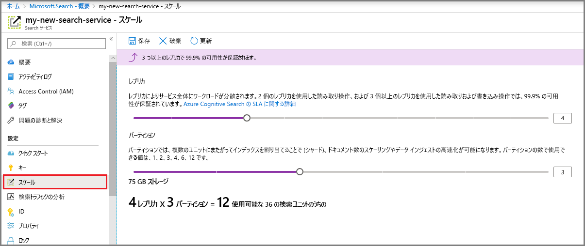

# ポータルでの Azure Search サービスの作成

ポータルで Azure Search サービスを作成またはプロビジョニングする方法について説明します。 

PowerShell をお好みですか? Azure Resource Manager [サービス テンプレート](https://azure.microsoft.com/resources/templates/101-azure-search-create/)をご使用ください。 作業の開始にあたっては、背景について「[PowerShell を使用して Azure Search サービスを管理する](search-manage-powershell.md)」を参照してください。

## サブスクリプション (無料または有料)

[無料の Azure アカウントを開き](https://azure.microsoft.com/pricing/free-trial/?WT.mc_id=A261C142F)、無料クレジットを使って有料の Azure サービスを試用できます。 このクレジットを使い切った後は、アカウントを保持したまま、Websites などの無料の Azure サービスを使用できます。 明示的に設定を変更して課金を了承しない限り、クレジット カードに課金されることはありません。

[MSDN サブスクライバーの特典を有効にする](https://azure.microsoft.com/pricing/member-offers/msdn-benefits-details/?WT.mc_id=A261C142F)こともできます。 MSDN サブスクリプションにより、有料の Azure サービスを利用できるクレジットが毎月与えられます。 

## Azure Search を探す
1. [Azure Portal](https://portal.azure.com/) にサインインします。
2. 左上隅のプラス記号 ([+ リソースの作成]) をクリックします。
3. **[Web]** > **[Azure Search]** を選択します。

## サービスと URL エンドポイントに名前を付ける

サービス名は、API 呼び出しを発行する対象となる URL エンドポイントの一部です。`https://your-service-name.search.windows.net` **[URL]** フィールドにサービス名を入力します。 

サービス名の要件:
   * search.windows.net 名前空間内で一意である
   * 2 ～ 60 文字である
   * 小文字、数字、ダッシュ ("-") のみを使用する
   * 最初の 2 文字または最後の 1 文字にダッシュ ("-") を使用していない
   * 連続するダッシュ ("-") をどこにも使用していない

## サブスクリプションの選択
サブスクリプションが複数ある場合には、データまたはファイル ストレージ サービスがあるものを 1 つ選択します。 Azure Search では、[*インデクサー*](search-indexer-overview.md) 経由でインデックスが作成されている場合に、Azure テーブルおよび Blob Storage、SQL Database、Azure Cosmos DB の自動検出が可能ですが、これは同じサブスクリプション内のサービスのみで有効です。

## リソース グループの選択
リソース グループとは、一緒に使用される Azure サービスとリソースのコレクションです。 たとえば、Azure Search を使用して SQL Database のインデックスを作成する場合、これら両方のサービスを同じリソース グループに含める必要があります。

> [!TIP]
> リソース グループを削除すると、その中のサービスも削除されます。 複数のサービスを利用するプロトタイプ プロジェクトの場合は、すべてのサービスを同じリソース グループに配置することで、プロジェクト終了後のクリーンアップが容易になります。 

## ホストする場所の選択 
Azure サービスの 1 つである Azure Search は、世界中のデータ センターでホストできます。 地域によって[価格が異なる場合がある](https://azure.microsoft.com/pricing/details/search/)ことにご注意ください。

## 価格レベルの選択 (SKU)

  [Azure Search は現在、Free、Basic、Standard の複数の価格レベルで提供されています](https://azure.microsoft.com/pricing/details/search/)。 レベルごとに独自の [容量と制限](search-limits-quotas-capacity.md)があります。 ガイダンスについては、 [価格レベルまたは SKU の選択](search-sku-tier.md) に関する記事をご覧ください。

運用環境のワークロードでは通常 Standard を選ぶことになりますが、ほとんどのお客様は Free サービスから始めています。

サービスの作成後に価格レベルを変更することはできません。 後で高いレベルまたは低いレベルが必要になった場合は、サービスを作成し直す必要があります。

## サービスの作成

サインインするたびにアクセスしやすくするために、サービスをダッシュボードにピン留めすることを忘れないでください。

## サービスを拡張する
サービスを作成するのに数分かかる場合があります (レベルによっては 15 分以上)。 サービスのプロビジョニングが完了したら、ニーズに合わせてサービスを拡張できます。 Azure Search サービスの Standard レベルを選択しているため、レプリカとパーティションの 2 つのディメンションでサービスを拡張できます。 Basic レベルを選択した場合は、レプリカのみ追加できます。 無料サービスをプロビジョニングした場合、拡張は利用できません。

***パーティション***を使用すると、サービスでより多くのドキュメントを格納し、検索できます。

***レプリカ***を使用すると、より大きい検索クエリの負荷をサービスが処理できます。

リソースを追加すると、月ごとの請求が増加します。 [料金計算ツール](https://azure.microsoft.com/pricing/calculator/)を使うと、リソース追加の課金への影響を把握できます。 負荷に基づいてリソースを調整できることに注意してください。 たとえば、リソースを増やして完全な初期インデックスを作成した後、増分インデックス作成に適したレベルまでリソースを減らすことができます。

> [!Important]
> サービスでは、[読み取り専用の SLA の場合は 2 つのレプリカ、読み取り/書き込み SLA の場合は 3 つのレプリカ](https://azure.microsoft.com/support/legal/sla/search/v1_0/)が必要です。

1. Azure Portal で検索サービス ページを開きます。
2. 左のナビゲーション ウィンドウで、**[設定]** > **[スケール]** を選択します。
3. スライダーを使って、いずれかの種類のリソースを追加します。

> [!Note] 
> 1 つのサービスで許可される検索ユニットの総数の[制限](search-limits-quotas-capacity.md)は、レベルごとに異なります (レプリカ * パーティション数 = 検索ユニット合計)。

## 2 番目のサービスの追加が必要になる状況

大半のお客様は、[リソースの適切なバランス](search-sku-tier.md)を提供する階層に、ただ 1 つのサービスをプロビジョニングします。 1 つのサービスで、相互に分離された複数のインデックスをホストできます。インデックスは、[選択した階層の上限](search-capacity-planning.md)の対象になります。 Azure Search では、要求は 1 つのインデックスにのみ転送でき、同じサービス内の他のインデックスから偶発的または意図的にデータが取得される可能性が最小限に抑えられます。

ほとんどのお客様はサービスを 1 つしか使いませんが、運用要件に次のことが含まれる場合、サービスの冗長性が必要になる場合があります。

+ 障害復旧 (データ センターの停止)。 Azure Search では、停止時の即時フェールオーバーは提供されません。 推奨事項とガイダンスについては、「[Azure Portal での Azure Search のサービス管理](search-manage.md)」をご覧ください。
+ マルチ テナント モデルの調査により、サービスを追加するのが最適な設計であると判断された場合。 詳しくは、「[マルチテナント SaaS アプリケーションと Azure Search の設計パターン](search-modeling-multitenant-saas-applications.md)」をご覧ください。
+ グローバルにデプロイされるアプリケーションで、アプリケーションの国際トラフィックの待機時間を最小限に抑えるため、複数のリージョンに Azure Search のインスタンスが必要な場合。

> [!NOTE]
> Azure Search では、インデックス作成とクエリのワークロードを分離することはできません。このため、ワークロードを分離するために複数のサービスを作成することはありません。 インデックスのクエリは常に、インデックスが作成されたサービスで行われます (あるサービスでインデックスを作成し、それを別のサービスにコピーすることはできません)。
>

高可用性のために 2 番目のサービスを作成する必要はありません。 クエリの高可用性は、同じサービスで 2 つ以上のレプリカを使用することにより実現されます。 レプリカの更新はシーケンシャルです。つまり、サービスの更新が展開されているとき、少なくとも 1 つのレプリカが動作しています。アップタイムについて詳しくは、「[サービス レベル アグリーメント](https://azure.microsoft.com/support/legal/sla/search/v1_0/)」をご覧ください。

## 次の手順
Azure Search サービスをプロビジョニングしたら、データをアップロードし、検索できるように、 [インデックスを定義する](search-what-is-an-index.md)ことができます。 

> [!div class="nextstepaction"]
> [.NET で Azure Search を使用する方法](search-howto-dotnet-sdk.md)
