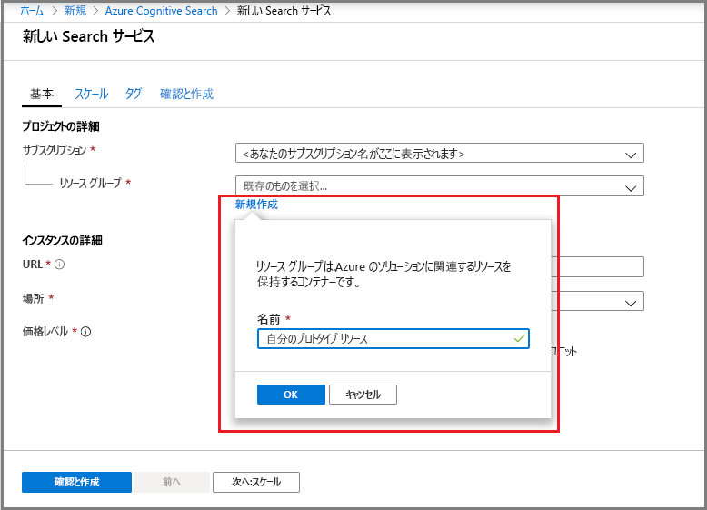
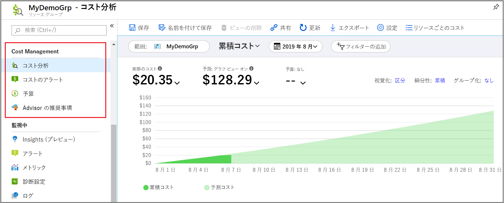
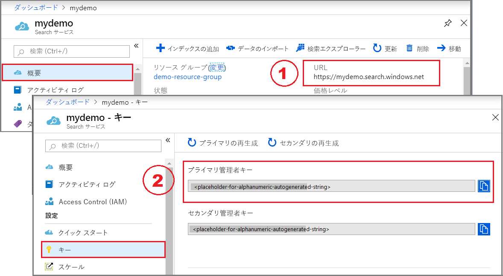

# クイック スタート:ポータルで Azure Cognitive Search サービスを作成する

Azure Cognitive Search は、カスタム アプリに検索エクスペリエンスを追加するために使用されるスタンドアロンのリソースです。 Azure Cognitive Search は他の Azure サービスと簡単に統合できますが、スタンドアロン コンポーネントとして使用することも、ネットワーク サーバー上のアプリまたは他のクラウド プラットフォーム上で実行されているソフトウェアと統合することもできます。

この記事では、[Azure portal](https://portal.azure.com/) 内でリソースを作成する方法を説明します。

PowerShell をお好みですか? Azure Resource Manager [サービス テンプレート](https://azure.microsoft.com/resources/templates/101-azure-search-create/)をご使用ください。 作業の開始にあたっては、[PowerShell を使用して Azure Cognitive Search サービスを管理する方法](search-manage-powershell.md)に関するページを参照してください。

## サブスクリプション (無料または有料)

[無料の Azure アカウントを開き](https://azure.microsoft.com/pricing/free-trial/?WT.mc_id=A261C142F)、無料クレジットを使って有料の Azure サービスを試用できます。 このクレジットを使い切った後は、アカウントを保持したまま、Websites などの無料の Azure サービスを使用できます。 明示的に設定を変更して課金を了承しない限り、クレジット カードに課金されることはありません。

[MSDN サブスクライバーの特典を有効にする](https://azure.microsoft.com/pricing/member-offers/msdn-benefits-details/?WT.mc_id=A261C142F)こともできます。 MSDN サブスクリプションにより、有料の Azure サービスを利用できるクレジットが毎月与えられます。 

## Azure Cognitive Search を検索する

1. [Azure portal](https://portal.azure.com/) にサインインします。
2. 左上隅のプラス記号 ([+ リソースの作成]) をクリックします。
3. 検索バーを使用して "Azure Cognitive Search" を検索するか、 **[Web]**  >  **[Azure Cognitive Search]** を選択してリソースに移動します。

## サブスクリプションを選択します。

サブスクリプションが複数ある場合には、Search サービスに使用するものを選択します。

## リソース グループを設定する

リソース グループは、コストを含めてリソースをまとめて管理するために必要であり、また利便性を発揮します。 リソース グループは、1 つのサービスの場合もあれば、一緒に使用される複数のサービスから成る場合もあります。 たとえば、Azure Cognitive Search を使用して Azure Cosmos DB データベースのインデックスを作成する場合、両方のサービスを同じリソース グループに追加して管理することができます。 

リソースを単一グループに結合していない場合、または関連のないソリューションで使用されるリソースが既存のリソース グループに格納されている場合は、Azure Cognitive Search リソース用の新しいリソース グループを作成します。 

時間が経つにつれて、現在のコストと予想されるコストをまとめて追跡 (スクリーンショットを参照) できるほか、下へスクロールして個々のリソースの料金を確認することができるようになります。 次のスクリーンショットは、複数のリソースを 1 つのグループにまとめるときに最終的に期待できるコスト情報の種類を示しています。

> [!TIP]
> グループを削除するとその中のサービスも削除されるため、リソース グループによってクリーンアップが簡略化されます。 複数のサービスを利用するプロトタイプ プロジェクトの場合は、すべてのサービスを同じリソース グループに配置することで、プロジェクト終了後のクリーンアップが容易になります。

## サービスに名前を付ける

サービスの名前は、[インスタンスの詳細] の **[URL]** フィールドに入力します。 この名前は、API 呼び出しの発行対象となる URL エンドポイントの一部となります (`https://your-service-name.search.windows.net`)。 たとえば、エンドポイントを `https://myservice.search.windows.net` とする場合は、「`myservice`」と入力します。

サービス名の要件:

* search.windows.net 名前空間内で一意である
* 2 ～ 60 文字である
* 小文字、数字、ダッシュ ("-") のみを使用する
* 最初の 2 文字または最後の 1 文字にダッシュ ("-") を使用していない
* 連続するダッシュ ("-") をどこにも使用していない

> [!TIP]
> 複数のサービスを使用する予定がある場合、名前付け規則として、サービス名にリージョン (場所) を含めることをお勧めします。 同じリージョン内のサービスはデータを無料で交換することができます。したがって、Azure Cognitive Search とそれ以外のサービスが米国西部にある場合、`mysearchservice-westus` のような名前を付けておけば、リソースの組み合わせ (関連付け) を決めるときに逐一プロパティ ページを確認する手間が省けます。

## 場所を選択する

Azure サービスの 1 つである Azure Cognitive Search は、世界中のデータ センターでホストできます。 サポートされているリージョンの一覧は、[価格のページ](https://azure.microsoft.com/pricing/details/search/)にあります。 

複数のサービスに対して同じ場所を選ぶことで帯域幅の料金を最小限に抑えるか、回避することができます。 たとえば、別の Azure サービス (Azure Storage、Azure Cosmos DB、Azure SQL Database) によって提供されたデータにインデックスを付ける場合、同じリージョン内に Azure Cognitive Search サービスを作成することで、帯域幅の料金を避けることができます。つまり、サービスが同じリージョン内にある場合、アウトバウンド データに料金はかかりません。

さらに、AI エンリッチメントを使用している場合は、Cognitive Services と同じリージョンにサービスを作成します。 *Azure Cognitive Search と Cognitive Services を同じリージョンに配置することは、AI エンリッチメントの要件です*。

> [!Note]
> インド中部は、現在、新しいサービスには使用できません。 既にインド中部で使用できるサービスについては、制限なしでスケールアップでき、サービスはそのリージョンで完全にサポートされます。 このリージョンに関する制限は一時的なものであり、新しいサービスのみに限定されます。 制限が適用されなったら、この注記を削除する予定です。

## 価格レベル (SKU) を選択する

[Azure Cognitive Search は現在、複数の価格レベルで提供されています](https://azure.microsoft.com/pricing/details/search/)(Free、Basic、Standard)。 レベルごとに独自の [容量と制限](search-limits-quotas-capacity.md)があります。 ガイダンスについては、 [価格レベルまたは SKU の選択](search-sku-tier.md) に関する記事をご覧ください。

運用環境のワークロードでは Basic と Standard が最も一般的な選択肢ですが、ほとんどのお客様は Free サービスから始めています。 レベルごとの主な違いは、パーティション サイズと速度、そして作成できるオブジェクトの数に対する制限です。

サービスの作成後に価格レベルを変更することはできないことに注意してください。 後で高いレベルまたは低いレベルが必要になった場合は、サービスを作成し直す必要があります。

## サービスの作成

必要な入力作業を終えたら、サービスの作成に進みます。 

ご利用のサービスは数分以内にデプロイされ、Azure の通知を介してそれを監視できます。 今後アクセスしやすくするために、サービスをご自分のダッシュ ボードにピン留めすることを検討してください。

## キーと URL エンドポイントを取得する

ポータルを使用していない場合、新しいサービスにプログラムからアクセスするには、URL エンドポイントと認証 API キーを指定する必要があります。

1. **[概要]** ページの右側から、URL エンドポイントを探してコピーします。

2. **[キー]** のページで、いずれかの管理者キー (同等) をコピーします。 ご利用のサービスのオブジェクトを作成、更新、削除するためには、管理者の API キーが必要です。 これに対し、クエリ キーはインデックス コンテンツへの読み取りアクセスを提供します。

   

ポータル ベースのタスクにエンドポイントとキーは必要ありません。 ポータルは、ご利用の Azure Cognitive Search リソースにあらかじめ管理者権限付きでリンクされています。 ポータルのチュートリアルについては、[クイック スタート: ポータルで Azure Cognitive Search インデックスを作成する](search-get-started-portal.md)方法のページから始めてください。

## サービスを拡張する

サービスのプロビジョニングが完了したら、ニーズに合わせてサービスを拡張できます。 Azure Cognitive Search サービスの Standard レベルを選択している場合は、レプリカとパーティションの 2 つのディメンションでご利用のサービスをスケーリングできます。 Basic レベルを選択した場合は、レプリカのみ追加できます。 無料サービスをプロビジョニングした場合、拡張は利用できません。

***パーティション***を使用すると、サービスでより多くのドキュメントを格納し、検索できます。

***レプリカ***を使用すると、より大きい検索クエリの負荷をサービスが処理できます。

リソースを追加すると、月ごとの請求が増加します。 [料金計算ツール](https://azure.microsoft.com/pricing/calculator/)を使うと、リソース追加の課金への影響を把握できます。 負荷に基づいてリソースを調整できることに注意してください。 たとえば、リソースを増やして完全な初期インデックスを作成した後、増分インデックス作成に適したレベルまでリソースを減らすことができます。

> [!Important]
> サービスでは、[読み取り専用の SLA の場合は 2 つのレプリカ、読み取り/書き込み SLA の場合は 3 つのレプリカ](https://azure.microsoft.com/support/legal/sla/search/v1_0/)が必要です。

1. Azure Portal で検索サービス ページを開きます。
2. 左のナビゲーション ウィンドウで、 **[設定]**  >  **[スケール]** を選択します。
3. スライダーを使って、いずれかの種類のリソースを追加します。

> [!Note]
> パーティションごとのストレージと速度がより高いレベルで向上します。 詳細については、[容量と制限](search-limits-quotas-capacity.md)に関するページをご覧ください。

## 2 番目のサービスの追加が必要になる状況

大半のお客様は、[リソースの適切なバランス](search-sku-tier.md)を提供する階層にプロビジョニングされたサービスを 1 つだけ使用します。 1 つのサービスで、相互に分離された複数のインデックスをホストできます。インデックスは、[選択した階層の上限](search-capacity-planning.md)の対象になります。 Azure Cognitive Search では、要求は 1 つのインデックスにのみ転送でき、同じサービス内の他のインデックスから偶発的または意図的にデータが取得される可能性が最小限に抑えられます。

ほとんどのお客様はサービスを 1 つしか使いませんが、運用要件に次のことが含まれる場合、サービスの冗長性が必要になる場合があります。

* 障害復旧 (データ センターの停止)。 Azure Cognitive Search では、停止時の即時フェールオーバーは提供されません。 推奨事項とガイダンスについては、「[Azure Portal での Azure Search のサービス管理](search-manage.md)」をご覧ください。
* マルチ テナント モデルの調査により、サービスを追加するのが最適な設計であると判断された場合。 詳しくは、「[マルチテナント SaaS アプリケーションと Azure Search の設計パターン](search-modeling-multitenant-saas-applications.md)」をご覧ください。
* グローバルにデプロイされるアプリケーションで、アプリケーションの国際トラフィックの待機時間を最小限に抑えるため、複数のリージョンに Azure Cognitive Search のインスタンスが必要な場合。

> [!NOTE]
> Azure Cognitive Search では、インデックス作成とクエリの操作を分離することはできません。このため、ワークロードを分離するために複数のサービスを作成することはありません。 インデックスのクエリは常に、インデックスが作成されたサービスで行われます (あるサービスでインデックスを作成し、それを別のサービスにコピーすることはできません)。

高可用性のために 2 番目のサービスを作成する必要はありません。 クエリの高可用性は、同じサービスで 2 つ以上のレプリカを使用することにより実現されます。 レプリカの更新はシーケンシャルです。つまり、サービスの更新が展開されているとき、少なくとも 1 つのレプリカが動作しています。アップタイムについて詳しくは、「[サービス レベル アグリーメント](https://azure.microsoft.com/support/legal/sla/search/v1_0/)」をご覧ください。

## 次のステップ

サービスのプロビジョニングが完了した後、ポータル内で最初のインデックスの作成に進むことができます。

> [!div class="nextstepaction"]
> [クイック スタート: ポータルで Azure Cognitive Search インデックスを作成する](search-get-started-portal.md)
