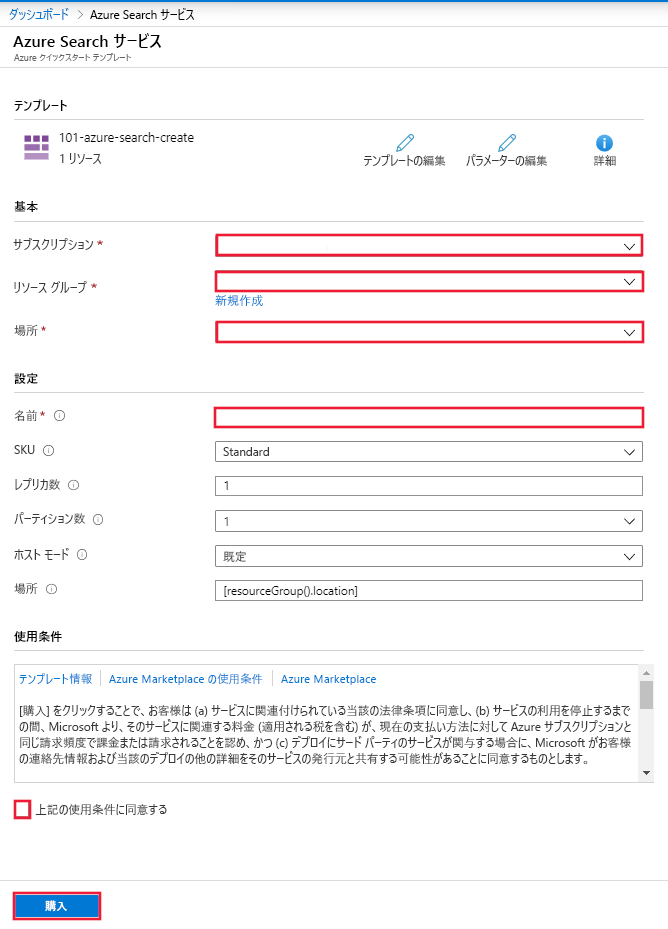

# クイック スタート:Resource Manager テンプレートを使用して Cognitive Search をデプロイする

この記事では、Azure portal で Resource Manager テンプレートを使用して Azure Cognitive Search リソースをデプロイする手順について説明します。

[!INCLUDE [About Azure Resource Manager](../../includes/resource-manager-quickstart-introduction.md)]

## 前提条件

Azure サブスクリプションをお持ちでない場合は、開始する前に [無料アカウント](https://azure.microsoft.com/free/?WT.mc_id=A261C142F) を作成してください。

## Cognitive Search サービスを作成する

### テンプレートを確認する

このクイック スタートで使用されるテンプレートは [Azure クイック スタート テンプレート](https://azure.microsoft.com/resources/templates/101-azure-search-create/)からのものです。

:::code language="json"source="~/quickstart-templates/101-azure-search-create/azuredeploy.json" range="1-86" highlight="4-50,70-85":::

このテンプレートで定義されている Azure リソースは次のとおりです。

- [Microsoft.Search/searchServices](https://docs.microsoft.com/azure/templates/Microsoft.Search/2015-08-19/searchServices): Azure Cognitive Search サービスを作成します。

### テンプレートのデプロイ

Azure にサインインし、テンプレートを開くには次のイメージを選択します。 このテンプレートは、Azure Cognitive Search リソースを作成するものです。

ポータルには、パラメーター値を簡単に指定できるフォームが表示されます。 一部のパラメーターには、テンプレートの既定値があらかじめ入力されています。 サブスクリプション、リソース グループ、場所、サービス名を指定する必要があります。 Cognitive Services を [AI エンリッチメント](https://docs.microsoft.com/azure/search/cognitive-search-concept-intro) パイプラインで使用したい場合 (バイナリ画像ファイルのテキスト分析を行うなど)、Cognitive Search と Cognitive Services の両方が提供されている場所を選びます。 AI エンリッチメント ワークロードでは、その両方のサービスが同じリージョンに存在する必要があります。 フォームへの入力が済んだら、使用条件に同意し、購入ボタンを選択して、デプロイを完了する必要があります。

> [!div class="mx-imgBorder"]
> 

## デプロイされているリソースを確認する

デプロイが完了したら、ポータルから新しいリソース グループと新しい検索サービスにアクセスすることができます。

## リソースをクリーンアップする

Cognitive Search に関する他のクイックスタートとチュートリアルは、このクイックスタートに基づいています。 後続のクイックスタートおよびチュートリアルを引き続き実行する場合は、このリソースをそのまま残しておくことをお勧めします。 不要になったら、リソース グループを削除します。これにより、Cognitive Search サービスと関連リソースが削除されます。

## 次のステップ

このクイックスタートでは、Azure Resource Manager テンプレートを使用して Cognitive Search サービスを作成し、デプロイを検証しました。 Cognitive Search と Azure Resource Manager の詳細については、引き続き以下の記事を参照してください。

 - [Azure Cognitive Search の概要](https://docs.microsoft.com/azure/search/search-what-is-azure-search)を確認する
 - 検索サービス用の[インデックスを作成](https://docs.microsoft.com/azure/search/search-get-started-portal)する
 - ポータルのウィザードを使用して[検索アプリを作成](https://docs.microsoft.com/azure/search/search-create-app-portal)する
 - データから情報を抽出するための[スキルセットを作成](https://docs.microsoft.com/azure/search/cognitive-search-quickstart-blob)する

