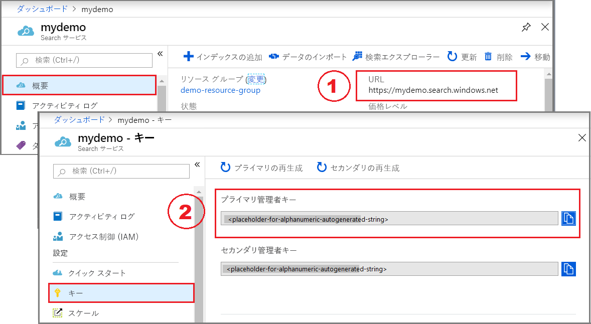

# <a name="quickstart-create-an-azure-search-index-in-c-using-the-net-sdk"></a>クイック スタート:.NET SDK を使用して C# で Azure Search インデックスを作成する
> [!div class="op_single_selector"]
> * [C#](search-get-started-dotnet.md)
> * [ポータル](search-get-started-portal.md)
> * [PowerShell](search-create-index-rest-api.md)
> * [Python](search-get-started-python.md)
> * [Postman](search-get-started-postman.md)
>*

Visual Studio と [Azure Search .NET SDK](https://aka.ms/search-sdk) を使用して Azure Search インデックスの作成、読み込み、およびクエリの実行を行う .NET Core C# コンソール アプリケーションを作成します。 この記事では、アプリケーションを作成する方法について順を追って説明します。 代わりに、[完全なアプリケーションをダウンロードして実行する](https://github.com/Azure-Samples/azure-search-dotnet-samples/tree/master/Quickstart)こともできます。

Azure サブスクリプションをお持ちでない場合は、開始する前に [無料アカウント](https://azure.microsoft.com/free/?WT.mc_id=A261C142F) を作成してください。

> [!NOTE]
> この記事のデモ コードでは、簡単にするため、Azure Search .NET SDK の同期メソッドを使用します。 ただし、運用環境シナリオの実際のアプリケーションでは、スケーラビリティと応答性を維持するため、非同期メソッドを使用することをお勧めします。 たとえば、`Create` と `Delete` の代わりに、`CreateAsync` および `DeleteAsync` を使用できます。

## <a name="prerequisites"></a>前提条件

このクイック スタートでは、次のサービス、ツール、およびデータを使用します。 

+ [Visual Studio](https://visualstudio.microsoft.com/downloads/) (任意のエディション)。 サンプル コードと手順については、無料の Community エディションでテストされています。

+ サンプルのインデックスとドキュメントは、この記事、およびこのクイックスタート用の [Visual Studio ソリューション](https://github.com/Azure-Samples/azure-search-dotnet-samples/tree/master/quickstart)に含まれています。

+ [Azure Search サービスを作成](search-create-service-portal.md)するか、現在のサブスクリプションから[既存のサービスを見つけます](https://ms.portal.azure.com/#blade/HubsExtension/BrowseResourceBlade/resourceType/Microsoft.Search%2FsearchServices)。 このクイック スタート用には、無料のサービスを使用できます。

<a name="get-service-info"></a>

## <a name="get-a-key-and-url"></a>キーと URL を入手する

サービスの呼び出しには、要求ごとに URL エンドポイントとアクセス キーが必要です。 両方を使用して検索サービスが作成されるので、Azure Search をサブスクリプションに追加した場合は、次の手順に従って必要な情報を入手してください。

1. [Azure portal にサインイン](https://portal.azure.com/)し、ご使用の検索サービスの **[概要]** ページで、URL を入手します。 たとえば、エンドポイントは `https://mydemo.search.windows.net` のようになります。

2. **[設定]**  >  **[キー]** で、サービスに対する完全な権限の管理者キーを取得します。 管理キーをロールオーバーする必要がある場合に備えて、2 つの交換可能な管理キーがビジネス継続性のために提供されています。 オブジェクトの追加、変更、および削除の要求には、主キーまたはセカンダリ キーのどちらかを使用できます。

   クエリ キーも入手します。 読み取り専用アクセスを使用してクエリ要求を発行することをお勧めします。



すべての要求では、サービスに送信されるすべての要求に API キーが必要です。 有効なキーがあれば、要求を送信するアプリケーションとそれを処理するサービスの間で、要求ごとに信頼を確立できます。

## <a name="set-up-your-environment"></a>環境をセットアップする

まず Visual Studio を開き、.NET Core 上で実行する新しいコンソール アプリ プロジェクトを作成します。

### <a name="install-nuget-packages"></a>NuGet パッケージのインストール

[Azure Search .NET SDK](https://aka.ms/search-sdk) は、NuGet パッケージとして配布されるいくつかのクライアント ライブラリで構成されています。

このプロジェクトでは、バージョン 9 の `Microsoft.Azure.Search` NuGet パッケージと最新の `Microsoft.Extensions.Configuration.Json` NuGet パッケージを使用します。

1. **[ツール]**  >  **[NuGet パッケージ マネージャー]** で、 **[ソリューションの NuGet パッケージの管理]** を選択します。 

1. **[参照]** をクリックします。

1. `Microsoft.Azure.Search` を検索し、バージョン 9.0.1 以降を選択します。

1. 右側にある **[インストール]** をクリックして、ご自分のプロジェクトとソリューションにアセンブリを追加します。

1. `Microsoft.Extensions.Configuration.Json` についても同じ手順を繰り返し、バージョン 2.2.0 以降を選択します。


### <a name="add-azure-search-service-information"></a>Azure Search サービス情報の追加

1. ソリューション エクスプローラーで、プロジェクトを右クリックし、 **[追加]**  >  **[新しい項目]** の順に選択します。 

1. [新しい項目の追加] で、「JSON」を検索すると、JSON に関連する項目の種類の一覧が返されます。

1. **[JSON ファイル]** を選択し、ファイルに "appsettings.json" という名前を付け、 **[追加]** をクリックします。 

1. ファイルをご自分の出力ディレクトリに追加します。 appsettings.json を右クリックし、 **[プロパティ]** を選択します。 **[出力ディレクトリにコピー]** で、 **[新しい場合はコピーする]** を選択します。

1. 次の JSON をご自分の新しい JSON ファイルにコピーします。 検索サービス名 (YOUR-SEARCH-SERVICE-NAME) と管理者 API キー (YOUR-ADMIN-API-KEY) を有効な値に置き換えます。 ご使用のサービス エンドポイントが `https://mydemo.search.windows.net` の場合、サービス名は "mydemo" になります。

```json
{
  "SearchServiceName": "<YOUR-SEARCH-SERVICE-NAME>",
  "SearchServiceAdminApiKey": "<YOUR-ADMIN-API-KEY>",
  "SearchIndexName": "hotels-quickstart"
}
```

### <a name="add-class-method-files-to-your-project"></a>クラス ".Method" ファイルをご自分のプロジェクトに追加する

コンソール ウィンドウに結果を出力するときに、Hotel オブジェクトから個々のフィールドが文字列として返される必要があります。 必要なコードを 2 つの新しいファイルにコピーして、[ToString()](https://docs.microsoft.com/dotnet/api/system.object.tostring?view=netframework-4.8) を実装することで、このタスクを実行できます。

1. 2 つの空のクラス定義をご自分のプロジェクトに追加します。Address.Methods.cs、Hotel.Methods.cs

1. Address.Methods.cs で、既定のコンテンツを次のコードの[行 1 から 32](https://github.com/Azure-Samples/azure-search-dotnet-samples/blob/master/Quickstart/AzureSearchQuickstart/Address.Methods.cs/#L1-L32) で上書きします。

1. Hotel.Methods.cs に、[行 1 から 66](https://github.com/Azure-Samples/azure-search-dotnet-samples/blob/master/Quickstart/AzureSearchQuickstart/Hotel.Methods.cs/#L1-L66) をコピーします。


## <a name="1---create-index"></a>1 - インデックスの作成

ホテル インデックスは、単純および複雑なフィールドで構成されています。単純なフィールドは "HotelName" や "Description" で、複雑なフィールドはサブフィールドによって構成される住所や、部屋のコレクションです。 インデックスに複合型が含まれている場合は、複雑なフィールド定義を別々のクラスに分離します。

1. 2 つの空のクラス定義をご自分のプロジェクトに追加します。Address.cs、Hotel.cs

1. Address.cs で、既定のコンテンツを次のコードで上書きします。

    ```csharp
    using System;
    using Microsoft.Azure.Search;
    using Microsoft.Azure.Search.Models;
    using Newtonsoft.Json;

    namespace AzureSearchQuickstart
    {
        public partial class Address
        {
            [IsSearchable]
            public string StreetAddress { get; set; }

            [IsSearchable, IsFilterable, IsSortable, IsFacetable]
            public string City { get; set; }

            [IsSearchable, IsFilterable, IsSortable, IsFacetable]
            public string StateProvince { get; set; }

            [IsSearchable, IsFilterable, IsSortable, IsFacetable]
            public string PostalCode { get; set; }

            [IsSearchable, IsFilterable, IsSortable, IsFacetable]
            public string Country { get; set; }
        }
    }
    ```

1. Hotel.cs 内のクラスで、Address クラスへの参照を含む、インデックスの全体的な構造を定義します。

    ```csharp
    namespace AzureSearchQuickstart
    {
        using System;
        using Microsoft.Azure.Search;
        using Microsoft.Azure.Search.Models;
        using Newtonsoft.Json;

        public partial class Hotel
        {
            [System.ComponentModel.DataAnnotations.Key]
            [IsFilterable]
            public string HotelId { get; set; }

            [IsSearchable, IsSortable]
            public string HotelName { get; set; }

            [IsSearchable]
            [Analyzer(AnalyzerName.AsString.EnMicrosoft)]
            public string Description { get; set; }

            [IsSearchable]
            [Analyzer(AnalyzerName.AsString.FrLucene)]
            [JsonProperty("Description_fr")]
            public string DescriptionFr { get; set; }

            [IsSearchable, IsFilterable, IsSortable, IsFacetable]
            public string Category { get; set; }

            [IsSearchable, IsFilterable, IsFacetable]
            public string[] Tags { get; set; }

            [IsFilterable, IsSortable, IsFacetable]
            public bool? ParkingIncluded { get; set; }

            [IsFilterable, IsSortable, IsFacetable]
            public DateTimeOffset? LastRenovationDate { get; set; }

            [IsFilterable, IsSortable, IsFacetable]
            public double? Rating { get; set; }

            public Address Address { get; set; }
        }
    }
    ```

    フィールドは、その属性によって、アプリケーション内でどのように使用できるかが決まります。 たとえば、フルテキスト検索に含める必要があるすべてのフィールドには、`IsSearchable` 属性が割り当てられています。 .NET SDK の場合、既定では、明示的に有効にされていないフィールドの動作は無効になります。

    実際のインデックス内の `string` 型のフィールドを 1 つだけ、各ドキュメントを一意に識別する "*キー*" フィールドにする必要があります。 このスキーマでは、キーは `HotelId` です。

    このインデックスの説明フィールドでは、既定の標準 Lucene アナライザーをオーバーライドする場合に指定する、オプションのアナライザー プロパティを使用します。 `description_fr` フィールドでは、フランス語のテキストを格納するため、フランス語の Lucene アナライザー ([FrLucene](https://docs.microsoft.com/dotnet/api/microsoft.azure.search.models.analyzername.frlucene?view=azure-dotnet)) を使用します。 `description` では、オプションの Microsoft 言語アナライザー ([EnMicrosoft](https://docs.microsoft.com/dotnet/api/microsoft.azure.search.models.analyzername.enmicrosoft?view=azure-dotnet)) を使用します。

1. Program.cs で、アプリケーションの構成ファイル (appsettings.json) に格納されている値を使用して、サービスに接続する [`SearchServiceClient`](https://docs.microsoft.com/dotnet/api/microsoft.azure.search.searchserviceclient?view=azure-dotnet) クラスのインスタンスを作成します。 

   `SearchServiceClient` には、Azure Search インデックスの作成、一覧表示、更新、または削除に必要なすべてのメソッドを提供する [`Indexes`](https://docs.microsoft.com/dotnet/api/microsoft.azure.search.searchserviceclient.indexes?view=azure-dotnet) プロパティがあります。 

    ```csharp
    using System;
    using System.Linq;
    using System.Threading;
    using Microsoft.Azure.Search;
    using Microsoft.Azure.Search.Models;
    using Microsoft.Extensions.Configuration;

    namespace AzureSearchQuickstart
    {
        class Program
            // Demonstrates index delete, create, load, and query
            // Commented-out code is uncommented in later steps
            static void Main(string[] args)
            {
                IConfigurationBuilder builder = new ConfigurationBuilder().AddJsonFile("appsettings.json");
                IConfigurationRoot configuration = builder.Build();

                SearchServiceClient serviceClient = CreateSearchServiceClient(configuration);

                string indexName = configuration["SearchIndexName"];

                Console.WriteLine("{0}", "Deleting index...\n");
                DeleteIndexIfExists(indexName, serviceClient);

                Console.WriteLine("{0}", "Creating index...\n");
                CreateIndex(indexName, serviceClient);

                // Uncomment next 3 lines in "2 - Load documents"
                // ISearchIndexClient indexClient = serviceClient.Indexes.GetClient(indexName);
                // Console.WriteLine("{0}", "Uploading documents...\n");
                // UploadDocuments(indexClient);

                // Uncomment next 2 lines in "3 - Search an index"
                // Console.WriteLine("{0}", "Searching index...\n");
                // RunQueries(indexClient);

                Console.WriteLine("{0}", "Complete.  Press any key to end application...\n");
                Console.ReadKey();
            }

            // Create the search service client
            private static SearchServiceClient CreateSearchServiceClient(IConfigurationRoot configuration)
            {
                string searchServiceName = configuration["SearchServiceName"];
                string adminApiKey = configuration["SearchServiceAdminApiKey"];

                SearchServiceClient serviceClient = new SearchServiceClient(searchServiceName, new SearchCredentials(adminApiKey));
                return serviceClient;
            }

            // Delete an existing index to reuse its name
            private static void DeleteIndexIfExists(string indexName, SearchServiceClient serviceClient)
            {
                if (serviceClient.Indexes.Exists(indexName))
                {
                    serviceClient.Indexes.Delete(indexName);
                }
            }

            // Create an index whose fields correspond to the properties of the Hotel class.
            // The Address property of Hotel will be modeled as a complex field.
            // The properties of the Address class in turn correspond to sub-fields of the Address complex field.
            // The fields of the index are defined by calling the FieldBuilder.BuildForType() method.
            private static void CreateIndex(string indexName, SearchServiceClient serviceClient)
            {
                var definition = new Index()
                {
                    Name = indexName,
                    Fields = FieldBuilder.BuildForType<Hotel>()
                };

                serviceClient.Indexes.Create(definition);
            }
        }
    }    
    ```

    開いている接続の数が多くなりすぎないよう、可能であれば、ご自分のアプリケーション内で `SearchServiceClient` の単一のインスタンスを共有します。 クラス メソッドはスレッド セーフなので、このような共有が可能です。

   このクラスにはいくつかのコンストラクターがあります。 目的のコンストラクターは、パラメーターとして検索サービスの名前と `SearchCredentials` オブジェクトを使用します。 `SearchCredentials` は API キーをラップします。

    このインデックスの定義の場合、`Field` オブジェクトを作成する最も簡単な方法は、`FieldBuilder.BuildForType` メソッドを呼び出し、型パラメーターのモデル クラスを渡すことです。 モデル クラスには、インデックスのフィールドにマップされるプロパティがあります。 このマッピングにより、ドキュメントを検索インデックスからモデル クラスのインスタンスにバインドすることができます。

    > [!NOTE]
    > モデル クラスを使用する予定がない場合でも、`Field` オブジェクトを直接作成してインデックスを定義できます。 コンストラクターに対して、データ型 (または文字列フィールドのアナライザー) と共に、フィールドの名前を指定することができます。 `IsSearchable` や `IsFilterable` など、他のプロパティを設定することもできます。
    >

1. F5 キーを押して、アプリをビルドし、インデックスを作成します。 

    プロジェクトが正常にビルドされると、コンソール ウィンドウが開き、インデックスの削除および作成に関する状態メッセージが画面に書き込まれます。 

<a name="load-documents"></a>

## <a name="2---load-documents"></a>2 - ドキュメントを読み込む

Azure Search では、ドキュメントにはインデックス作成の入力とクエリからの出力があり、どちらもデータ構造です。 外部データ ソースから取得するドキュメント入力には、データベース内の行、Blob storage 内の BLOB、ディスク上の JSON ドキュメントがあります。 この例では、手短な方法として、4 つのホテルの JSON ドキュメントをコード自体に埋め込みます。 

ドキュメントをアップロードするときは、[`IndexBatch`](https://docs.microsoft.com/dotnet/api/microsoft.azure.search.models.indexbatch?view=azure-dotnet) オブジェクトを使用する必要があります。 `IndexBatch` には [`IndexAction`](https://docs.microsoft.com/dotnet/api/microsoft.azure.search.models.indexaction?view=azure-dotnet) オブジェクトのコレクションが含まれています。各オブジェクトには、ドキュメント 1 つと、実行するアクション ([upload、merge、delete、mergeOrUpload](search-what-is-data-import.md#indexing-actions)) を Azure Search に指示するプロパティが 1 つ含まれています。

1. Program.cs で、ドキュメントとインデックス アクションの配列を作成し、その配列を `IndexBatch` に渡します。 以下のドキュメントは、Hotel と Address クラスで定義されている hotel-quickstart インデックスに準拠しています。

    ```csharp
    // Upload documents as a batch
    private static void UploadDocuments(ISearchIndexClient indexClient)
    {
        var actions = new IndexAction<Hotel>[]
        {
            IndexAction.Upload(
                new Hotel()
                {
                    HotelId = "1",
                    HotelName = "Secret Point Motel",
                    Description = "The hotel is ideally located on the main commercial artery of the city in the heart of New York. A few minutes away is Time's Square and the historic centre of the city, as well as other places of interest that make New York one of America's most attractive and cosmopolitan cities.",
                    DescriptionFr = "L'hôtel est idéalement situé sur la principale artère commerciale de la ville en plein cœur de New York. A quelques minutes se trouve la place du temps et le centre historique de la ville, ainsi que d'autres lieux d'intérêt qui font de New York l'une des villes les plus attractives et cosmopolites de l'Amérique.",
                    Category = "Boutique",
                    Tags = new[] { "pool", "air conditioning", "concierge" },
                    ParkingIncluded = false,
                    LastRenovationDate = new DateTimeOffset(1970, 1, 18, 0, 0, 0, TimeSpan.Zero),
                    Rating = 3.6,
                    Address = new Address()
                    {
                        StreetAddress = "677 5th Ave",
                        City = "New York",
                        StateProvince = "NY",
                        PostalCode = "10022",
                        Country = "USA"
                    }
                }
            ),
            IndexAction.Upload(
                new Hotel()
                {
                    HotelId = "2",
                    HotelName = "Twin Dome Motel",
                    Description = "The hotel is situated in a  nineteenth century plaza, which has been expanded and renovated to the highest architectural standards to create a modern, functional and first-class hotel in which art and unique historical elements coexist with the most modern comforts.",
                    DescriptionFr = "L'hôtel est situé dans une place du XIXe siècle, qui a été agrandie et rénovée aux plus hautes normes architecturales pour créer un hôtel moderne, fonctionnel et de première classe dans lequel l'art et les éléments historiques uniques coexistent avec le confort le plus moderne.",
                    Category = "Boutique",
                    Tags = new[] { "pool", "free wifi", "concierge" },
                    ParkingIncluded = false,
                    LastRenovationDate =  new DateTimeOffset(1979, 2, 18, 0, 0, 0, TimeSpan.Zero),
                    Rating = 3.60,
                    Address = new Address()
                    {
                        StreetAddress = "140 University Town Center Dr",
                        City = "Sarasota",
                        StateProvince = "FL",
                        PostalCode = "34243",
                        Country = "USA"
                    }
                }
            ),
            IndexAction.Upload(
                new Hotel()
                {
                    HotelId = "3",
                    HotelName = "Triple Landscape Hotel",
                    Description = "The Hotel stands out for its gastronomic excellence under the management of William Dough, who advises on and oversees all of the Hotel’s restaurant services.",
                    DescriptionFr = "L'hôtel est situé dans une place du XIXe siècle, qui a été agrandie et rénovée aux plus hautes normes architecturales pour créer un hôtel moderne, fonctionnel et de première classe dans lequel l'art et les éléments historiques uniques coexistent avec le confort le plus moderne.",
                    Category = "Resort and Spa",
                    Tags = new[] { "air conditioning", "bar", "continental breakfast" },
                    ParkingIncluded = true,
                    LastRenovationDate = new DateTimeOffset(2015, 9, 20, 0, 0, 0, TimeSpan.Zero),
                    Rating = 4.80,
                    Address = new Address()
                    {
                        StreetAddress = "3393 Peachtree Rd",
                        City = "Atlanta",
                        StateProvince = "GA",
                        PostalCode = "30326",
                        Country = "USA"
                    }
                }
            ),
            IndexAction.Upload(
                new Hotel()
                {
                    HotelId = "4",
                    HotelName = "Sublime Cliff Hotel",
                    Description = "Sublime Cliff Hotel is located in the heart of the historic center of Sublime in an extremely vibrant and lively area within short walking distance to the sites and landmarks of the city and is surrounded by the extraordinary beauty of churches, buildings, shops and monuments. Sublime Cliff is part of a lovingly restored 1800 palace.",
                    DescriptionFr = "Le sublime Cliff Hotel est situé au coeur du centre historique de sublime dans un quartier extrêmement animé et vivant, à courte distance de marche des sites et monuments de la ville et est entouré par l'extraordinaire beauté des églises, des bâtiments, des commerces et Monuments. Sublime Cliff fait partie d'un Palace 1800 restauré avec amour.",
                    Category = "Boutique",
                    Tags = new[] { "concierge", "view", "24-hour front desk service" },
                    ParkingIncluded = true,
                    LastRenovationDate = new DateTimeOffset(1960, 2, 06, 0, 0, 0, TimeSpan.Zero),
                    Rating = 4.6,
                    Address = new Address()
                    {
                        StreetAddress = "7400 San Pedro Ave",
                        City = "San Antonio",
                        StateProvince = "TX",
                        PostalCode = "78216",
                        Country = "USA"
                    }
                }
            ),
        };

        var batch = IndexBatch.New(actions);

        try
        {
            indexClient.Documents.Index(batch);
        }
        catch (IndexBatchException e)
        {
            // When a service is under load, indexing might fail for some documents in the batch. 
            // Depending on your application, you can compensate by delaying and retrying. 
            // For this simple demo, we just log the failed document keys and continue.
            Console.WriteLine(
                "Failed to index some of the documents: {0}",
                String.Join(", ", e.IndexingResults.Where(r => !r.Succeeded).Select(r => r.Key)));
        }

        // Wait 2 seconds before starting queries 
        Console.WriteLine("Waiting for indexing...\n");
        Thread.Sleep(2000);
    }
    ```

    `IndexBatch` オブジェクトは、初期化した後、ご自分の [`SearchIndexClient`](https://docs.microsoft.com/dotnet/api/microsoft.azure.search.searchindexclient?view=azure-dotnet) オブジェクトに対して [`Documents.Index`](https://docs.microsoft.com/dotnet/api/microsoft.azure.search.documentsoperationsextensions.index?view=azure-dotnet) を呼び出すことで、インデックスに送信できます。 `Documents` は、実際のインデックス内のドキュメントの追加、変更、削除、クエリの実行を行うためのメソッドを提供する `SearchIndexClient` のプロパティです。

    `Index` メソッドの呼び出しを囲む `try`/`catch` では、ご使用のサービスへの負荷が大きい場合に発生する可能性があるインデックス作成エラーをキャッチします。 運用環境のコードでは、しばらく待ってから失敗したドキュメントのインデックス作成を再試行したり、サンプルと同じようにログに記録してから続けることができます。または、ご自分のアプリケーションのデータ整合性要件に合った他の方法で処理することもできます。

    2 秒の遅延により、非同期のインデックス作成を待ち、クエリの実行前にすべてのドキュメントのインデックスを作成できるようにしています。 通常、遅延のコーディングは、デモ、テスト、およびサンプル アプリケーションでのみ必要です。

1. Program.cs の main で、"2 - Load documents" の行をコメント解除します。 

    ```csharp
    // Uncomment next 3 lines in "2 - Load documents"
    ISearchIndexClient indexClient = serviceClient.Indexes.GetClient(indexName);
    Console.WriteLine("{0}", "Uploading documents...\n");
    UploadDocuments(indexClient);
    ```
1. F5 キーを押して、アプリをリビルドします。 

    プロジェクトが正常にビルドされると、コンソール ウィンドウが開き、状態メッセージが画面に書き込まれます。今回はドキュメントのアップロードに関するメッセージです。 これで、Azure portal 内にある検索サービスの **[概要]** ページで、hotels-quickstart インデックスに 4 つのドキュメントがあるはずです。

ドキュメント処理の詳細については、「[How the .NET SDK handles documents (.NET SDK がドキュメントを処理する方法)](search-howto-dotnet-sdk.md#how-dotnet-handles-documents)」を参照してください。

## <a name="3---search-an-index"></a>3 - インデックスの検索

最初のドキュメントのインデックスが作成されるとすぐにクエリの結果を取得できますが、インデックスの実際のテストではすべてのドキュメントのインデックスが作成されるまで待つ必要があります。 

このセクションでは、クエリ ロジックと結果の 2 つの機能を追加します。 クエリには、[`Search`](https://docs.microsoft.com/dotnet/api/microsoft.azure.search.documentsoperationsextensions.search?view=azure-dotnet
) メソッドを使います。 このメソッドは、検索テキストとその他の[パラメーター](https://docs.microsoft.com/dotnet/api/microsoft.azure.search.models.searchparameters?view=azure-dotnet)を受け取ります。 

[`DocumentsSearchResult`](https://docs.microsoft.com/dotnet/api/microsoft.azure.search.models.documentsearchresult-1?view=azure-dotnet) クラスは結果を表します。


1. Program.cs で、検索結果をコンソールに出力する WriteDocuments メソッドを作成します。

    ```csharp
    private static void WriteDocuments(DocumentSearchResult<Hotel> searchResults)
    {
        foreach (SearchResult<Hotel> result in searchResults.Results)
        {
            Console.WriteLine(result.Document);
        }

        Console.WriteLine();
    }
    ```

1. クエリを実行し、結果を返す RunQueries メソッドを作成します。 結果は、Hotel オブジェクトです。 select パラメーターを使用して、個々のフィールドを取り出すことができます。 select パラメーターに含まれていないフィールドについては、その対応する Hotel プロパティは null になります。

    ```csharp
    private static void RunQueries(ISearchIndexClient indexClient)
    {
        SearchParameters parameters;
        DocumentSearchResult<Hotel> results;

        // Query 1 
        Console.WriteLine("Query 1: Search for term 'Atlanta' with no result trimming");
        parameters = new SearchParameters();
        results = indexClient.Documents.Search<Hotel>("Atlanta", parameters);
        WriteDocuments(results);

        // Query 2
        Console.WriteLine("Query 2: Search on the term 'Atlanta', with trimming");
        Console.WriteLine("Returning only these fields: HotelName, Tags, Address:\n");
        parameters =
            new SearchParameters()
            {
                Select = new[] { "HotelName", "Tags", "Address" },
            };
        results = indexClient.Documents.Search<Hotel>("Atlanta", parameters);
        WriteDocuments(results);

        // Query 3
        Console.WriteLine("Query 3: Search for the terms 'restaurant' and 'wifi'");
        Console.WriteLine("Return only these fields: HotelName, Description, and Tags:\n");
        parameters =
            new SearchParameters()
            {
                Select = new[] { "HotelName", "Description", "Tags" }
            };
        results = indexClient.Documents.Search<Hotel>("restaurant, wifi", parameters);
        WriteDocuments(results);

        // Query 4 -filtered query
        Console.WriteLine("Query 4: Filter on ratings greater than 4");
        Console.WriteLine("Returning only these fields: HotelName, Rating:\n");
        parameters =
            new SearchParameters()
            {
                Filter = "Rating gt 4",
                Select = new[] { "HotelName", "Rating" }
            };
        results = indexClient.Documents.Search<Hotel>("*", parameters);
        WriteDocuments(results);

        // Query 5 - top 2 results
        Console.WriteLine("Query 5: Search on term 'boutique'");
        Console.WriteLine("Sort by rating in descending order, taking the top two results");
        Console.WriteLine("Returning only these fields: HotelId, HotelName, Category, Rating:\n");
        parameters =
            new SearchParameters()
            {
                OrderBy = new[] { "Rating desc" },
                Select = new[] { "HotelId", "HotelName", "Category", "Rating" },
                Top = 2
            };
        results = indexClient.Documents.Search<Hotel>("boutique", parameters);
        WriteDocuments(results);
    }
    ```

    [クエリにおける語句の照合方法](search-query-overview.md#types-of-queries)には、フルテキスト検索とフィルターの 2 つがあります。 フルテキスト検索クエリでは、実際のインデックス内の `IsSearchable` フィールドで 1 つ以上の語句を検索します。 フィルターは、インデックス内の `IsFilterable` フィールドに対して評価されるブール式です。 フルテキスト検索とフィルターは、単独でまたは組み合わせて使用できます。

    検索とフィルターは両方とも `Documents.Search` メソッドを使用して実行できます。 検索クエリは `searchText` パラメーターで渡すことができます。一方、フィルター式は `SearchParameters` クラスの `Filter` プロパティで渡すことができます。 検索せずにフィルター処理を実行するには、`"*"` を `searchText` パラメーターに渡します。 フィルター処理を行わずに検索するには、`Filter` プロパティを未設定のままにするか、`SearchParameters` インスタンスを 1 つも渡さないようにします。

1. Program.cs の main で、"3 - Search" の行をコメント解除します。 

    ```csharp
    // Uncomment next 2 lines in "3 - Search an index"
    Console.WriteLine("{0}", "Searching documents...\n");
    RunQueries(indexClient);
    ```
1. これで、このソリューションは完成です。 F5 キーを押して、アプリをリビルドし、プログラム全体を実行します。 

    出力には、前と同じメッセージが含まれ、クエリの情報と結果が追加されます。

## <a name="clean-up"></a>クリーンアップ

独自のサブスクリプションを使用している場合は、プロジェクトの最後に、作成したリソースがまだ必要かどうかを確認してください。 リソースを実行したままにすると、お金がかかる場合があります。 リソースは個別に削除することも、リソース グループを削除してリソースのセット全体を削除することもできます。

ポータルの左側のナビゲーション ウィンドウにある **[すべてのリソース]** または **[リソース グループ]** リンクを使って、リソースを検索および管理できます。

無料サービスを使っている場合は、3 つのインデックス、インデクサー、およびデータソースに制限されることに注意してください。 ポータルで個別の項目を削除して、制限を超えないようにすることができます。 

## <a name="next-steps"></a>次の手順

この C# クイックスタートでは、インデックスの作成、ドキュメントを利用した読み込み、およびクエリの実行を行う一連のタスクに取り組みました。 さまざまな段階で、読みやすく、理解しやすいように、手短な方法として、コードを簡略化しました。 基本的な概念に慣れている場合、次の記事で別の方法や概念を確認してご自分の知識を深めることをお勧めします。 

サンプル コードとインデックスはこれの拡張バージョンです。 次のサンプルでは、Rooms コレクションを追加し、さまざまなクラスとアクションを使用するほか、処理のしくみについて詳しく見ていきます。

> [!div class="nextstepaction"]
> [.NET で開発する方法](search-howto-dotnet-sdk.md)